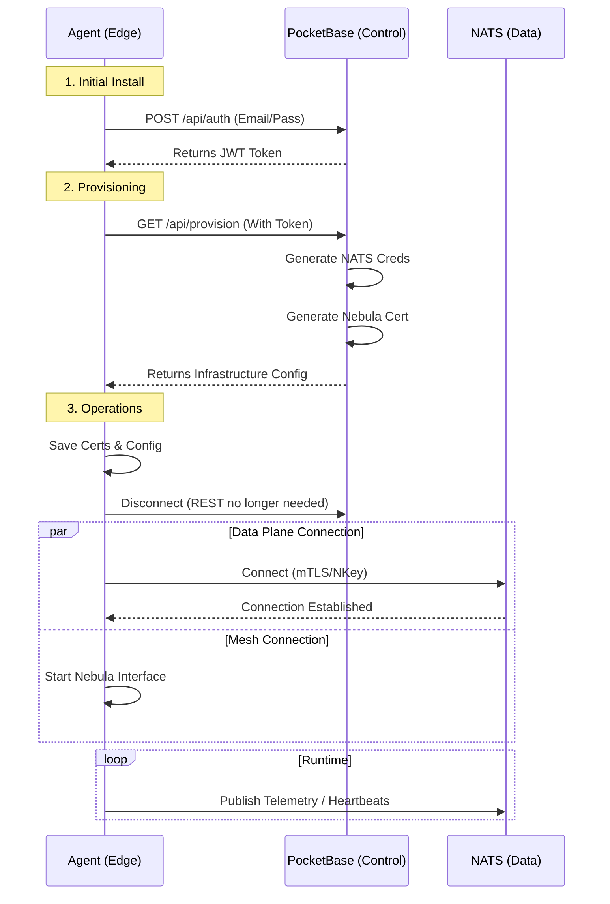

# The Agent

The **Stone-Age.io Agent** is a lightweight, NATS-native management and observability daemon designed to run on Windows, Linux, and FreeBSD. It acts as a resilient, outbound-only executor that connects your physical hardware to the Data Plane.

The Agent is what turns a bare server or IoT gateway into a participant in the Data Plane. Once connected, it publishes telemetry that Layer 1 rules can react to, Layer 2 stream processors can aggregate, and Layer 3 tools can archive. See [Platform Layers](./platform-layers.md) for the complete picture.

---

## 1. Overview

The agent is a single Go binary with zero external dependencies (other than the optional Prometheus exporters). Its design philosophy is simple: **Stay invisible until needed.**

- **Lightweight:** Consumes < 50MB of RAM and negligible CPU.
- **Secure:** No listening ports. It initiates all connections outbound via NATS.
- **Resilient:** Automatically handles NATS reconnections and backoffs.
- **Cross-Platform:** First-class support for Windows Services, Linux systemd, and FreeBSD rc.d.

---

## 2. Provisioning Flow 

One of the most powerful features for MSPs is the automated provisioning flow. Instead of manually copying certificates and config files to every device, the Agent uses the **PocketBase API** to bootstrap itself.

### The Lifecycle of a "Thing":

1.  **Creation:** An Admin creates a new **Thing** in the Stone Age Console.
2.  **Identity:** PocketBase generates a unique `email` and `password` (or token) for that Thing.
3.  **Bootstrap:** The Agent is installed on the edge device with its PocketBase credentials.
4.  **Login:** The Agent logs into the PocketBase API (`/api/collections/things/auth-with-password`).
5.  **Provision:** Upon successful login, the Agent fetches its specific infrastructure config:
    *   **NATS Credentials:** Its `.creds` file and WebSocket URL.
    *   **Nebula Config:** Its IP assignment, CA certificate, and private key.
6.  **Operation:** The Agent disconnects from the API and initiates its NATS and Nebula connections.

<center>

</center>

---

## 3. Capabilities

The agent performs four primary tasks to ensure your edge infrastructure is healthy and manageable.

### A. Telemetry & Observability

The Agent integrates seamlessly with the Prometheus ecosystem.

- **Exporters:** It acts as a sidecar for `node_exporter` (Linux/BSD) or `windows_exporter`.
- **NATS Ingestion:** It scrapes these exporters locally and publishes the metrics to a NATS JetStream.
- **Heartbeats:** It publishes a consistent heartbeat to the Digital Twin (KV store), allowing the UI to show real-time "Online/Offline" status.

Agent telemetry flows through every layer of the platform: Layer 1 rules can alert on missed heartbeats or anomalous readings, Layer 2 processors can compute per-device baselines, and Layer 3 archives the full history for trend analysis.

### B. Service Checks & Control

The Agent can monitor the status of system services (e.g., `nginx`, `docker`, `mssql`).

- **Monitoring:** Reports if a service is running, stopped, or crashing.
- **Remote Control:** Authorized users can trigger `start`, `stop`, or `restart` commands directly from the Stone Age UI.

### C. Command & Script Execution

For custom logic, the Agent can execute local scripts or shell commands.

- **Whitelisting:** To ensure security, the Agent will only execute commands or scripts defined in its local `allowed_commands` list.
- **Request/Reply:** Uses the NATS Request/Reply pattern so the UI can display the command output (stdout/stderr) to the administrator in real-time.

---

## 4. Security & Isolation

Security at the edge is handled through strict cryptographic isolation.

- **nKey Authentication:** The Agent uses a private NKey to sign NATS connection challenges. The private key never leaves the device.
- **Sandboxed Logic:** The Agent does not have "God Mode." Its permissions are restricted by the **NATS Role** assigned to it in the Control Plane. If an Agent is only meant to report temperature, its NATS credentials will physically prevent it from sending a "Restart Server" command.
- **Nebula Encryption:** All administrative traffic between your workstation and the Agent (like SSH or log retrieval) is encrypted end-to-end via the Nebula mesh, bypassing the public internet entirely.

---

## 5. Deployment Example

```yaml
# A typical Agent config fetched during bootstrap
thing_code: "chicago-warehouse-vent-01"
nats:
  urls: ["wss://nats.acme.io:9222"]
  auth_type: "creds"
tasks:
  metrics:
    enabled: true
    interval: "1m"
  heartbeat:
    enabled: true
    interval: "30s"
commands:
  scripts_directory: "/opt/stone-age/scripts"
  allowed_commands:
    - "df -h"
    - "uptime"
```

The Stone Age Agent turns a raw server or IoT gateway into a managed entity that is secure by default and easy to operate at scale — a first-class participant in the layered platform rather than a bolted-on endpoint.
