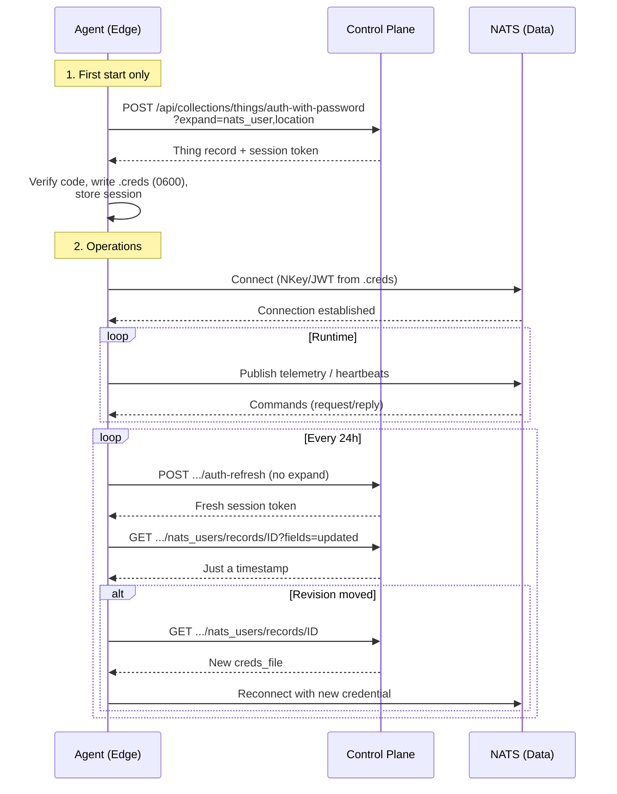

# The Agent

The **Stone-Age.io Agent** is a lightweight, NATS-native management and observability daemon designed to run on Windows, Linux, and FreeBSD. It acts as a resilient, outbound-only executor that connects your physical hardware to the Data Plane.

The Agent is what turns a bare server or IoT gateway into a participant in the Data Plane. Once connected, it publishes telemetry that Layer 1 rules can react to, Layer 2 stream processors can aggregate, and Layer 3 tools can archive. See [Platform Layers](./platform-layers.md) for the complete picture.

---

## 1. Overview

The agent is a single Go binary with zero external dependencies (other than the optional Prometheus exporters). Its design philosophy is simple: **Stay invisible until needed.**

- **Lightweight:** Consumes < 50MB of RAM and negligible CPU.
- **Secure:** No listening ports. It initiates all connections outbound via NATS.
- **Resilient:** Automatically handles NATS reconnections and backoffs.
- **Cross-Platform:** First-class support for Windows Services, Linux systemd, and FreeBSD rc.d.

!!! note "Not to be confused with `leaf-sync`"
    The Agent is a **per-Thing** executor — it manages one device or server. `leaf-sync` is a **per-site** config-mirroring agent that bootstraps a NATS leaf node and syncs an org's configuration into local KV. A site often runs both. See [Leaf Nodes](./leaf-nodes.md).

---

## 2. Provisioning & Credential Lifecycle

One of the most powerful features for MSPs is the automated provisioning flow. Instead of manually copying credential files to every device, the Agent authenticates to the Control Plane **as its own Thing** and fetches its NATS credentials itself — then keeps them current for the life of the device.

This is `auth.type: "stone-age"` in the Agent's config. It is deliberately named after the platform rather than after PocketBase: the Agent depends on the Stone-Age.io schema (`things` → `nats_user` → `creds_file`) and on a route the platform defines itself, not on anything generic.

### The Lifecycle of a "Thing":

1.  **Creation:** An Owner, Admin, or Member creates a new **Thing** in the Stone Age Console. Attaching the Thing's **NATS user** and **Nebula host** is Owner/Admin only, though — so a Thing created by a member sits un-provisioned until an Owner or Admin links its identities, and step 4 below has nothing to hand it. See [Authorization](./authorization.md).
2.  **Identity:** The Console generates the Thing's login password when it creates the record and shows it **once**, in the success dialog. If the Owner or Admin also chose automatic identities, the Console creates and links the `nats_users` record (and a `nebula_hosts` record) in the same step.
3.  **Install:** The Agent is installed on the edge device with its `code`, the platform URL, the Thing's login email, and that password in an environment variable — never in the config file.
4.  **Bootstrap (first start only):** The Agent authenticates as the Thing against `POST /api/collections/things/auth-with-password?expand=nats_user,location`, verifies the returned record's `code` matches its own config, and writes the `.creds` file from `expand.nats_user.creds_file` with `0600` permissions. It also stores the session token and the credential's revision.
5.  **Operation:** The Agent connects to NATS with that `.creds` file and begins publishing.
6.  **Upkeep (every 24h by default):** The Agent renews its platform session and adopts a credential the platform has re-minted. Once it holds a session token the Thing's password is optional and can be removed from the device — see §2.2.

The Agent fetches **only** its NATS credentials. It does not fetch a NATS URL (`nats.urls` is local config), and it neither fetches nor manages Nebula — a Thing's Nebula config is downloaded from the Console and installed separately.

<center>

```mermaid
sequenceDiagram
    participant Device as Agent (Edge)
    participant API as Control Plane
    participant NATS as NATS (Data)

    Note over Device: 1. First start only
    Device->>API: POST /api/collections/things/auth-with-password<br/>?expand=nats_user,location
    API-->>Device: Thing record + session token
    Device->>Device: Verify code, write .creds (0600),<br/>store session

    Note over Device: 2. Operations
    Device->>NATS: Connect (NKey/JWT from .creds)
    NATS-->>Device: Connection established

    loop Runtime
        Device->>NATS: Publish telemetry / heartbeats
        NATS-->>Device: Commands (request/reply)
    end

    loop Every 24h
        Device->>API: POST .../auth-refresh (no expand)
        API-->>Device: Fresh session token
        Device->>API: GET .../nats_users/records/ID?fields=updated
        API-->>Device: Just a timestamp
        alt Revision moved
            Device->>API: GET .../nats_users/records/ID
            API-->>Device: New creds_file
            Device->>NATS: Reconnect with new credential
        end
    end
```
</center>

### 2.1 Why the upkeep call is split in two

A `.creds` file embeds the NATS **nkey seed** — a private key. The routine sync therefore refreshes the session token *without* expanding any relation, then asks only for the credential's `updated` timestamp. The key itself is transferred only when that revision has actually moved.

This split is necessary rather than fussy: PocketBase does not apply `?fields=` to auth responses, so any auth call carrying `expand=nats_user` hands back the whole credential whether the caller wanted it or not. Without the split, every device in the fleet would pull its private key across the network daily, forever.

A useful side effect: because each sync reports the current revision, pressing **Regenerate** on a Thing's NATS identity in the Console propagates on its own. Every affected device adopts the new credential within one sync interval, with no visit and no redistribution.

### 2.2 Removing the password

The platform's session token for a Thing lives **7 days**, renewed by each sync. Once the Agent holds one, the Thing's password is no longer needed and can be deleted from the service environment. That is the tighter configuration: a `0600` session file is narrower than a machine-level environment variable, which on Windows any local process can read.

The tradeoff is recovery. A device powered off or offline for more than 7 days returns with a lapsed token, and with no password it cannot re-authenticate on its own — it needs the password set once more, or a fresh bootstrap. Devices that are frequently offline should keep the password configured. Deleting only the `.creds` file is always safe: the Agent restores it from its stored session without the password.

**Deactivating a Thing ends the session immediately, not in 7 days.** Clearing `active` refreshes the record's `tokenKey`, which invalidates every token already issued — the 7-day lifetime is not a floor on how long a decommissioned device keeps access. This is the intended behaviour, and it has one recovery consequence worth planning for: a Thing that was reactivated after its password had been removed from the service environment cannot re-authenticate on its own. Reactivation restores the *NATS* credential automatically; the PocketBase session has to be re-established with a password. An Owner or Admin can reset it from the Thing's detail view.

### 2.3 Rotation

Any identity can rotate its **own** NATS credential — that is the one credential operation the API rules cannot express, so it is a route: `POST /api/me/nats-creds/rotate`. It takes no record id (it derives the caller from the auth token) and writes a single field. See [Authorization](./authorization.md).

For an Agent, rotation has two triggers:

- **From the device:** the `cmd.rotate_creds` command (§3.D).
- **From the Console:** **Regenerate** on the Thing's NATS identity, adopted on the next sync.

**Rotation is not revocation.** The previous credential stays valid until it expires or an Owner/Admin revokes it. Rotating after a suspected compromise does not lock the old credential out — revoke it.

Revocation needs no manual recovery step at the edge. The credential sync path never touches NATS, so it keeps working while the NATS connection does not: the Agent exits when its credential is rejected, the service manager restarts it, and the sync on the way back up adopts the current credential.

That recovery loop is exactly what **deactivating** the Thing severs, and deliberately so. Deactivation revokes the NATS credential *and* invalidates the platform session the Agent would have used to fetch a replacement, so the device stays dark rather than healing itself. Reach for it when you want a device gone; reach for revocation alone when you want its current credential replaced. See [Authorization §4.2](./authorization.md#42-taking-a-device-out-of-service).

---

## 3. Capabilities

The Agent publishes on a schedule and answers commands on request. Everything it says lives under one subject prefix, so a fleet is addressable by convention rather than by registry.

| Subject | Transport | Purpose |
|---------|-----------|---------|
| `{prefix}.{code}.heartbeat` | Core NATS | Liveness beacon: `{code, location, ts}` |
| `{prefix}.{code}.telemetry.system` | JetStream | CPU, memory, disk |
| `{prefix}.{code}.telemetry.service` | JetStream | Service status |
| `{prefix}.{code}.telemetry.inventory` | JetStream | Hardware/software inventory |
| `{prefix}.{code}.cmd.*` | Core NATS (request/reply) | `ping`, `service`, `logs`, `exec`, `health`, `rotate_creds` |

Every telemetry payload carries `code`, `location`, and `ts`, so a message is self-describing to any direct subscriber.

!!! note "Heartbeats are deliberately not JetStream"
    A missed beat is the signal consumers care about, so last-write-wins is the correct semantic — a backlog of stale beats replayed after a reconnect would be actively misleading. This is why the server-side stream must bind `{prefix}.*.telemetry.>` rather than `{prefix}.>`: the heartbeat stays outside the stream by subject construction.

### A. Telemetry & Observability

- **Built-in collection (default):** The Agent reads CPU, memory, and disk itself. No exporter, no sidecar, nothing else to install.
- **Prometheus exporters (optional):** Point it at a local `node_exporter` (Linux/BSD) or `windows_exporter` instead, and it scrapes that.
- **Inventory:** A fuller hardware/software picture, published on startup and daily thereafter.
- **Heartbeats:** A liveness beacon on a core NATS subject. A Layer 1 rule can turn those beats — or their absence — into a Digital Twin KV update or an alert.

Agent telemetry flows through every layer of the platform: Layer 1 rules can alert on missed heartbeats or anomalous readings, Layer 2 processors can compute per-device baselines, and Layer 3 archives the full history for trend analysis.

### B. Service Checks & Control

The Agent can monitor the status of system services (e.g., `nginx`, `docker`, `mssql`).

- **Monitoring:** Reports if a service is running, stopped, or crashing.
- **Remote Control:** Authorized users can trigger `start`, `stop`, or `restart` commands directly from the Stone Age UI.

### C. Command & Script Execution

For custom logic, the Agent can execute local scripts or shell commands.

- **Whitelisting:** To ensure security, the Agent will only execute commands or scripts defined in its local `allowed_commands` list, and scripts must live in its configured `scripts_directory`.
- **Request/Reply:** Uses the NATS Request/Reply pattern so the UI can display the command output (stdout/stderr) to the administrator in real-time.
- **Log retrieval:** The `logs` command tails a file, restricted to configured path patterns with traversal protection.

### D. Credential Upkeep

- **`creds_sync` task:** Renews the platform session and adopts a re-minted credential (§2.1).
- **`cmd.rotate_creds`:** Asks the platform to re-mint this Agent's credential, writes it, replies, then reconnects — so a rotation costs no downtime and no site visit. The response reports `changed: false` if the platform handed back the credential the Agent already had. An Agent that is not platform-managed answers with an error rather than timing out.

---

## 4. Security & Isolation

Security at the edge is handled through strict cryptographic isolation.

- **NKey Authentication:** The Agent signs every NATS connection challenge locally with the nkey seed in its `.creds` file. Be precise about where that key comes from, though: the Control Plane mints the keypair (`pb-nats` generates it and embeds the seed in `creds_file`), so the private key originates on the platform and is *delivered* to the device — it is not generated there. That is exactly why the credential lifecycle in §2 is built the way it is: HTTPS is required, the key is re-transmitted only when it has actually changed, it is written `0600` through an atomic replace, and platform response bodies are never logged.
- **Sandboxed Logic:** The Agent does not have "God Mode." Its permissions are restricted by the **NATS Role** assigned to it in the Control Plane. If an Agent is only meant to report temperature, its NATS credentials will physically prevent it from sending a "Restart Server" command. Assigning or changing that role is an **Owner/Admin** action — the `nats_roles` and `nats_users` collections are closed to members and badge holders for reads as well as writes, precisely because a role's permission fields are copied verbatim into the JWT the platform signs.
- **Nebula Encryption:** Administrative traffic between your workstation and the host (SSH, for instance) can be encrypted end-to-end via the Nebula mesh, bypassing the public internet entirely. Note this is a property of the *host*, not of the Agent: the Agent does not manage the Nebula interface, and its own NATS traffic is outbound and TLS-protected regardless.

---

## 5. Deployment Example

The Agent's `config.yaml` is **local** — it is not fetched from the platform. Only the NATS credential comes over the wire.

```yaml
# /etc/agent/config.yaml
code: "chicago-warehouse-vent-01"   # identity token used in NATS subjects
location: "chicago-warehouse"        # optional, carried in every payload
subject_prefix: "agents"

nats:
  urls: ["nats://nats.acme.io:4222"]
  auth:
    type: "stone-age"
    creds_file: "/etc/agent/device.creds"
    stone-age:
      url: "https://platform.acme.io"
      identity: "chicago-warehouse-vent-01@things.acme.io"
      password_env: "AGENT_PLATFORM_PASSWORD"   # optional after first boot

tasks:
  heartbeat:
    enabled: true
    interval: "30s"
  system_metrics:
    enabled: true
    interval: "1m"
    source: "builtin"       # or "exporter" to scrape node_exporter
  inventory:
    enabled: true
    interval: "24h"
  creds_sync:
    enabled: true
    interval: "24h"         # renews the 7-day platform session

commands:
  scripts_directory: "/opt/stone-age/scripts"
  allowed_commands:
    - "df -h"
    - "uptime"
```

Full per-platform installation guides, including how to set `AGENT_PLATFORM_PASSWORD` under systemd, Windows Services, and rc.d, ship in the Agent repository (`docs/credentials.md`).

The Stone Age Agent turns a raw server or IoT gateway into a managed entity that is secure by default and easy to operate at scale — a first-class participant in the layered platform rather than a bolted-on endpoint.
