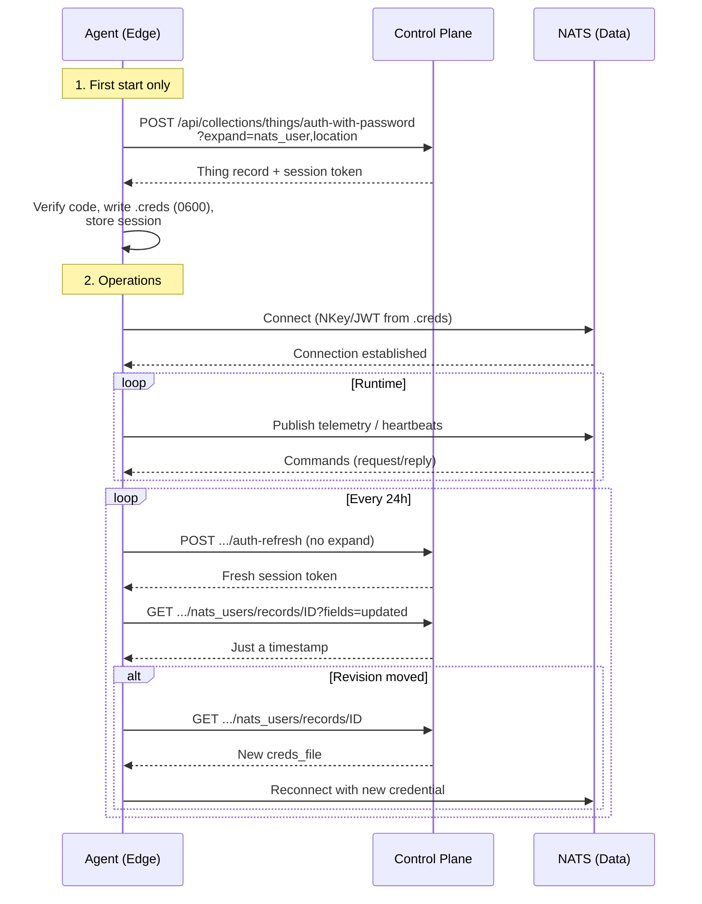

# The Agent

The **Stone-Age.io Agent** is a lightweight, NATS-native management and observability daemon designed to run on Windows, Linux, and FreeBSD. It connects your physical hardware to the Data Plane, and it takes its instructions only over a connection it dialed itself — there is no inbound management API to expose, forward a port to, or firewall.

The Agent is what turns a bare server or IoT gateway into a participant in the Data Plane. Once connected, it publishes telemetry that Layer 1 rules can react to, Layer 2 stream processors can aggregate, and Layer 3 tools can archive. See [Platform Layers](./platform-layers.md) for the complete picture.

---

## 1. Overview

The agent is a single Go binary with zero external dependencies. Its design philosophy is simple: **Stay invisible until needed.**

- **Lightweight:** Consumes < 50MB of RAM and negligible CPU.
- **Secure:** No inbound management API — every instruction arrives over the authenticated NATS connection the Agent dialed outbound, so no port forward is ever needed to manage a device. (It is not, however, "no listening ports": `/ready` and `/metrics` bind `127.0.0.1:9100` unless you set `observability.addr` empty, and a site gateway hosts a NATS server that local devices connect *in* to. See [§6](#6-what-listens-and-what-dials-out).)
- **Resilient:** Automatically handles NATS reconnections and backoffs.
- **Cross-Platform:** First-class support for Windows Services, Linux systemd, and FreeBSD rc.d.

!!! note "It absorbed `leaf-sync`"
    There used to be a second binary — `leaf-sync` — that bootstrapped a site's NATS leaf node and mirrored an organization's configuration into local KV. It is gone. Its leaf-node duties moved into the Agent, and the config mirror was dropped rather than moved, because nothing ever read the mirrored rows. A site that runs a leaf node runs **one** binary now, not two. See [Leaf Nodes](./leaf-nodes.md).

### Getting the binary

Prebuilt archives are attached to every [release](https://github.com/stone-age-io/agent/releases) — Linux amd64/arm64, Windows amd64, FreeBSD amd64. Each one carries the binary, the per-OS example configs under `configs/`, and the install guides under `docs/`:

```sh
VERSION=0.3.2
wget https://github.com/stone-age-io/agent/releases/download/v${VERSION}/agent_${VERSION}_linux_amd64.tar.gz
tar xzf agent_${VERSION}_linux_amd64.tar.gz
sudo mv agent /usr/local/bin/agent && sudo chmod +x /usr/local/bin/agent
sudo mkdir -p /etc/agent /opt/agent/scripts
sudo cp configs/linux/config.yaml.example /etc/agent/config.yaml
```

The scripts directory is not optional housekeeping: `commands.scripts_directory` defaults to `/opt/agent/scripts`, and the Agent **refuses to start** if the directory it names does not exist. Set it to `""` to turn script execution off entirely.

!!! warning "0.3.1 is a security release — upgrade anything older"
    Before 0.3.1, anyone able to publish to `cmd.exec` could run arbitrary commands on a device that had a single script in its `scripts_directory`, whatever the allowlist said: the check approved a request by its last path element and then handed the *unreduced* string to a shell. See §3.C for the rules that close it. The fix changes one behaviour a caller can see — a script request must now be a bare filename (`deploy.sh`, not `/opt/agent/scripts/deploy.sh`), and a full path is refused.

The agent then installs itself as a service on the host's own service manager — `agent -service install`, which resolves to systemd, a Windows service, or rc.d. There are no unit files to place by hand. `agent -version` reports what a host is running without starting it.

The per-platform guides in the agent repository (`docs/linux.md`, `docs/windows.md`, `docs/freebsd.md`) cover directory layout, permissions and service registration in full.

---

## 2. Provisioning & Credential Lifecycle

The automated provisioning flow is what makes the Agent practical at MSP scale. Instead of manually copying credential files to every device, the Agent authenticates to the Control Plane **as its own Thing** and fetches its NATS credentials itself — then keeps them current for the life of the device.

This is `auth.type: "platform"` in the Agent's config, with the platform itself configured in a **top-level `platform:` block**. It is deliberately named after the platform rather than after PocketBase: the Agent depends on the Stone-Age.io schema (`things` → `nats_user` → `creds_file`) and on routes the platform defines itself, not on anything generic.

The block is top-level rather than nested under `nats.auth` because **three** subsystems read it: the NATS credential lifecycle below, the [Nebula](#4-security-isolation) config source, and the [leaf bootstrap](./leaf-nodes.md#3-get-apimeleaf-config). With it buried under one of them, the other two had to ask "is some other section's type field set to a particular string" instead of "is the block present".

### The Lifecycle of a "Thing":

1.  **Creation:** An Owner, Admin, or Member creates a new **Thing** in the Stone Age Console. Attaching the Thing's **NATS user** and **Nebula host** is Owner/Admin only, though — so a Thing created by a member sits un-provisioned until an Owner or Admin links its identities, and step 4 below has nothing to hand it. See [Authorization](./authorization.md).
2.  **Identity:** The Console generates the Thing's login password when it creates the record and shows it **once**, in the success dialog. If the Owner or Admin also chose automatic identities, the Console creates and links the `nats_users` record (and a `nebula_hosts` record) in the same step.
3.  **Install:** The Agent is installed on the edge device with its `code`, the platform URL, the Thing's login email, and that password in an environment variable — never in the config file.
4.  **Bootstrap (first start only):** The Agent authenticates as the Thing against `POST /api/collections/things/auth-with-password?expand=nats_user,location`, verifies the returned record's `code` matches its own config, and writes the `.creds` file from `expand.nats_user.creds_file` with `0600` permissions. It also stores the session token and the credential's revision.
5.  **Operation:** The Agent connects to NATS with that `.creds` file and begins publishing.
6.  **Upkeep (`platform.sync_interval`, 24h by default):** The Agent renews its platform session and adopts a credential the platform has re-minted. Once it holds a session token the Thing's password is optional and can be removed from the device — see §2.2.

The Agent does not fetch a NATS URL — `nats.urls` is local config, because what a box can reach is a property of where the box is. With `nebula.enabled` it fetches its **Nebula** config the same way, from the `nebula_host` linked to the same Thing, and re-reads it on `nebula.sync_interval`. That interval is the device's **revocation latency**, not a tuning knob: Nebula has no CRL, so a revoked certificate is only refused once each peer has re-read its own config.

<center>

```mermaid
sequenceDiagram
    participant Device as Agent (Edge)
    participant API as Control Plane
    participant NATS as NATS (Data)

    Note over Device: 1. First start only
    Device->>API: POST /api/collections/things/auth-with-password<br/>?expand=nats_user,location
    API-->>Device: Thing record + session token
    Device->>Device: Verify code, write .creds (0600),<br/>store session

    Note over Device: 2. Operations
    Device->>NATS: Connect (NKey/JWT from .creds)
    NATS-->>Device: Connection established

    loop Runtime
        Device->>NATS: Publish telemetry / heartbeats
        NATS-->>Device: Commands (request/reply)
    end

    loop Every 24h
        Device->>API: POST .../auth-refresh (no expand)
        API-->>Device: Fresh session token
        Device->>API: GET .../nats_users/records/ID?fields=updated
        API-->>Device: Just a timestamp
        alt Revision moved
            Device->>API: GET .../nats_users/records/ID
            API-->>Device: New creds_file
            Device->>NATS: Reconnect with new credential
        end
    end
```
</center>

### 2.1 Why the upkeep call is split in two

A `.creds` file embeds the NATS **nkey seed** — a private key. The routine sync therefore refreshes the session token *without* expanding any relation, then asks only for the credential's `updated` timestamp. The key itself is transferred only when that revision has actually moved.

This split is necessary rather than fussy: PocketBase does not apply `?fields=` to auth responses, so any auth call carrying `expand=nats_user` hands back the whole credential whether the caller wanted it or not. Without the split, every device in the fleet would pull its private key across the network daily, forever.

A useful side effect: because each sync reports the current revision, pressing **Regenerate** on a Thing's NATS identity in the Console propagates on its own. Every affected device adopts the new credential within one sync interval, with no visit and no redistribution.

### 2.2 Removing the password

The platform's session token for a Thing lives **7 days**, renewed by each sync. Once the Agent holds one, the Thing's password is no longer needed and can be deleted from the service environment. That is the tighter configuration: a `0600` session file is narrower than a machine-level environment variable, which on Windows any local process can read.

The tradeoff is recovery. A device powered off or offline for more than 7 days returns with a lapsed token, and with no password it cannot re-authenticate on its own — it needs the password set once more, or a fresh bootstrap. Devices that are frequently offline should keep the password configured. Deleting only the `.creds` file is always safe: the Agent restores it from its stored session without the password.

**Deactivating a Thing ends the session immediately, not in 7 days.** Clearing `active` refreshes the record's `tokenKey`, which invalidates every token already issued — the 7-day lifetime is not a floor on how long a decommissioned device keeps access. This is the intended behaviour, and it has one recovery consequence worth planning for: a Thing that was reactivated after its password had been removed from the service environment cannot re-authenticate on its own. Reactivation issues a **new** NATS credential on the platform, but the Agent can only fetch it over a platform session, and that session died with the deactivation — so it has to be re-established with a password. An Owner or Admin sets a new one on the Thing's **edit form** (the Authentication card), then puts it back in the service environment; the next start adopts the new credential.

### 2.3 Rotation

Any identity can rotate its **own** NATS credential — that is the one credential operation the API rules cannot express, so it is a route: `POST /api/me/nats-creds/rotate`. It takes no record id (it derives the caller from the auth token) and writes a single field. See [Authorization](./authorization.md).

For an Agent, rotation has two triggers:

- **From the device:** the `cmd.rotate_creds` command (§3.D).
- **From the Console:** **Regenerate** on the Thing's NATS identity, adopted on the next sync.

**Rotation is not revocation.** Rotating (and **Regenerate**) re-signs the JWT for the **same** key pair, so the seed inside the previous `.creds` is unchanged and that file keeps working until it expires. After a suspected compromise, use **Revoke** on the NATS identity instead: it generates a new key pair, puts the old public key on the account's revocation list — so every copy of the old file is rejected at once — and issues a working replacement, which the Agent adopts on its next sync. The identity stays active; Revoke is the "these credentials leaked" button, not a way to take a device out of service.

The rotate route also refuses a **suspended** identity (`403`). Without that check a re-sign would mint a JWT issued after the suspension's revocation cutoff — which NATS accepts — and the self-service button would double as a self-service un-suspend.

Revocation needs no manual recovery step at the edge. The credential sync path never touches NATS, so it keeps working while the NATS connection does not: the Agent exits when its credential is rejected, the service manager restarts it, and the sync on the way back up adopts the current credential.

That recovery loop is exactly what **deactivating** the Thing severs, and deliberately so. Deactivation *suspends* the NATS credential — revoked, with nothing reissued — blocklists the Thing's Nebula certificate once peer configs are redeployed, *and* invalidates the platform session the Agent would have used to fetch a replacement, so the device stays dark rather than healing itself. Reach for it when you want a device gone; reach for Revoke alone when you want its current credential replaced. See [Authorization §4.2](./authorization.md#42-taking-a-device-out-of-service).

---

## 3. Capabilities

The Agent publishes on a schedule and answers commands on request. Everything it says lives under one subject prefix, so a fleet is addressable by convention rather than by registry.

| Subject | Transport | Purpose |
|---------|-----------|---------|
| `{prefix}.{code}.heartbeat` | Core NATS | Liveness beacon: `{code, location, ts}` |
| `{prefix}.{code}.telemetry.system` | JetStream | CPU, memory, disk |
| `{prefix}.{code}.telemetry.service` | JetStream | Service status |
| `{prefix}.{code}.telemetry.inventory` | JetStream | Hardware/software inventory |
| `{prefix}.{code}.cmd.*` | Core NATS (request/reply) | `ping`, `service`, `logs`, `exec`, `health`, `rotate_creds`, `nebula` |

Every telemetry payload carries `code`, `location`, and `ts`, so a message is self-describing to any direct subscriber.

Beyond the bus, the Agent has three capabilities that apply on a box which is also a **site gateway**. Each is independently switchable and none of them is a mode:

| Capability | Turned on by | What it does |
|---|---|---|
| Leaf bootstrap | `agent -leaf-config` | Writes `nats-leaf.conf` + creds from `GET /api/me/leaf-config` |
| Embedded NATS | `nats.server_config` | Hosts that leaf server in this process |
| KV bucket sync | `sync.twin`, `sync.mirrors`, `sync.relays` | Keeps declared KV buckets in step with the hub — mirrors down, relays up |

There is **no `edge.enabled` key and no gateway flag on the platform**: "gateway" is not a mode the config declares, it is the sum of the capabilities it turns on. A single flag naming the role would be a second control that can disagree with the first — `edge.enabled: false` beside `sync.twin: true` has no correct behaviour. See [Leaf Nodes](./leaf-nodes.md).

!!! warning "`twin.enabled` was replaced by `sync:` in Agent v0.2.0"
    The digital twin used to be two hardcoded buckets behind one boolean. It is now a preset over a general mechanism — see [Leaf Nodes §6](./leaf-nodes.md#6-offline-autonomy-and-kv-bucket-sync). The old key is **rejected by name at config load**, rather than ignored: viper drops unknown keys silently, and a file still carrying `twin.enabled` would sync nothing and say nothing about it.

**Local health is not one of them**, though it is often listed beside them. `observability.addr` serves `/ready` and `/metrics` on **every** Agent, defaulted to `127.0.0.1:9100`, because the reason to answer locally has nothing to do with running a leaf node: `cmd.health` travels over NATS, which is the link that breaks, so the box you most want to ask is the one that has just gone quiet. Nebula is the same shape — `nebula.enabled` is a per-device capability, not a gateway one.

!!! note "Heartbeats are deliberately not JetStream"
    A missed beat is the signal consumers care about, so last-write-wins is the correct semantic — a backlog of stale beats replayed after a reconnect would be actively misleading. This is why the server-side stream must bind `{prefix}.*.telemetry.>` rather than `{prefix}.>`: the heartbeat stays outside the stream by subject construction.

### A. Telemetry & Observability

- **Built-in collection:** The Agent reads CPU, memory, and disk itself. No exporter, no sidecar, nothing else to install. This is the only collector: the old exporter mode (`tasks.system_metrics.source: "exporter"`, which scraped `node_exporter` or `windows_exporter` instead) was removed in 0.3.1. A config still carrying `source` or `exporter_url` loads unchanged and gets built-in metrics. If you want node_exporter's series, run it and let Prometheus scrape it directly.
- **Inventory:** A fuller hardware/software picture, published on startup and daily thereafter.
- **Heartbeats:** A liveness beacon on a core NATS subject. A Layer 1 rule can turn those beats — or their absence — into a Digital Twin KV update or an alert.

Agent telemetry flows through every layer of the platform: Layer 1 rules can alert on missed heartbeats or anomalous readings, Layer 2 processors can compute per-device baselines, and Layer 3 archives the full history for trend analysis.

### B. Service Checks & Control

The Agent can monitor the status of system services (e.g., `nginx`, `docker`, `mssql`).

- **Monitoring:** `tasks.service_check` reports the state of each service in its `services` list on a schedule. It is **on by default**, and a config that leaves it on with an empty list is refused at load — list your services, or set `enabled: false`.
- **Remote Control:** `cmd.service` takes `start`, `stop`, `restart` or `status`, each gated by `commands.allowed_services`. `status` (0.3.2) reads one service's state without changing it — the same lookup the telemetry makes, in the same words (`Running`, `Stopped`, `NotInstalled`, …) — so you no longer wait for the next `service_check` cycle to see it.

There is no dedicated agent-command screen in the console. Commands are ordinary NATS requests, sent by anything whose NATS Role may publish to the subject — in the console, a **Button** or **Publisher** [dashboard widget](./dashboards.md); from a terminal, `stone nats req`.

### C. Command & Script Execution

For custom logic, `cmd.exec` runs a local script or an allowlisted shell command — and nothing else. The rules, as of the 0.3.1 security fix:

- **Scripts are files, named bare.** A script request is a bare filename with the platform's script extension (`.sh`, or `.ps1` on Windows) naming a regular file directly inside `commands.scripts_directory`. Anything with a separator, a drive letter or a `..` is refused rather than reduced. The Agent builds the path itself and starts the file directly — no shell parses the request. Scripts are checked first and never go through `allowed_commands`.
- **Commands are allowlist entries.** Anything else must match a line of `commands.allowed_commands` (whitespace-normalized), and the Agent runs **the allowlist entry**, not the request — so a newline smuggled into a request cannot split one allowed line into two commands. Linux runs it through `/bin/bash`, FreeBSD through `/bin/sh`.
- **The reply comes once, when the command finishes** — this is request/reply, not a stream. It carries the combined output and an `exit_code` whenever the command actually ran (0 included), and a failure keeps its output, so the stderr explaining it leaves the box. `commands.timeout` (30s by default) is a real bound: it kills everything the command started (its process group, or `taskkill /T` on Windows), and a timed-out command returns what it had printed.
- **Log retrieval:** `cmd.logs` reads a file only if it exactly equals a file one of `commands.allowed_log_paths` names. The allowlist alone decides; there is no second denylist behind it, so narrow the pattern rather than relying on one.
- **Overlay control:** with `nebula.enabled`, `cmd.nebula` takes `sync` (re-fetch the host's config now rather than on `nebula.sync_interval`) or `restart`. It is the one handler that **answers before it acts** — both actions can interrupt the tunnel the request arrived over, so a reply sent afterwards might never land. `accepted` means the work has started; the outcome is reported through `cmd.health`.

### D. Credential Upkeep

- **Credential sync:** Renews the platform session and adopts a re-minted credential (§2.1), on `platform.sync_interval`.
- **`cmd.rotate_creds`:** Asks the platform to re-mint this Agent's credential, writes it, replies, then reconnects — so a rotation costs no downtime and no site visit. The response reports `changed: false` if the platform handed back the credential the Agent already had. An Agent that is not platform-managed answers with an error rather than timing out.

---

## 4. Security & Isolation

Three mechanisms enforce cryptographic isolation at the edge:

- **NKey Authentication:** The Agent signs every NATS connection challenge locally with the nkey seed in its `.creds` file. Be precise about where that key comes from, though: the Control Plane mints the keypair (`pb-nats` generates it and embeds the seed in `creds_file`), so the private key originates on the platform and is *delivered* to the device — it is not generated there. That is exactly why the credential lifecycle in §2 is built the way it is: HTTPS is required, the key is re-transmitted only when it has actually changed, it is written `0600` through an atomic replace, and platform response bodies are never logged.
- **Sandboxed Logic:** The Agent does not have "God Mode." Its permissions are restricted by the **NATS Role** assigned to it in the Control Plane. If an Agent is only meant to report temperature, its NATS credentials will physically prevent it from sending a "Restart Server" command. Assigning or changing that role is an **Owner/Admin** action — `nats_roles` is closed to every role below admin for reads as well as writes, and `nats_users` nearly so (each console user reads only the one identity linked to their own membership, and a Thing only its own), precisely because a role's permission fields are copied verbatim into the JWT the platform signs.
- **Nebula Encryption:** Administrative traffic between your workstation and the host (SSH, for instance) can be encrypted end-to-end via the Nebula mesh, bypassing the public internet entirely. With `nebula.enabled` the Agent runs that mesh host **in-process** and keeps its config current, which is what makes revocation, renewal and CA rotation actually reach the device. A newly applied config that cannot reach a lighthouse is restarted and then rolled back to the last one known to have worked, so a bad config cannot take a fleet off the network. The Agent's own NATS traffic is outbound and TLS-protected either way — the overlay is for everything else.

---

## 5. Deployment Example

The Agent's `config.yaml` is **local** — it is not fetched from the platform. Only the NATS credential comes over the wire.

```yaml
# /etc/agent/config.yaml
code: "chicago-warehouse-vent-01"   # identity token used in NATS subjects
location: "chicago-warehouse"        # optional, carried in every payload
subject_prefix: "agents"

platform:                            # one home for the platform relationship
  url: "https://platform.acme.io"
  identity: "chicago-warehouse-vent-01@acme.thing.local"   # <code>@<org code>.thing.local
  password_env: "AGENT_PLATFORM_PASSWORD"   # optional after first boot
  sync_interval: "24h"               # renews the 7-day platform session

nats:
  urls: ["nats://nats.acme.io:4222"]
  auth:
    type: "platform"
    creds_file: "/etc/agent/device.creds"

tasks:
  heartbeat:
    enabled: true
    interval: "30s"
  system_metrics:
    enabled: true
    interval: "1m"
  service_check:            # on by default: list services or set enabled: false
    enabled: true
    interval: "1m"
    services: ["nginx"]
  inventory:
    enabled: true
    interval: "24h"

commands:
  scripts_directory: "/opt/agent/scripts"   # must exist; "" disables scripts
  allowed_services: ["nginx"]
  allowed_commands:
    - "df -h"
    - "uptime"
```

The `identity` is the Thing's login email, and the console builds it for you when it creates the Thing — `<code>@<org code>.thing.local` — so copy it from the success dialog rather than composing it.

A site gateway adds `nats.server_config` and/or a `sync:` block to the same file — see [Leaf Nodes §5](./leaf-nodes.md#5-deploy-flow). `observability` and `nebula` are not gateway keys and may be set on any device.

Full per-platform installation guides, including how to set `AGENT_PLATFORM_PASSWORD` under systemd, Windows Services, and rc.d, ship in the Agent repository (`docs/credentials.md`).

---

## 6. What listens, and what dials out

This is the table to hand whoever writes the firewall rules. It is also the
correction to a claim that stood in these docs for a long time: the Agent used to
have no listening sockets at all, and that stopped being true when local
readiness and the embedded NATS server arrived.

| | Direction | Port | When |
|---|---|---|---|
| NATS — telemetry, commands, heartbeats | **outbound** | 4222 (or your hub's) | always |
| Platform HTTPS — credentials, Nebula config, leaf bootstrap | **outbound** | 443 | when the `platform:` block is set |
| Nebula overlay | **outbound** UDP to a lighthouse | the lighthouse's configured port, commonly 4242 | when `nebula.enabled` |
| `/ready` + `/metrics` | **listens** | `127.0.0.1:9100` | unless `observability.addr` is empty |
| Embedded `nats-server` | **listens** | per its own config | only when `nats.server_config` is set |

The property worth relying on is the first row's direction, not a count of open
sockets: **nothing can instruct an Agent except over the NATS connection it
dialed itself.** A device on a customer network needs no inbound rule and no port
forward to be managed, which is what makes a fleet behind NAT or CGNAT tractable.

An ordinary Agent binds an **ephemeral** local UDP port for the overlay — `pb-nebula` writes `listen.port: 0` for anything that is not a lighthouse or a relay, since only those two are reached at a fixed address through `static_host_map`. So there is nothing to open inbound for Nebula either.

Two footnotes that matter in practice:

- **Loopback is not an authorization boundary** when other users share the box.
  `/metrics` carries no per-organization labels by design, but it does carry this
  device's health. Set `observability.metrics_token` (accepted as Bearer or as
  Basic with any username) before moving `addr` off loopback, or set `addr` empty
  and let `cmd.health` over NATS be the only answer.
- **9100 is also node_exporter's default port** on Linux and FreeBSD. If you also
  run node_exporter on the same box for Prometheus to scrape, move one of the
  two, or neither will bind reliably. Windows is unaffected: `windows_exporter`
  uses 9182.

---

The Stone Age Agent turns a raw server or IoT gateway into a managed entity that is secure by default and easy to operate at scale — a first-class participant in the layered platform rather than a bolted-on endpoint.
