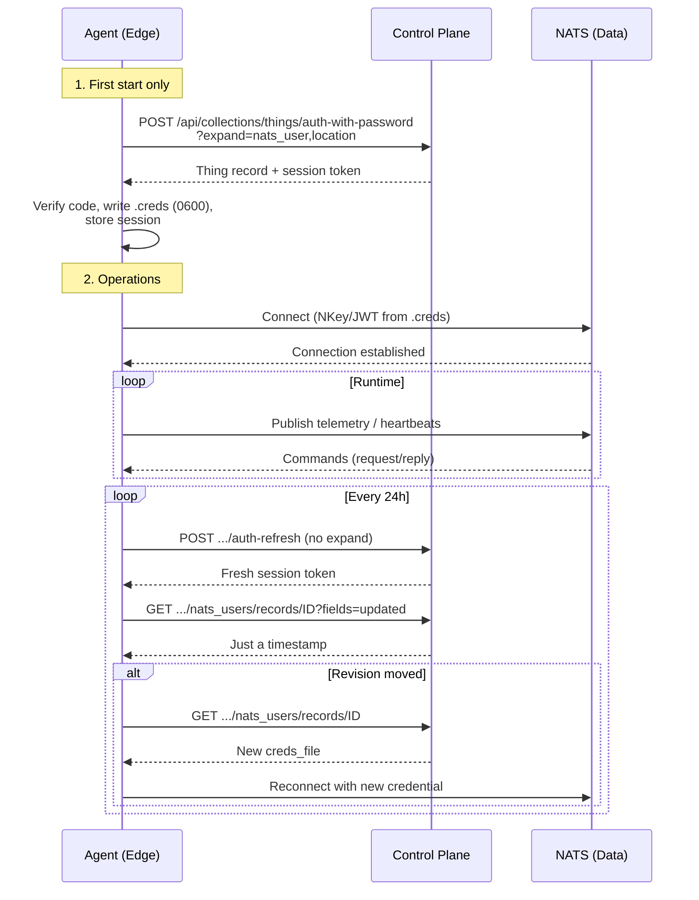

# The Agent

The **Stone-Age.io Agent** is a small management and observability daemon for
Windows, Linux and FreeBSD, built on NATS. It connects your hardware to the Data
Plane. It takes instructions only over a connection that it opened itself, so
there is no inbound management API to expose, forward or firewall.

With the Agent, a server or IoT gateway publishes telemetry that Layer 1 rules
react to, Layer 2 stream processors aggregate, and Layer 3 tools archive. See
[Platform Layers](./platform-layers.md).

---

## 1. Overview

The Agent is one Go binary with no external dependencies.

- **Small:** under 50 MB of RAM and very little CPU.
- **No inbound management API:** every instruction arrives over the
  authenticated NATS connection that the Agent opened outbound. You never need a
  port forward to manage a device. It does have listening ports: `/ready` and
  `/metrics` bind `127.0.0.1:9100` unless you set `observability.addr` empty,
  and a site gateway hosts a NATS server that local devices connect *in* to.
  See [§6](#6-what-listens-and-what-dials-out).
- **Reconnects by itself:** it handles NATS reconnection and backoff.
- **Cross-platform:** Windows services, Linux systemd and FreeBSD rc.d.

A site that runs a leaf node needs only the Agent. It bootstraps and can host
the leaf server. See [Leaf Nodes](./leaf-nodes.md).

### Getting the binary

Every [release](https://github.com/stone-age-io/agent/releases) has archives for
Linux amd64/arm64, Windows amd64 and FreeBSD amd64. Each has the binary, example
configs per OS under `configs/`, and install guides under `docs/`:

```sh
VERSION=0.3.2
wget https://github.com/stone-age-io/agent/releases/download/v${VERSION}/agent_${VERSION}_linux_amd64.tar.gz
tar xzf agent_${VERSION}_linux_amd64.tar.gz
sudo mv agent /usr/local/bin/agent && sudo chmod +x /usr/local/bin/agent
sudo mkdir -p /etc/agent /opt/agent/scripts
sudo cp configs/linux/config.yaml.example /etc/agent/config.yaml
```

Create the scripts directory. `commands.scripts_directory` defaults to
`/opt/agent/scripts`, and the Agent **refuses to start** if that directory does
not exist. Set it to `""` to turn off script execution.

::: warning Run 0.3.1 or later
Versions before 0.3.1 let anyone who could publish to `cmd.exec` run any command
on a device with a script in its `scripts_directory`. §3.C has the current
rules. A script request must be a bare filename (`deploy.sh`), not a full path.
:::

Install the Agent as a service with `agent -service install`. It uses systemd,
a Windows service or rc.d, so you do not write unit files. `agent -version`
shows the installed version without starting it.

The guides in the agent repository (`docs/linux.md`, `docs/windows.md`,
`docs/freebsd.md`) cover directory layout, permissions and service
registration.

---

## 2. Provisioning & Credential Lifecycle

You do not copy credential files to each device. The Agent signs in to the
Control Plane **as its own Thing**, fetches its NATS credentials, and keeps them
current for the life of the device.

This is `auth.type: "platform"` in the Agent's config, with the platform set in
a **top-level `platform:` block**. The Agent depends on the Stone-Age.io schema
(`things` to `nats_user` to `creds_file`) and on platform routes, not on generic
PocketBase.

The block is top-level because **three** parts of the Agent read it: the NATS
credential lifecycle below, the [Nebula](#4-security-isolation) config source,
and the [leaf bootstrap](./leaf-nodes.md#3-get-apimeleaf-config). Each checks
only whether the block is present.

### The lifecycle of a Thing

1. **Creation:** an Owner, Admin or Member creates a **Thing** in the console.
   Only an Owner or Admin can attach its **NATS user** and **Nebula host**. A
   Thing a member creates stays unprovisioned until an Owner or Admin links its
   identities, and step 4 then has nothing to fetch. See
   [Authorization](./authorization.md).
2. **Identity:** the console generates the Thing's password when it creates the
   record and shows it **once**, in the success dialog. If the Owner or Admin
   chose automatic identities, the console also creates and links the
   `nats_users` record (and a `nebula_hosts` record) in the same step.
3. **Install:** install the Agent on the device with its `code`, the platform
   URL, the Thing's login email, and the password in an environment variable,
   never in the config file.
4. **Bootstrap (first start only):** the Agent signs in as the Thing with
   `POST /api/collections/things/auth-with-password?expand=nats_user,location`.
   It checks that the record's `code` matches its own config and writes the
   `.creds` file from `expand.nats_user.creds_file` with `0600` permissions. It
   also stores the session token and the credential's revision.
5. **Operation:** the Agent connects to NATS with the `.creds` file and starts
   publishing.
6. **Upkeep (`platform.sync_interval`, 24h by default):** the Agent renews its
   platform session and picks up a credential the platform minted again. When it
   has a session token, you can remove the Thing's password from the device
   (§2.2).

The Agent does not fetch a NATS URL. `nats.urls` is local config, because what a
box can reach depends on where it is. With `nebula.enabled`, it fetches its
**Nebula** config from the `nebula_host` linked to the same Thing, and reads it
again every `nebula.sync_interval`. That interval is the device's **revocation
delay**. Nebula has no CRL, so a peer refuses a revoked certificate only after
it reads its own new config.


```mermaid
sequenceDiagram
    participant Device as Agent (Edge)
    participant API as Control Plane
    participant NATS as NATS (Data)

    Note over Device: 1. First start only
    Device->>API: POST /api/collections/things/auth-with-password<br/>?expand=nats_user,location
    API-->>Device: Thing record + session token
    Device->>Device: Verify code, write .creds (0600),<br/>store session

    Note over Device: 2. Operations
    Device->>NATS: Connect (NKey/JWT from .creds)
    NATS-->>Device: Connection established

    loop Runtime
        Device->>NATS: Publish telemetry / heartbeats
        NATS-->>Device: Commands (request/reply)
    end

    loop Every 24h
        Device->>API: POST .../auth-refresh (no expand)
        API-->>Device: Fresh session token
        Device->>API: GET .../nats_users/records/ID?fields=updated
        API-->>Device: Just a timestamp
        alt Revision moved
            Device->>API: GET .../nats_users/records/ID
            API-->>Device: New creds_file
            Device->>NATS: Reconnect with new credential
        end
    end
```

### 2.1 Why the upkeep call is split in two

A `.creds` file contains the NATS **nkey seed**, which is a private key. So the
routine sync renews the session token *without* expanding any relation, then
asks only for the credential's `updated` timestamp. The Agent downloads the key
only when that revision has changed.

PocketBase does not apply `?fields=` to auth responses, so any auth call with
`expand=nats_user` returns the whole credential. Without the split, every device
would download its private key every day.

Because each sync checks the revision, **Regenerate** on a Thing's NATS identity
in the console reaches the device by itself. Every affected device picks up the
new credential within one sync interval, with no site visit.

### 2.2 Removing the password

The platform's session token for a Thing lasts **7 days**, and each sync renews
it. When the Agent has one, you can delete the Thing's password from the service
environment. This is safer: a `0600` session file is harder to read than a
machine-level environment variable, which any local process on Windows can read.

The cost is recovery. A device offline for more than 7 days comes back with an
expired token. With no password, it cannot sign in again by itself. It needs
the password set again, or a new bootstrap. Keep the password on devices that
are often offline. You can always delete only the `.creds` file: the Agent
restores it from its stored session without the password.

**Deactivating a Thing ends its session at once.** Clearing `active` refreshes
the record's `tokenKey`, which invalidates every token issued before. Plan for
one consequence: if you reactivate a Thing whose password was removed, it cannot
sign in by itself. Reactivation issues a **new** NATS credential, but the Agent
can fetch it only over a platform session, and deactivation ended that session.
An Owner or Admin sets a new password on the Thing's **edit form**
(Authentication card) and puts it in the service environment. At the next
start, the Agent picks up the new credential.

### 2.3 Rotation

Any identity can rotate its **own** NATS credential through
`POST /api/me/nats-creds/rotate`. It takes no record id and writes one field.
See [Authorization](./authorization.md).

An Agent's credential rotates in two ways:

- **From the device:** the `cmd.rotate_creds` command (§3.D).
- **From the console:** **Regenerate** on the Thing's NATS identity, picked up
  on the next sync.

**Rotation is not revocation.** Rotation and **Regenerate** sign a new JWT for
the **same** key pair. The seed in the old `.creds` is the same, so the old file
keeps working until it expires. After a suspected compromise, use **Revoke** on
the NATS identity. It generates a new key pair, puts the old public key on the
account's revocation list so every copy of the old file is rejected at once,
and issues a working replacement. The Agent picks it up on its next sync. The
identity stays active.

The rotate route returns `403` for a **suspended** identity. Otherwise the new
JWT would be issued after the revocation cutoff, NATS would accept it, and the
suspension would end.

Revocation needs no manual step at the edge. The credential sync does not use
NATS, so it still works when NATS rejects the credential. The Agent exits, the
service manager restarts it, and the sync at startup picks up the current
credential.

**Deactivating** the Thing stops this recovery on purpose. It suspends the NATS
credential (revoked, nothing reissued), blocklists the Nebula certificate when
peer configs are redeployed, and ends the platform session the Agent would use
to fetch a replacement. The device stays offline. Use deactivation to remove a
device. Use Revoke to replace its current credential. See
[Authorization §4.2](./authorization.md#42-taking-a-device-out-of-service).

---

## 3. Capabilities

The Agent publishes on a schedule and answers commands. All its subjects share
one prefix, so you address a fleet by convention, not by a registry.

| Subject | Transport | Purpose |
|---------|-----------|---------|
| `{prefix}.{code}.heartbeat` | Core NATS | Liveness beacon: `{code, location, ts}` |
| `{prefix}.{code}.telemetry.system` | JetStream | CPU, memory, disk |
| `{prefix}.{code}.telemetry.service` | JetStream | Service status |
| `{prefix}.{code}.telemetry.inventory` | JetStream | Hardware/software inventory |
| `{prefix}.{code}.cmd.*` | Core NATS (request/reply) | `ping`, `service`, `logs`, `exec`, `health`, `rotate_creds`, `nebula` |

Every telemetry payload has `code`, `location` and `ts`, so any subscriber can
read it without other context.

On a box that is also a **site gateway**, the Agent has three more capabilities.
You turn each on separately:

| Capability | Turned on by | What it does |
|---|---|---|
| Leaf bootstrap | `agent -leaf-config` | Writes `nats-leaf.conf` and creds from `GET /api/me/leaf-config` |
| Embedded NATS | `nats.server_config` | Hosts that leaf server in this process |
| KV bucket sync | `sync.twin`, `sync.mirrors`, `sync.relays` | Keeps declared KV buckets in step with the hub: mirrors down, relays up |

There is **no `edge.enabled` key and no gateway flag on the platform**. A
gateway is whatever these capabilities make it. A separate flag could disagree
with them: `edge.enabled: false` next to `sync.twin: true` has no correct
meaning. See [Leaf Nodes](./leaf-nodes.md).

The Agent **rejects** the key `twin.enabled` at config load. Use `sync:`
instead ([Leaf Nodes §6](./leaf-nodes.md#6-offline-autonomy-and-kv-bucket-sync)).

**Local health is on every Agent.** `observability.addr` serves `/ready` and
`/metrics` on every Agent, by default on `127.0.0.1:9100`. `cmd.health` goes
over NATS, and NATS is the link that fails, so you need a local answer most
from the box that has gone quiet. `nebula.enabled` is also a per-device
capability, not a gateway one.

::: note Heartbeats are not JetStream
Consumers care about a missed beat, so only the latest beat matters. A backlog of
old beats replayed after a reconnect would mislead. So the server-side stream
must bind `{prefix}.*.telemetry.>`, not `{prefix}.>`. The subject shape keeps
the heartbeat out of the stream.
:::

### A. Telemetry & Observability

- **Built-in collection:** the Agent reads CPU, memory and disk itself, with no
  exporter or sidecar. It is the only collector. A config that still has
  `tasks.system_metrics.source` or `exporter_url` loads and gets the built-in
  metrics. For node_exporter's series, run node_exporter and let Prometheus
  scrape it directly.
- **Inventory:** a fuller hardware and software report, published at startup
  and then daily.
- **Heartbeats:** a liveness beacon on a core NATS subject. A Layer 1 rule can
  turn beats, or missing beats, into a twin KV update or an alert.

Layer 1 rules can alert on missed heartbeats or unusual readings. Layer 2
processors can compute baselines per device. Layer 3 keeps the full history.

### B. Service Checks & Control

The Agent can monitor system services such as `nginx`, `docker` or `mssql`.

- **Monitoring:** `tasks.service_check` reports the state of each service in
  its `services` list on a schedule. It is **on by default**. A config that
  leaves it on with an empty list is refused at load. List your services, or set
  `enabled: false`.
- **Remote control:** `cmd.service` takes `start`, `stop`, `restart` or
  `status`, each limited by `commands.allowed_services`. `status` reads one
  service's state without a change, in the same words as the telemetry
  (`Running`, `Stopped`, `NotInstalled`, …).

The console has no agent-command screen. Commands are normal NATS requests.
Anything whose NATS role can publish to the subject can send them: a **Button**
or **Publisher** [dashboard widget](./dashboards.md), or `stone nats req` from a
terminal.

### C. Command & Script Execution

`cmd.exec` runs a local script or an allowlisted shell command, and nothing
else:

- **Scripts are files, named bare.** A script request is a bare filename with
  the platform's script extension (`.sh`, or `.ps1` on Windows). It must name a
  regular file directly inside `commands.scripts_directory`. The Agent refuses
  any request with a separator, a drive letter or `..`. It builds the path
  itself and starts the file directly, with no shell. Scripts are checked first
  and never go through `allowed_commands`.
- **Commands are allowlist entries.** Any other request must match a line of
  `commands.allowed_commands` (whitespace-normalized). The Agent runs **the
  allowlist entry**, not the request, so a newline in a request cannot split one
  allowed line into two commands. Linux runs it through `/bin/bash`, FreeBSD
  through `/bin/sh`.
- **The reply comes once, when the command finishes.** It is request/reply, not
  a stream. It has the combined output and an `exit_code` whenever the command
  ran (0 included). A failure keeps its output, so you get the stderr that
  explains it. `commands.timeout` (30s by default) kills everything the command
  started (its process group, or `taskkill /T` on Windows). A timed-out command
  returns the output it printed.
- **Log retrieval:** `cmd.logs` reads a file only if it exactly matches a file
  that `commands.allowed_log_paths` names. Only the allowlist decides, so keep
  the pattern narrow.
- **Overlay control:** with `nebula.enabled`, `cmd.nebula` takes `sync` (fetch
  the host's config now, not at `nebula.sync_interval`) or `restart`. It is the
  one handler that **replies before it acts**, because both actions can break the
  tunnel the request came through. `accepted` means the work started. Check the
  result with `cmd.health`.

### D. Credential Upkeep

- **Credential sync:** renews the platform session and picks up a new credential
  (§2.1), every `platform.sync_interval`.
- **`cmd.rotate_creds`:** asks the platform for a new credential, writes it,
  replies, then reconnects. A rotation needs no downtime and no site visit. The
  response has `changed: false` if the platform returned the credential the
  Agent already had. An Agent that is not platform-managed returns an error.

---

## 4. Security & Isolation

- **NKey authentication:** the Agent signs every NATS connection challenge
  locally with the nkey seed in its `.creds` file. The Control Plane makes the
  key pair (`pb-nats` generates it and puts the seed in `creds_file`), so the
  private key is *delivered* to the device, not generated there. For this
  reason, the lifecycle in §2 requires HTTPS, sends the key only when it
  changes, writes it `0600` with an atomic replace, and never logs platform
  response bodies.
- **Limited permissions:** the **NATS Role** assigned in the Control Plane
  limits the Agent. If an Agent should only report temperature, its NATS
  credentials prevent it from sending a "Restart Server" command. Only an
  **Owner or Admin** can assign or change that role. No lower role can read
  `nats_roles`, and `nats_users` is almost as closed: each console user reads
  only their own linked identity, and a Thing only its own. The reason is that
  the platform copies a role's permission fields into the JWT it signs.
- **Nebula encryption:** admin traffic between your workstation and the host,
  such as SSH, can go end to end through the Nebula mesh, off the public
  internet. With `nebula.enabled`, the Agent runs the mesh host **in-process**
  and keeps its config current, so revocation, renewal and CA rotation reach the
  device. If a new config cannot reach a lighthouse, the Agent restarts it and
  then rolls back to the last config that worked, so a bad config cannot take a
  fleet off the network. The Agent's own NATS traffic is outbound and uses TLS
  either way.

---

## 5. Deployment Example

The Agent's `config.yaml` is **local**. The platform does not supply it. Only
the NATS credential comes over the network.

```yaml
# /etc/agent/config.yaml
code: "chicago-warehouse-vent-01"   # identity token used in NATS subjects
location: "chicago-warehouse"        # optional, carried in every payload
subject_prefix: "agents"

platform:                            # one home for the platform relationship
  url: "https://platform.acme.io"
  identity: "chicago-warehouse-vent-01@acme.thing.local"   # <code>@<org code>.thing.local
  password_env: "AGENT_PLATFORM_PASSWORD"   # optional after first boot
  sync_interval: "24h"               # renews the 7-day platform session

nats:
  urls: ["nats://nats.acme.io:4222"]
  auth:
    type: "platform"
    creds_file: "/etc/agent/device.creds"

tasks:
  heartbeat:
    enabled: true
    interval: "30s"
  system_metrics:
    enabled: true
    interval: "1m"
  service_check:            # on by default: list services or set enabled: false
    enabled: true
    interval: "1m"
    services: ["nginx"]
  inventory:
    enabled: true
    interval: "24h"

commands:
  scripts_directory: "/opt/agent/scripts"   # must exist; "" disables scripts
  allowed_services: ["nginx"]
  allowed_commands:
    - "df -h"
    - "uptime"
```

The `identity` is the Thing's login email, `<code>@<org code>.thing.local`. The
console makes it when it creates the Thing. Copy it from the success dialog.

A site gateway adds `nats.server_config`, a `sync:` block, or both, to the same
file. See [Leaf Nodes §5](./leaf-nodes.md#5-deploy-flow). `observability` and
`nebula` are not gateway keys, and you can set them on any device.

The Agent repository's `docs/credentials.md` explains how to set
`AGENT_PLATFORM_PASSWORD` under systemd, Windows services and rc.d.

---

## 6. What listens, and what dials out

Give this table to whoever writes the firewall rules.

| | Direction | Port | When |
|---|---|---|---|
| NATS: telemetry, commands, heartbeats | **outbound** | 4222 (or your hub's) | always |
| Platform HTTPS: credentials, Nebula config, leaf bootstrap | **outbound** | 443 | when the `platform:` block is set |
| Nebula overlay | **outbound** UDP to a lighthouse | the lighthouse's port, commonly 4242 | when `nebula.enabled` |
| `/ready` + `/metrics` | **listens** | `127.0.0.1:9100` | unless `observability.addr` is empty |
| Embedded `nats-server` | **listens** | set in its own config | only when `nats.server_config` is set |

The important property is the first row's direction: **nothing can instruct an
Agent except over the NATS connection it opened itself.** A device on a
customer network needs no inbound rule and no port forward, which makes a fleet
behind NAT or CGNAT manageable.

A normal Agent binds a **random** local UDP port for the overlay. `pb-nebula`
writes `listen.port: 0` for every host except lighthouses and relays, because
only those two are reached at a fixed address through `static_host_map`. So
Nebula needs no inbound rule either.

- **Loopback is not an authorization boundary** when other users share the
  box. `/metrics` has no per-organization labels, but it shows this device's
  health. Set `observability.metrics_token` (Bearer, or Basic with any username)
  before you move `addr` off loopback. Or set `addr` empty and use only
  `cmd.health` over NATS.
- **9100 is also node_exporter's default port** on Linux and FreeBSD. If you run
  node_exporter on the same box, move one of them. Windows is not affected:
  `windows_exporter` uses 9182.
