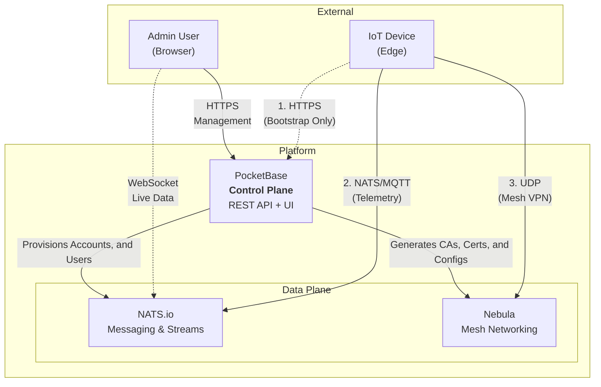
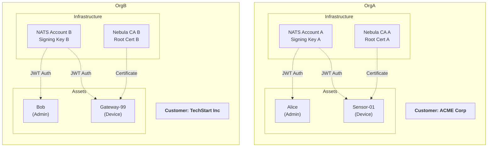
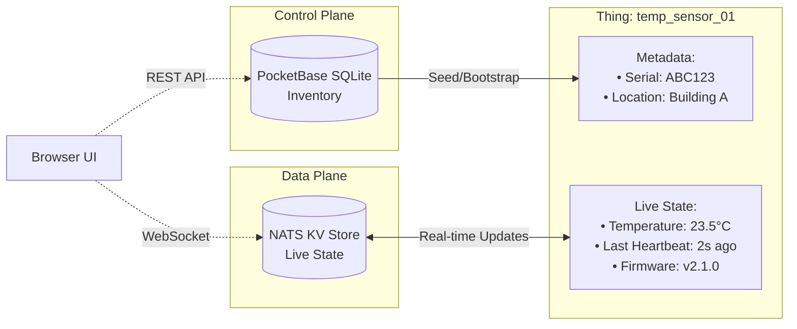

# Architecture

The Stone-Age.io Platform is architected to decouple **Control** (the "who" and "where") from **Data** (the "what" and "how"). This separation ensures that the platform remains lightweight and responsive, while the underlying infrastructure provides industrial-grade security and reliability.

---

## 1. Control Plane vs. Data Plane

Understanding the split between these two layers is key to understanding the platform.

### The Control Plane
 
**Powered by: PocketBase**

The Control Plane is where you manage your business logic and inventory. It is the "Source of Truth" for your static and relational data.

- **Identity:** Users, Organizations, and Memberships.
- **Inventory:** Things, Thing Types, Locations, and Floorplans.
- **Credentials:** Generating NATS JWTs, Nebula Certificates, and API Tokens.
- **Orchestration:** PocketBase hooks automatically trigger infrastructure provisioning when you change things in the UI.

### The Data Plane 

**Powered by: NATS.io & Nebula**

The Data Plane is where the actual work happens. It handles the movement of every byte of telemetry and every command sent by your things, e.g. IoT devices, applications, etc. and users.

- **Messaging:** Real-time pub/sub, request/reply, and streaming via NATS.
- **Connectivity:** Secure, peer-to-peer mesh networking via Nebula.

---

## 2. Multi-Tenancy & Infrastructure Isolation

In the Stone-Age.io Platform, multi-tenancy is not just a software filter; it is **infrastructure-enforced**. When you create an **Organization** in the platform, a specific chain of events occurs to isolate that tenant:

| Platform Entity | Infrastructure Primitive | Isolation Method |
| :--- | :--- | :--- |
| **Organization** | **NATS Account** | Cryptographic multi-tenancy via NATS Operator mode. |
| **Organization** | **Nebula CA** | A unique Certificate Authority is generated for every Org. |
| **Members/Things**| **NATS Users** | Users are scoped to their specific NATS Account. |

This means that even if a device in *Organization A* is compromised, it has no cryptographic path to see messages or network traffic in *Organization B*.

---

## 3. The Digital Twin Concept (Live State)

While PocketBase stores the **Inventory** (the identity/metadata about a thing), the live **State** of a thing is stored in the **NATS Key-Value (KV) Store**. We call this the Digital Twin.

*   **PocketBase (Static/Slow/Initial):** Stores the serial number, the type, the location, the assigned owner, etc. Data that doesn't change often or data used to seed the beginning of a thing.
*   **NATS KV (Variable/Fast/Live):** Stores the current temperature, the light switch status, the last heartbeat, and the current firmware version. Data that moves fast, but often used in stateful contexts.

**Why this matters:**
The UI connects directly to NATS via WebSockets. When a property changes in the KV store, the UI updates instantly without polling a database. This architecture allows the platform to handle high-frequency data with millisecond latency.

---

## 4. The Chain of Trust

The Stone-Age.io Platform uses a "Chain of Trust" model based on Private Key Infrastructure (PKI) and JSON Web Token (JWT).

### NATS Security (nKeys & JWTs)

The platform acts as a NATS **Account Server**.

1.  The platform holds the **Operator** key.
2.  Each Org has an **Account** key signed by the Operator.
3.  Each Thing/User has a **User** key signed by their Account.

Authentication happens via **JWTs** and **nKeys**. Accounts are distributed to the cluster in real-time. Users sign a challenge during the connection handshake, and the chain of trust is verified.

### Nebula Security (Certificates)

Nebula functions similarly to SSH keys but for your entire network.

1.  The platform generates a unique **CA** (Certificate Authority) for each Org.
2.  Within a CA you can create one or more unique networks.
3.  Each **Host** belongs to a single network and is issued a certificate signed by that CA.
4.  Hosts will only communicate with other hosts that have a certificate signed by the *exact same* CA.

---

## 5. Compatibility and Automation Strategy 

### Third-Party Applications

Since the platform manages just the infrastructure, you can plug-in any application that emit or consume data. We love to see the interesting ways the platform is utilized. Webhooks, Websockets, MQTT clients, etc. provide diverse protocol adapters for a wide range of compatibility.

### MQTT

NATS provides a native MQTT integration via Jetstream. Enable your server/cluster/leaf-node to allow MQTT connections and utilize your JWT as a bearer token to use the same auth as NATS clients.

### NATS Message Routing

Since the platform uses NATS.io as a messaging bus, any stream processor will work as thing. Use eKuiper, Benthos/RedPanda Connect/Wombat, etc. Or we offer our own if you want something simple.

The **Rule-Router** is a stateless evaluation engine that sits on the NATS backbone. 

Unlike traditional platforms that store "if/then" logic in a heavy database, rules are defined in simple YAML files. This allows the platform to evaluate thousands of messages per second.

1.  **Trigger:** A message arrives on a NATS subject (e.g., `telemetry.temp`).
2.  **Condition:** The router checks a condition (e.g., `temp > 40`).
3.  **Action:** The router performs an action (e.g., `publish alerts.high_temp` or `set a value in the KV store`).

This stateless approach makes the system horizontally scalable and incredibly resilient to failures.

### HTTP to NATS Integration

The **Http-Gateway** is a an application built on the same rule engine as the **Rule-Router**

This allows bidrectional communication via inbound and outbound webhooks.

Legacy devices or applicatoins that can't speak NATS or MQTT directly can send a POST requeste to configurable URL's with the same evaluation power as the **Rule-Router.** Inbound HTTP requests through the *Http-Gateway** are "Fire and Forget".

Alternatively, you can use NATS originating messages to send outbound HTTP requests integrating REST API's with Jetstream based acknowledgement.
