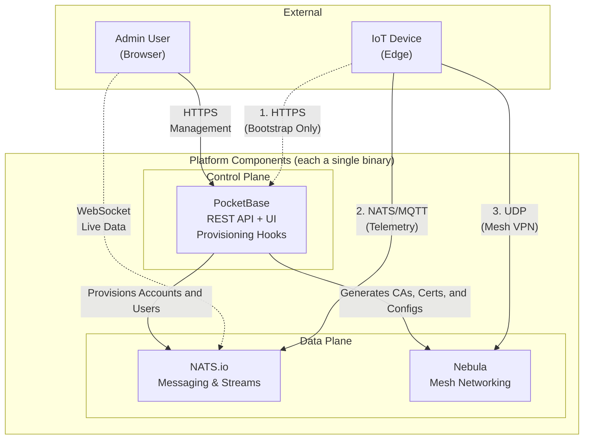
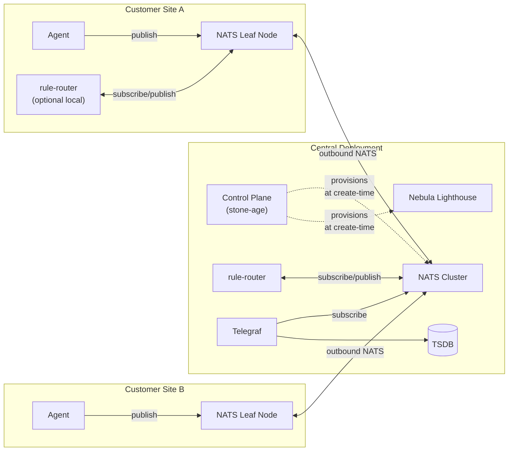
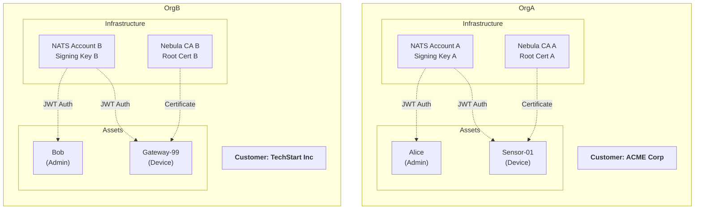
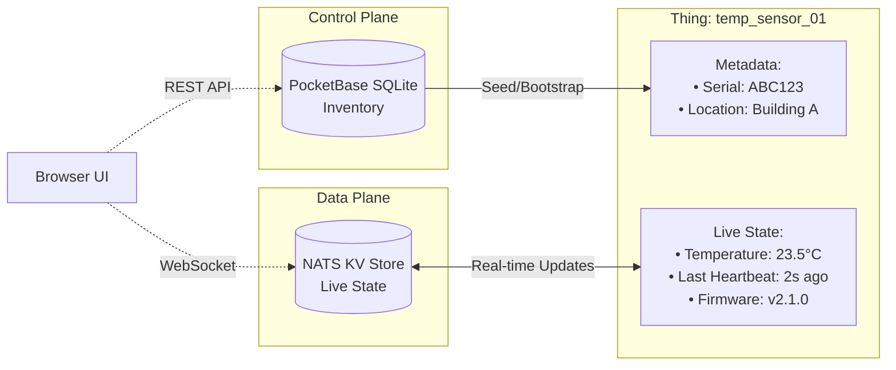

# Architecture

The Stone-Age.io Platform is architected to decouple **Control** (the "who" and "where") from **Data** (the "what" and "how"). This separation ensures that the platform remains lightweight and responsive, while the underlying infrastructure provides industrial-grade security and reliability.

This document focuses on the Control Plane / Data Plane split that structures the platform at the highest level. The Data Plane is further organized into four composable layers — see [Platform Layers](./platform-layers.md) for that model, and for how Planes and Layers relate.

---

## 1. Control Plane vs. Data Plane

Understanding the split between these two layers is key to understanding the platform.

### The Control Plane
 
**Powered by: PocketBase**

The Control Plane is where you manage your business logic and inventory. It is the "Source of Truth" for your static and relational data.

- **Identity:** Users, Organizations, and Memberships.
- **Inventory:** Things, Thing Types, Locations, and Floorplans.
- **Credentials:** Generating NATS JWTs, Nebula Certificates, and API Tokens.
- **Orchestration:** PocketBase hooks automatically trigger infrastructure provisioning when you change things in the UI.

### The Data Plane 

**Powered by: NATS.io & Nebula**

The Data Plane is where the actual work happens. It handles the movement of every byte of telemetry and every command sent by your things (IoT devices, applications, etc.) and users.

- **Messaging:** Real-time pub/sub, request/reply, and streaming via NATS.
- **Connectivity:** Secure, peer-to-peer mesh networking via Nebula.

The Data Plane is internally organized as four composable layers (substrate, declarative event logic, stream processing, long-term storage). The Control Plane sits alongside the Data Plane — it provisions identities and credentials the Data Plane uses, but it doesn't participate in runtime event flow. See [Platform Layers](./platform-layers.md) for the layer model.

---

## 2. Component Topology

Stone-Age.io is not a single monolithic executable. It's a small set of independent components, **each a single binary**, that communicate through NATS subjects. Every component is independently deployable, independently upgradable, and independently scalable.

The minimum viable deployment is two binaries: the Control Plane and a NATS server. Every other component is additive — you add it when you need the capability it provides, and it joins the fabric by speaking NATS to the same bus.

| Component | Role | Binary | Added when you need... |
|---|---|---|---|
| **Control Plane** | Identity, inventory, provisioning, embedded UI | `stone-age` | Always required |
| **NATS** | Messaging substrate, streams, KV | `nats-server` | Always required |
| **Nebula Lighthouse** | Mesh VPN directory / hole-punching | `nebula` | Secure edge connectivity |
| **Agent** | Edge telemetry, service checks, remote exec | `stone-age-agent` | You have devices or servers to manage |
| **Rule engine** | Layer 1 declarative event logic (router, gateway, scheduler) | `rule-router` | Automation, webhook I/O, scheduled publishing |
| **Stream processor** | Layer 2 windowed/stateful computation | eKuiper, Benthos, custom Go/Rust | Time-window aggregations, stream joins, anomaly detection |
| **Telegraf** | Layer 3 TSDB ingestion bridge | `telegraf` | Long-term historical storage |
| **TSDB** | Long-term time-series storage | VictoriaMetrics, InfluxDB, etc. | Long-term historical storage |
| **Dashboards** | Historical visualization and alerting | Grafana, Perses | Long-term historical analysis |

**Key properties of this topology:**

- **The Control Plane does not sit on the NATS runtime bus.** It provisions credentials into NATS at create-time, then gets out of the way. A PocketBase restart does not interrupt the Data Plane.
- **Every runtime component is a NATS client.** Agents publish telemetry. The rule engine subscribes to subjects and publishes derived events. Stream processors consume and produce on NATS. Telegraf subscribes to telemetry subjects and writes to the TSDB. The common vocabulary is NATS subjects.
- **Components can be colocated or distributed.** A small deployment might run the Control Plane, NATS, Nebula Lighthouse, and rule engine on a single host. A large deployment might run each centrally, with NATS leaf nodes and rule engine instances at each edge site. The components don't know or care which topology they're in — they only know about NATS.
- **Each component can be scaled independently.** The rule engine is stateless per-message and scales horizontally. NATS clusters horizontally. The Control Plane scales vertically (it's a low-traffic metadata store). Stream processors scale per pipeline.

This separation is deliberate and it's the reason the platform scales from a developer laptop to a multi-site MSP deployment without architectural changes. You add components, you don't rewire.

---

## 3. Multi-Tenancy & Infrastructure Isolation

In the Stone-Age.io Platform, multi-tenancy is not just a software filter; it is **infrastructure-enforced**. When you create an **Organization** in the platform, a specific chain of events occurs to isolate that tenant:

| Platform Entity | Infrastructure Primitive | Isolation Method |
| :--- | :--- | :--- |
| **Organization** | **NATS Account** | Cryptographic multi-tenancy via NATS Operator mode. |
| **Organization** | **Nebula CA** | A unique Certificate Authority is generated for every Org. |
| **Members/Things**| **NATS Users** | Users are scoped to their specific NATS Account. |

This means that even if a device in *Organization A* is compromised, it has no cryptographic path to see messages or network traffic in *Organization B*.

---

## 4. The Digital Twin Concept (Live State)

While PocketBase stores the **Inventory** (the identity/metadata about a thing), the live **State** of a thing is stored in the **NATS Key-Value (KV) Store**. We call this the Digital Twin.

*   **PocketBase (Static/Slow/Initial):** Stores the serial number, the type, the location, the assigned owner, etc. Data that doesn't change often or data used to seed the beginning of a thing.
*   **NATS KV (Variable/Fast/Live):** Stores the current temperature, the light switch status, the last heartbeat, and the current firmware version. Data that moves fast, but often used in stateful contexts.

**Why this matters:**
The UI connects directly to NATS via WebSockets. When a property changes in the KV store, the UI updates instantly without polling a database. This architecture allows the platform to handle high-frequency data with millisecond latency.

The KV store is also where Layer 1 rules keep durable state — alarm status, presence keys, debounce windows, rate-limit counters. See [Automation](./automation.md) for the canonical patterns.

The subjects and message shapes that flow through both the KV store and the broader NATS bus are declared, per kind of participant, by **Thing Types**. A Thing Type is the contract for what a Thing publishes, subscribes to, requests, or replies to — making the subject hierarchy that underpins the Digital Twin explicit rather than implicit. See [Thing Types](./thing-types.md) for the full model.

---

## 5. The Chain of Trust

The Stone-Age.io Platform uses a "Chain of Trust" model based on Private Key Infrastructure (PKI) and JSON Web Token (JWT).

### NATS Security (nKeys & JWTs)

The platform acts as a NATS **Account Server**.

1.  The platform holds the **Operator** key.
2.  Each Org has an **Account** key signed by the Operator.
3.  Each Thing/User has a **User** key signed by their Account.

Authentication happens via **JWTs** and **nKeys**. Accounts are distributed to the cluster in real-time. Users sign a challenge during the connection handshake, and the chain of trust is verified.

### Nebula Security (Certificates)

Nebula functions similarly to SSH keys but for your entire network.

1.  The platform generates a unique **CA** (Certificate Authority) for each Org.
2.  Within a CA you can create one or more unique networks.
3.  Each **Host** belongs to a single network and is issued a certificate signed by that CA.
4.  Hosts will only communicate with other hosts that have a certificate signed by the *exact same* CA.

---

## 6. Compatibility and Automation Strategy 

### Third-Party Applications

Since the platform manages just the infrastructure, you can plug in any application that emits or consumes data. We love to see the interesting ways the platform is utilized. Webhooks, Websockets, MQTT clients, etc. provide diverse protocol adapters for a wide range of compatibility.

### MQTT

NATS provides a native MQTT integration via JetStream. Enable your server/cluster/leaf-node to allow MQTT connections and utilize your JWT as a bearer token to use the same auth as NATS clients.

### Layered Event Processing

The platform's event-processing story is structured as three distinct tiers on top of the NATS substrate. Each tier has a clear job and composes cleanly with the others. See [Platform Layers](./platform-layers.md) for the complete model; this section summarizes where each component fits.

#### Layer 1 — The Rule Engine (Declarative Event Logic)

The platform's **rule engine** (`rule-router`) is a separate single-binary component that runs alongside NATS — just like the Agent does, but on the server/central side of the fabric rather than at the edge. It's not embedded in the Control Plane binary; it's a peer process that speaks NATS. It hosts three features:

- **Router** — NATS-in, NATS-out. The default. Routes, filters, and enriches messages between NATS subjects.
- **Gateway** — Bidirectional HTTP↔NATS. Inbound webhooks become NATS messages; outbound NATS messages become HTTP calls to external APIs (with configurable retry).
- **Scheduler** — Cron-triggered publishes to NATS or HTTP on a schedule.

All three features share the same YAML rule syntax following the **Trigger → Condition → Action** pattern, read from the same NATS KV buckets, and run on the same engine. You can enable any combination of features in a single process or split them across separate processes. Instances can be deployed centrally, at the edge alongside NATS leaf nodes, or both — the engine doesn't know or care which topology it's in.

The rule engine is **stateless per message** — each rule evaluation is independent. Durable state lives in NATS KV, which rules read from and write to. This keeps the engine horizontally scalable while still supporting rich stateful patterns (alarm deduplication, presence tracking, debouncing) through KV-as-state. See [Automation](./automation.md) for the full pattern library and feature-by-feature detail.

#### Layer 2 — Stream Processing (Stateful Computation)

When a problem needs **time-window aggregations, stream joins, or retractable results**, the rule engine isn't the right tool. That's where stream processors come in. They subscribe to NATS subjects, maintain in-memory state with proper windowing semantics, and publish results back to NATS for Layer 1 rules or the UI to consume.

Any stream processor that speaks NATS works: **eKuiper**, **Benthos / RedPanda Connect / Wombat**, or your own custom Go/Python/Rust service. The platform has no opinion — pick whichever matches your team and your problem. See [Stream Processing](./stream-processing.md) for the full picture.

---

## 7. Where to Go Next

- For the conceptual layer model: [Platform Layers](./platform-layers.md).
- For the contract layer that describes participants on the fabric: [Thing Types](./thing-types.md).
- For Layer 0 (substrate) detail: [Connectivity](./connectivity.md).
- For Layer 1 (rule engine) detail: [Automation](./automation.md).
- For Layer 2 (stream processing) detail: [Stream Processing](./stream-processing.md).
- For Layer 3 (long-term storage) detail: [Observability](./observability.md).
