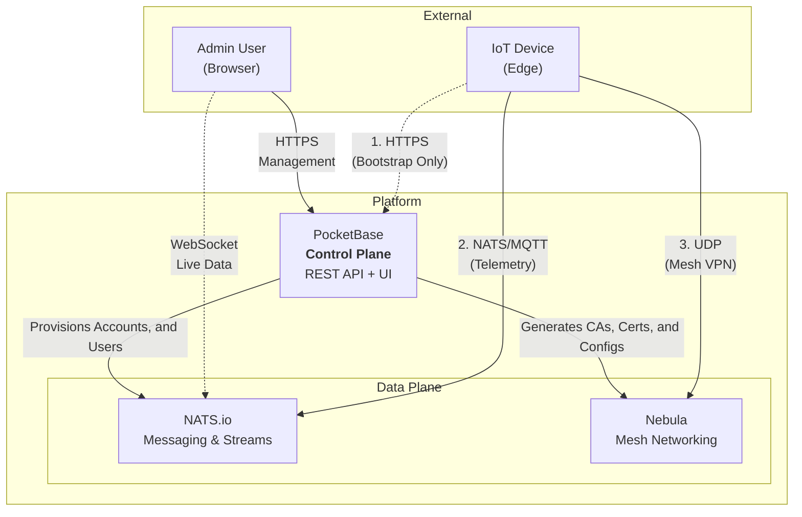
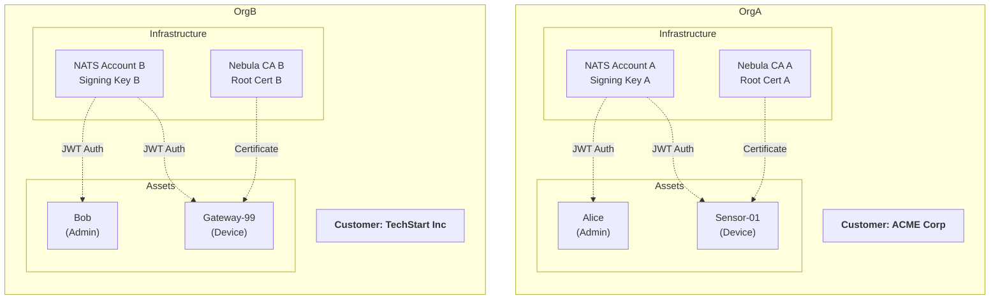
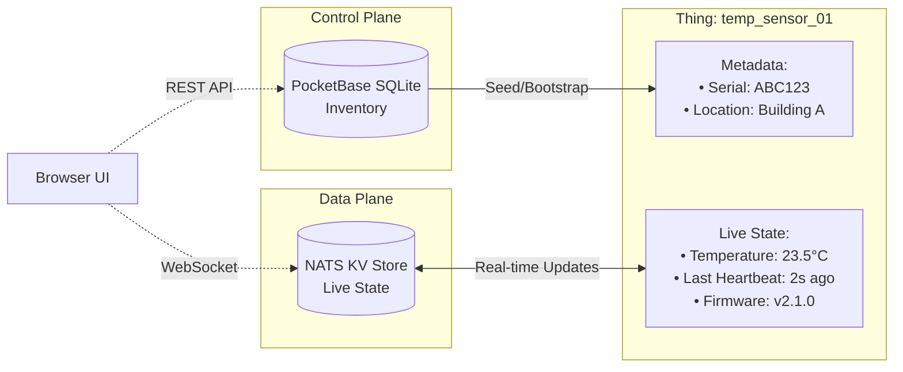

# Architecture

The Stone-Age.io Platform is architected to decouple **Control** (the "who" and "where") from **Data** (the "what" and "how"). This separation ensures that the platform remains lightweight and responsive, while the underlying infrastructure provides industrial-grade security and reliability.

On top of that Control / Data split, the platform is organized as **four composable layers** — substrate, declarative event logic, stream processing, and long-term storage. This document focuses on the Control Plane / Data Plane architecture; see [Platform Layers](./platform-layers.md) for the complete layer model and graduation criteria.

---

## 1. Control Plane vs. Data Plane

Understanding the split between these two layers is key to understanding the platform.

### The Control Plane
 
**Powered by: PocketBase**

The Control Plane is where you manage your business logic and inventory. It is the "Source of Truth" for your static and relational data.

- **Identity:** Users, Organizations, and Memberships.
- **Inventory:** Things, Thing Types, Locations, and Floorplans.
- **Credentials:** Generating NATS JWTs, Nebula Certificates, and API Tokens.
- **Orchestration:** PocketBase hooks automatically trigger infrastructure provisioning when you change things in the UI.

### The Data Plane 

**Powered by: NATS.io & Nebula**

The Data Plane is where the actual work happens. It handles the movement of every byte of telemetry and every command sent by your things (IoT devices, applications, etc.) and users.

- **Messaging:** Real-time pub/sub, request/reply, and streaming via NATS.
- **Connectivity:** Secure, peer-to-peer mesh networking via Nebula.

The Data Plane is Layer 0 of the platform's layered architecture — the always-on substrate that all higher tiers build on.

---

## 2. Multi-Tenancy & Infrastructure Isolation

In the Stone-Age.io Platform, multi-tenancy is not just a software filter; it is **infrastructure-enforced**. When you create an **Organization** in the platform, a specific chain of events occurs to isolate that tenant:

| Platform Entity | Infrastructure Primitive | Isolation Method |
| :--- | :--- | :--- |
| **Organization** | **NATS Account** | Cryptographic multi-tenancy via NATS Operator mode. |
| **Organization** | **Nebula CA** | A unique Certificate Authority is generated for every Org. |
| **Members/Things**| **NATS Users** | Users are scoped to their specific NATS Account. |

This means that even if a device in *Organization A* is compromised, it has no cryptographic path to see messages or network traffic in *Organization B*.

---

## 3. The Digital Twin Concept (Live State)

While PocketBase stores the **Inventory** (the identity/metadata about a thing), the live **State** of a thing is stored in the **NATS Key-Value (KV) Store**. We call this the Digital Twin.

*   **PocketBase (Static/Slow/Initial):** Stores the serial number, the type, the location, the assigned owner, etc. Data that doesn't change often or data used to seed the beginning of a thing.
*   **NATS KV (Variable/Fast/Live):** Stores the current temperature, the light switch status, the last heartbeat, and the current firmware version. Data that moves fast, but often used in stateful contexts.

**Why this matters:**
The UI connects directly to NATS via WebSockets. When a property changes in the KV store, the UI updates instantly without polling a database. This architecture allows the platform to handle high-frequency data with millisecond latency.

The KV store is also where the Rule-Router (Layer 1) keeps state that its rules read and write — alarm status, presence keys, debounce windows, rate-limit counters. The pattern throughout the platform is the same: **state lives in KV; logic is expressed in rules or pipelines that read from and write to KV.**

---

## 4. The Chain of Trust

The Stone-Age.io Platform uses a "Chain of Trust" model based on Private Key Infrastructure (PKI) and JSON Web Token (JWT).

### NATS Security (nKeys & JWTs)

The platform acts as a NATS **Account Server**.

1.  The platform holds the **Operator** key.
2.  Each Org has an **Account** key signed by the Operator.
3.  Each Thing/User has a **User** key signed by their Account.

Authentication happens via **JWTs** and **nKeys**. Accounts are distributed to the cluster in real-time. Users sign a challenge during the connection handshake, and the chain of trust is verified.

### Nebula Security (Certificates)

Nebula functions similarly to SSH keys but for your entire network.

1.  The platform generates a unique **CA** (Certificate Authority) for each Org.
2.  Within a CA you can create one or more unique networks.
3.  Each **Host** belongs to a single network and is issued a certificate signed by that CA.
4.  Hosts will only communicate with other hosts that have a certificate signed by the *exact same* CA.

---

## 5. Compatibility and Automation Strategy 

### Third-Party Applications

Since the platform manages just the infrastructure, you can plug in any application that emits or consumes data. We love to see the interesting ways the platform is utilized. Webhooks, Websockets, MQTT clients, etc. provide diverse protocol adapters for a wide range of compatibility.

### MQTT

NATS provides a native MQTT integration via JetStream. Enable your server/cluster/leaf-node to allow MQTT connections and utilize your JWT as a bearer token to use the same auth as NATS clients.

### Layered Event Processing

The platform's event-processing story is structured as three distinct tiers on top of the NATS substrate. Each tier has a clear job and composes cleanly with the others. See [Platform Layers](./platform-layers.md) for the complete model; this section summarizes where each component fits.

#### Layer 1 — The Rule-Router (Declarative Event Logic)

The **Rule-Router** is a high-performance evaluation engine that sits on the NATS backbone. It expresses logic as simple YAML rules following the **Trigger → Condition → Action** pattern.

1.  **Trigger:** A message arrives on a NATS subject (e.g., `telemetry.temp`).
2.  **Condition:** The router checks a condition (e.g., `temp > 40`).
3.  **Action:** The router performs an action (e.g., `publish alerts.high_temp` or update a KV key).

The Rule-Router is **stateless per message** — each rule evaluation is independent. Durable state lives in NATS KV, which rules read and write. This keeps rule-router horizontally scalable while still supporting rich stateful patterns (alarm deduplication, presence tracking, debouncing) through KV-as-state. See [Automation](./automation.md) for the full pattern library.

#### Layer 2 — Stream Processing (Stateful Computation)

When a problem needs **time-window aggregations, stream joins, or retractable results**, the Rule-Router isn't the right tool. That's where stream processors come in. They subscribe to NATS subjects, maintain in-memory state with proper windowing semantics, and publish results back to NATS for the Rule-Router or UI to consume.

Any stream processor that speaks NATS works: **eKuiper**, **Benthos / RedPanda Connect / Wombat**, or your own custom Go/Python/Rust service. The platform has no opinion — pick whichever matches your team and your problem. See [Stream Processing](./stream-processing.md) for the full picture.

#### The HTTP-Gateway — Layer 1, HTTP flavor

The **HTTP-Gateway** is built on the same rule engine as the Rule-Router but translates between HTTP and NATS in both directions.

- **Inbound:** Legacy devices or applications that can't speak NATS or MQTT directly can send a POST request to a configurable URL, and the gateway evaluates rules against the request just as the Rule-Router would evaluate a NATS message. Inbound requests are "fire and forget" — the HTTP response is immediate.
- **Outbound:** NATS messages can trigger outbound HTTP requests to external REST APIs, with JetStream-based acknowledgement so retries are durable.

---

## 6. Where to Go Next

- For the conceptual layer model: [Platform Layers](./platform-layers.md).
- For Layer 0 (substrate) detail: [Connectivity](./connectivity.md).
- For Layer 1 (Rule-Router) detail: [Automation](./automation.md).
- For Layer 2 (stream processing) detail: [Stream Processing](./stream-processing.md).
- For Layer 3 (long-term storage) detail: [Observability](./observability.md).
