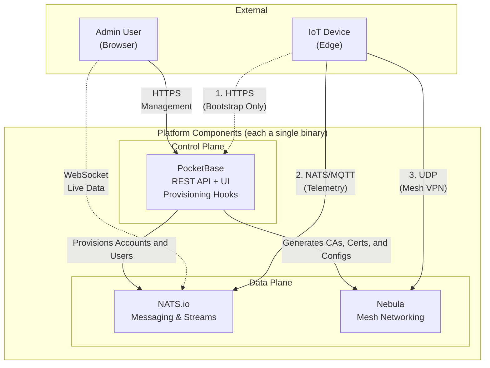
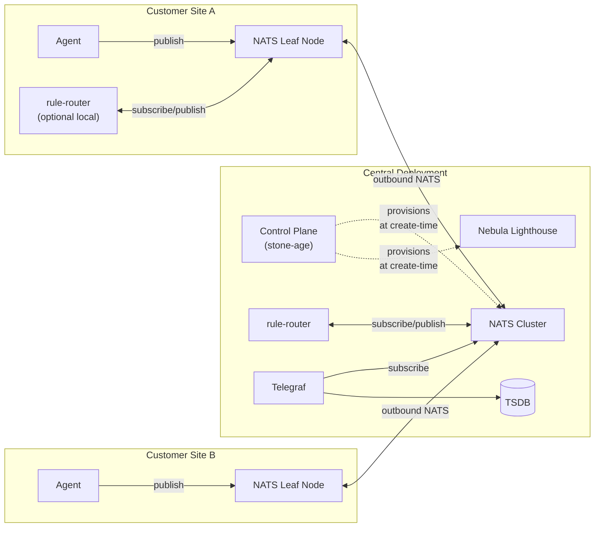
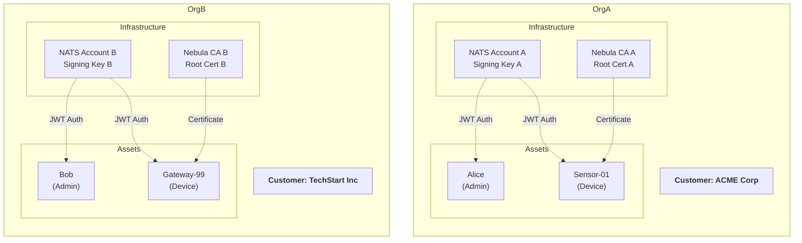
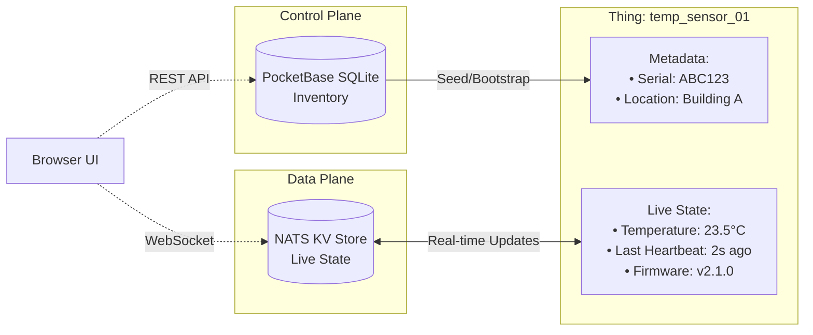

# Architecture

The platform separates **control** (who and where) from **data** (what and
how). This page covers that split. The Data Plane itself has four layers. See
[Platform Layers](./platform-layers.md) for those.

---

## 1. Control Plane vs. Data Plane


```mermaid
graph TB
    subgraph Platform["Platform Components (each a single binary)"]
        direction TB
        
        subgraph ControlPlane["Control Plane"]
            PB["PocketBase<br/>REST API + UI<br/>Provisioning Hooks"]
        end
        
        subgraph DataPlane["Data Plane"]
            NATS["NATS.io<br/>Messaging & Streams"]
            Nebula["Nebula<br/>Mesh Networking"]
        end
        
        PB -->|"Provisions Accounts and Users"| NATS
        PB -->|"Generates CAs, Certs, and Configs"| Nebula
    end
    
    subgraph External["External"]
        Admin["Admin User<br/>(Browser)"]
        Thing["IoT Device<br/>(Edge)"]
    end
    
    Admin -->|"HTTPS<br/>Management"| PB
    Admin -.->|"WebSocket<br/>Live Data"| NATS
    
    Thing -.->|"1. HTTPS<br/>(Bootstrap Only)"| PB
    Thing -->|"2. NATS/MQTT<br/>(Telemetry)"| NATS
    Thing -->|"3. UDP<br/>(Mesh VPN)"| Nebula
    
```

### The Control Plane

**Powered by PocketBase.** The Control Plane is the source of truth for
inventory and identity.

- **Identity:** Users, Organizations and Memberships.
- **Inventory:** Things, Thing Types, Locations and Floorplans.
- **Credentials:** NATS JWTs, Nebula certificates and API tokens.
- **Provisioning:** PocketBase hooks provision infrastructure when you change
  records.
- **Authorization:** the PocketBase API rules on each collection are the only
  permission layer. One hook also enforces a tenancy invariant that the rules
  cannot express. See [§3](#authorization-inside-an-organization) and
  [Authorization & Roles](./authorization.md).

### The Data Plane

**Powered by NATS.io and Nebula.** The Data Plane moves all telemetry and
commands from things (devices, applications) and users.

- **Messaging:** pub/sub, request/reply and streaming through NATS.
- **Connectivity:** peer-to-peer mesh networking through Nebula.

---

## 2. Component Topology

The platform is a small set of independent binaries that talk over NATS
subjects. You can deploy, upgrade and scale each one on its own.

The smallest deployment is **one** binary: `stone-age serve --nats` runs the
NATS server inside the Control Plane ([ADR 0001](./decisions/0001-embedded-nats-server.md)).
If you run `nats-server` as its own process, a Control Plane restart does not
stop the Data Plane. Add every other component when you need it.

| Component | Role | Binary | Add it when you need... |
|---|---|---|---|
| **Control Plane** | Identity, inventory, provisioning, embedded UI | `stone-age` | Always required |
| **NATS** | Messaging, streams, KV | `nats-server`, or embedded with `serve --nats` | Always required, as its own process or inside the Control Plane |
| **Nebula Lighthouse** | Mesh VPN directory and hole punching | `nebula` | Secure edge connectivity |
| **Agent** | Edge telemetry, service checks, remote exec | `agent` | Devices or servers to manage |
| **Rule engine** | Layer 1 event logic (router, gateway, scheduler) | `rule-router` | Automation, webhooks, scheduled publishes |
| **Stream processor** | Layer 2 windowed or stateful computation | eKuiper, Benthos, custom Go/Rust | Window aggregations, stream joins, anomaly detection |
| **Telegraf** | Layer 3 bridge into the TSDB | `telegraf` | Long-term storage |
| **TSDB** | Long-term time-series storage | VictoriaMetrics, InfluxDB, etc. | Long-term storage |
| **Dashboards** | Historical charts and alerts | Grafana, Perses | Historical analysis |

### Bootstrapping the NATS Server from the Control Plane

When you initialize PocketBase, the platform generates a NATS Operator JWT, a
System Account JWT, a System User, a resolver configuration and a `nats-server`
config file. Export them with one command:

```bash
./stone-age nats export --output ./nats-config/
```

Then run `nats-server -c ./nats-config/nats.conf`. From that point, PocketBase
sends every account and user change to the running cluster over the System
Account. You do not edit config files or restart servers.

The Control Plane owns the NATS Operator key and creates the server's identity
files. After NATS starts, it manages its own lifecycle. You can run several NATS
servers or a cluster from one Control Plane, and scale or reconfigure them
without PocketBase. The Control Plane does not supervise the servers.

`stone-age serve --nats` runs a NATS server inside the Control Plane from the
same exported config. The operator, identity hierarchy and file are the same.
The one difference is that the Data Plane now shares a process with the Control
Plane. This mode is off by default. See [Operations §2.1](./operations.md#21-where-the-nats-server-runs)
and [Getting Started](./getting-started.md).

### Key Properties of This Topology

- **The Control Plane is an admin-only NATS client.** PocketBase connects on the
  System Account and publishes account and credential changes
  (`$SYS.REQ.CLAIMS.UPDATE` and related admin subjects). It does not publish or
  subscribe on tenant subjects. With NATS as its own process, a PocketBase
  restart pauses new provisioning but does not stop tenant traffic. With
  `serve --nats`, a restart is a short outage of the whole bus.
- **Every runtime component is a NATS client.** Agents publish telemetry. The
  rule engine subscribes and publishes derived events. Stream processors read
  and write NATS. Telegraf subscribes and writes to the TSDB.
- **Components can share a host or be spread out.** A small deployment can run
  the Control Plane, NATS, a Nebula lighthouse and the rule engine on one host.
  A large one can run them centrally, with NATS leaf nodes and rule engines at
  each site. The components only know about NATS.
- **Each component scales on its own.** The rule engine keeps no state between
  messages and scales horizontally. Its `throttle` windows are in each
  instance's memory, so each instance has its own windows. NATS clusters
  horizontally. The Control Plane scales vertically, because it is a
  low-traffic metadata store. Stream processors scale per pipeline.


```mermaid
flowchart LR
    subgraph Central["Central Deployment"]
        CP["Control Plane<br/>(stone-age)"]
        NATSC["NATS Cluster"]
        NEB["Nebula Lighthouse"]
        RR["rule-router"]
        TG["Telegraf"]
        TSDB[("TSDB")]
    end
    
    subgraph Edge["Customer Site A"]
        LEAF["NATS Leaf Node"]
        AGENT1["Agent"]
        RR_EDGE["rule-router<br/>(optional local)"]
    end
    
    subgraph Edge2["Customer Site B"]
        LEAF2["NATS Leaf Node"]
        AGENT2["Agent"]
    end
    
    CP -.->|"provisions<br/>at create-time"| NATSC
    CP -.->|"provisions<br/>at create-time"| NEB
    
    RR <-->|"subscribe/publish"| NATSC
    TG -->|"subscribe"| NATSC
    TG --> TSDB
    
    LEAF <-->|"outbound NATS"| NATSC
    LEAF2 <-->|"outbound NATS"| NATSC
    
    AGENT1 -->|"publish"| LEAF
    RR_EDGE <-->|"subscribe/publish"| LEAF
    AGENT2 -->|"publish"| LEAF2
```

The same design runs on a laptop and on a multi-site MSP deployment. To grow,
you add components. You do not change how they connect.

---

## 3. Multi-Tenancy & Infrastructure Isolation

The infrastructure enforces tenancy. When you create an **Organization**, the
platform creates these primitives for it:

| Platform Entity | Infrastructure Primitive | Isolation Method |
| :--- | :--- | :--- |
| **Organization** | **NATS Account** | Cryptographic multi-tenancy through NATS Operator mode. |
| **Organization** | **Nebula CA** | Each Org gets its own Certificate Authority. |
| **Thing** (auth record) | **NATS User** | Each Thing has its own NATS user, signed by the Org's Account. |
| **Membership** (User to Org link) | **NATS User** (relation) | A Membership points to a NATS user in that Org's Account, so the person has a credential scoped to that organization. |

A compromised device in *Organization A* has no cryptographic path to messages
or network traffic in *Organization B*.

### 3.1 Inventory-as-Identity

Many systems keep two registries: an asset database that knows the lobby camera
exists, and a device-management system that knows what the camera can do on the
network. The two drift apart. Someone removes a device from one and forgets the
other.

In Stone-Age.io, **the inventory record is the identity.**

A `things` record is a PocketBase **auth record**. It has credentials and can
sign in to the API to fetch its own configuration. It has a relation to a
`nats_users` record (its messaging identity) and a relation to a `nebula_hosts`
record (its mesh identity). One row is four things:

| The row is... | Which means... |
| :--- | :--- |
| An **inventory entry** | It has a code, a name, a location, a type and metadata |
| A **login** | It can authenticate against the REST API and read its own record |
| A **messaging identity** | Its NATS user is signed by the Org's Account, with permissions from its NATS role |
| A **mesh node** | Its Nebula host has a certificate from the Org's CA |

**The halves are optional.** `POST /api/org/things` takes a `mode` for each
identity: `auto` (mint a new one), `link` (attach an existing one) or `none`. A
Thing with `none` on both is a plain inventory row that never appears on the
bus. This is [depth 1](./index.md#start-where-you-need-to). A `member` can
create and edit inventory, but only an Owner or Admin can attach identities.

**One action changes the asset and the credential.** When you clear `active` on
a Thing:

1. The device cannot sign in again.
2. Every session it holds is signed out immediately.
3. Its NATS identity is suspended. The key is revoked and nothing is reissued.
4. Its Nebula certificate goes on every peer's blocklist. This takes effect as
   each peer's config is redeployed.

When you reactivate the Thing, it gets a *new* `.creds` file and the old one
stays revoked. See [Authorization §4.2](./authorization.md#42-taking-a-device-out-of-service).

The same idea applies to Organizations (**Infrastructure-as-Tenant**). Creating
an Organization provisions its NATS Account and Nebula CA, and the record and
its infrastructure are created and deleted together.

### Authorization inside an Organization

Cryptography separates tenants. Inside a tenant, five roles on the Membership
record control access: `owner`, `admin`, `member`, `viewer` and `dashboard`.
Two identities work across organizations: the **Platform Operator**
(`users.is_operator`) and the **SuperUser**.

- `owner` and `admin` are the same in every rule.
- `member` manages inventory.
- `viewer` reads inventory.
- `dashboard` can open only the Visualizer.
- Only Platform Operators can edit the Organization record and read the audit
  log.

**The PocketBase API rules on each collection are the only permission layer.**
The provisioning libraries (`pb-nats`, `pb-nebula`) have no tenancy logic. The
console's capability map decides what it shows, not what is permitted.

One hook enforces an invariant: it refuses any relation into another
Organization's records, also for superusers. A rule cannot follow a submitted id
to its target, and without the hook `pb-nats` would sign a credential in
whichever Account that id named. See [Authorization & Roles](./authorization.md)
for the capability matrix and the credential design.


```mermaid
graph TB
    subgraph OrgA
        direction TB
        A_Header["<b>Customer: ACME Corp</b>"]
        
        subgraph A_Infra["Infrastructure"]
            A_NATS["NATS Account A<br/> Signing Key A"]
            A_CA["Nebula CA A<br/> Root Cert A"]
        end
        
        subgraph A_Assets["Assets"]
            A_User["Alice<br/>(Admin)"]
            A_Thing["Sensor-01<br/>(Device)"]
        end
        
        A_NATS -.->|"JWT Auth"| A_User
        A_NATS -.->|"JWT Auth"| A_Thing
        A_CA -.->|"Certificate"| A_Thing
    end
    
    subgraph OrgB
        direction TB
        B_Header["<b>Customer: TechStart Inc</b>"]
        
        subgraph B_Infra["Infrastructure"]
            B_NATS["NATS Account B<br/>Signing Key B"]
            B_CA["Nebula CA B<br/>Root Cert B"]
        end
        
        subgraph B_Assets["Assets"]
            B_User["Bob<br/>(Admin)"]
            B_Thing["Gateway-99<br/>(Device)"]
        end
        
        B_NATS -.->|"JWT Auth"| B_User
        B_NATS -.->|"JWT Auth"| B_Thing
        B_CA -.->|"Certificate"| B_Thing
    end
```

---

## 4. The Digital Twin Concept (Live State)

PocketBase stores the **inventory** of a thing. The **NATS KV store** holds its
live **state**. This live state is the digital twin.

- **PocketBase** holds data that changes slowly or seeds a new thing: serial
  number, type, location, owner.
- **NATS KV** holds data that changes fast: current temperature, switch status,
  last heartbeat, firmware version.

The console connects to NATS over WebSocket. When a KV value changes, the
console updates with no database polling.

### 4.1 Two buckets, one writer each

Each organization has **two** KV buckets, split by who writes the data:

| Bucket | Who writes it | Direction |
| :--- | :--- | :--- |
| `twin` | the device | edge to hub (**reported** state) |
| `twin_desired` | a console user | hub to edge (**desired** state) |

Keys are `<kind>.<code>.<prop>`, for example `thing.S01.temp` or
`location.CHI-W-A.occupancy`. The two buckets use the *same* key for a
property. The bucket gives the direction, so keys carry no sync data. These
buckets are per organization, keyed by code. There is no bucket per Location or
Thing.

**One writer per bucket is what keeps the data safe.** If both ends write one
bucket, a conflict has no winner. The two values swap back and forth across the
leaf link with no end.

At the edge, the twin is a preset. An agent takes lists of buckets to mirror
down and relay up, and `sync.twin: true` expands to these two buckets
([Leaf Nodes §6](./leaf-nodes.md#6-offline-autonomy-and-kv-bucket-sync)). The
rules on this page apply to every bucket a site declares. The agent refuses to
start if two lists give one bucket two writers.

Reported state is written by the edge, so **it is read-only in the console.**
An edit to a reported key would be overwritten on the next sync. `twin_desired`
is the writable bucket.

### 4.2 What belongs in `twin_desired`, and what does not

| Job | Where it goes |
| :--- | :--- |
| Reported state | `twin` KV, written by the device |
| Setpoints and configuration | `twin_desired` KV. It is durable, so a device that boots after three days offline reads the current value from its local mirror. |
| Commands (`reboot`) | A NATS message on `cmd.>`, **not** a KV value. A "reboot now" that stays in a bucket is a bug. |
| Ranges, thresholds, alarms, hysteresis | A [rule](./automation.md) over `twin`, not a desired value. |

**Pair a desired key with an echo, not a measurement.** Put a desired value on
a property the device echoes back to acknowledge an instruction, such as
`setpoint` or `mode`. Those values match exactly when the device accepts the
instruction, so a difference means the device has not accepted it. A desired
`temp = 20` against a reported `temp = 20.3` compares an instruction to a
continuous reading. It differs permanently, and no single tolerance fixes that
for all properties, devices and seasons. "Alarm when temp leaves 18 to 22" is a
rule over reported state.

A desired value is a **partial assertion**. Only the keys in the desired object
are compared, and extra fields in the reported object are ignored. With full
equality, one new reported field would make every older assertion "differ".
Objects use subset comparison. Arrays and scalars must match exactly.

### 4.3 The console says "differs", never "pending"

**The platform does not apply desired values to devices.** No hook, agent or
subscription does this. `twin_desired` only delivers the value: the platform's
job ends when the value is readable in the edge's local KV. Your firmware or
your rules consume it.

So the console shows the difference and predicts nothing. "Waiting for the
device" would imply a control loop that does not exist. The console shows the
values, such as `"auto"` and `"manual"` in the row, and a reported/desired
column pair in the detail pane.

Layer 1 rules also keep durable state in KV, such as alarm status and presence
keys. Debounce and rate limiting use the rule engine's `throttle`, which keeps
its windows in memory, not KV. See [Automation](./automation.md).

**Thing Types** declare the subjects each kind of participant uses: what it
publishes, subscribes to, requests and replies to. They do not describe payload
shape. See [Thing Types](./thing-types.md).


```mermaid
graph LR
    subgraph Control["Control Plane"]
        PB_DB[("PocketBase SQLite<br/>Inventory")]
    end
    
    subgraph Data["Data Plane"]
        KV[("NATS KV Store<br/>Live State")]
    end
    
    subgraph Thing["Thing: temp_sensor_01"]
        Meta["Metadata:<br/>• Serial: ABC123<br/>• Location: Building A"]
        State["Live State:<br/>• Temperature: 23.5°C<br/>• Last Heartbeat: 2s ago<br/>• Firmware: v2.1.0"]
    end
    
    PB_DB -->|"Seed/Bootstrap"| Meta
    KV <-->|"Real-time Updates"| State
    
    UI["Browser UI"] -.->|"WebSocket"| KV
    UI -.->|"REST API"| PB_DB
```

---

## 5. The Chain of Trust

The platform's trust model uses public key infrastructure (PKI) and JSON Web
Tokens (JWT).

### NATS Security (nKeys & JWTs)

The Control Plane creates every Account JWT and pushes it to the servers. The
servers run a **full resolver** (`resolver: { type: full }` in the exported
config). The Control Plane publishes each new or changed Account JWT on
`$SYS.REQ.CLAIMS.UPDATE`. There is no separate account server.

1. The Control Plane holds the **NATS Operator** key.
2. Each Org has an **Account** key, signed by the NATS Operator.
3. Each Thing and User has a **User** key, signed by its Account.

Clients authenticate with **JWTs** and **nKeys**. A user signs a challenge
during the connection handshake, and the server verifies the chain.

### Nebula Security (Certificates)

1. The platform generates a **CA** (Certificate Authority) for each Org.
2. A CA can have one or more networks.
3. Each **host** belongs to one network and has a certificate signed by that CA.
4. Hosts communicate only with hosts whose certificates come from the *same* CA.

---

## 6. Compatibility

### Third-Party Applications

The platform manages the infrastructure, so any application that sends or
receives data can connect. Webhooks, WebSockets and MQTT clients all work.

### MQTT

NATS has native MQTT support through JetStream. Enable MQTT on your server,
cluster or leaf node. MQTT clients send their JWT as a bearer token and use the
same auth as NATS clients.

---

## 7. Where to Go Next

- The layer model: [Platform Layers](./platform-layers.md)
- Subject contracts: [Thing Types](./thing-types.md)
- Roles, API rules and credentials: [Authorization & Roles](./authorization.md)
- Layer 0: [Connectivity](./connectivity.md)
- Layer 1: [Automation](./automation.md)
- Layer 2: [Stream Processing](./stream-processing.md)
- Layer 3: [Observability](./observability.md)
