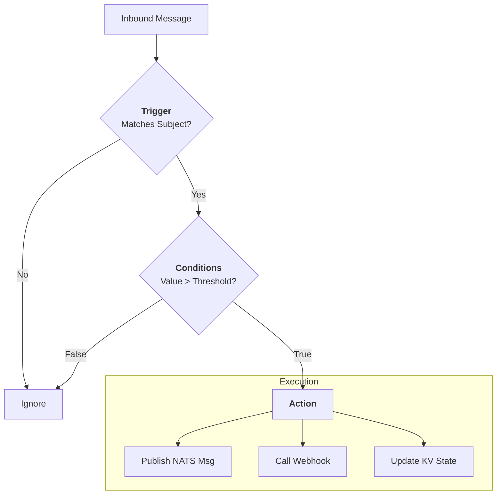

# Automation

Automation transforms raw telemetry into actionable intelligence. While the Control Plane (PocketBase) manages the inventory, the Automation layer (consisting of the **Rule-Router** and **HTTP-Gateway**) processes events in real-time to route data, trigger alerts, and manage system state.

<center>

</center>

---

## 1. The Rule-Router 

The **Rule-Router** is a stateless, high-performance evaluation engine that sits directly on the NATS backbone. It is used for message inspection and routing between NATS Subjects and follows the **TCA (Trigger-Condition-Action)** pattern.

### How it Works

Every rule defined in the system follows a simple logical flow:

1.  **Trigger:** A message arrives on a NATS subject (e.g., `sensors.temp_01`).
2.  **Condition:** The router evaluates the payload against specific logic (e.g., `{value} > 40`).
3.  **Action:** If the condition is met, the router executes one or more actions (e.g., publishing a new message or calling a webhook).

### Key Features

- **Stateless Scaling:** Because the router doesn't store data locally, you can run multiple instances to handle massive loads. It has been tested to evaluate over **8,000 messages per second** on a single node.
- **YAML-Based:** Rules are defined in simple, human-readable YAML files.
- **Rich Variable Injection:** Use `{field_name}` to access message data or `{@system_var}` for context like `{@timestamp}`, `{@subject}`, or `{@kv.lookup}`.

---

## 2. The HTTP-Gateway 

The **HTTP-Gateway** acts as the translator between the NATS-native Data Plane and HTTP-based applications. It uses the same evaluation engine as the **Rule-Router** so all of the same features are available.

### Inbound (Webhooks to NATS)

Transform incoming HTTP requests from third-party services (like GitHub, Jira, or a legacy building management system) into NATS messages.

- **Authentication:** The gateway manages NATS tokens so external services can securely "speak" to your NATS bus without having a NATS client.

### Outbound (NATS to Webhooks)

Route NATS events to external notification platforms.

- **Alerting:** When the Rule-Router detects an issue, it publishes to an `alerts.>` subject. The HTTP-Gateway picks this up and sends a formatted notification to **Slack**, **Microsoft Teams**, **Ntfy**, or any custom REST API.

---

## 3. Stateful Alarms (KV Stacking)

A common challenge in IoT is "Alarm Fatigue"—getting 100 emails because a sensor is flickering around a threshold. Stone Age solves this using **Stateful Alarms via NATS KV stacking.**

### The Pattern

Instead of sending an alert every time a condition is met, the Rule-Router manages the state in a dedicated NATS KV bucket:

1.  **Threshold Hit:** The Router checks if an alarm already exists in KV for `alarms.device_01.high_temp`.
2.  **State Check:** If the key doesn't exist, it writes the alarm to KV and triggers an outbound notification (Slack).
3.  **De-duplication:** If the key *already* exists, the Router knows the administrator has already been notified and stays quiet.
4.  **Auto-Clear:** When the temperature returns to normal, a separate rule deletes the KV key, effectively "clearing" the alarm and optionally sending a "Recovery" notification.

**Grug-brain benefit:** You don't need a complex database to track alarm states. The NATS KV bucket *is* the state.

---

## 4. Rule Writing Best Practices

To keep your rules clean and efficient, follow these principles:

*   **Be Specific with Subjects:** Avoid triggering rules on `>` (all messages). Use narrow subjects like `telemetry.*.temp` to reduce unnecessary CPU cycles.
*   **Use JSONPath Wisely:** The Router supports JSONPath for extracting nested data. Keep your JSON structures flat where possible to maximize evaluation speed.
*   **Leverage KV for Context:** Don't embed static data (like "Unit Location") in every message. Store that metadata in a KV bucket and have the Rule-Router "hydrate" the alert using a `{@kv.lookup}`.

---

## 5. Example Rule

```yaml
# Detect High Temperature and Manage State
- trigger:
    nats:
      subject: "telemetry.*.temp"
  conditions:
    operator: and
    items:
      - field: "{value}"
        operator: gt
        value: 45
      - field: "{@kv.alarms.{@subject.2}:status}"
        operator: neq
        value: "active"
  action:
    - nats:
        subject: "alarms.{@subject.2}.high_temp"
        payload: '{"status": "active", "val": {value}, "ts": "{@timestamp}"}'
    - nats:
        subject: "notify.slack"
        payload: "CRITICAL: {@subject.2} is too hot ({value}°C)!"
```

This simple configuration provides a powerful, self-healing automation layer that scales effortlessly from a few devices to thousands.
