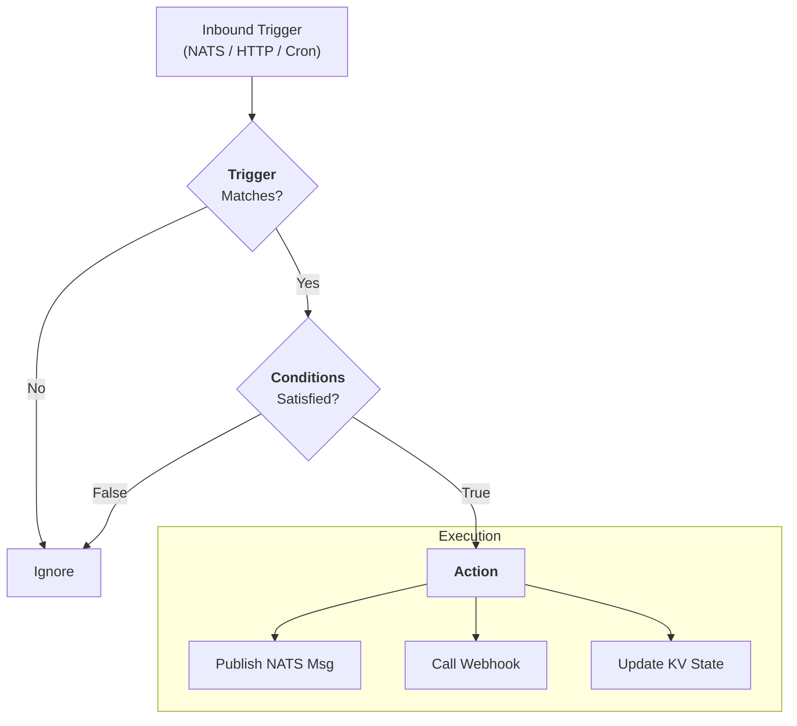

# Automation

Automation transforms raw telemetry into actionable intelligence. The **rule engine** is Stone-Age.io's Layer 1 — declarative, stateless-per-message event logic that composes on top of the NATS substrate.

This doc covers the rule engine's three features (router, gateway, scheduler), the patterns that extend them with NATS KV for durable state, and — importantly — when you should reach for a stream processor instead. For the complete layer model, see [Platform Layers](./platform-layers.md).

<center>

</center>

---

## 1. The Rule Engine — A Separate Binary With Three Features

The rule engine (`rule-router`) is a **single-binary component** that runs alongside NATS as a peer process — in the same spirit as the Agent, but on the server/central side of the fabric. It is **not** part of the Control Plane binary; it's an independent executable that connects to NATS as a client and does its work entirely over NATS subjects and KV buckets.

**Deployment topology is operational, not architectural.** You can run the rule engine:

- **Centrally** alongside your main NATS cluster — the common case for most deployments.
- **At the edge** alongside a NATS leaf node at a customer site — when you want local rule evaluation that keeps working during WAN outages.
- **Both** — a common pattern is one set of rules running centrally (for aggregation, cross-site alerting) and another at the edge (for site-local reflexes).

Wherever it runs, the engine is stateless per message and horizontally scalable. Need more throughput? Run another instance against the same NATS cluster. Durable state lives in NATS KV, not in the engine process.

The binary hosts three selectable features that all share the same YAML rule syntax, read from the same NATS KV buckets, and use the same evaluation engine. What changes between them is the **trigger** — where events originate — and what **actions** are available.

| Feature | Trigger | Typical Actions | Default? |
|---|---|---|---|
| **Router** | NATS subject | Publish to NATS; call HTTP | ✅ Default |
| **Gateway** | HTTP request (inbound); NATS subject (outbound) | Publish to NATS (inbound); call HTTP with retry (outbound) | Opt-in |
| **Scheduler** | Cron expression | Publish to NATS; call HTTP with retry | Opt-in |

Features are enabled via the binary's config file or environment variables (e.g. `RR_FEATURES_GATEWAY=true`). You can run any combination in a single process — sharing NATS connections, KV cache, and the metrics endpoint — or split them across separate processes if you want operational isolation. **The choice is operational, not architectural.**

### The TCA Pattern

Every rule, regardless of feature, follows the same **Trigger → Condition → Action** structure:

1.  **Trigger:** An event arrives (a NATS message, an HTTP request, or a cron tick).
2.  **Condition:** The engine evaluates the event against one or more conditions (optional).
3.  **Action:** If conditions pass, the engine executes an action.

### Key Engine Properties

- **Stateless per Message, Scalable:** Each rule evaluation is independent. The engine itself holds no per-message state — that lives in NATS KV, which rules read from and write to. This makes the engine horizontally scalable while still supporting rich stateful patterns.
- **Microsecond Evaluation:** Rules evaluate in microseconds, supporting thousands of messages per second per instance. Cached KV lookups are sub-microsecond, so condition chains with multiple lookups stay fast.
- **YAML-Based:** Rules are defined in simple, human-readable YAML files (or stored in a NATS KV bucket for GitOps-style hot-reload — see the rule-router upstream docs for that pattern).
- **Rich Variable Injection:** Use `{field_name}` to access message data or `{@system_var}` for context like `{@timestamp()}`, `{@subject}`, or `{@kv.bucket.key}` lookups.

For full YAML syntax, the complete variable/function reference, array processing with `forEach`, and signature verification, see the [rule-router documentation](https://github.com/skeeeon/rule-router).

---

## 2. Feature: Router (NATS → NATS)

The Router feature is the default. It consumes from NATS subjects, evaluates conditions against message payloads and metadata, and publishes results back to NATS (or calls out to HTTP).

### Example: Temperature Threshold with Enrichment

```yaml
- trigger:
    nats:
      subject: "telemetry.*.temp"
  conditions:
    operator: and
    items:
      - field: "{value}"
        operator: gt
        value: 45
  action:
    nats:
      subject: "alerts.{@subject.1}.high_temp"
      payload: |
        {
          "device": "{@subject.1}",
          "value": {value},
          "location": "{@kv.devices.{@subject.1}:location}",
          "timestamp": "{@timestamp()}"
        }
```

This rule fires when any message on `telemetry.*.temp` carries a `value` over 45. It publishes an enriched alert, pulling the device's location from a KV bucket. The `{@subject.1}` token extracts the wildcard segment of the subject.

### When to Use the Router Feature

- Routing and filtering — splitting a stream into specialized subjects.
- Enrichment — hydrating sparse events with KV-sourced context.
- Message translation — reshaping payloads before forwarding.
- Stateful patterns (alarm stacking, presence tracking, debounce) — see §5 below.

---

## 3. Feature: Gateway (HTTP ↔ NATS)

The Gateway feature bridges HTTP and NATS in both directions, using the same TCA engine.

### Inbound: Webhook → NATS

Legacy devices or third-party services that can't speak NATS natively send HTTP POSTs to a configurable path. The gateway evaluates rules against the request and publishes the result to NATS. Inbound requests are **"fire and forget"** — the HTTP response is immediate (200 OK), with processing happening asynchronously on the NATS side.

```yaml
- trigger:
    http:
      path: "/webhooks/github"
      method: "POST"
  conditions:
    operator: and
    items:
      - field: "{@header.X-GitHub-Event}"
        operator: eq
        value: "push"
  action:
    nats:
      subject: "scm.github.push.{repository.name}"
      payload: |
        {
          "repo": "{repository.full_name}",
          "branch": "{ref}",
          "pusher": "{pusher.name}",
          "commits": {commits}
        }
```

GitHub's webhook payload becomes a properly-namespaced NATS message. Any downstream Router or Scheduler rules can react to `scm.github.push.>` without knowing the original came from HTTP.

### Outbound: NATS → HTTP

The Gateway also listens on NATS subjects and translates matching messages into outbound HTTP calls to external services. Outbound calls support configurable retry with exponential backoff — essential for integrations with flaky third-party APIs.

```yaml
- trigger:
    nats:
      subject: "alerts.>"
  action:
    http:
      url: "https://hooks.slack.com/services/T00000000/B00000000/XXX"
      method: "POST"
      headers:
        Content-Type: "application/json"
      payload: |
        {
          "text": "🚨 Alert on {@subject}: {message}"
        }
      retry:
        maxAttempts: 5
        initialDelay: "1s"
        maxDelay: "30s"
```

Any NATS message matching `alerts.>` becomes a Slack notification. The retry block ensures transient Slack outages don't drop alerts — retries are durable and honor graceful shutdown.

### When to Use the Gateway Feature

- **Inbound:** integrating webhooks from GitHub, Jira, Stripe, building management systems, or any legacy device that speaks HTTP but not NATS.
- **Outbound:** routing alerts or events to Slack, Microsoft Teams, Ntfy, PagerDuty, or any REST API.
- Bidirectional integration with services that don't have a NATS client library.

---

## 4. Feature: Scheduler (Cron → NATS/HTTP)

The Scheduler feature fires on cron expressions rather than on incoming messages. It's useful anywhere you need periodic publishes — batch commands, reports, cache warming, or fan-out operations against KV-stored lists.

### Example: Weekday Morning Door Unlock Fan-Out

```yaml
- trigger:
    schedule:
      cron: "0 8 * * 1-5"
      timezone: "America/New_York"
  action:
    nats:
      forEach: "{@kv.config.door_list}"
      subject: "access.door.{id}.command"
      payload: |
        {
          "command": "unlock",
          "zone": "{zone}",
          "source": "rule-scheduler",
          "id": "{@uuid7()}"
        }
```

At 8:00 AM Eastern every weekday, this rule reads a door list from the `config.door_list` KV key and publishes one unlock command per door. Adding or removing doors only requires updating the KV entry — no rule changes or restarts.

### Example: Daily Report POST

```yaml
- trigger:
    schedule:
      cron: "0 23 * * *"
      timezone: "UTC"
  action:
    http:
      url: "https://reports.internal.example.com/daily"
      method: "POST"
      headers:
        Authorization: "Bearer ${REPORTS_API_TOKEN}"
      payload: |
        {
          "report_date": "{@date.iso}",
          "generated_at": "{@timestamp()}"
        }
      retry:
        maxAttempts: 3
        initialDelay: "5s"
```

The `${REPORTS_API_TOKEN}` is expanded from an environment variable at rule-load time, keeping secrets out of the YAML.

### Scheduler Semantics

- Schedule-triggered rules have **no incoming message payload**. Conditions can reference time variables (`{@time.*}`, `{@day.*}`), KV lookups (`{@kv.*}`), and template functions (`{@uuid7()}`, `{@timestamp()}`) — but not message fields or headers.
- Timezones are IANA zone names (e.g. `America/New_York`). Omit to use system local time.
- Both NATS and HTTP actions are supported; HTTP actions get the same retry configuration as the Gateway feature.

### When to Use the Scheduler Feature

- Periodic batch operations — nightly reports, weekly summaries, monthly cleanup triggers.
- KV-driven fan-out — any "do X for every entry in this KV list" pattern.
- Cache warming or pre-computation jobs that publish to NATS for downstream consumption.
- Replacing separate cron daemons with a single NATS-integrated scheduler that uses the same rule syntax as the rest of your automation.

---

## 5. Stateful Patterns via KV

The engine is stateless per message, but the *system* supports rich stateful behavior through NATS KV. Rules read from and write to KV to implement patterns that would otherwise need a separate state store.

This is the canonical location for the KV-as-state pattern. Other docs reference it rather than re-explaining.

### Stateful Alarms (KV Stacking)

A common challenge in IoT is "Alarm Fatigue" — getting 100 emails because a sensor is flickering around a threshold. Stone-Age.io solves this using **Stateful Alarms via NATS KV stacking**.

Instead of sending an alert every time a condition is met, the engine manages state in a dedicated KV bucket:

1.  **Threshold Hit:** A rule checks whether an alarm already exists in KV for `alarms.device_01.high_temp`.
2.  **State Check:** If the key doesn't exist, the rule writes the alarm state and triggers an outbound notification.
3.  **De-duplication:** If the key *already* exists, the rule knows the administrator has already been notified and stays quiet.
4.  **Auto-Clear:** When the temperature returns to normal, a separate rule deletes the KV key — effectively "clearing" the alarm and optionally sending a "Recovery" notification.

**The rule stays stateless; the KV bucket holds the state.** You don't need a complex database to track alarm status.

### Other KV-Backed Patterns

The same principle — rule reads KV, acts, optionally writes KV — supports a whole family of behaviors:

- **Presence tracking via TTL.** A KV key with a short TTL gets refreshed by each relevant event; the key's expiration *is* the "gone" event. Great for occupancy tracking or heartbeat monitoring.
- **Debounce.** A KV key blocks firing again until it expires. The rule checks the key; if present, it skips the action; if absent, it fires and writes a fresh TTL'd key.
- **Rate limiting.** A KV counter incremented per event with a TTL window. Once the counter exceeds the limit, subsequent events are suppressed until the window rolls over.
- **Deduplication.** A KV key per seen event ID prevents re-processing duplicates across restarts or replays.

---

## 6. Rule-Writing Best Practices

- **Be Specific with Subjects:** Avoid triggering on `>` (all messages). Use narrow subjects like `telemetry.*.temp` to reduce unnecessary CPU cycles.
- **Use Field Paths Wisely:** The engine supports nested field access (e.g., `{user.profile.email}`). Keep your JSON structures reasonably flat to maximize readability and evaluation speed.
- **Leverage KV for Context:** Don't embed static data (like "Unit Location") in every message. Store that metadata in a KV bucket and have rules hydrate the alert using a `{@kv.lookup}`.
- **Keep State in KV, Not in Rules:** If you find yourself trying to remember something across messages, the answer is a KV key, not a more complex rule.
- **Name Subjects Consistently:** Subject names are contracts between layers. Rule authors, stream processors, and Telegraf all address the same subjects. Pick a hierarchical convention and stick to it.

---

## 7. When the Rule Engine Isn't the Right Tool

Being honest about what doesn't fit at Layer 1 is part of using the platform well. The engine's stateless-per-message model covers a remarkable amount of ground, but it has real limits.

**Reach for a stream processor (Layer 2) when:**

- The computation needs a **time window.** "Average temperature per sensor over the last 5 minutes." "Count of login failures per user in the last hour." "Anyone who entered a zone and didn't leave within 30 minutes."
- You're **joining two streams** by a common key and time window.
- You need **retractable results** — intermediate outputs that update as late data arrives.
- You want **SQL-like expressiveness** over continuous event streams.
- You need **complex event processing** — patterns like "A followed by B but not C within T seconds."

A concrete example: computing a 5-minute rolling average of sensor readings with alerting on threshold crossings. You could try to express this with KV-based accumulator keys, but you'd be fighting the tool. The natural fit is an eKuiper query consuming from the sensor subject and publishing aggregates back to NATS, where a separate rule handles the thresholding. Both layers live on the same bus; neither needs to know about the other's implementation.

**Reach for a custom service when:**

- The logic is genuinely domain-specific (a physics model, an ML inference loop, a non-trivial state machine).
- You need tight integration with existing internal libraries.
- The declarative tools feel like they're working against you rather than with you.

A small Go service that consumes from and publishes to NATS is completely idiomatic and composes with the rest of the platform cleanly.

See [Stream Processing](./stream-processing.md) for the Layer 2 detail and the handoff pattern.

---

## 8. Where Layer 1 Shines

To balance out the previous section: the rule engine is the right tool whenever the problem is expressible as "when X happens (on subject A, via webhook B, or at cron time T), check Y (possibly using KV state), do Z (publish/HTTP call/update KV)." That pattern covers the vast majority of operational event logic:

- **Routing and filtering** — splitting an incoming stream into multiple specialized subjects.
- **Enrichment** — hydrating sparse events with KV-sourced context before forwarding.
- **Alarm management** — detection, deduplication, auto-clear via the KV stacking pattern.
- **Access control and authorization** — a single rule with KV lookups resolves credential → user → permissions → decision.
- **Webhook ingestion and egress** — translating between HTTP and NATS in both directions.
- **Scheduled publishing and fan-out** — cron-triggered rules that publish to NATS or HTTP, optionally iterating over KV-stored lists.
- **Debounce, throttle, and rate limiting** — KV-backed state machines that suppress or gate events.

When your problem fits this shape, the engine will do it with microsecond latency, in a rule definition you can version-control as YAML, and with no operational overhead beyond running the binary.

The platform's strength isn't that Layer 1 solves every problem — it's that Layer 1 solves a lot of problems very well, and the graduation path to Layer 2 is clean and principled when you need more.
