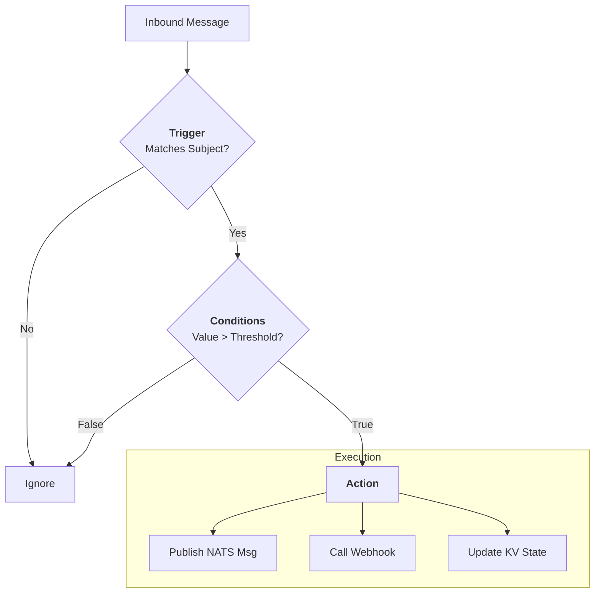

# Automation

Automation transforms raw telemetry into actionable intelligence. The **Rule-Router** and **HTTP-Gateway** together form **Layer 1** of the Stone-Age.io platform — declarative, stateless-per-message event logic that composes on top of the NATS substrate.

This doc covers what the Rule-Router does well, the patterns that extend it with NATS KV for durable state, and — importantly — when you should reach for a stream processor instead. For the complete layer model, see [Platform Layers](./platform-layers.md).

<center>

</center>

---

## 1. The Rule-Router 

The **Rule-Router** is a high-performance evaluation engine that sits directly on the NATS backbone. It follows the **TCA (Trigger-Condition-Action)** pattern.

### How It Works

Every rule follows a simple logical flow:

1.  **Trigger:** A message arrives on a NATS subject (e.g., `sensors.temp_01`).
2.  **Condition:** The router evaluates the payload against specific logic (e.g., `{value} > 40`).
3.  **Action:** If the condition is met, the router executes an action (publishing a new message, calling a webhook, or updating KV state).

### Key Features

- **Stateless per Message, Scalable:** Each rule evaluation is independent. The Rule-Router itself holds no per-message state — that lives in NATS KV, which rules read from and write to. This makes the engine horizontally scalable while still supporting rich stateful patterns.
- **Microsecond Evaluation:** Rules evaluate in microseconds, supporting thousands of messages per second per instance. Cached KV lookups are sub-microsecond, so condition chains with multiple lookups stay fast.
- **YAML-Based:** Rules are defined in simple, human-readable YAML files.
- **Rich Variable Injection:** Use `{field_name}` to access message data or `{@system_var}` for context like `{@timestamp}`, `{@subject}`, or `{@kv.lookup}`.

---

## 2. The HTTP-Gateway 

The **HTTP-Gateway** acts as the translator between the NATS-native Data Plane and HTTP-based applications. It uses the same evaluation engine as the **Rule-Router**, so all of the same features are available.

### Inbound (Webhooks to NATS)

Transform incoming HTTP requests from third-party services (like GitHub, Jira, or a legacy building management system) into NATS messages.

- **Authentication:** The gateway manages NATS tokens so external services can securely "speak" to your NATS bus without having a NATS client.

### Outbound (NATS to Webhooks)

Route NATS events to external notification platforms.

- **Alerting:** When the Rule-Router detects an issue, it publishes to an `alerts.>` subject. The HTTP-Gateway picks this up and sends a formatted notification to **Slack**, **Microsoft Teams**, **Ntfy**, or any custom REST API.
- **Reliable Delivery:** Outbound calls use configurable retries with exponential backoff, and the retry context is anchored in JetStream so retries survive restarts.

---

## 3. Stateful Alarms (KV Stacking)

A common challenge in IoT is "Alarm Fatigue" — getting 100 emails because a sensor is flickering around a threshold. Stone-Age.io solves this using **Stateful Alarms via NATS KV stacking**.

This is the canonical example of **stateful logic expressed through stateless rules + KV**. The rule itself is stateless per message; the state lives in KV; the rule's condition checks the KV state before acting.

### The Pattern

Instead of sending an alert every time a condition is met, the Rule-Router manages the state in a dedicated NATS KV bucket:

1.  **Threshold Hit:** The Router checks if an alarm already exists in KV for `alarms.device_01.high_temp`.
2.  **State Check:** If the key doesn't exist, it writes the alarm to KV and triggers an outbound notification (Slack).
3.  **De-duplication:** If the key *already* exists, the Router knows the administrator has already been notified and stays quiet.
4.  **Auto-Clear:** When the temperature returns to normal, a separate rule deletes the KV key, effectively "clearing" the alarm and optionally sending a "Recovery" notification.

**Grug-brain benefit:** You don't need a complex database to track alarm states. The NATS KV bucket *is* the state, and the rule expressing the logic is still a stateless condition-plus-action on each incoming message.

The same pattern supports **presence tracking via TTL** (a KV key with a short TTL gets refreshed by each relevant event; the key's expiration or deletion *is* the "gone" event), **debounce** (a KV key blocks firing again until it expires), and **rate limiting** (a KV counter incremented per event with a TTL window).

---

## 4. Rule Writing Best Practices

To keep your rules clean and efficient, follow these principles:

*   **Be Specific with Subjects:** Avoid triggering rules on `>` (all messages). Use narrow subjects like `telemetry.*.temp` to reduce unnecessary CPU cycles.
*   **Use Field Paths Wisely:** The Router supports nested field access (e.g., `{user.profile.email}`). Keep your JSON structures reasonably flat to maximize readability and evaluation speed.
*   **Leverage KV for Context:** Don't embed static data (like "Unit Location") in every message. Store that metadata in a KV bucket and have the Rule-Router "hydrate" the alert using a `{@kv.lookup}`.
*   **Keep State in KV, Not in Rules:** If you find yourself trying to remember something across messages, the answer is a KV key, not a more complex rule.

---

## 5. Example Rule

```yaml
# Detect High Temperature and Manage State
- trigger:
    nats:
      subject: "telemetry.*.temp"
  conditions:
    operator: and
    items:
      - field: "{value}"
        operator: gt
        value: 45
      - field: "{@kv.alarms.{@subject.1}:status}"
        operator: neq
        value: "active"
  action:
    nats:
      subject: "alarms.{@subject.1}.high_temp"
      payload: '{"status": "active", "val": {value}, "ts": "{@timestamp()}"}'
```

A companion rule subscribes to `alarms.*.high_temp`, writes the alarm state to the `alarms` KV bucket, and publishes a notification to `notify.slack`. Keeping each rule focused on one concern — detection, state update, notification — keeps the logic testable and composable.

---

## 6. When Rule-Router Isn't the Right Tool

Being honest about what doesn't fit at Layer 1 is part of using the platform well. The Rule-Router's stateless-per-message model covers a remarkable amount of ground, but it has real limits.

**Reach for a stream processor (Layer 2) when:**

- The computation needs a **time window.** "Average temperature per sensor over the last 5 minutes." "Count of login failures per user in the last hour." "Anyone who entered a zone and didn't leave within 30 minutes."
- You're **joining two streams** by a common key and time window.
- You need **retractable results** — intermediate outputs that update as late data arrives.
- You want **SQL-like expressiveness** over continuous event streams.
- You need **complex event processing** — patterns like "A followed by B but not C within T seconds."

A concrete example: computing a 5-minute rolling average of sensor readings with alerting on threshold crossings. You could try to express this with KV-based accumulator keys, but you'd be fighting the tool. The natural fit is an eKuiper query consuming from the sensor subject and publishing aggregates back to NATS, where a separate Rule-Router rule handles the thresholding. Both layers live on the same bus; neither needs to know about the other's implementation.

**Reach for a custom service when:**

- The logic is genuinely domain-specific (a physics model, an ML inference loop, a non-trivial state machine).
- You need tight integration with existing internal libraries.
- The declarative tools feel like they're working against you rather than with you.

A small Go service that consumes from and publishes to NATS is completely idiomatic and composes with the rest of the platform cleanly.

See [Stream Processing](./stream-processing.md) for the Layer 2 detail and the handoff pattern.

---

## 7. Where Layer 1 Shines

To balance out the previous section: the Rule-Router is the right tool whenever the problem is expressible as "when X happens on subject A, check Y (possibly using KV state), do Z (publish/HTTP call/update KV)." That pattern covers the vast majority of operational event logic:

- **Routing and filtering** — splitting an incoming stream into multiple specialized subjects.
- **Enrichment** — hydrating sparse events with KV-sourced context before forwarding.
- **Alarm management** — detection, deduplication, auto-clear via the KV stacking pattern.
- **Access control and authorization** — a single rule with KV lookups resolves credential → user → permissions → decision.
- **Webhook ingestion and egress** — translating between HTTP and NATS in both directions.
- **Scheduled publishing** — cron-triggered rules that publish to NATS or HTTP.
- **Debounce, throttle, and rate limiting** — KV-backed state machines that suppress or gate events.

When your problem fits this shape, the Rule-Router will do it with microsecond latency, in a rule definition you can version-control as YAML, and with no operational overhead beyond running the binary.

The platform's strength isn't that Layer 1 solves every problem — it's that Layer 1 solves a lot of problems very well, and the graduation path to Layer 2 is clean and principled when you need more.
