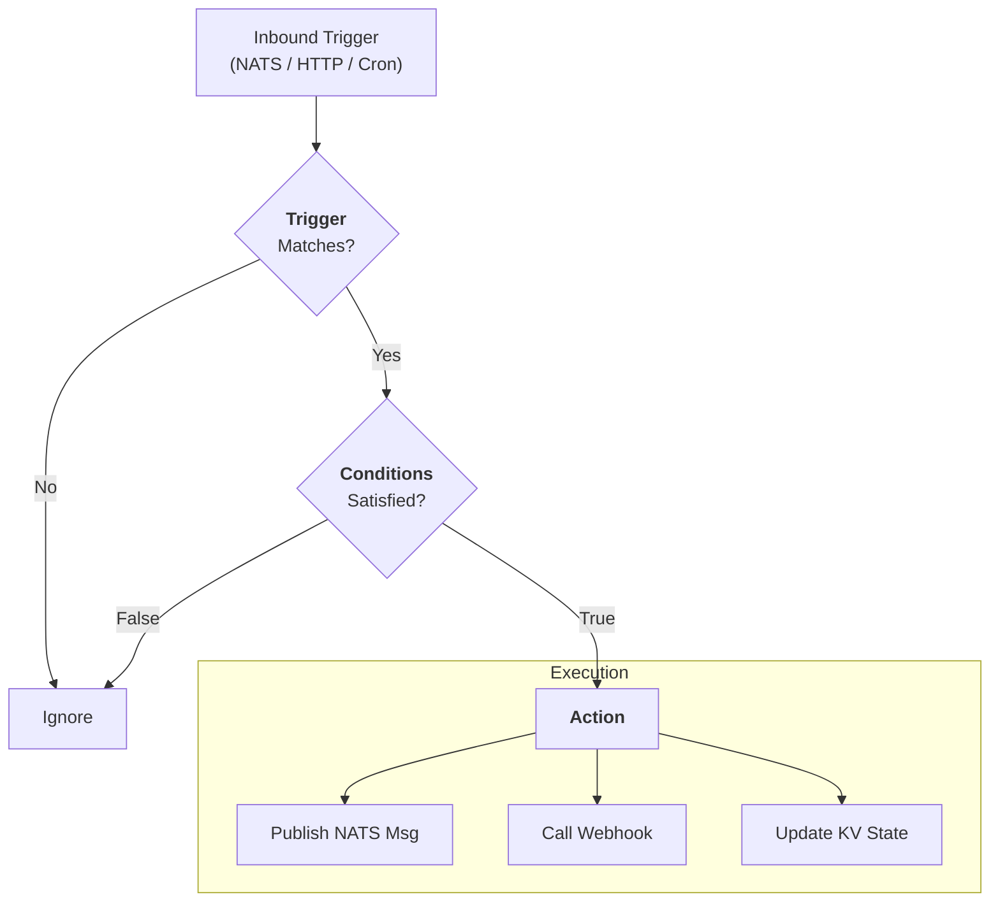

# Automation

The **rule engine** is Layer 1 of Stone-Age.io: declarative event logic on top
of NATS, with no state between messages.

This page covers the engine's three features (router, gateway, scheduler), the
patterns that use NATS KV for state, and when to use a stream processor
instead. See [Platform Layers](./platform-layers.md) for the layer model.


```mermaid
flowchart TD
    Msg["Inbound Trigger<br/>(NATS / HTTP / Cron)"] --> Trigger{"<b>Trigger</b><br/>Matches?"}

    Trigger -- No --> Ignore["Ignore"]
    Trigger -- Yes --> Condition{"<b>Conditions</b><br/>Satisfied?"}

    Condition -- False --> Ignore
    Condition -- True --> Action["<b>Action</b>"]

    subgraph Execution
        Action --> Pub["Publish NATS Msg"]
        Action --> HTTP["Call Webhook"]
        Action --> KV_Update["Update KV State"]
    end
```

---

## 1. The Rule Engine: One Binary, Three Features

The rule engine (`rule-router`) is a **separate binary** that runs beside NATS,
like the Agent but on the central side. It is **not** part of the Control Plane
binary. It connects to NATS as a client and does all its work over NATS
subjects and KV buckets.

You can run the rule engine:

- **Centrally** beside your main NATS cluster. This is the usual case.
- **At the edge** beside a NATS leaf node at a customer site, so local rules
  keep running during WAN outages.
- **Both.** For example, central rules for aggregation and cross-site alerts,
  and edge rules for site-local reactions.

The engine keeps no state between messages and scales horizontally. To get more
throughput, run another instance on the same NATS cluster. Durable state is in
NATS KV, not in the engine. The one exception: **throttle windows** (§5) are in
each instance's memory. Two instances keep two sets of windows, and a restart
or rule reload clears them.

How instances share work depends on the trigger's transport. The default
JetStream trigger is a durable consumer named from the subject and the
configured consumer prefix, so instances with the same prefix share the consumer
and split the messages. A `mode: core` trigger is a plain subscription. Without
a `queue` group, **every instance gets every message** and fires the rule once
each.

The binary has three features. They share the YAML rule syntax, the KV buckets
and the evaluation engine. They differ in the **trigger** (where events come
from) and the available **actions**.

| Feature | Trigger | Typical Actions | Default? |
|---|---|---|---|
| **Router** | NATS subject | Publish to NATS; call HTTP | ✅ Default |
| **Gateway** | HTTP request (inbound); NATS subject (outbound) | Publish to NATS (inbound); call HTTP with retry (outbound) | Opt-in |
| **Scheduler** | Cron expression | Publish to NATS; call HTTP with retry | Opt-in |

Turn features on in the binary's config file or with environment variables
(for example `RR_FEATURES_GATEWAY=true`). You can run any combination in one
process, or split them across processes. See the
[rule-router documentation](./vendor/rule-router/README.md) for each
feature's configuration.

### The TCA Pattern

Every rule has the same **Trigger, Condition, Action** structure:

1. **Trigger:** an event arrives (a NATS message, an HTTP request or a cron
   tick).
2. **Condition:** the engine tests the event against the conditions, if any.
3. **Action:** if the conditions pass, the engine runs the action.

### Key Engine Properties

- **No state between messages:** each evaluation is independent. The engine
  holds no durable state, apart from in-memory throttle windows. Rules read and
  write state in NATS KV.
- **One action per rule:** "write the state *and* notify" is two rules, or a
  rule whose output triggers the next one.
- **Fast:** rules evaluate in microseconds, so one instance handles thousands
  of messages per second. Cached KV lookups take under a microsecond, so a
  condition with several lookups stays fast.
- **YAML:** rules are YAML files, or entries in a NATS KV bucket that the engine
  reloads on change (see the rule-router docs).
- **Variables:** `{field_name}` reads message data. `{@system_var}` reads
  context, such as `{@timestamp()}`, `{@subject}` or a `{@kv.bucket.key}` lookup.

For the full YAML syntax, variables and functions, `forEach` over arrays,
payload modes (`passthrough`, `merge`) and signature verification, see the
[rule-router documentation](./vendor/rule-router/README.md). This page
describes rule-router **v0.20.0**.

---

## 2. Feature: Router (NATS to NATS)

The router is the default feature. It reads NATS subjects, tests conditions on
message payloads and metadata, and publishes to NATS or calls HTTP.

### Example: Temperature Threshold with Enrichment

```yaml
- trigger:
    nats:
      subject: "telemetry.*.temp"
  conditions:
    operator: and
    items:
      - field: "{value}"
        operator: gt
        value: 45
  action:
    nats:
      subject: "alerts.{@subject.1}.high_temp"
      payload: |
        {
          "device": "{@subject.1}",
          "value": {value},
          "location": "{@kv.devices.{@subject.1}:location}",
          "timestamp": "{@timestamp()}"
        }
```

This rule fires when a message on `telemetry.*.temp` has a `value` over 45. It
publishes an alert with the device's location from a KV bucket. `{@subject.1}`
is the subject token that the wildcard matched.

**A NATS trigger is a JetStream consumer by default**, so a stream must already
cover `telemetry.*.temp`. If none does, the engine rejects the rule at load
("no stream found for trigger subject"). Actions also publish to JetStream and
wait for an ack by default, so `alerts.>` needs a stream too, or every fire logs
an ack timeout. For subjects you do not stream (heartbeats, or high-rate
telemetry where a lost message does not matter), set `mode: core` on the trigger
or the action. Core mode is at-most-once, needs no stream, and takes an optional
`queue` group.

A NATS trigger can also serve **request/reply**. `reply: true` subscribes over
core NATS and answers each request with a `respond` action.

### Use the router for

- Routing and filtering: splitting a stream into specific subjects.
- Enrichment: adding KV context to sparse events.
- Translation: reshaping payloads before forwarding.
- Stateful patterns such as alarm stacking and presence tracking (§5). For
  debounce and rate limiting, use the built-in `throttle` (§5).

---

## 3. Feature: Gateway (HTTP and NATS)

The gateway connects HTTP and NATS in both directions, with the same engine.

### Inbound: Webhook to NATS

Devices or services that cannot use NATS send HTTP POSTs to a configured path.
The gateway evaluates rules on the request and publishes the result to NATS. By
default it replies at once (`200 {"accepted"}`) and processes the request
asynchronously on the NATS side.

Two options change this:

- **Signature verification.** An HTTP trigger can have an `hmac` block (header,
  secret, algorithm, encoding, optional prefix). If the signature is missing or
  wrong, the gateway returns `401` and does not evaluate the rule. This covers
  GitHub, Shopify and most generic HMAC webhooks. For providers that sign a
  timestamp with the body, set `scheme: stripe`, `slack` or `standardwebhooks`
  (Svix, Clerk, Resend and others) and only a `secret`. A timestamp more than
  five minutes old is rejected. Put signature verification on
  every endpoint the internet can reach. Without it, anyone who learns the path
  can publish into your bus.
- **Synchronous routes.** A rule with a `respond` action returns its result as
  the HTTP response. A NATS action with `request: true` sends a NATS request and
  returns the reply (`503` if nothing answers, `504` on timeout).

```yaml
- trigger:
    http:
      path: "/webhooks/github"
      method: "POST"
      hmac:
        header: "X-Hub-Signature-256"
        secret: "${GITHUB_WEBHOOK_SECRET}"
        algorithm: "sha256"
        encoding: "hex"
        prefix: "sha256="
  conditions:
    operator: and
    items:
      - field: "{@header.X-GitHub-Event}"
        operator: eq
        value: "push"
  action:
    nats:
      subject: "scm.github.push.{repository.name}"
      payload: |
        {
          "repo": "{repository.full_name}",
          "branch": "{ref}",
          "pusher": "{pusher.name}",
          "commits": {commits}
        }
```

The GitHub webhook becomes a NATS message under `scm.github.push`. Router and
scheduler rules can react to `scm.github.push.>` without knowing it came from
HTTP.

### Outbound: NATS to HTTP

The gateway also listens on NATS subjects and turns matching messages into HTTP
calls. Outbound calls can retry with exponential backoff, for unreliable
third-party APIs.

```yaml
- trigger:
    nats:
      subject: "alerts.>"
  action:
    http:
      url: "https://hooks.slack.com/services/T00000000/B00000000/XXX"
      method: "POST"
      headers:
        Content-Type: "application/json"
      payload: |
        {
          "text": "🚨 Alert on {@subject}: {message}"
        }
      retry:
        maxAttempts: 5
        initialDelay: "1s"
        maxDelay: "30s"
```

Every message on `alerts.>` becomes a Slack notification. With the retry block,
a short Slack outage does not lose alerts. Retries are durable and respect
graceful shutdown.

### Use the gateway for

- **Inbound:** webhooks from GitHub, Jira, Stripe, building management systems,
  or any device that speaks HTTP but not NATS.
- **Outbound:** alerts or events to Slack, Microsoft Teams, Ntfy, PagerDuty or
  any REST API.
- Two-way integration with services that have no NATS client library.

---

## 4. Feature: Scheduler (Cron to NATS/HTTP)

The scheduler fires on cron expressions, not on messages. Use it for periodic
publishes: batch commands, reports, cache warming, or fan-out over a list in KV.
An expression has five fields, or six with a leading seconds field for
intervals under a minute.

### Example: Weekday Morning Door Unlock Fan-Out

```yaml
- trigger:
    schedule:
      cron: "0 8 * * 1-5"
      timezone: "America/New_York"
  action:
    nats:
      forEach: "{@kv.config.door_list}"
      subject: "access.door.{id}.command"
      payload: |
        {
          "command": "unlock",
          "zone": "{zone}",
          "source": "rule-scheduler",
          "id": "{@uuid7()}"
        }
```

At 8:00 AM Eastern every weekday, this rule reads a door list from the
`config.door_list` KV key and publishes one unlock command per door. To add or
remove doors, update the KV entry. You do not change the rule or restart
anything.

### Example: Daily Report POST

```yaml
- trigger:
    schedule:
      cron: "0 23 * * *"
      timezone: "UTC"
  action:
    http:
      url: "https://reports.internal.example.com/daily"
      method: "POST"
      headers:
        Authorization: "Bearer ${REPORTS_API_TOKEN}"
      payload: |
        {
          "report_date": "{@date.iso}",
          "generated_at": "{@timestamp()}"
        }
      retry:
        maxAttempts: 3
        initialDelay: "5s"
```

The engine reads `${REPORTS_API_TOKEN}` from an environment variable when it
loads the rule, so the secret is not in the YAML.

### Scheduler Semantics

- A scheduled rule has **no incoming message**. Conditions can use time
  variables (`{@time.*}`, `{@day.*}`), KV lookups (`{@kv.*}`) and template
  functions (`{@uuid7()}`, `{@timestamp()}`), but not message fields or headers.
- Timezones are IANA names (for example `America/New_York`). With no timezone,
  the engine uses system local time.
- NATS and HTTP actions both work. HTTP actions have the same retry options as
  the gateway.

### Use the scheduler for

- Periodic batch work: nightly reports, weekly summaries, monthly cleanup.
- KV-driven fan-out: "do X for every entry in this KV list".
- Cache warming or precomputation that publishes to NATS.
- Replacing separate cron daemons, with the same rule syntax as your other
  automation.

---

## 5. Stateful Patterns via KV

The engine keeps no state between messages, but rules can read and write NATS
KV. This gives you stateful behavior with no separate state store.

### Stateful Alarms (KV Stacking)

A sensor that flickers around a threshold can send 100 alerts. To prevent this,
keep the alarm state in a KV bucket:

1. **Threshold hit:** a rule fires on the reading only if no alarm is active:
   an `or` group of `{@kv.alarms.device_01.high_temp}` with `not_exists` (no
   alarm yet) and `{@kv.alarms.device_01.high_temp:state}` `eq` `cleared`.
   Only `not_exists` matches a missing key. `neq` `active` is `false` on a
   missing key, so it would never raise the first alarm.
2. **Write state:** the rule's action writes the alarm state. A write is a
   normal publish to the bucket's subject, `$KV.alarms.device_01.high_temp`,
   with the value as the body.
3. **Notify:** a rule has one action, so a second rule sends the notification.
   It triggers on the write (`$KV.alarms.>`) or on the same threshold
   condition.
4. **Deduplication:** once the key holds an active alarm, neither condition
   passes. The administrator was already notified, and the rules do nothing.
5. **Auto-clear:** when the temperature is normal again, another rule
   overwrites the key with a cleared state. A recovery notification can trigger
   on that write in the same way.

**The rules keep no state. The KV bucket holds it.**

### Other KV-Backed Patterns

- **Presence tracking with a TTL.** Each relevant event refreshes a KV key with a
  short TTL. When the key expires, that is the "gone" event. Use it for
  occupancy or heartbeat monitoring.
- **Deduplication.** A KV key per event ID stops duplicates across restarts or
  replays.

### Throttle and debounce are built in

Rate limiting and debounce do **not** use KV, because rule templates have no
arithmetic and cannot increment a counter. Each rule takes a `throttle` block
with a `window` and an optional `key` template, for one window per device or
room:

- **`mode: leading`** (default) fires the first match in the window and drops
  the rest. Use it for alerts: one page, now.
- **`mode: trailing`** keeps the latest match and fires it when the window
  closes. Use it for real debounce, such as a dial being turned or a setpoint
  being edited.

Put the throttle on the **action**, not the trigger. A trigger throttle skips
evaluation, so a normal reading can use up the window and the engine never
evaluates the alarming reading after it. The windows are in the instance's
memory (§1). A restart or reload resets them, and a trailing value that is
waiting at a crash is lost. If suppression must survive a restart, gate the rule
on a KV key with `not_exists`, have its action write that key, and let the
bucket's TTL expire it.

---

## 6. Rule-Writing Best Practices

- **Use specific subjects.** Do not trigger on `>`. Use narrow subjects such as
  `telemetry.*.temp`.
- **Keep JSON flat.** The engine reads nested fields (`{user.profile.email}`),
  but flat structures are easier to read and faster to evaluate.
- **Use KV for context.** Do not repeat static data such as "unit location" in
  every message. Store it in KV and add it with a `{@kv.lookup}`.
- **Keep state in KV, not in rules.** If a rule must remember something across
  messages, use a KV key. The one built-in exception is `throttle`.
- **Name subjects consistently.** Rules, stream processors and Telegraf all use
  the same subjects. Choose a hierarchy and keep it.

---

## 7. When to Use Something Else

**Use a stream processor (Layer 2) when:**

- The computation needs a **time window**: "average temperature per sensor over
  the last 5 minutes", "login failures per user in the last hour", "anyone who
  entered a zone and did not leave within 30 minutes".
- You **join two streams** by a common key and time window.
- You need **retractable results** that change when late data arrives.
- You want **SQL-like queries** over event streams.
- You need **complex event processing**, such as "A followed by B but not C
  within T seconds".

For example, a 5-minute rolling average with a threshold alert: an eKuiper query
reads the sensor subject and publishes averages to NATS, and a rule checks the
threshold. Both use the same bus, and neither needs to know how the other works.

**Use a custom service when:**

- The logic is specific to your domain (a physics model, ML inference, a
  complex state machine).
- You need your existing internal libraries.
- The declarative tools work against you.

A small Go service that reads from and publishes to NATS works with the rest of
the platform.

See [Stream Processing](./stream-processing.md) for Layer 2.

---

## 8. What the Rule Engine Does Well

The rule engine fits any problem of the form "when X happens (on subject A, by
webhook B or at cron time T), check Y (with KV state if needed), do Z (publish,
HTTP call or KV update)". That covers most operational event logic: routing,
enrichment, alarms, webhooks, scheduled fan-out, debounce and rate limiting.

It also fits your application's own access control. For example, one rule with
KV lookups can go from a badge credential to a user, to permissions, to an
unlock decision. This is not the platform's own authorization, which only
PocketBase API rules enforce (see [Authorization & Roles](./authorization.md)).

Rules run in microseconds, are YAML you can keep in version control, and need
only the one binary to run.
