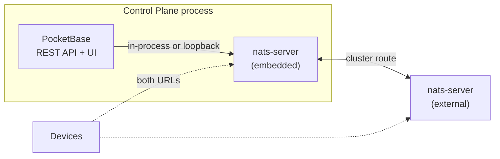

# ADR 0001: Embed the NATS Server in the Control Plane Binary

**Status:** Accepted — implemented
**Date:** 2026-08-14 (implemented 2026-08-15)

> The Context below describes the state of things when the decision was made. Two of the problems it names have since been fixed; see [As implemented](#as-implemented) at the end for what shipped and what building it turned up.

---

## Context

The Control Plane and the NATS server are configured separately today. `stone-age nats export` reads the operator JWT and System Account out of the database and writes an `operator.jwt`, an `operator.conf`, and a `nats.conf`; you then run `nats-server -c nats.conf` yourself. That is [Getting Started §3](../getting-started.md#3-stand-up-the-nats-server), and §4 exists only because §3 does.

That split costs us three things:

**An ordering problem.** The database has to be seeded before a server config can be emitted, and NATS can't be reached before it's running. pb-nats solves this with bootstrap mode — a retry ticker, a durable `nats_publish_queue`, and a warning in the log that we have to explain to every new user because it looks like an error and isn't.

**A drift surface.** Two things are configured independently, so they can disagree. They already do: `nats.server_url` defaults to `nats://localhost:4422` in `main.go` and in the shipped `config.yaml`, while `nats export --port` defaults to `4222`. A user who follows the documentation exactly gets a server on one port and a Control Plane dialling another, and the only symptom is the bootstrap warning that we have taught them to ignore.

**A topology small installs don't need.** An access-control install with forty badge readers runs two processes, two configs, and two upgrade paths to get one bus.

None of this is a problem at scale, where separating the Control Plane from a NATS cluster is correct. It is a problem at the bottom of the [adoption ladder](../index.md#start-where-you-need-to), which is where most first runs happen.

---

## Decision

Add `stone-age serve --nats`. It starts a NATS server inside the Control Plane process **by loading the config file that `stone-age nats export` already writes**.

Three rules keep this simple, and all three are load-bearing:

1. **The embedded server is an ordinary `nats-server`.** Config file in, standard behaviour out. No special embedded mode, no derived options, no branch in its logic.
2. **`nats export` stays, and stays required.** The config remains a real file you can read, edit, diff, and commit. `--nats` refuses to start without it and prints the command to generate it.
3. **pb-nats is unchanged.** It connects as the System User and pushes account claims over `$SYS.REQ.CLAIMS.UPDATE` exactly as it does to an external server.

`--nats` is **off by default**. Nothing changes for anyone who doesn't pass it.

---

## Why a config file and not generated options

The obvious alternative is to build `server.Options` in Go from the same database values `nats export` reads, and skip the file. It is a worse idea, and the reasons are the whole point of this ADR.

| | Config file (chosen) | Generated options |
| :--- | :--- | :--- |
| Code to write | `ProcessConfigFile` + `NoSigs` | Build and maintain an options struct |
| Tuning a setting | Edit the file | Add a config key, a viper default, a flag |
| Adding a cluster | Edit the file | Not expressible |
| Escape hatch | The same file, run externally | A different code path |
| Migrating out | Config edit | Data migration |
| Things that can disagree | One artifact | Two |

The config-file version is less code *and* does more. It is also the version that keeps `nats export` on the hot path, so the export code stays exercised instead of rotting into a thing nobody runs.

The clever option — a PocketBase-backed `AccountResolver`, so the server reads account JWTs straight from the database and the whole publish path disappears — works. It was prototyped and it is genuinely elegant. **It is rejected.** It forks pb-nats' behaviour between embedded and external modes to buy something the boring version already delivers, and it means two ways for an account JWT to reach a server instead of one.

---

## Topologies

Because the embedded server is an ordinary server reading an ordinary config, the deployment story is a ladder rather than a fork. Each rung is reached by editing the config file.

| | What runs | Cost of a Control Plane restart | Use when |
| :--- | :--- | :--- | :--- |
| **1. Solo embedded** | One process | Brief total bus outage | Most small installs |
| **2. Embedded + external** | Control Plane + one `nats-server` | Devices reconnect; fabric stays up | Upgrade windows start to hurt |
| **3. Fully external** | Control Plane + NATS cluster | None | HA, or independent scaling |

Rung 2 is reached by adding a `cluster` block to both configs. Rung 3 is reached by turning `--nats` off.

### What a restart actually costs at rung 2

Measured against a two-node cluster with the embedded node shut down:

| | |
| :--- | :--- |
| Core NATS pub/sub | Survives |
| Device connections | Reconnect to the surviving node |
| JetStream KV reads | Survive |
| JetStream KV writes (R1) | Survive |
| JetStream **management** — create/delete stream, consumer, bucket | **Stalls** until the node returns |

The stall is real but well-aimed: two nodes means RAFT quorum is two, so losing one leaves the JetStream meta group without a leader. What stops working is creating and modifying streams and buckets — which is Control Plane work, and the Control Plane is the thing that is down. Telemetry keeps flowing and twins keep updating throughout.

Two things this is not:

> **Two nodes is not high availability.** It buys independence for *planned* upgrades. Losing the external node at rung 2 is worse than running at rung 1. Real fault tolerance needs three voting nodes.

> **Devices must know both URLs.** A device holding a single URL pointed at the embedded node still drops when it restarts. pb-nats already supports `BackupNATSServerURLs`; Agent and leaf-node configs need the same treatment or the benefit disappears in practice.

---

## Prerequisite: the export writes unusable paths

`nats export` emits relative paths — `operator: './operator.jwt'` and `dir: './jwt'`. `nats-server` resolves those against the **process working directory**, not the config file's directory, which is why the generated README tells you to `cd nats-config` first.

The Control Plane cannot `cd`. Its own `pb_data` is resolved relative to *its* working directory, so changing directory to load a NATS config would break the database path.

The export must resolve its output directory to an absolute path before writing. This is a small change in pb-nats, and it is a bug fix independent of this ADR — a systemd unit running `nats-server -c /opt/stone-age/nats-config/nats.conf` without `WorkingDirectory=` fails today for the same reason.

**This is a hard prerequisite.** Nothing below works until it is done.

---

## Implementation

Roughly in this order. Each step is useful on its own and none of them requires the next.

**1. Absolute paths in `nats export`.** The prerequisite above.

**2. `--nats` on the serve command.** One new file, in the region of 150 lines:

- `server.ProcessConfigFile(path)` → set `NoSigs = true` → `NewServer` → `go Start()` → `ReadyForConnections(15s)`
- Bind `OnServe`, not `OnBootstrap`. pb-nats calls `e.Next()` *before* it seeds the operator, so a handler registered after `pbnats.Setup` runs **earlier**, when the operator JWT does not exist yet.
- Bind `OnTerminate` → `Shutdown()`.
- `NoSigs = true` is not optional. Without it `nats-server` installs its own `SIGINT`/`SIGTERM` handlers and fights PocketBase for them.
- Route `server.Logger` into PocketBase's logger, or the two log streams interleave into noise.
- Default config path `./nats-config/nats.conf`, overridable with `--nats-config`. Missing file is a hard error naming the export command.
- Fail loudly on a port conflict rather than silently not listening.

**3. Config reload.** `s.Reload()` re-reads the config file. Wire it to `SIGHUP` or a `stone-age nats reload` command so editing `nats.conf` doesn't mean restarting the Control Plane. This is what makes "just edit the config" true rather than technically true.

**4. Documentation.** The three topologies above, and a runbook for the one migration that isn't free — see below.

---

## Consequences

### Good

- The ordering problem disappears at rung 1. So does the class of bug the port mismatch belongs to: the server and the client are configured from one artifact.
- Getting Started gets **shorter**. §3 loses its second process and §4 folds into it, at the cost of one extra command.
- Tests get a real bus in-process. `scripts/test-authz.sh` and any integration test can stand up genuine NATS with no external dependency — worth having even if nobody runs `--nats` in production.
- Moving between topologies is config editing, not data migration.
- `nats export` stops being a step people run once and forget.

### Costs we are accepting

- **Binary grows from 41.9 MB to roughly 57 MB.** Measured: `nats-server` adds about 15 MB.
- **NATS security patches now need a platform release.** Today a NATS advisory is a container tag bump, independent of us. This is a genuine operational regression and the strongest argument against the whole idea. It is accepted because rung 3 remains available to anyone for whom it matters.
- **Five new modules and five version bumps.** No conflicts; all clean forward moves. `nats-server` requires Go ≥ 1.25.0, which we are exactly at.
- **Two supported topologies to test.**
- **Shared failure domain at rung 1.** A panic or OOM in either half takes both. One address space, one `GOMEMLIMIT`.

### The sharp edge

**JetStream data on the embedded node does not migrate for free.** Moving from rung 2 to rung 3 strands any R1 stream or KV bucket living on the embedded node — including Digital Twin state. Account and user JWTs re-derive from PocketBase and cost nothing to move; JetStream data does not.

This needs a written runbook before `--nats` ships, not after. People hit this exact transition at the moment they are already stressed about scaling. The simple guidance, and the one worth leading with: **once you add an external node, don't keep JetStream on the embedded one.**

---

## What would make us revisit this

- If rung 1 installs routinely grow into rung 3 installs, the migration runbook is the real product and this design is aimed wrong.
- If NATS CVEs land often enough that platform releases become patch vehicles, the coupling is costing more than the simplicity is worth.
- If the embedded and external paths ever start behaving differently, rule 1 has been broken and should be restored rather than documented.

---

## As implemented

Shipped as `stone-age serve --nats` (`nats.embedded` in `config.yaml`), off by default, loading `./nats-config/nats.conf`. Operator guidance lives in [Operations §2.1](../operations.md#21-where-the-nats-server-runs) and the migration runbook in [§5.5](../operations.md#55-moving-the-nats-server-out-of-the-control-plane).

Two deviations from the plan above, both forced:

**The flags are persistent on the root command, not on `serve`.** PocketBase registers the `serve` subcommand inside `Start()`, which registers and executes in one call, so there is no point at which a serve-only flag can be attached. This mirrors how `--config` was already handled. The cost is that `--nats` is accepted and ignored by the other subcommands.

**Startup polls for readiness** rather than calling `ReadyForConnections` once, and refuses a server that became ready *after* logging a fatal. A server can accept connections while a subsystem the config asked for failed — JetStream silently missing is worse than not starting, because twin state just never persists.

Building it turned up two bugs in the documented path that had nothing to do with embedding, and would have broken an external `nats-server` identically:

**The system account had JetStream enabled.** `createSystemAccount` stores it with unlimited JetStream storage, and while the first JWT zeroed those limits, any later regeneration went through the ordinary account path and read the `-1` straight off the record. Linking the system account to an organization was enough to trigger it, so `bootstrap` → `nats export` produced a broken system account JWT every time. NATS refuses to start with it: *"jetstream can not be enabled on the system account"*.

**WebSockets were commented out.** The exported `nats.conf` shipped the `websocket` block disabled on port 8080, while the console requires WebSockets and the documentation told people to connect to 9222. The browser half of a deployment could not work as documented. Now enabled on 9222 by default.

Both were pre-existing. Neither was visible until something actually consumed the exported config on the documented path — which is the strongest argument in this ADR for rule 2, keeping `nats export` load-bearing rather than letting it rot.

The `4422` / `4222` port disagreement named in the Context is fixed; `--nats` additionally refuses to start when `nats.server_url` and the config's listen port differ.

---

## Verification

The design was prototyped end to end before this was written. Confirmed working: an embedded server started from the exported `nats.conf` loaded from an unrelated working directory; pb-nats' unmodified `$SYS.REQ.CLAIMS.UPDATE` push accepted; a device authenticating against the pushed account and round-tripping a message; cross-tenant publishes still denied by the account JWT; a second node joined by config edit alone; cross-node delivery; and the fabric still serving after the embedded node was shut down. The JetStream quorum behaviour in the table above was measured, not inferred.
