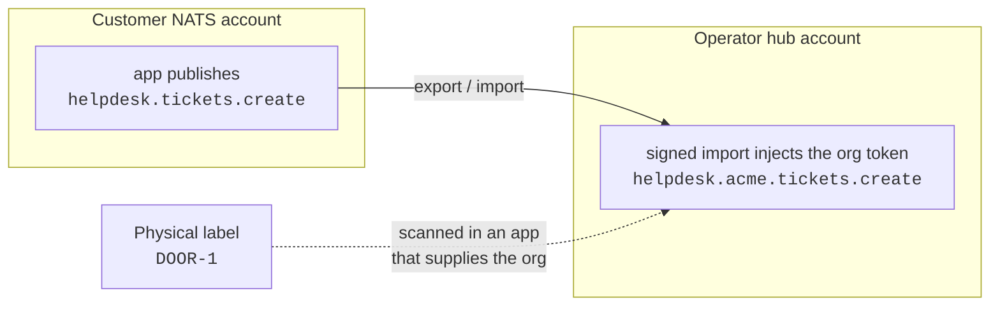

# ADR 0002: Root the Public Namespace at the Organization Code

**Status:** Accepted — implemented
**Date:** 2026-08-30 (implemented 2026-08-30)

> This ADR is ecosystem-scoped. It defines a namespace the platform registers and every sibling app consumes, and it uses the helpdesk as the worked example because it is the first app to have implemented the pattern.

> The Context and Decision below describe the design as it was argued. All six steps have since shipped; see [As implemented](#as-implemented) for what changed on contact with the code — including one ordering error in this document that would have dropped events.

---

## Context

An object in the real world — a door, a card reader, a site — is named several times over. It has a PocketBase id in the platform. It has a different PocketBase id in the helpdesk. It has a `code` that both agree on. It has a NATS subject it publishes under, a KV key its twin lives at, and, if someone screws a label to it, a string on a sticker.

Most of those already agree. `stone` resolves records by code, `leaf-sync` keys KV by the handle `candidateKey` derives, twin keys are `<kind>.<code>.<prop>`, and the helpdesk's machine intakes resolve a payload `thing_code` / `location_code` per `(customer, code)`. The ecosystem federates on `(organization, code)` and has for a while.

Two things spoil it.

**There are two namespace roots, not one.** The managed-org export rewrites a customer's subject by injecting the PocketBase **org id** — `hooks/managed_org_exports.go` builds `localSubject` as `helpdesk.{org.Id}.>`. Everything else in the ecosystem roots at a code. One system, two answers to "what identifies a tenant."

**There is no organization code to root at.** `organizations` carries a unique `name` and nothing else that is stable and machine-safe. A name has spaces, case, and a habit of changing when marketing gets involved. So the only tenant token available today is a PocketBase id — a single database's primary key, which is exactly the wrong thing to embed in a signed account JWT or print on a sticker that will outlive the app.

**And `code`, which everything already depends on, is mutable.** `UNIQUE (organization, code) WHERE code != ''` (`migrations/schema_update_unique_org_code.go`) makes it unique when present, and the partial predicate is deliberate — a code is *optional*, because both the platform's pre-onboarding inventory and an operator's service work cover gear with no upstream record. What is not deliberate is that nothing except `leaf_nodes` stops a code from being edited after consumers have started resolving by it. Consumers treat it as an identifier while the schema treats it as a label.

---

## Decision

**Ids for storage. Codes for addressing.**

Five rules, all load-bearing:

1. **`organizations` gains a `code`** — globally unique, immutable, `^[a-z][a-z0-9-]{1,30}$`, assigned at organization creation. This is the **only** globally unique identifier in the ecosystem. Everything below it stays unique within its organization, which is already enforced.

    Presence is guaranteed by a create hook that slugifies `name` when no code is given, not by `required` in the schema, and the index is **partial** (`WHERE code != ''`) exactly like the other five. That is not a hedge — it is what makes the change one migration instead of two. A required column plus a total unique index cannot be imported over existing rows that have no code, and the backfill cannot run before the column exists. A partial index imports cleanly at any backfill state, and the hook makes blanks unreachable from that point forward.
2. **`code` is an optional, immutable slug.** Installer-supplied where the physical world already has one (`DOOR-1` is stencilled on the device and is what a tech says out loud); slugified from `name` otherwise. Most records will carry one, and blank stays legal everywhere except `organizations` — a record without a code simply cannot be resolved by a machine intake or carry a label, which is a limit rather than a failure. Frozen once set, on every code-scoped collection.
3. **The subject rewrite roots at the organization code**, not `org.Id`.
4. **Relation columns stay PocketBase ids.** A foreign key on a human-typed string is a bad idea even when the string is frozen, and PocketBase relations are id-native. Codes address; ids store. This is the rule that keeps the change small.
5. **A QR payload is the bare code.** No host, no organization, no kind.

Rule 2 is the keystone, and it is narrower than it first looks. **Mutability was the disqualifier, not optionality.** A code that can change cannot root a signed subject or survive on a label; a code that is merely absent costs nothing but the ability to address that one record. So rule 1 is the only place presence is required — everywhere else the freeze alone does the work, and no field changes at all.

---

## The namespace grammar

```
{app}.{org}.{domain}.{verb}
```

Two tokens are worth stating explicitly because both have already caused an argument.

**Token 1 is the app.** It keeps each sibling app's stream subjects disjoint on the shared hub account.

**Token 3 must differ between an app's inbound and outbound streams.** The helpdesk found this the hard way: JetStream forbids two streams sharing a subject, and its ingest filter matches any tenant at token 2, so token 3 is the only place disjointness can be proven. It runs `tickets` inbound and `events` outbound, and that difference doubles as a loop guard — an emitted event can never be re-ingested as a command. This is an ecosystem rule, not a helpdesk quirk, and it needs an owner before a third app picks a token.

### Absolute and relative are the same name

The apparent inconsistency in the grammar is not one. A customer-mode app publishes:

```
helpdesk.tickets.create
```

with no organization token at all. The hub-side import injects it:

```
helpdesk.{org}.tickets.create
```

> A NATS subject may elide the organization token, because the account supplies it. A URL or a physical label cannot, because they have no ambient context.

That is relative versus absolute addressing, and it is why the same identity has two encodings without either being wrong. It also means the namespace survives a deployment-mode change: an organization that starts on an operator's helpdesk and later stands up its own loses a subject token and nothing else. No re-slugging, no reprinting.

<center>

</center>

The label sits outside both, which is the point: it carries the least context of anything in the system, so it carries the least information.

---

## Why the subject change is cheap

The helpdesk's ingest filter is `helpdesk.*.tickets.>` (`internal/subjects`, `StreamWildcards`). **Token 2 is a wildcard.** Both the id-rooted and code-rooted subject shapes match the same filter, so:

- No stream reconfiguration.
- No flag day. The consumer resolves token 2 as "try `code`, fall back to `platform_org_id`" and drops the fallback once every org has a code.
- No coordination between the platform and its consumers about when to switch.

The security property is unchanged. Provenance comes from the rewrite being **operator-signed**, not from what the token contains — a publisher can no more forge `acme` than it could forge an org id. Ingestion still parses the organization from the subject and never from the payload.

---

## Prerequisite: the export hook never updates what it created

`ensureManagedExports` in `hooks/managed_org_exports.go` is **create-if-missing**. When the hub import record already exists it backfills the `organization` stamp and returns; it never touches `local_subject`.

That is survivable today because `org.Id` cannot change. It stops being survivable the moment the subject roots at a mutable-until-frozen code:

> A code change would leave the signed import routing at the old token, and the wildcard filter would **mask** the failure. Traffic still matches `helpdesk.*.tickets.>`. It simply never arrives. There is no error anywhere.

Two consequences follow, and the second is the one that costs something:

1. The hook needs a reconcile path for `local_subject` — a latent bug independent of this ADR, since any future change to the subject shape hits it too.
2. **The code must be frozen from day one.** It cannot be added now and hardened later, because the window between the two is a window where the ecosystem silently stops delivering.

`hubImportName(org.Id)` keys the *record* by the immutable id. That is correct and should stay: record identity on the id, subject content on the code, is exactly the split rule 4 describes.

---

## Why a QR payload is the bare code

| | Bare `DOOR-1` (chosen) | `acme/thing/DOOR-1` | `https://host/acme/thing/DOOR-1` |
| :--- | :--- | :--- | :--- |
| Works with the existing scanner | **Today, unmodified** | Needs parsing | Needs parsing |
| Host / DNS commitment | None | None | For the life of every label |
| Forged sticker can | Show the wrong record | Show the wrong record | **Send a human anywhere** |
| Scans on a scratched label in a dark closet | Best (fewest modules) | Worse | Worst |
| Survives an org rename or merge | Yes | No — reprint | No — reprint |
| Matches what is stamped on the device | Yes | No | No |
| Naked phone camera | Nothing useful | Nothing useful | Opens a browser |

Two facts decided this, and both are properties of the system as it exists rather than arguments about how it ought to work.

**The platform already has a QR scanner, and it is generic.** `ui/src/components/widgets/ScannerWidget.vue` resolves a scanned value through an operator-configured `pbFilter` and `kvKeyTemplate` with a `{value}` placeholder (`replacePlaceholder`), with `html5-qrcode` already a declared dependency. A bare code works with it **now**, via `code = "{value}"` against PocketBase or `thing.{value}.status` against twin KV. A structured payload would require parsing the widget does not do. The decision that needs no new code is the one the existing consumer already implements.

**A sticker in a public hallway is an attacker-writable surface.** Anyone can print one and stick it over yours. With a URL payload, a forged sticker redirects a human to arbitrary content — and scan-and-tap is trained behaviour, which is what makes the attack work. With a bare in-system identifier, the worst a forged sticker achieves is resolving a different record inside an already-authenticated session. That is a data-integrity annoyance, not a phishing vector.

This is why **in-app scanning is the rule and there is no resolver service.** The trust boundary is not camera access — an in-app scanner needs the camera too. It is what happens to the decoded string.

What is given up: a naked phone camera does nothing with a bare code, so "point your camera at the door and land in the portal" is off the table. A requester scans inside the portal PWA instead. If that trade ever looks wrong, the upgrade path is open — a bare code is a strict suffix of the URL form, so future labels can carry a host while existing stickers keep working in-app.

### Scanner behaviour, which is not a payload question

> **Resolve globally across everything the scanner can see, then disambiguate. Never resolve within a sticky tenant context.**

Those sound similar and are not. Context-scoped resolution produces a confident wrong record; global resolution produces either the right one or a visible choice.

This matters most in the helpdesk, whose `staff` collection has **no customer field** — agents are cross-customer by design, so a field tech scanning `DOOR-1` has no ambient tenant at all. Context should *sort* results (the customer of the visit they are on floats to the top) and never filter them. The same rule handles the rarer case where a thing and a location in one organization share a code, since their unique indexes are per-collection and unaware of each other.

### Labels

Every sticker carries its payload as human-readable text alongside the symbol. Not for decoration — for the scratched, greasy, badly-lit label that will not scan, where a tech needs to read the code aloud or type it. Location labels can carry a small `LOC` marker; things dominate and need no marker.

---

## Quick wins

Each of these is small, independently useful, and does not wait on the rest.

**1. Reconcile `local_subject` in `ensureManagedExports`.** A latent bug today, a silent outage after rule 3. See the prerequisite above.

**2. Freeze `code` on the remaining code-scoped collections.** The precedent already exists and is one rule term, not a hook — `leaf_nodes` carries `@request.body.code:changed = false` in its update rule, with the reason written next to it. Extend the same term to `things`, `locations`, `thing_types` and `location_types`. All four already carry the unique index, so this is a rule edit with no data migration behind it. (The sweep-and-refuse pattern in `migrations/schema_update_unique_org_code.go` — list the offending rows, refuse, and deliberately do not pick a winner — is what the `organizations.code` backfill in step 1 should copy instead.)

**3. Let bootstrap claim `system` and `operator`, and skip the reserved-word list.** These two names want reserving, matching the `is_system_org` / `is_operator_org` special-case the org hooks already carry — but no list is needed to do it. Bootstrap creates both organizations, so if it sets their codes explicitly the global unique index makes those strings unavailable to everyone else for free. A reserved-word check would be a second mechanism enforcing what the constraint already enforces, and a second place to forget to update.

**4. Resolve, don't assume.** Consumers should look an organization code up rather than assume it equals `organizations.code`. That is one line of difference now and it is the hedge for organizational mergers: when one org absorbs another, an alias set keeps existing labels and subjects resolving, and it can be added later without touching a single caller. Build the lookup, not the alias table.

**5. Retire the second org slug.** `hooks/thing_routes.go` derived its own slug from the organization NAME, freshly on every call, to build the synthetic emails identifying a Thing and its NATS / Nebula records. Two bugs in one function: renaming an organization silently split its devices across two identifier domains, and names are unique while their slugs are not ("Acme Inc" and "Acme, Inc." both give `acme-inc`), so two legal organizations could collide in a namespace carrying a global unique index — a hazard the code there documented and worked around with an apologetic error telling the operator to rename an organization. Reading `organizations.code` closes both, and the emails become literally the `(organization, code)` join key with each half immutable. This is the smallest illustration of the whole ADR: the identifier already existed, it was just being derived twice, differently.

**6. Fix the subject a consumer *emits*, not only the one it reads.** The helpdesk publishes its own outbound event stream, and token 2 there was the helpdesk's own record id for the customer — a local primary key in a subject that crosses to other applications, which is this ADR's problem in the opposite direction. Reading it is only half the boundary. Once it carries the tenant code, both directions name a tenant the same way and a consumer can join events to platform data without a mapping table that only one database could produce.

Worth stating because it is the tempting shortcut: where the code is absent, **skip and log rather than falling back to the local id**. A token that is sometimes an ecosystem-wide code and sometimes one app's primary key is not a token at all — the consumer cannot tell which it is holding, and the two namespaces have no reason to stay disjoint.

**7. Restate pull-and-seed as a choice rather than a limitation.** Consumer docs currently describe the absence of live inventory sync as architecturally closed. It is not — it is correct in both deployment modes for different reasons. In operator mode the app spans tenants, so live query would mean holding one credential per organization. In customer mode it could live-query and still should not, because a synchronous cross-app dependency in the ticket path is worse than a stale inventory row. Worth noting that customer mode gets sync nearly free: the existing `things` list rule already admits `@request.auth.collectionName = "users" && organization = @request.auth.current_organization`, so an ordinary org-scoped user credential can pull inventory with no new endpoint, no new export, and no new credential class.

---

## Implementation order

Two ordering constraints, and both bite silently if ignored.

**Steps 1 and 2 must land before step 4**, or the window in the [prerequisite](#prerequisite-the-export-hook-never-updates-what-it-created) opens.

**Step 3 must land before step 4** — readers before writers. A consumer resolves subject token 2 against its own tenant table, and an unresolved organization is **acked, not retried**. A platform that switched the token before its consumers could resolve codes would drop every machine-filed event in the gap, with a log line as the only evidence. This is why the consumer change is not step 5, which is where it reads more naturally.

1. `organizations.code` — field with a `pattern` validator, partial unique index, slugify-on-create hook, immutability rule, bootstrap claiming `system` / `operator`, and a backfill for existing rows.
2. Reconcile path in `ensureManagedExports`; freeze `code` on the four remaining collections.
3. **Consumers** add their own tenant code (in the helpdesk, `customers.code`) and resolve token 2 as code-then-id. `platform_org_id` degrades into the "is this customer actually onboarded" marker, which is still a question worth being able to answer. Deploy this before step 4.
4. Switch the export rewrite to the code, and re-save every managed org so existing imports reconcile. Re-save the *organization* rather than updating the import row directly: pb-nats republishes the account JWT from its own record hooks, so a raw SQL update would change the database and leave the running NATS server enforcing the old import.
5. Drop the id fallback in consumers, once no deployment emits ids.
6. QR: a dashboard widget config on the platform (no code), and a scan view in the helpdesk field shell (the one real build).

---

## Consequences

### Good

- One namespace root instead of two, and it is the one every other consumer already used.
- Labels survive organization renames, app rewrites, and deployment-mode changes, because they depend on nothing outside the database.
- The platform's QR path needs no new code — a widget config against a scanner that already ships.
- The subject change needs no stream reconfiguration and no coordinated cutover.
- Monitoring becomes legible: `helpdesk.acme.tickets.create` reads, `helpdesk.k3j2h4g5k3j2h4g.tickets.create` does not.

### Costs we are accepting

- **Global uniqueness is the only non-local constraint in an otherwise cleanly org-scoped system.** It needs a registrar, which is a social process rather than a table.
- **An organization code must be reserved even for a tenant with no platform presence.** A consuming app may serve customers the platform never onboarded; they still need a code from the same namespace, which means the platform is a required participant in allocation even where it is not otherwise involved. That is the coupling a global namespace costs, and it is the right price.
- **No naked-camera scanning**, deliberately.

### The sharp edge

**Immutability is a promise the database cannot keep.** A rule term guards the record API. It does not guard a superuser in the PocketBase dashboard, and it never will.

That is tolerable while a code is only a lookup handle. It stops being tolerable once the same string is printed on labels across a customer's buildings and baked into signed account JWTs — at which point an edit is a site visit with a label printer *and* a re-signed export, and the failure in between is silent. The mitigation is not technical: codes are operator-assigned at creation, and the reason they cannot be changed belongs in a comment next to the rule, the way `leaf_nodes` already does it.

---

## What would make us revisit this

- If organizational mergers turn out to be routine rather than occasional, the alias set stops being a hedge and should become a real collection with its own resolution rules.
- If requesters scanning with an ordinary phone camera turns out to matter more than the phishing surface it opens, the payload gains a host prefix and the DNS commitment that comes with it. Existing labels survive that change; the decision is reversible in one direction only.
- If a third app needs a token-3 allocation that collides with an existing one, the grammar has outgrown being a convention and needs an owner.
- If `code` freezing is routinely worked around through the admin panel, the constraint is wrong for how people actually operate and the honest fix is aliasing, not stricter enforcement.

---

## Rejected alternatives

**A resolver service on a dedicated host.** Proposed during the design discussion and dropped. It solves a problem that only exists for naked-camera scans, which rule 5 removes; an in-app scanner never fetches the URL. Role-aware landing, the other thing it would have bought, is already solved without a service — the helpdesk's `ui/src/views/TicketLinkView.vue` forwards staff, requesters and anonymous visitors to the right place in about twenty lines.

**Splitting `things` into inventory and credentials.** Argued on the grounds that a sibling app cannot be granted read on an auth collection without the credential half riding along. Checked, and false: `password`, `tokenKey` and `verified` are `hidden=true` and never serialize, and `email` is masked by `emailVisibility`. An inventory query against an auth collection returns what a base collection would. The only residue is `nats_user` and `nebula_host` as bare relation ids, inert without read access that `schema_update_credential_scoping.go` and `schema_update_privesc_chain.go` already lock down. One more table in exchange for nothing.

**`{org}/{kind}/{code}` on the label.** The organization token was defended as a validator — a stale field-tech context could otherwise resolve the wrong tenant's `DOOR-1`, and codes like `DOOR-1`, `RDR-01` and `AP-1` are exactly what everyone independently invents. It does not survive contact with the UI: the helpdesk is cross-customer, so every screen names the customer, and a wrong-tenant resolve is loudly visible rather than silent. A disambiguation picker was already the accepted remedy for the thing/location collision; refusing the same remedy one collision over was inconsistent. Dropping the token also buys QR density, which is a real field-reliability property, and immunity to organizational renames.

**Keeping `org.Id` as the subject root and using the code only for labels.** Coherent, and cheaper by exactly one migration. Rejected because it preserves the two-roots problem this ADR exists to close, and because the legibility win in monitoring and the single resolution path in consumers are worth one migration in a system with no production deployments.

---

## As implemented

All six steps shipped across `platform` and `helpdesk`. The decision itself survived intact; five things about it did not.

**The step order in the first draft of this document was wrong, and wrong in the dangerous direction.** It had the platform switching the subject token (step 3) before consumers could resolve codes (step 4). A consumer resolves subject token 2 against its own tenant table and **acks** an unresolved organization rather than retrying, so every machine-filed event in the gap would have been dropped with a log line as the only evidence. Readers before writers. The order above is corrected; this paragraph stays as the reason.

**Presence is guaranteed by a hook, not by `required`, and the index is partial.** Documented in rule 1, but worth repeating as the thing that made it one migration instead of two: a required column plus a total unique index cannot be imported over existing rows that have no code, and a column cannot be backfilled before it exists.

**Hook errors are invisible unless they are the right type.** The create hook pre-checks code uniqueness specifically so an operator gets a useful message instead of a driver constraint violation. A plain `fmt.Errorf` from `OnRecordCreate` reaches the client as `{"message":"Failed to create record."}` and nothing else — so the check bought exactly nothing until it was switched to `apis.NewBadRequestError`. Worth knowing before writing the next guard hook.

**The freeze reports 404, not 403.** A record failing its update rule is indistinguishable from one that does not exist, by PocketBase's design. The stored value is provably unchanged and the UI disables the field, but anything hitting the rule from outside the UI gets a confusing status.

**Two more places were substituting a local identifier for the shared one**, neither of them in the original plan and both found only by reading the surrounding code:

- `hooks/thing_routes.go` derived a *second* org slug from the organization NAME on every call, to build the synthetic emails identifying a Thing and its NATS / Nebula records — mutable, and non-unique where names slugged alike. Quick win 5.
- The helpdesk's own outbound event stream carried the helpdesk's record id for the customer in a subject crossing to other applications: this ADR's problem in the opposite direction. Quick win 6.

Both are the same shape as the problem this ADR names, which suggests the useful question when reviewing any subject, key or label is not "is this identifier unique" but "whose database does this identifier belong to".

### What the QR work confirmed

The density argument for a bare payload turned out to be stronger than the estimate in [Why a QR payload is the bare code](#why-a-qr-payload-is-the-bare-code). Measured with the encoder actually used:

| Payload | Error correction | Symbol |
| :--- | :--- | :--- |
| `DOOR-1` | H (30% recovery) | version 1 — 21×21 modules |
| `https://host/acme/thing/DOOR-1` | H (30% recovery) | version 6 — 41×41 modules |

So the bare code does not merely produce a smaller symbol: it makes **maximum** error correction free. The URL form at the same recovery level would put roughly four times the modules on an identically sized sticker, halving the width of each one. A label that lives in a plant room and gets scratched, painted and wiped wants that headroom spent on recovery.

Label generation shipped in both apps as the same component, operator-branded — the brand is on the sticker because whoever finds a broken device needs to know who services it, while the *tenant* name deliberately is not, since a sticker in a public hallway is readable by anyone walking past. The scanner shipped in the helpdesk only; the platform already had a generic dashboard scanner that resolves a scanned value through a configured filter, and a bare code works with it unmodified — which is the clearest evidence available that the payload decision matched what a real consumer already expected.

Labels are sized to real stock in millimetres with a per-size `@page` box — **2″ × 1″** and **4″ × 2″**, the two sizes that exist in both plain and UHF RFID form. Both reserve a centred **inlay keep-out**: printing over an RFID chip bump causes print voids and can crack the die under a thermal head, so the artwork straddles the band, QR one side and text the other, and one layout prints correctly on either stock. That constraint is the reason the QR is not simply centred, and it is worth knowing before anyone "tidies" the layout.

The measured module sizes are the check that the whole payload argument holds physically: 0.69 mm per module at 2″ × 1″ and 1.38 mm at 4″ × 2″, with the spec's full 4-module quiet zone, against roughly 0.5 mm as the floor for a phone camera. The URL payload would not have fit the small stock at all.

Verified end to end on seeded demo data: the rendered label decodes to exactly `CAM-NE` — no scheme, no host, no organization, no kind token — and a code held by two customers produces the disambiguation picker rather than a confident wrong answer.
