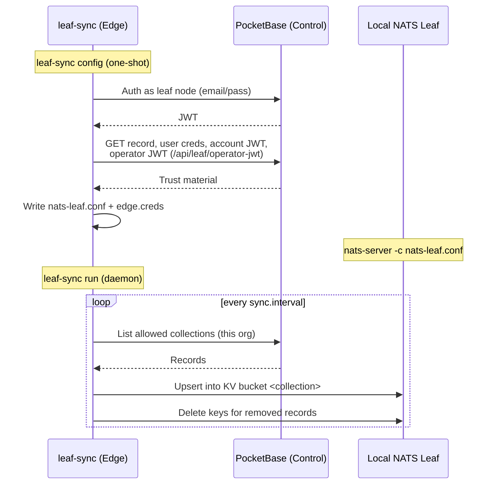

# Edge Nodes & leaf-sync

A NATS **Leaf Node** ([Connectivity §1](./connectivity.md#leaf-nodes)) gives a customer site local autonomy — devices keep talking and data keeps flowing during a WAN outage. But a leaf node is only useful if it knows *what's at the site*: which Things exist, what their Types can do, which Locations they live in. That configuration lives in the central Control Plane (PocketBase), and it has to reach the edge somehow.

**`leaf-sync`** is how. It is the platform's edge agent: a small, separate Go binary that runs at the site, authenticates as the site's identity, and mirrors that organization's configuration into the leaf node's local NATS KV. The platform models each site as a **`leaf_nodes`** record — "a special Thing" with one NATS identity — so an edge site is a first-class, provisionable entity rather than a hand-assembled pile of config files.

This page covers both: the `leaf_nodes` entity and the `leaf-sync` agent.

!!! note "Three things called 'leaf', one called 'agent' — keep them straight"
    | Term | What it is |
    | :--- | :--- |
    | **NATS Leaf Node** | The stock `nats-server` running at the site in leaf mode, dialing the hub outbound. A Layer 0 transport primitive — see [Connectivity](./connectivity.md#leaf-nodes). |
    | **`leaf_nodes` record** | How the *platform* models the site: a PocketBase auth record with one NATS user, an optional Nebula host, and an allowlist of collections to mirror. |
    | **`leaf-sync`** | The agent that bootstraps the leaf node's config and continuously mirrors central config → local KV. The subject of this page. |
    | **The [Agent](./agent.md)** (`stone-age-agent`) | A *per-Thing* executor (telemetry, service checks, remote exec). Different binary, different job. A site can run both: `leaf-sync` keeps config in sync; Agents report on individual devices. |

---

## 1. Why config can't just be pushed

There are two distinct sync planes at an edge site, and only one of them is `leaf-sync`'s job.

- **Config plane** — PocketBase records → `leaf-sync` (HTTPS pull) → local KV. This exists because the Control Plane is the NATS **operator** and only ever touches the **SYSTEM account**. It deliberately has no presence inside any tenant's account data plane (see [Architecture §2](./architecture.md#key-properties-of-this-topology)), so it *cannot* push config into an org's buckets. Instead, the edge pulls its own config, authenticated as its own identity.
- **Data plane** — live data already in NATS (digital twin state, telemetry) replicates between hub and edge via cross-domain JetStream **mirror/source**, configured by the account's own users. This is ordinary JetStream replication, not `leaf-sync`.

The split matters: `leaf-sync` moves *metadata* (the inventory and contracts an edge needs to make sense of its traffic), while JetStream moves the *traffic itself*.

---

## 2. The `leaf_nodes` entity

Create one in the console under **Leaf Nodes → New**. A server-side hook then provisions its NATS identity automatically — no manual key handling.

| Field | Role |
| :--- | :--- |
| `code` | The site's slug. Derives the NATS username and the JetStream domain (`edge-<code>`). Immutable after creation. |
| `domain` | Local JetStream domain, distinct from the hub's, so the edge has its own KV/stream namespace. |
| `nats_user` | The site's single NATS identity, minted by the provisioning hook. Shared by the leaf remote, `leaf-sync`, and any local rule engine. |
| `nebula_host` | Optional link to a Nebula host, so the site can also join the overlay mesh. A leaf can have both. |
| `synced_collections` | The subset of the allowlist (§4) this site mirrors. |
| `location`, `metadata` | Optional site context. |

When you create a leaf node, the success modal shows its PocketBase credentials **once** — those are what `leaf-sync` authenticates with. The detail view mirrors the Thing layout: identity on the left; a **Connectivity** card (NATS username/status, role with reassignment, per-user permission overrides, `.creds` download, and Nebula hostname/IP/config) on the right; plus the synced-collection selection.

!!! tip "Why an entity and not just a config file"
    Modeling the site as a record means its identity, permissions, and sync scope are managed the same way as everything else in the platform — through the UI, the API rules, and the audit log. Rotating the site's credentials or narrowing its NATS role is a record edit, not an SSH session.

---

## 3. leaf-sync: the edge agent

`leaf-sync` is built from the same repository as the Control Plane but ships as its own lean binary. **The edge never runs PocketBase.** It has two commands:

```sh
leaf-sync config   # one-shot: write nats-leaf.conf + edge.creds from PocketBase
leaf-sync run      # daemon: mirror config collections into local KV
```

- **`config`** authenticates to PocketBase as the leaf node and fetches everything needed to stand the leaf server up: its own record (domain, synced collections), its NATS user's `.creds`, the org account JWT, and the **operator JWT** (served by the dedicated, leaf-node-authenticated route `GET /api/leaf/operator-jwt`, so the operator key itself stays superuser-only). It writes `nats-leaf.conf` and the creds file. No NATS connection required — run it *before* the leaf server is up.
- **`run`** connects to the local leaf and, every `sync.interval`, performs a **full reconcile** of each allowed collection: upsert every record into KV bucket `<collection>`, then delete keys for records that no longer exist. It is **fail-soft** — on any PocketBase or NATS error it leaves local KV untouched and retries; it never wipes local state — and it shuts down cleanly on `SIGINT`/`SIGTERM`, so it's safe under systemd or Docker.

<center>

</center>

Records are keyed in KV the same way the Control Plane handles them: `message_schemas` by `namespace__name__version`, everything else by `code` (then `name`), falling back to the PocketBase record id when no stable handle exists. The id always stays inside the stored JSON so relation fields resolve, and server-only noise fields (`collectionId`, `collectionName`, `expand`) are stripped from the value.

---

## 4. What gets synced

A hard allowlist, enforced both by the server's API rules and by `leaf-sync`:

```
things   locations   thing_types   location_types
thing_type_operations   message_schemas
```

This is exactly the **Thing contract graph**: `thing_type` → `thing_type_operation` → `message_schema` (see [Thing Types](./thing-types.md)), plus the Things and Locations that instantiate it. With these mirrored locally, an edge can resolve what a Thing's Type is allowed to do — and validate the messages it exchanges — **entirely offline**.

A leaf node identity can only ever read these collections, and only within its own organization. Secret-bearing collections (`nats_users`, `nats_accounts`, `nebula_*`) are never exposed to a leaf identity and can never be synced. The `synced_collections` field on the record selects which of the allowlist a given site actually mirrors.

---

## 5. Offline autonomy

Once `leaf-sync` has populated local KV, the rest of the layered platform runs at the edge without the hub:

- A [rule engine](./automation.md) instance reads the mirrored config and live KV and keeps evaluating site-local reflexes during a WAN outage.
- A [stream processor](./stream-processing.md) keeps producing aggregates from local subjects.
- Devices and Agents keep publishing to the local leaf, which buffers and forwards once connectivity returns.

`leaf-sync`'s full-reconcile loop is what makes this safe: when the link comes back, the next cycle converges local KV to whatever changed centrally, without ever having served stale-but-broken state in the meantime.

---

## 6. Security model

- **One NATS identity per edge**, shared by the leaf remote, the rule engine, and `leaf-sync`. The **edge box is the trust boundary**; tenant isolation is the NATS *account* boundary, which the edge cannot cross.
- The edge only ever holds **public trust material** (operator JWT, account JWT) plus its own user's creds. It **cannot mint new account users**.
- The operator JWT is reachable only through `GET /api/leaf/operator-jwt`, authenticated as the leaf node — the operator collection stays superuser-only.
- Narrowing a site's blast radius is a record edit: reassign its NATS role or add per-user permission overrides from the leaf node's detail view.

---

## 7. Deploy flow

1. In the console, create a **Leaf Node**; copy the credentials from the success modal.
2. On the edge box, install `leaf-sync` and a stock `nats-server`, and write `leaf-sync.yaml`:

   ```yaml
   pocketbase:
     url: "https://platform.acme.io"
     email: "warehouse-a@acme.leaf.local"   # from the success modal
     password: "••••••••"
   nats:
     hub_leaf_url: "nats://nats.acme.io:7422"   # where the leaf remote dials the hub
     local_url: "nats://127.0.0.1:4222"
     creds_file: "edge.creds"
   sync:
     interval: "30s"
   ```

   Any key can be overridden by an environment variable: upper-case it, replace dots with underscores, and prefix `LEAF_SYNC_` (e.g. `LEAF_SYNC_POCKETBASE_PASSWORD`).
3. `leaf-sync config` → produces `nats-leaf.conf` + `edge.creds`.
4. `nats-server -c nats-leaf.conf` (under systemd/Docker/your init system).
5. `leaf-sync run` (likewise supervised).
6. Point your local rule engine at `edge.creds` for site-local automation.

`leaf-sync` does not supervise the other processes — use whatever your platform provides.

---

## 8. Where to Go Next

- **The leaf node transport primitive:** [Connectivity §1 — Leaf Nodes](./connectivity.md#leaf-nodes).
- **The contract graph that gets synced:** [Thing Types](./thing-types.md).
- **Per-Thing edge execution (a different agent):** [The Agent](./agent.md).
- **Site-local rules during outages:** [Automation](./automation.md).
- **How the planes fit together:** [Architecture](./architecture.md) and [Platform Layers](./platform-layers.md).
