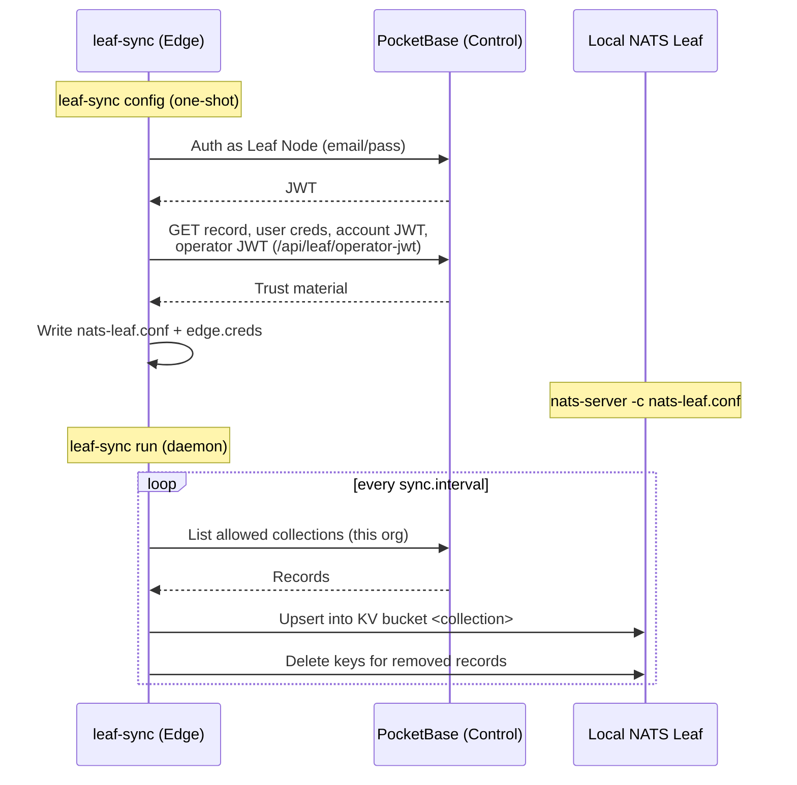

# Leaf Nodes

A **Leaf Node** is how Stone-Age.io models a customer site that runs its own local NATS server. The transport underneath is a stock NATS leaf node ([Connectivity §1](./connectivity.md#leaf-nodes)) — it dials the hub outbound and gives the site local autonomy when the WAN drops. On its own, though, that leaf node is just an empty pipe: it has a local JetStream domain but knows nothing about *what's at the site* — which Things exist, what their Types can do, which Locations they live in.

What turns a bare NATS process into a Stone-Age.io **Leaf Node** is **`leaf-sync`**: a small, opinionated edge agent that runs at the site, authenticates as the site's own identity, and mirrors that organization's configuration into the leaf node's local KV. The platform tracks each site as a **`leaf_nodes`** record — "a special Thing" with one NATS identity — so a Leaf Node is a provisioned, RBAC-scoped, audited entity, not a hand-assembled pile of config files.

This page covers both: the Leaf Node entity and the `leaf-sync` agent that brings it to life.

> # "Leaf node" means two related things — keep them straight
>    | Term | What it is |
>    | :--- | :--- |
>    | **NATS leaf node** | The stock `nats-server` running at the site in leaf mode, dialing the hub outbound. A Layer 0 transport primitive — see [Connectivity](./connectivity.md#leaf-nodes). |
>    | **Leaf Node** (this page) | The *platform's* model of the site: a PocketBase record with one NATS identity, an optional Nebula host, and an allowlist of config to mirror. Built **on** a NATS leaf node, but adds  provisioning, RBAC, and config sync. This is what the UI and PocketBase call a "Leaf Node." |
>    | **`leaf-sync`** | The binary that bootstraps the leaf node's config and continuously mirrors central config → local KV. The subject of this page. |
>    | **The [Agent](./agent.md)** (`stone-age-agent`) | A *per-Thing* executor (telemetry, service checks, remote exec). Different binary, different job. A site often runs both: `leaf-sync` keeps the site's config in  sync; Agents report on individual devices. |

---

## 1. More than a NATS leaf node

A vanilla NATS leaf node is unopinionated by design — it's transport, and nothing more. Stone-Age.io's Leaf Node is the opposite: it's a leaf node with a point of view, and `leaf-sync` is what gives it one. Four things make it *platform-specific* rather than a bare process:

- **Pre-loaded config.** `leaf-sync` populates the local KV with the org's Thing contract graph and inventory (§4), so the site can resolve what its devices are and what they're allowed to do — offline, with no round-trip to the hub.
- **A managed identity.** The Leaf Node is provisioned with its own NATS user by a server-side hook. You never hand-mint keys; you create a record.
- **A bounded sync scope.** What a site mirrors is an enforced allowlist (§4), not "whatever's in PocketBase." Secret-bearing collections can never reach it.
- **The same control surface as everything else.** Rotating credentials, narrowing the site's NATS role, or auditing changes are record edits in the console — not SSH sessions on the edge box.

The payoff: a Leaf Node *understands its own configuration*, where a plain leaf node only moves bytes.

---

## 2. Why the edge pulls its config

There are two distinct sync planes at a site, and `leaf-sync` owns only one of them.

- **Config plane** — PocketBase records → `leaf-sync` (HTTPS pull) → local KV. This exists because the Control Plane is the NATS **operator** and only ever touches the **SYSTEM account**. It deliberately has no presence inside any tenant's account data plane (see [Architecture §2](./architecture.md#key-properties-of-this-topology)), so it *cannot* push config into an org's buckets. Instead, the site pulls its own config, authenticated as its own identity.
- **Data plane** — live data already in NATS (digital twin state, telemetry) replicates between hub and edge via cross-domain JetStream **mirror/source**, configured by the account's own users. This is ordinary JetStream replication, not `leaf-sync`.

The split matters: `leaf-sync` moves *metadata* (the inventory and contracts a site needs to make sense of its traffic), while JetStream moves the *traffic itself*.

---

## 3. The Leaf Node entity

Create one in the console under **Leaf Nodes → New**. A server-side hook then provisions its NATS identity automatically — no manual key handling.

| Field | Role |
| :--- | :--- |
| `code` | The site's slug. Derives the NATS username and the JetStream domain (`edge-<code>`). Immutable after creation. |
| `domain` | Local JetStream domain, distinct from the hub's, so the site has its own KV/stream namespace. |
| `nats_user` | The site's single NATS identity, minted by the provisioning hook. Shared by the leaf remote, `leaf-sync`, and any local rule engine. |
| `nebula_host` | Optional link to a Nebula host, so the site can also join the overlay mesh. A Leaf Node can have both. |
| `synced_collections` | The subset of the allowlist (§4) this site mirrors. |
| `location`, `metadata` | Optional site context. |

When you create a Leaf Node, the success modal shows its PocketBase credentials **once** — those are what `leaf-sync` authenticates with. If they're lost, an org Admin/Owner can **reset credentials** from the detail view (the new password is shown once); the old one stops working immediately, so update `leaf-sync.yaml` and restart the agent. The detail view mirrors the Thing layout: a **Liveness** card (status, last heartbeat, agent version, per-collection sync counts — see §4.1) and identity on the left; a **Connectivity** card (NATS username/status, role with reassignment, per-user permission overrides, `.creds` download, and Nebula hostname/IP/config) on the right; plus the synced-collection selection.

---

## 4. leaf-sync: the edge agent

`leaf-sync` is built from the same repository as the Control Plane but ships as its own lean binary. **The edge never runs PocketBase.** It has two commands:

```sh
leaf-sync config   # one-shot: write nats-leaf.conf + edge.creds from PocketBase
leaf-sync run      # daemon: mirror config collections into local KV
```

- **`config`** authenticates to PocketBase as the Leaf Node and fetches everything needed to stand the leaf server up: its own record (domain, synced collections), its NATS user's `.creds`, the org account JWT, and the **operator JWT** (served by the dedicated, leaf-node-authenticated route `GET /api/leaf/operator-jwt`, so the operator key itself stays superuser-only). It writes `nats-leaf.conf` and the creds file. No NATS connection required — run it *before* the leaf server is up.
- **`run`** connects to the local leaf and, every `sync.interval`, performs a **full reconcile** of each allowed collection: upsert every record into KV bucket `<collection>`, then delete keys for records that no longer exist. It is **fail-soft** — on any PocketBase or NATS error it leaves local KV untouched and retries; it never wipes local state. A *successful but empty* fetch is guarded too: if a collection returns zero records while local KV still holds keys, the purge is skipped for that cycle, so a transient auth or scoping glitch can't wipe the mirror. It shuts down cleanly on `SIGINT`/`SIGTERM`, so it's safe under systemd or Docker.

After each cycle, `run` also writes a best-effort **liveness heartbeat** (when `nats.hub_domain` is set — see §4.1).

<center>

</center>

Records are keyed in KV the same way the Control Plane handles them: `message_schemas` by `namespace__name__version`, everything else by `code` (then `name`), falling back to the PocketBase record id when no stable handle exists. The id always stays inside the stored JSON so relation fields resolve, and server-only noise fields (`collectionId`, `collectionName`, `expand`) are stripped from the value.

### 4.1 Liveness heartbeat

A provisioned Leaf Node is only useful if you can tell it's actually running. After each reconcile, `leaf-sync` writes a small **heartbeat** into the org account's **`leaf_status`** KV bucket, keyed by the site's `code`:

```json
{ "code": "warehouse-a", "version": "1.4.0", "ts": "2026-06-08T12:34:56Z",
  "interval": "30s", "synced": { "things": 142, "locations": 12 }, "errors": [] }
```

The console reads this bucket over its existing NATS connection and renders each site's status — a dot on the **Leaf Nodes** list and a **Liveness** card on the detail view (agent version, last-beat time, per-collection record counts, and any sync errors). A site is shown **offline** once its last beat is older than three sync intervals.

Two things make this a clean, NATS-only signal — no PocketBase write-back, no new server route:

- **It rides the data plane.** The Leaf Node's own NATS identity writes the beat, and the UI (an account user) reads it. The Control Plane is never involved, consistent with the plane split in §2.
- **The heartbeat targets the *hub's* JetStream domain.** `leaf-sync` is connected to the local leaf (domain `edge-<code>`), so a default KV write would stay local and invisible to the hub. It therefore writes across the leaf link to the hub domain named by `nats.hub_domain` — the same place the digital-twin buckets live. Leave `hub_domain` unset and the heartbeat is simply off.

The write is **best-effort**: a heartbeat failure (e.g. a WAN outage) is logged and never disturbs the sync loop — and the *absence* of a recent beat is exactly what the console reads as "offline."

---

## 5. What gets synced

A hard allowlist, enforced both by the server's API rules and by `leaf-sync`:

```
things   locations   thing_types   location_types
thing_type_operations   message_schemas
```

This is exactly the **Thing contract graph**: `thing_type` → `thing_type_operation` → `message_schema` (see [Thing Types](./thing-types.md)), plus the Things and Locations that instantiate it. With these mirrored locally, a site can resolve what a Thing's Type is allowed to do — and validate the messages it exchanges — **entirely offline**.

A Leaf Node identity can only ever read these collections, and only within its own organization. Secret-bearing collections (`nats_users`, `nats_accounts`, `nebula_*`) are never exposed to a Leaf Node identity and can never be synced. The `synced_collections` field on the record selects which of the allowlist a given site actually mirrors.

---

## 6. Offline autonomy

Once `leaf-sync` has populated local KV, the rest of the layered platform runs at the edge without the hub:

- A [rule engine](./automation.md) instance reads the mirrored config and live KV and keeps evaluating site-local reflexes during a WAN outage.
- A [stream processor](./stream-processing.md) keeps producing aggregates from local subjects.
- Devices and Agents keep publishing to the local leaf, which buffers and forwards once connectivity returns.

`leaf-sync`'s full-reconcile loop is what makes this safe: when the link comes back, the next cycle converges local KV to whatever changed centrally, without ever having served stale-but-broken state in the meantime.

---

## 7. Security model

- **One NATS identity per Leaf Node**, shared by the leaf remote, the rule engine, and `leaf-sync`. The **edge box is the trust boundary**; tenant isolation is the NATS *account* boundary, which the site cannot cross.
- The site only ever holds **public trust material** (operator JWT, account JWT) plus its own user's creds. It **cannot mint new account users**.
- The operator JWT is reachable only through `GET /api/leaf/operator-jwt`, authenticated as the Leaf Node — the operator collection stays superuser-only.
- Narrowing a site's blast radius is a record edit: reassign its NATS role or add per-user permission overrides from the Leaf Node's detail view.
- The Leaf Node's PocketBase password (its `leaf-sync` login) is resettable by an org Admin/Owner from the console — gated by the collection's `manageRule`, so it stays a scoped, audited record action rather than a superuser-only operation.

---

## 8. Deploy flow

1. In the console, create a **Leaf Node**; copy the credentials from the success modal.
2. On the edge box, install `leaf-sync` and a stock `nats-server`, and write `leaf-sync.yaml`:

   ```yaml
   pocketbase:
     url: "https://platform.acme.io"
     email: "warehouse-a@acme.leaf.local"   # from the success modal
     password: "••••••••"
   nats:
     hub_leaf_url: "nats://nats.acme.io:7422"   # where the leaf remote dials the hub
     local_url: "nats://127.0.0.1:4222"
     creds_file: "edge.creds"
     hub_domain: "hub"                           # hub's JetStream domain; enables the heartbeat (§4.1)
   sync:
     interval: "30s"
   ```

   Any key can be overridden by an environment variable: upper-case it, replace dots with underscores, and prefix `LEAF_SYNC_` (e.g. `LEAF_SYNC_POCKETBASE_PASSWORD`).
3. `leaf-sync config` → produces `nats-leaf.conf` + `edge.creds`.
4. `nats-server -c nats-leaf.conf` (under systemd/Docker/your init system).
5. `leaf-sync run` (likewise supervised).
6. Point your local rule engine at `edge.creds` for site-local automation.

`leaf-sync` does not supervise the other processes — use whatever your platform provides.

> Build a release binary with the version stamped in (it surfaces in `leaf-sync --version` and in every heartbeat):
> ```sh
> go build -ldflags "-X platform/internal/leafsync.Version=$(git describe --tags --always --dirty)" -o leaf-sync ./cmd/leaf-sync
> ```

---

## 9. Where to Go Next

- **The leaf node transport primitive:** [Connectivity §1 — Leaf Nodes](./connectivity.md#leaf-nodes).
- **The contract graph that gets synced:** [Thing Types](./thing-types.md).
- **Per-Thing edge execution (a different agent):** [The Agent](./agent.md).
- **Site-local rules during outages:** [Automation](./automation.md).
- **How the planes fit together:** [Architecture](./architecture.md) and [Platform Layers](./platform-layers.md).
