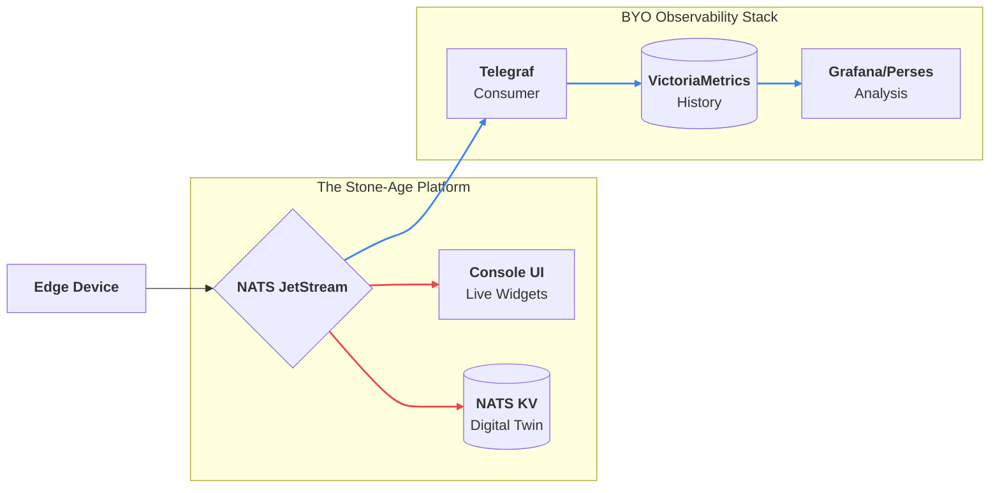

# Observability

One of the core tenets of the Stone-Age.io Platform is our **"Bring Your Own" (BYO)** philosophy regarding things/applications, and specifically long-term data storage. We focus on providing the best possible real-time Control Plane and Data Plane, while leaving historical storage to industry-leading time-series databases.

This document explains our observability strategy and how to integrate the suggested stack for long-term telemetry storage and trend analysis.

---

## 1. The "Bring Your Own" Philosophy

Traditional IoT platforms often attempt to build a time-series database (TSDB) directly into their core binary. This inevitably leads to architectural bloat, poor performance, and difficult maintenance.

**The Stone-Age.io approach is different:**

- **Stone Age Console:** Focuses on **Live State** (The Digital Twin) and **Control**. It answers: *"What is happening right now?"*
- **Suggested Stack:** Focuses on **History** and **Trends**. It answers: *"What happened last Tuesday?"*

By leveraging the NATS backbone, you can tap into the data stream and pipe it into any storage engine without impacting the performance of the live Control Plane.

---

## 2. The Suggested Stack 

If you do not have an existing observability stack, we recommend the following based on speed, simplicity, and efficiency.

### A. Telegraf 

**Telegraf** is a lightweight agent used for collecting and reporting metrics. In our ecosystem, it acts as the bridge between NATS and your database.

- **NATS Consumer:** Telegraf subscribes to your NATS subjects (e.g., `telemetry.>`).
- **Parsing:** It converts NATS JSON payloads into metrics.
- **Output:** It pushes those metrics to your storage engine.

### B. VictoriaMetrics 

**VictoriaMetrics** is a high-performance, cost-effective, and scalable time-series database. It is fully compatible with the Prometheus API.

- **Grug-Brained:** Like Stone Age, VictoriaMetrics prefers single-binary simplicity and low resource usage.
- **Retention:** Use it to store months or years of historical data.
- **Vmalert:** This component allows you to execute "recording rules" or "alerting rules" against historical data (e.g., *"Alert if the average temperature over the last 24 hours is 10% higher than the previous week"*).

### C. Perses.dev 

While the Stone-Age.io Platform Dashboard is perfect for operational control, **Perses** (or Grafana) is ideal for historical analysis.

- **Standardized:** Perses is an open-standard dashboard engine.
- **Deep Dives:** Use it to build long-term trend reports, heatmaps, and complex comparative charts from VictoriaMetrics.

---

## 3. Data Flow Architecture

A typical production pipeline follows this path:

1.  **Agent:** Collects local metrics (CPU, Temp, etc.) and publishes to NATS.
2.  **NATS Cluster:** Routes the data to real-time UI widgets AND persistent JetStream.
3.  **Telegraf:** Acts as a JetStream consumer, pulling data from the bus at its own pace.
4.  **VictoriaMetrics:** Receives data from Telegraf via the remote write protocol.
5.  **Perses/Grafana:** Queries VictoriaMetrics to render historical graphs.

**Why this is resilient:**
If your VictoriaMetrics server goes down for maintenance, the data stays safe in the **NATS JetStream**. Once the database is back online, Telegraf will catch up from where it left off, ensuring no gaps in your history.

<center>

</center>

---

## 4. Example Telegraf Configuration

To begin ingesting data from your data plane, simply configure Telegraf with a NATS input:

```toml
[[inputs.nats_consumer]]
  ## NATS Servers to connect to
  servers = ["nats://nats.acme.io:4222"]
  
  ## Subjects to consume
  subjects = ["telemetry.>"]
  
  ## Use a durable queue group to ensure no data is missed
  queue_group = "telegraf_ingestor"
  
  ## Data format to expect from your Things/Agents
  data_format = "json"
  
  ## Map JSON fields to Telegraf tags/fields
  tag_keys = ["device_id", "location"]

[[outputs.http]]
  ## Push data to VictoriaMetrics
  url = "http://victoria-metrics:8428/api/v1/write"
```

---

## 5. Summary

By decoupling observability from the core platform, Stone Age remains:

1.  **Fast:** The core binary is not bogged down by heavy disk I/O.
2.  **Flexible:** You can switch from VictoriaMetrics to InfluxDB, Snowflake, or SQL without changing a single line of code in Stone Age.
3.  **Scalable:** You can scale your storage independently of your control plane as your device count grows.
