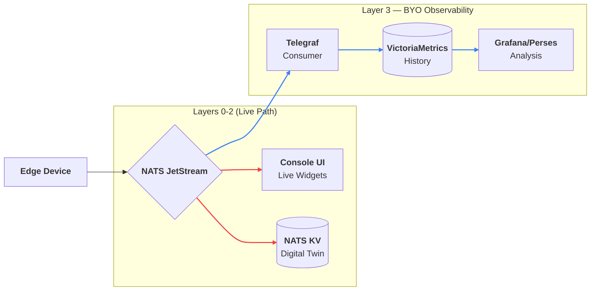

# Observability

Observability is **Layer 3** of the Stone-Age.io platform — the tier that answers questions about the past. While the substrate (Layer 0) handles live state, the rule engine (Layer 1) handles reflexes, and stream processors (Layer 2) handle real-time analytical computation, Layer 3 is the historical record. It's what lets you ask "what happened last Tuesday" or "how has this trended over the last month."

For the complete layer model and graduation criteria, see [Platform Layers](./platform-layers.md).

One of the core tenets of Stone-Age.io is the **"Bring Your Own" (BYO)** philosophy for long-term data storage. We focus on providing an excellent substrate and live-path experience, while leaving historical storage to industry-leading time-series databases that are optimized for exactly that job.

---

## 1. The "Bring Your Own" Philosophy

Traditional IoT platforms often bundle a time-series database directly into their core binary. This inevitably leads to architectural bloat, poor performance, and difficult maintenance.

**Stone-Age.io takes a different approach:**

- **Layers 0–2 (live path):** Focus on **present state** and **reflexive behavior**. They answer: *"What is happening right now? What should I do about it?"*
- **Layer 3 (BYO):** Focuses on **history and trends**. Answers: *"What happened last Tuesday? How has this changed over time?"*

Because all layers communicate through NATS subjects, Layer 3 is a **pure consumer**. It can fail, be taken offline for maintenance, or be entirely replaced — none of which affects the operational path of Layers 0–2.

---

## 2. The Suggested Stack 

If you do not have an existing observability stack, we recommend the following based on speed, simplicity, and efficiency. Each component below is its own single-binary process — you deploy them alongside your NATS cluster and they connect as NATS clients.

> **A turnkey reference deployment is on the roadmap.** We're planning to publish a "Stone-Age Reference Stack" — an opinionated Docker Compose (and/or systemd unit file) bundle that provisions the Control Plane, NATS, Nebula Lighthouse, rule-router, Telegraf, VictoriaMetrics, and Grafana with preconfigured dashboards, so teams who don't want to make architectural decisions on day one can get a complete working stack in one command. Until then, the sections below describe the pieces you'd assemble yourself.

### A. Telegraf 

**Telegraf** is a lightweight agent used for collecting and reporting metrics. In our ecosystem, it acts as the bridge between NATS and your database.

- **NATS Consumer:** Telegraf subscribes to your NATS subjects (e.g., `telemetry.>`) using a durable JetStream consumer, so nothing is lost during maintenance.
- **Parsing:** It converts NATS JSON payloads into metrics.
- **Output:** It pushes those metrics to your storage engine.

### B. VictoriaMetrics 

**VictoriaMetrics** is a high-performance, cost-effective, and scalable time-series database. It is fully compatible with the Prometheus API.

- **Operationally simple:** Like Stone-Age.io, VictoriaMetrics ships as a single binary and runs comfortably on modest hardware.
- **Retention:** Use it to store months or years of historical data.
- **Vmalert:** This component allows you to execute "recording rules" or "alerting rules" against historical data (e.g., *"Alert if the average temperature over the last 24 hours is 10% higher than the previous week"*).

### C. Perses.dev 

While the Stone-Age.io Platform Dashboard is perfect for operational control, **Perses** (or Grafana) is ideal for historical analysis.

- **Standardized:** Perses is an open-standard dashboard engine.
- **Deep Dives:** Use it to build long-term trend reports, heatmaps, and complex comparative charts from VictoriaMetrics.

---

## 3. Data Flow Architecture

A typical production pipeline follows this path:

1.  **Agent / Device:** Collects local metrics (CPU, Temp, etc.) and publishes to NATS.
2.  **NATS Cluster:** Routes the data to real-time UI widgets AND persistent JetStream.
3.  **Telegraf:** Acts as a JetStream consumer, pulling data from the bus at its own pace.
4.  **VictoriaMetrics:** Receives data from Telegraf via the remote-write protocol.
5.  **Perses/Grafana:** Queries VictoriaMetrics to render historical graphs.

**Why this is resilient:**
If your VictoriaMetrics server goes down for maintenance, the data stays safe in the **NATS JetStream**. Once the database is back online, Telegraf catches up from where it left off, ensuring no gaps in your history. The live path — dashboards, alerts, Layer 1 rules — is completely unaffected.

<center>

</center>

---

## 4. Example Telegraf Configuration

To begin ingesting data from the Data Plane, configure Telegraf with a NATS input:

```toml
[[inputs.nats_consumer]]
  ## NATS Servers to connect to
  servers = ["nats://nats.acme.io:4222"]
  
  ## Subjects to consume
  subjects = ["telemetry.>"]
  
  ## Use a durable queue group to ensure no data is missed
  queue_group = "telegraf_ingestor"
  
  ## Data format to expect from your Things/Agents
  data_format = "json"
  
  ## Map JSON fields to Telegraf tags/fields
  tag_keys = ["device_id", "location"]

[[outputs.http]]
  ## Push data to VictoriaMetrics
  url = "http://victoria-metrics:8428/api/v1/write"
```

---

## 5. Closing the Loop — Alerts From Historical Analysis

Layer 3 isn't just a read-only archive. Historical alerts (via vmalert or Grafana alerting) can publish *back* into NATS — typically by POSTing to the rule engine's Gateway feature — where Layer 1 rules pick them up and route them like any other event.

This completes the loop:

1.  Events flow out from devices (Layer 0) through Layer 1 rules and Layer 2 stream processors to Telegraf and into VictoriaMetrics (Layer 3).
2.  Vmalert or Grafana evaluates alerting rules against historical data.
3.  Alert notifications are POSTed to the rule engine's Gateway feature.
4.  A Layer 1 rule translates the inbound webhook into a NATS event on a well-defined subject.
5.  Existing alert-routing rules (Slack, PagerDuty, etc.) handle the event just like any other alert.

Your alerting pipeline — short-term and long-term — converges on the same subject contracts. You don't maintain two separate notification systems.

---

## 6. Summary

By decoupling observability from the core platform, Stone-Age.io stays:

1.  **Fast:** The core binary is not bogged down by heavy disk I/O.
2.  **Flexible:** You can switch from VictoriaMetrics to InfluxDB, Snowflake, or SQL without changing any code in Layers 0–2. The subject contracts stay stable; only the Layer 3 consumer changes.
3.  **Scalable:** You can scale your storage independently of your Control Plane as your device count grows.
4.  **Resilient:** Layer 3 failures never affect Layers 0–2. The operational pipeline keeps running; only historical recency lags until the TSDB returns.

For the layer model in full, see [Platform Layers](./platform-layers.md). For the Layer 1 alerting patterns that hand off to Layer 3, see [Automation](./automation.md).
