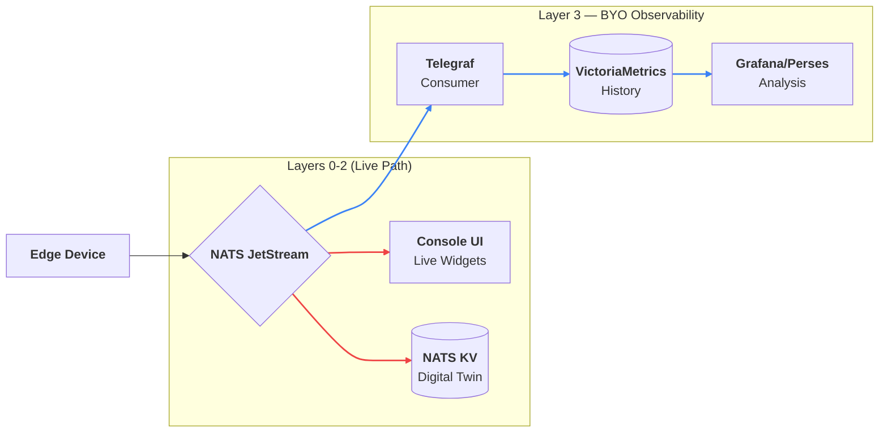

# Observability

Observability is **Layer 3** of Stone-Age.io. It answers questions about the
past, such as "what happened last Tuesday" or "how has this changed over the
last month". Layers 0 to 2 handle the present. See
[Platform Layers](./platform-layers.md).

Stone-Age.io does not bundle a time-series database. You bring your own, and it
reads your telemetry from NATS.

---

## 1. Bring Your Own Storage

- **Layers 0 to 2 (live path)** handle **present state** and reactions: "what
  is happening now, and what should I do about it?"
- **Layer 3 (your choice)** handles **history and trends**: "what happened last
  Tuesday, and how has it changed?"

All layers talk through NATS subjects, so Layer 3 **only reads**. You can stop,
maintain or replace it, and Layers 0 to 2 keep running.

> **This page is about your telemetry, not the platform's own health.** The binaries report their own health on `GET /api/ready` and `GET /metrics`, with no auth and no NATS connection. The same Prometheus-compatible stack below can scrape them. See [Health & Metrics](./health-metrics.md).

> **The audit log is separate.** Layer 3 holds the history of your *telemetry*. The history of *administrative changes*, such as who created a Thing or rotated a credential, is in the Control Plane, in two collections:
>
> - `audit_logs`: the forensic record. It keeps the names of the fields each change touched, and old and new values for an allowlist of collections with no credentials. Only **Platform Operators** can read it.
> - `activity`: an org-scoped feed of actor, action and record, with no values. Every role can read it.
>
> Set audit retention with `audit.retention` in `config.yaml` ([Configuration §2](./configuration.md#2-section-reference)). See [Authorization §5](./authorization.md#5-two-histories-the-audit-log-and-the-activity-feed). Do not use your TSDB for an admin-change audit trail.

---

## 2. The Suggested Stack

If you have no observability stack yet, we suggest these tools. Each is its own
binary. Deploy them beside your NATS cluster, and they connect as NATS clients.

### A. Telegraf

**Telegraf** is a small agent that collects and reports metrics. Here it moves
data from NATS into your database.

- **NATS consumer:** Telegraf subscribes to your NATS subjects (for example
  `telemetry.>`) as a normal NATS client, with a `.creds` file. Each
  organization's account is one tenant, so run one Telegraf process per
  organization.
- **Parsing:** it converts JSON payloads into metrics.
- **Output:** it writes the metrics to your storage.

### B. VictoriaMetrics

**VictoriaMetrics** is a time-series database compatible with the Prometheus
API.

- **Simple to run:** one binary, on modest hardware.
- **Retention:** keeps months or years of history.
- **vmalert:** runs recording and alerting rules on history, for example
  *"alert if the 24-hour average temperature is 10% above last week's"*.

### C. Perses.dev

The console's dashboards are for live operation. **Perses** (or Grafana) is for
historical analysis.

- **Open standard:** Perses is an open-standard dashboard engine.
- **Analysis:** build long-term trend reports, heatmaps and comparison charts
  from VictoriaMetrics.

---

## 3. Data Flow Architecture

1. **Agent or device:** collects local metrics (CPU, temperature and so on) and
   publishes to NATS.
2. **NATS cluster:** sends the data to live widgets, and into a JetStream stream
   if one covers the subject.
3. **Telegraf:** subscribes to the subjects and parses each message into
   metrics.
4. **VictoriaMetrics:** receives the data from Telegraf as InfluxDB line
   protocol.
5. **Perses or Grafana:** queries VictoriaMetrics for historical graphs.

**What happens in an outage:**

- **The TSDB goes down.** Telegraf keeps collecting and holds a limited buffer
  in memory (`metric_buffer_limit`), which it writes when the database returns.
  Past that limit it drops the oldest metrics, so a long outage leaves a gap.
- **Telegraf goes down.** A plain subscription, like the example below, misses
  everything published while it was down, because core NATS stores nothing for
  an absent subscriber. For history with no gaps, put a JetStream stream over
  those subjects and read from the stream, so the stream's retention covers the
  outage. Telegraf's `nats_consumer` plugin has JetStream options for this.
  Check its documentation for your version before you rely on them.
- **In both cases, the live path (dashboards, alerts, Layer 1 rules) is not
  affected.**


```mermaid
flowchart LR
    Source["<b>Edge Device</b>"] 
    
    subgraph Platform ["Layers 0-2 (Live Path)"]
        Bus{"<b>NATS JetStream</b>"}
        UI["<b>Console UI</b><br/>Live Widgets"]
        KV[("<b>NATS KV</b><br/>Digital Twin")]
    end

    subgraph BYO ["Layer 3 — BYO Observability"]
        Telegraf["<b>Telegraf</b><br/>Consumer"]
        TSDB[("<b>VictoriaMetrics</b><br/>History")]
        Grafana["<b>Grafana/Perses</b><br/>Analysis"]
    end

    %% Flow
    Source --> Bus
    
    %% Hot Path
    Bus --> UI
    Bus --> KV
    
    %% Cold Path
    Bus --> Telegraf
    Telegraf --> TSDB
    TSDB --> Grafana

    class Bus,UI,KV platform;
    class Telegraf,TSDB,Grafana byo;
    
    %% Hot Path Styling (Red)
    linkStyle 1 stroke:#ef4444,stroke-width:2px;
    linkStyle 2 stroke:#ef4444,stroke-width:2px;
    
    %% Cold Path Styling (Blue)
    linkStyle 3 stroke:#3b82f6,stroke-width:2px;
    linkStyle 4 stroke:#3b82f6,stroke-width:2px;
    linkStyle 5 stroke:#3b82f6,stroke-width:2px;
```

---

## 4. Example Telegraf Configuration

Configure Telegraf with a NATS input and a VictoriaMetrics output:

```toml
[[inputs.nats_consumer]]
  ## NATS Servers to connect to
  servers = ["nats://nats.acme.io:4222"]

  ## The server runs in operator mode, so Telegraf needs a credential.
  ## Create a NATS user for it in the organization and download its .creds.
  ## It only subscribes, so give it a role with no publish rights.
  credentials = "/etc/telegraf/acme-telegraf.creds"

  ## Subjects to consume. One input is one NATS connection, and connections
  ## count against the organization's account limit, so list every reading
  ## subject here rather than adding a second input.
  subjects = ["temp-probe.*.temperature", "temp-probe.*.battery"]

  ## Only matters if you run more than one Telegraf against this account:
  ## instances sharing a queue group split the load instead of duplicating it.
  ## It does not make the subscription durable.
  queue_group = "telegraf-acme"

  ## Data format to expect from your Things/Agents
  data_format = "json"

## The Thing's code, out of the subject. On the default layout,
## {thing_type_code}.{thing}.{operation}, it is the second token.
[[processors.regex]]
  [[processors.regex.tags]]
    key = "subject"
    pattern = '^[^.]+\.(?P<thing>[^.]+)\.'

[[outputs.http]]
  ## VictoriaMetrics accepts InfluxDB line protocol and turns
  ## `measurement,tags field=value` into `measurement_field{tags}`.
  url = "http://victoria-metrics:8428/influx/write"
  data_format = "influx"
  tagexclude = ["subject"]
```

Use `outputs.http`, not `outputs.influxdb`. The InfluxDB output adds a `db=`
parameter to every write, and VictoriaMetrics turns it into a constant `db`
label on every series. The platform repository has a full working example in
`demo/telegraf/`.

**Readings have a `thing` tag and no location.** A code never changes, but a
location can. A `location` tag written at ingestion would never change, so a
moved Thing's history would stay at the old site, and a location fix would not
reach stored readings. Instead, location comes from the inventory at query time
(next section).

---

## 5. Where Things Are: Joining Against the Inventory

Long-term charts need a legend such as "Dock 3 camera", not `CA-9KD-4PX`, and
they need to group by site. That data is in the platform, not in the reading.
[ADR 0004](decisions/0004-long-term-data-and-location-path.md) puts it into the
TSDB as two **info series**: one series per record, value `1`, with the
record's details as labels.

| Series | Labels |
|---|---|
| `stone_thing_info` | `thing`, `name`, `thing_type`, `location`, `location_path` |
| `stone_location_info` | `location`, `name`, `location_type`, `location_path` |

`location_path` is the Location's [path](platform-ui-entities.md#2-locations):
its code and each ancestor's, from the root down, such as `/KC/BD-3/RM-204/`.

### The pipeline

It runs inside the tenant's own account, with tools the tenant already runs. It
needs no platform route and no new kind of credential:

```
nats-auth-manager ──► KV tokens.pocketbase           signs in as a viewer, keeps the token fresh
rule-router, every minute:
    GET the standard list API ──► inventory.things, inventory.locations
rule-router, on each: forEach item, merge {"info": 1}
    ──► inventory.thing.<code>, inventory.location.<code>
Telegraf ──► VictoriaMetrics                           stone_thing_info, stone_location_info
```

- **One viewer service login per organization.** Every list rule scopes by the
  current organization, so the poll needs no filter. The token can read the
  inventory and change nothing.
- **The whole inventory goes out every minute.** Nothing keeps state. The next
  poll covers a missed one, and a moved Thing shows its new location within a
  minute.
- **The platform repository has a working copy** in `demo/inventory/`, with its
  own README.

### The join

```
avg by (location) (
  thing_celsius
    * on(org, thing) group_left(name, location, location_path)
      (stone_thing_info @ end())
)
```

Join on `(org, thing)`, because a code is unique only in its organization.
`@ end()` reads the inventory once, at the end of the range, and applies it to
every reading in the range:

- **Moving a Thing loses no readings.** Only the place they are attributed to
  follows the Thing.
- **Corrections apply to the past.** Fix a wrong location, and every past
  reading gets the right one.

The default does not answer "where was it on Tuesday". If a Thing's past
location matters, as for a trailer, it should report its location in its own
payload, as data in the reading.

| Want | How |
|---|---|
| Everything under one place | `stone_thing_info{location_path=~".*/KC/.*"}` in the join. PromQL regexes match the whole value, so put `.*` at each end. |
| One line per location inside it | The same, inside `avg by (location)`. |
| Buildings side by side | A variable from `label_values(stone_location_info{location_type="building"}, location)` and a repeated panel, each filtering by path. |

### Limits to know

- **A move takes up to a minute to show**, the poll interval.
- **For a few minutes after a move, a panel whose range ends now can fail** with
  a duplicate-series error. Until the old info series goes stale, two series
  match the Thing. The error clears by itself.
- **One poll returns at most 1000 records** (PocketBase's page limit). The demo's
  guard rule publishes on `inventory.truncated` when an organization has more.
  Beyond that, the feed needs paging.
- **The token bucket holds a live PocketBase token.** Anything in the account
  that can read KV can use it, so the login must be a viewer. A subject deny
  does not fully stop a role that has `$JS.API.>`, because that role can source
  the bucket into its own stream.

---

## 6. Alerts From Historical Analysis

Historical alerts (from vmalert or Grafana alerting) can publish back into
NATS, usually by POSTing to the rule engine's gateway. Layer 1 rules then route
them like any other event.

1. Events go from devices (Layer 0) through Layer 1 rules and Layer 2 stream
   processors to Telegraf and VictoriaMetrics (Layer 3).
2. vmalert or Grafana evaluates alert rules on the history.
3. The alert is POSTed to the rule engine's gateway.
4. A Layer 1 rule turns the webhook into a NATS event on a known subject.
5. Your existing alert-routing rules (Slack, PagerDuty and so on) handle it like
   any other alert.

Live and historical alerts use the same subjects, so you keep one notification
system.

---

## 7. Where to Go Next

- The layer model: [Platform Layers](./platform-layers.md)
- Layer 1 alert patterns: [Automation](./automation.md)
- The platform's own readiness checks and metrics, a second `scrape_config` on
  the same stack: [Health & Metrics](./health-metrics.md)
