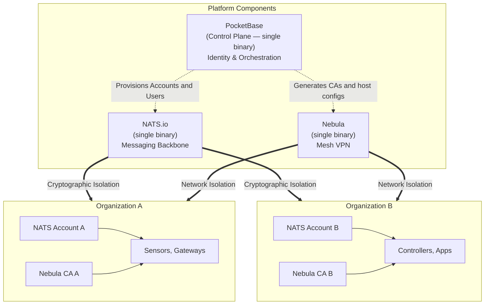

# Overview

The Stone-Age.io Platform is a comprehensive toolkit designed to build, manage, and scale private IoT and Event-Driven Architecture (EDA) applications. Each component is a single binary, composable over a shared NATS substrate — no service mesh, no orchestrator required.

By combining the simplicity of a monolithic control plane with the power of modern messaging and mesh networking, the platform provides a "Control Plane in a Box" for organizations that want to build and manage distributed infrastructure without the overhead of cloud-locked microservices.

---

## The Problem: Brittle & Complex Infrastructure

Current IoT and edge computing solutions typically fall into two categories:

1. **The Cloud Trap:** Heavy vendor lock-in with proprietary APIs, unpredictable egress costs, and the requirement that data must leave your premises to be useful.
2. **The Microservices Swamp:** Fragile stacks consisting of a dozen different open-source tools (VPNs, MQTT brokers, databases, auth services) that are difficult to secure, maintain, and multi-tenant.

## The Solution: The Modern Radio Network Analogy

Think of the Stone-Age.io Platform like a **modern digital radio network**.

In the past, a System Integrator would build out physical radio towers (infrastructure) and provide radios (things) to their customers. Each customer could have their own private channel (multi-tenancy) but share the same reliable backbone.

The Stone-Age.io Platform applies this concept to the modern edge:

- **The Towers:** NATS and Nebula provide the resilient airwaves and secure tunnels.
- **The Channels:** NATS Accounts and Subjects provide isolated logic for different tenants.
- **The Radios:** Devices and Applications that can speak NATS, MQTT, or even just plain HTTP.
- **The Dispatcher:** The Stone Age Console (powered by PocketBase) orchestrates the entire system from a single pane of glass.
- **The Control Room:** The rule engine provides live reflexes — routing traffic, triggering alerts, managing state, handling webhooks, firing scheduled tasks.
- **The Production Studio:** Stream processors (eKuiper, Benthos) take raw broadcasts and produce polished analytical content.
- **The Archive:** Your chosen time-series database keeps the historical record for analysis and reporting.

Each piece has a distinct job. Each uses the same airwaves. You can run just the towers and radios for pure messaging, or add the control room for automation, or stack the full set — production studio and archive included — for a complete event-driven architecture.

See [Platform Layers](./platform-layers.md) for the architectural picture of how these pieces compose into distinct tiers, and how to graduate from one to the next as your needs grow.

## Target Audience

- **Managed Service Providers (MSPs):** Build your own branded RMM (Remote Monitoring and Management) or IoT platform for hundreds of clients using a single deployment.
- **System Integrators (SIs):** Deploy reliable, edge-first logic for smart buildings, industrial automation, or fleet management.
- **Enterprise IT:** Manage internal distributed infrastructure across multiple buildings/offices/factories or cloud providers while maintaining absolute data sovereignty.

## Key Value Propositions

### 1. Each Component is a Single Binary

Stone-Age.io is not one monolithic executable — it's a small set of independent components, each delivered as a single binary with zero external runtime dependencies.

- **The Control Plane** (PocketBase + embedded UI + provisioning hooks) is one binary.
- **The rule engine** (`rule-router`) is another.
- **The Agent** is another.
- **NATS** and **Nebula** are their own upstream binaries.
- **Stream processors** (eKuiper, Benthos, custom) and **Layer 3 components** (Telegraf, TSDB) are additional single-binary components you add only when you need them.

Each component communicates with the others through NATS subjects. There's no service mesh to configure, no Docker Compose hell, no Kubernetes cluster to stand up just to get off the ground. Deploy each binary where it belongs — the Control Plane centrally, the Agent at the edge, the rule engine wherever makes operational sense — and let NATS handle the wiring.

### 2. Built-in Multi-Tenancy

Multi-tenancy is the foundational core. Every Organization created in the UI automatically provisions an isolated **NATS Account** and a private **Nebula Certificate Authority (CA)**. Data and network isolation are enforced at the infrastructure level.

### 3. Edge-First Connectivity

By leveraging **NATS.io** for messaging and **Nebula** for overlay networking, the platform excels in unreliable environments. Things connect via outbound-only traffic, punching through firewalls and CGNATs (LTE/5G/Satellite/etc.) without requiring complex port forwarding or static IPs.

### 4. Principled Layering, Not Feature Sprawl

The platform is explicitly structured as a Control Plane and a four-layer Data Plane (substrate, declarative event logic, stream processing, long-term storage). Each layer has a clear job and a clear graduation path to the next. You never hit a wall where you need to rewrite — you add the next layer when you need it, and it consumes from the same NATS subjects the previous layer was using. See [Platform Layers](./platform-layers.md) for the detail.

### 5. No Vendor Lock-in

The Stone-Age.io Platform is built on top of standard, industry-proven protocols. Your data lives in a local SQLite database, your messages travel over NATS, and your long-term metrics are handled by whatever time-series database you choose (e.g., VictoriaMetrics, InfluxDB, Postgres). You own the stack from top to bottom.

### 6. Designed to Be Understood

Complexity is the enemy of reliability. The platform is built so that a single engineer can hold the moving parts in their head: clear Go code, reactive Vue components, and straightforward YAML rules. Where we'd have to choose between a clever abstraction and a readable one, we pick readable.
