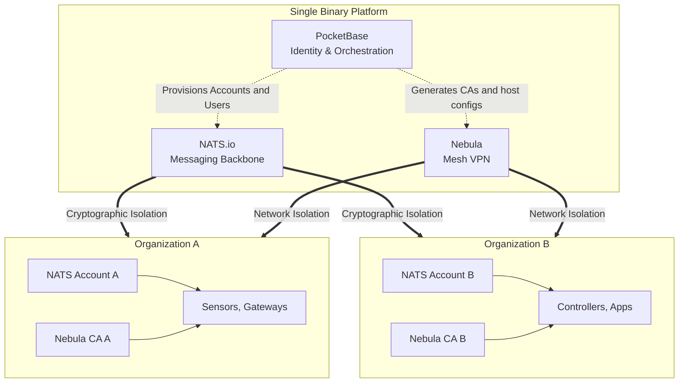

# Overview

The Stone-Age.io Platform is a comprehensive, single-binary toolkit designed to build, manage, and scale private IoT and Event-Driven Architecture (EDA) applications. 

By combining the simplicity of a monolithic backend with the power of modern messaging and mesh networking, the platform provides a "Control Plane in a Box" for organizations that want to build, and  manage distributed infrastructure without the overhead of cloud-locked microservices.

---

## The Problem: Brittle & Complex Infrastructure

Current IoT and edge computing solutions typically fall into two categories:

1. **The Cloud Trap:** Heavy vendor lock-in with proprietary APIs, unpredictable egress costs, and the requirement that data must leave your premises to be useful.
2. **The Microservices Swamp:** Fragile stacks consisting of a dozen different open-source tools (VPNs, MQTT brokers, databases, auth services) that are difficult to secure, maintain, and multi-tenant.

For Managed Service Providers (MSPs) and System Integrators (SIs), these hurdles make it difficult to offer a professional, private, and scalable platform to their customers.

## The Solution: The Moden Radio Network Analogy

Think of the Stone-Age.io Platform like a **modern digital radio network**. 

In the past, a System Integrator would build out physical radio towers (infrastructure) and provide radios (things) to their customers. Each customer could have their own private channel (multi-tenancy) but share the same reliable backbone.

The Stone-Age.io Platform applies this concept to the modern edge:

- **The Towers:** NATS and Nebula provide the resilient airwaves and secure tunnels.
- **The Channels:** NATS Accounts and Subjects provide isolated logic for different tenants.
- **The Radios:** Devices and Applications that can speak NATS, MQTT, or even just plain HTTP.
- **The Dispatcher:** The Stone Age Console (powered by PocketBase) orchestrates the entire system from a single pane of glass.

## Target Audience

- **Managed Service Providers (MSPs):** Build your own branded RMM (Remote Monitoring and Management) or IoT platform for hundreds of clients using a single deployment.
- **System Integrators (SIs):** Deploy reliable, edge-first logic for smart buildings, industrial automation, or fleet management.
- **Enterprise IT:** Manage internal distributed infrastructure across multiple buildings/offices/factories or cloud providers while maintaining absolute data sovereignty.

## Key Value Propositions

### 1. Single Binary Simplicity

Built on top of **PocketBase**, the entire platform (database, identity, API, and embedded UI) is delivered as a single executable binary. Use it however you want, bare metal, Docker, Kubernetes etc. No built in Docker-compose hell, no complex database migrations, and no "it works on my machine" deployment bugs.

### 2. Built-in Multi-Tenancy

Multi-tenancy is the foundational core. Every Organization created in the UI automatically provisions an isolated **NATS Account** and a private **Nebula Certificate Authority (CA)**. Data and network isolation are enforced at the infrastructure level.

### 3. Edge-First Connectivity

By leveraging **NATS.io** for messaging and **Nebula** for overlay networking, the platform excels in unreliable environments. Things connect via outbound-only traffic, punching through firewalls and CGNATs (LTE/5G/Satellite/etc.) without requiring complex port forwarding or static IPs.

### 4. No Vendor Lock-in

The Stone-Age.io Platform is built on top of standard, industry-proven protocols. Your data lives in a local SQLite database, your messages travel over NATS, and your long-term metrics are handled by whatever time-series database you choose (e.g., VictoriaMetrics, InfluxDB, Postgres). You own the stack from top to bottom.

### 5. Grug-Brained Development

We believe complexity is the enemy of reliability. Stone-Age.io is designed to be understood by a single human. We prefer clear Go code, reactive Vue components, and straightforward YAML rules over abstract magic and sprawling service meshes.
