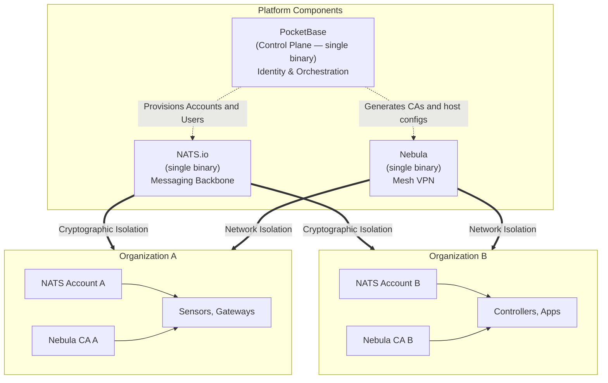

# Overview

Every site you manage, on one screen — and the equipment on those sites keeps
whatever it already is. Door controllers, cameras, kiosks, sensors and machines
reach the same bus whether they speak NATS, MQTT or HTTP, so a customer's
installed base is the thing you start from rather than the thing you replace.

Mechanically, that is one HTTP API for the things and places you manage, which
also mints the credentials those things use to reach each other. Around it sits a
small set of independent components — each a single binary, composable over a
shared NATS substrate, with no service mesh and no orchestrator required.

You can use it as a plain multi-tenant inventory and stop there, or grow it into
a complete private IoT and Event-Driven Architecture. See
[Start Where You Need To](./index.md#start-where-you-need-to) for the four depths
and where each one ends.

---

## What We Call Things

The docs use these eight names precisely. They are not interchangeable, and mixing them up is the fastest way to misread an architecture diagram.

| Name | What it means | What it is *not* |
| :--- | :--- | :--- |
| **Stone-Age.io** (or "the platform") | The whole system: every component, plane, and layer together. | Not a single binary, and not any one component. |
| **Control Plane** | The management component — the `stone-age` binary. Identity, inventory, provisioning, and the API. | Not the whole platform, and not the UI. |
| **Stone Age Console** (or "the console") | The Vue web UI embedded in the Control Plane binary. | Not the security boundary — it renders what the API rules already permit. |
| **`stone`** | The client CLI you run from a laptop or CI runner. | Not the server. See [Stone CLI](./stone-cli.md) for the `stone` vs `stone-age` distinction. |
| **Data Plane** | The runtime: NATS, JetStream, KV, and Nebula. Organized internally as [four layers](./platform-layers.md). | Not managed *by* the Control Plane at runtime — it is provisioned by it, then runs independently. |
| **NATS Operator** | The root key and JWT of the NATS trust chain. The Control Plane holds it and signs every organization's NATS Account with it. Config key: `operator_name`. | Not a person. Nobody signs in as the NATS Operator. |
| **Platform Operator** | A human user account with `is_operator = true`. Creates and edits Organizations, invites users into any org, reads the audit log. | Not a tenant role — it is a flag on the user, independent of any Membership. Not the NATS Operator key. |
| **the provider** | Whoever runs this deployment for its tenants — an MSP, an integrator, or an internal IT group. | Not a record in the database. The provider's *own* organization is the one created by `--operator-org`. |

When this page says "the platform provides X," it means the system as a whole. When it says "the Control Plane does X," it means that specific binary.

**"Operator" always carries a qualifier in these docs** — **NATS Operator** for the key, **Platform Operator** for the person. Bare "operator" appears only inside literal identifiers you type or configure (`is_operator`, `operator_name`, `--operator-org`, `operator_jwt`), where it is the code's spelling rather than ours.

---

## The Problem: Tenancy Has to Hold in Four Places at Once

Building a private, multi-tenant IoT platform means assembling roughly the same four things every time: a message broker, an overlay network, an identity and inventory store, and somewhere to put the logic. Each is mature and none of them is the hard part.

The hard part is that **"customer A cannot see customer B" has to be true in all four simultaneously**, and each one models tenancy differently — or not at all. A broker has its own notion of a tenant, the VPN has another, the database has a `WHERE` clause, and the rule engine usually has nothing. The isolation you sell is only as strong as the weakest of the four, and nothing in the stack tells you when they have drifted apart. That drift is silent by construction: every component is behaving exactly as configured.

The usual escape is to buy a platform that owns all four — which works, and costs you egress fees, proprietary APIs, and the premise that your data has to leave the building to be useful.

!!! note "What this platform does *not* claim"
    Not that there are fewer moving parts. Run every layer and you have a Control Plane, a broker, an overlay network, an Agent at each site, a rule engine, a stream processor, a metrics agent and a time-series database — eight component types, which is not obviously better than the stack you would have assembled yourself.

    The claim is about **where the tenancy boundary lives**, and about being able to stop early and leave late. If you want the process count itself to go down, see §1 below — it has been going down.

## What the Platform Commits To

Four commitments, each of which is checkable rather than atmospheric.

**1. One tenancy boundary, provisioned once.** Creating an Organization mints an isolated **NATS Account** and a private **Nebula CA** in the same operation. Isolation is then cryptographic and enforced by the infrastructure: a NATS account is a closed subject namespace, so a tenant cannot reach across it whatever its permissions say, and a Nebula host cannot present a certificate another organization's CA will trust. There is no application-layer filter to forget — the boundary is not a query predicate, so it cannot drift from one.

**2. Depth is opt-in, and every depth is a real place to stop.** There are [four depths](./index.md#start-where-you-need-to), and most deployments sit at 2 or 3 indefinitely. The eight components above describe depth 4; the stream processor, the metrics agent and the TSDB are things you add when you have a question that needs them, not prerequisites for a working system.

    Be precise about what the early depths buy, though. Depth 1 is about what you **model**, not about running less: a depth-1 deployment still includes a NATS server, it simply has nothing on it yet. What you get is a working system before you have modeled a single subject, and the guarantee that none of it is rewritten when you do — each layer consumes the same subjects the previous one was already publishing.

**3. Nothing here is forked.** NATS and Nebula are the upstream projects, running as upstream builds. The platform provisions them and is otherwise an ordinary client of both — a site's leaf node is upstream `nats-server` reading a generated config, whether it runs as its own process or embedded in the Agent (the same upstream server, linked as a library). Your data is in SQLite, your messages are on NATS, your history is in a TSDB you chose. The exit path is that you keep all three and stop running the Control Plane.

**4. No orchestrator, and no service mesh.** Components find each other over NATS subjects. There is no control loop to operate, no sidecar, and nothing that needs Kubernetes to reach a working state.

## A Mental Model: The Modern Radio Network

The architecture is easier to hold onto with an analogy. Think of the platform as a **modern digital radio network**.

In the past, a System Integrator would build out physical radio towers (infrastructure) and provide radios (things) to their customers. Each customer could have their own private channel (multi-tenancy) but share the same reliable backbone.

The Stone-Age.io Platform applies this concept to the modern edge:

- **The Towers:** NATS and Nebula provide the resilient airwaves and secure tunnels.
- **The Channels:** NATS Accounts and Subjects provide isolated logic for different tenants.
- **The Radios:** Devices and Applications that can speak NATS, MQTT, or even just plain HTTP.
- **The Dispatcher:** The Control Plane issues the credentials and holds the inventory, and the Stone Age Console is the single pane of glass onto it. Note the limit of the analogy: a dispatcher talks on the air, and this one does not — the Control Plane provisions the fabric and then stays off it (see the Data Plane row above).
- **The Control Room:** The rule engine provides live reflexes — routing traffic, triggering alerts, managing state, handling webhooks, firing scheduled tasks.
- **The Production Studio:** Stream processors (eKuiper, Benthos) take raw broadcasts and produce polished analytical content.
- **The Archive:** Your chosen time-series database keeps the historical record for analysis and reporting.

Each piece has a distinct job. Each uses the same airwaves. You can run just the towers and radios for pure messaging, or add the control room for automation, or stack the full set — production studio and archive included — for a complete event-driven architecture.

```mermaid
graph TB
    subgraph Core["Platform Components"]
        PB["PocketBase<br/>(Control Plane — single binary)<br/>Identity & Orchestration"]
        NATS["NATS.io<br/>(single binary)<br/>Messaging Backbone"]
        NEB["Nebula<br/>(single binary)<br/>Mesh VPN"]
        
        PB -.->|"Provisions Accounts and Users"| NATS
        PB -.->|"Generates CAs and host configs"| NEB
    end
    
    subgraph OrgA["Organization A"]
        A_Acc["NATS Account A"]
        A_CA["Nebula CA A"]
        A_Dev["Sensors, Gateways"]
        
        A_Acc --> A_Dev
        A_CA --> A_Dev
    end
    
    subgraph OrgB["Organization B"]
        B_Acc["NATS Account B"]
        B_CA["Nebula CA B"]
        B_Dev["Controllers, Apps"]
        
        B_Acc --> B_Dev
        B_CA --> B_Dev
    end
    
    NATS ==>|"Cryptographic Isolation"| OrgA
    NATS ==>|"Cryptographic Isolation"| OrgB
    NEB ==>|"Network Isolation"| OrgA
    NEB ==>|"Network Isolation"| OrgB
```

See [Platform Layers](./platform-layers.md) for the architectural picture of how these pieces compose into distinct tiers, and how to graduate from one to the next as your needs grow.

## Target Audience

- **Managed Service Providers (MSPs):** Build your own branded RMM (Remote Monitoring and Management) or IoT platform, with each customer isolated in its own NATS account and Nebula CA. Note the Control Plane is a single-writer SQLite database and scales vertically — it is a low-traffic metadata store, and the device traffic never touches it — so size a deployment against the console and API load, not the fleet. There are no production deployments to quote figures from yet.
- **System Integrators (SIs):** Deploy reliable, edge-first logic for smart buildings, industrial automation, or fleet management.
- **Enterprise IT:** Manage internal distributed infrastructure across multiple buildings/offices/factories or cloud providers while maintaining absolute data sovereignty.

## Key Value Propositions

### 1. Each Component is a Single Binary

Stone-Age.io is not one monolithic executable — it's a small set of independent components, each delivered as a single binary with zero external runtime dependencies.

- **The Control Plane** (PocketBase + embedded UI + provisioning hooks) is one binary. `serve --nats` starts a NATS server inside it, so the shortest working deployment is *one* process, not two ([ADR 0001](./decisions/0001-embedded-nats-server.md)).
- **The rule engine** (`rule-router`) is another.
- **The Agent** is another — and with `nebula.enabled` it runs the site's Nebula host **in-process**, and with `nats.server_config` set it hosts the site's leaf `nats-server` in-process too, so an edge box can run one binary rather than a stack of them.
- **NATS** and **Nebula** are their own upstream binaries when you want them to be. Neither is forked or wrapped: run them standalone and the platform is a well-behaved client of both.
- **Stream processors** (eKuiper, Benthos, custom) and **Layer 3 components** (Telegraf, TSDB) are additional single-binary components you add only when you need them.

The direction of travel is worth stating, because it runs against the usual grain: the platform has been *removing* processes rather than adding them. NATS moved inside the Control Plane, Nebula and (optionally) the leaf NATS server moved inside the Agent, and a second edge binary (`leaf-sync`) was deleted outright rather than maintained.

Each component communicates with the others through NATS subjects. There's no service mesh to configure, no Docker Compose hell, no Kubernetes cluster to run just to get started. Deploy each binary where it belongs — the Control Plane centrally, the Agent at the edge, the rule engine wherever makes operational sense — and let NATS handle the wiring.

### 2. Built-in Multi-Tenancy

Multi-tenancy is the foundational core. Every Organization created in the UI automatically provisions an isolated **NATS Account** and a private **Nebula Certificate Authority (CA)**. Data and network isolation are enforced at the infrastructure level.

### 3. Edge-First Connectivity

The platform uses **NATS.io** for messaging and **Nebula** for overlay networking, which is what makes it work on unreliable links. Things connect with outbound-only traffic, crossing firewalls and CGNATs (LTE/5G/Satellite) with no port forwarding and no static IPs.

### 4. Principled Layering, Not Feature Sprawl

The platform is explicitly structured as a Control Plane and a four-layer Data Plane (substrate, declarative event logic, stream processing, long-term storage). Each layer has a clear job and a clear graduation path to the next. You never hit a wall where you need to rewrite — you add the next layer when you need it, and it consumes from the same NATS subjects the previous layer was using. See [Platform Layers](./platform-layers.md) for the detail.

### 5. No Vendor Lock-in

The Stone-Age.io Platform is built on top of standard, industry-proven protocols. Your data lives in a local SQLite database, your messages travel over NATS, and your long-term metrics are handled by whatever time-series database you choose (e.g., VictoriaMetrics, InfluxDB, Postgres). You own the stack from top to bottom.

### 6. Designed to Be Legible

Not "simple enough to hold in your head." It isn't — a system that spans a broker, an overlay network, a certificate authority and a multi-tenant API has real depth, and claiming otherwise would be the kind of comfortable statement this platform is supposed to correct rather than repeat.

What it aims at instead is **legibility: the system tells you why it is the way it is.**

- Architectural decisions are written down as [ADRs](./decisions/0001-embedded-nats-server.md), including the options that were rejected and what building it turned up that the design did not anticipate.
- Non-obvious constraints live next to the code that depends on them, not in tribal memory — why a NATS publish DENY must not be "tightened", why a rotation is three steps, why a certificate field cannot be validated client-side.
- Where we'd have to choose between a clever abstraction and a readable one, we pick readable.

**And when a claim turns out to be false, it is corrected in place rather than quietly deleted.** A console feature once shipped on the strength of a field that did not exist; the commit that removed it says so, and says why the wrong belief is worth keeping on the record. That is the property being claimed here — not that mistakes do not happen, but that the system's own history will tell you about them.
