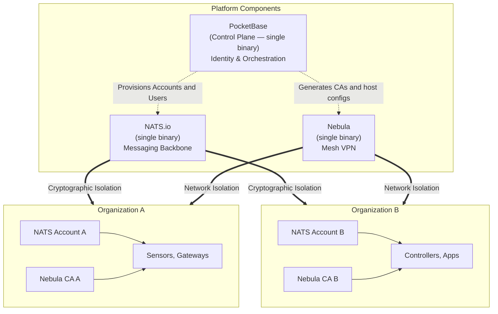

# Overview

Stone-Age.io is one HTTP API for the things and places you manage. The same API
mints the credentials those things use to reach each other. A small set of
independent components runs around it. Each is a single binary, and they
connect over NATS. There is no service mesh and no orchestrator.

The equipment on your sites stays as it is. Door controllers, cameras, kiosks,
sensors and machines reach the same bus over NATS, MQTT or HTTP.

You can use the platform as a multi-tenant inventory and stop there, or grow it
into a full private IoT and event-driven system. See
[Start Where You Need To](./index.md#start-where-you-need-to) for the four depths.

---

## What We Call Things

The docs use these eight names with exact meanings. Do not interchange them.

| Name | What it means | What it is *not* |
| :--- | :--- | :--- |
| **Stone-Age.io** (or "the platform") | The whole system: every component, plane and layer. | Not a single binary or component. |
| **Control Plane** | The management component, the `stone-age` binary. Identity, inventory, provisioning and the API. | Not the whole platform, and not the UI. |
| **Stone Age Console** (or "the console") | The Vue web UI inside the Control Plane binary. | Not the security boundary. It shows what the API rules already permit. |
| **`stone`** | The client CLI you run from a laptop or CI runner. | Not the server. See [Stone CLI](./stone-cli.md). |
| **Data Plane** | The runtime: NATS, JetStream, KV and Nebula, in [four layers](./platform-layers.md). | Not run by the Control Plane. The Control Plane provisions it, and then it runs on its own. |
| **NATS Operator** | The root key and JWT of the NATS trust chain. The Control Plane holds it and signs each organization's NATS Account with it. Config key: `operator_name`. | Not a person. Nobody signs in as the NATS Operator. |
| **Platform Operator** | A user account with `is_operator = true`. Creates and edits Organizations, invites users into any org, reads the audit log. | Not a tenant role. It is a flag on the user, separate from any Membership. |
| **the provider** | Whoever runs this deployment for its tenants: an MSP, an integrator or an internal IT group. | Not a database record. The provider's own organization is the one `--operator-org` creates. |

"The platform does X" means the whole system. "The Control Plane does X" means
that binary.

"Operator" always has a qualifier: **NATS Operator** for the key, **Platform
Operator** for the person. Bare "operator" appears only in identifiers you type
or configure, such as `is_operator`, `operator_name`, `--operator-org` and
`operator_jwt`.

---

## The Problem

A private, multi-tenant IoT platform needs the same four parts every time: a
message broker, an overlay network, an identity and inventory store, and a place
for the logic. Each part is mature.

The difficulty is that "customer A cannot see customer B" must be true in all
four at once, and each one models tenancy differently. The broker has its own
tenant model, the VPN has another, the database has a `WHERE` clause, and the
rule engine usually has none. Isolation is only as strong as the weakest part.
Nothing in the stack tells you when the four drift apart, because each part does
exactly what its configuration says.

The usual answer is a hosted platform that owns all four. That works, but you
pay egress fees, you use proprietary APIs, and your data must leave the building.

::: note What this platform does *not* claim
It does not claim fewer moving parts. With every layer running, you have a
Control Plane, a broker, an overlay network, an Agent at each site, a rule
engine, a stream processor, a metrics agent and a time-series database. That is
eight component types.

The claim is about where the tenant boundary lives, and about starting small and
leaving easily.
:::

---

## What the Platform Commits To

**One tenant boundary, provisioned once.** Creating an Organization mints an
isolated NATS Account and a private Nebula CA in the same operation. A NATS
account is a closed subject namespace, so a tenant cannot reach outside it,
whatever its permissions say. A Nebula host cannot present a certificate that
another organization's CA trusts. There is no application filter to forget.

**Adopt one depth at a time.** Most deployments stay at [depth](./index.md#start-where-you-need-to)
2 or 3. You add the stream processor, the metrics agent and the TSDB when a
question needs them. Each new layer reads the subjects the previous one already
publishes, so nothing gets rewritten.

**Nothing is forked.** NATS and Nebula are upstream builds. The platform
provisions them and is otherwise an ordinary client of both. A site's leaf node
is upstream `nats-server` with a generated config, as its own process or inside
the Agent. Your data is in SQLite, your messages are on NATS, and your history
is in a TSDB you chose. To leave, keep all three and stop running the Control
Plane.

**No orchestrator.** Components find each other over NATS subjects. There is no
control loop, no sidecar and no Kubernetes requirement.

```mermaid
graph TB
    subgraph Core["Platform Components"]
        PB["PocketBase<br/>(Control Plane — single binary)<br/>Identity & Orchestration"]
        NATS["NATS.io<br/>(single binary)<br/>Messaging Backbone"]
        NEB["Nebula<br/>(single binary)<br/>Mesh VPN"]
        
        PB -.->|"Provisions Accounts and Users"| NATS
        PB -.->|"Generates CAs and host configs"| NEB
    end
    
    subgraph OrgA["Organization A"]
        A_Acc["NATS Account A"]
        A_CA["Nebula CA A"]
        A_Dev["Sensors, Gateways"]
        
        A_Acc --> A_Dev
        A_CA --> A_Dev
    end
    
    subgraph OrgB["Organization B"]
        B_Acc["NATS Account B"]
        B_CA["Nebula CA B"]
        B_Dev["Controllers, Apps"]
        
        B_Acc --> B_Dev
        B_CA --> B_Dev
    end
    
    NATS ==>|"Cryptographic Isolation"| OrgA
    NATS ==>|"Cryptographic Isolation"| OrgB
    NEB ==>|"Network Isolation"| OrgA
    NEB ==>|"Network Isolation"| OrgB
```

---

## Components

Each component is a single binary with no external runtime dependencies.

- The Control Plane: PocketBase, the embedded console and the provisioning
  hooks. `serve --nats` starts a NATS server inside it, so the smallest working
  deployment is one process ([ADR 0001](./decisions/0001-embedded-nats-server.md)).
- The rule engine, `rule-router`.
- The Agent. With `nebula.enabled` it runs the site's Nebula host in-process.
  With `nats.server_config` set it also runs the site's leaf `nats-server`
  in-process, so an edge box can run one binary.
- NATS and Nebula, as their own upstream binaries when you want them separate.
- Stream processors (eKuiper, Benthos or your own), Telegraf and a TSDB, when
  you need them.

Run the Control Plane centrally, the Agent at the edge, and the rule engine
where it suits your operations. NATS connects them.

The Control Plane is a single-writer SQLite database and scales vertically. It
stores low-traffic metadata, and device traffic never reaches it. Size it for
console and API load, not for fleet size.

---

## Who It Is For

- **Managed service providers** who build their own branded RMM or IoT
  platform, with each customer in its own NATS account and Nebula CA.
- **System integrators** who deploy edge logic for smart buildings, industrial
  automation or fleet management.
- **Enterprise IT** teams who manage infrastructure across buildings, offices,
  factories or cloud providers and must keep their data under their own control.

---

## Designed to Be Legible

The platform spans a broker, an overlay network, a certificate authority and a
multi-tenant API, so it has real depth. The aim is that the system explains why
it is the way it is.

- [Decision records](./decisions.md) give the options we rejected and what
  implementation taught us.
- Constraints that are not obvious are documented next to the code that depends
  on them. Examples: why a NATS publish DENY must stay as it is, why a rotation
  takes three steps, and why the client cannot validate a certificate field.
- When we must choose between a clever abstraction and a readable one, we choose
  the readable one.
