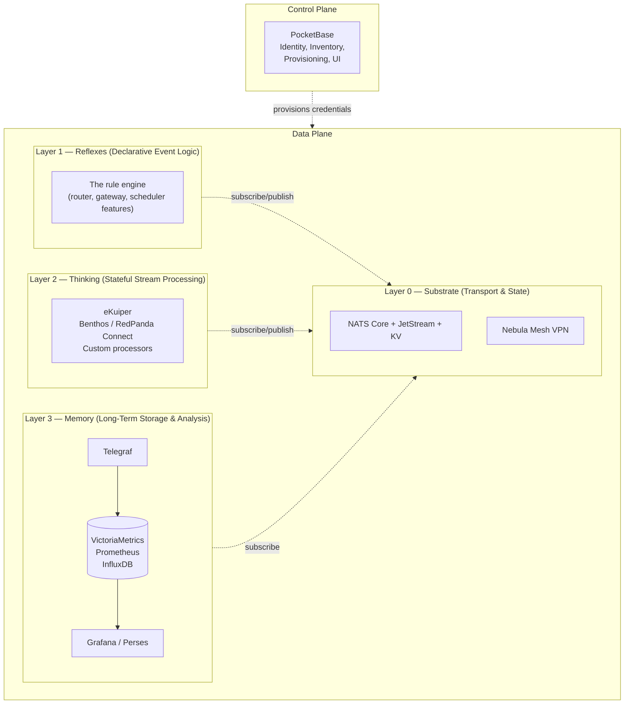
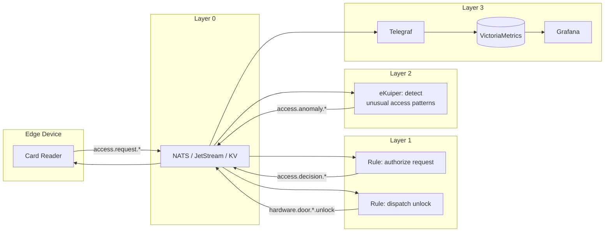

# Platform Layers

Stone-Age.io is not a single application with bundled features. It's a **layered platform** where each tier does one thing well, uses a shared substrate (NATS), and composes cleanly with the others.

Understanding the layers is the most useful mental model for working with the platform. It tells you where to solve each problem, when to reach for a different tool, and why the boundaries between components are principled rather than arbitrary.

---

## 1. Planes and Layers

Before introducing the layers, a quick clarification — the docs use two architectural framings that are often confused, but they describe different things and both are useful.

> **Planes describe *what the platform does*. Layers describe *how the runtime is composed*.**

- **The Control Plane** (PocketBase) is the management surface: identity, inventory, provisioning, the embedded UI. It's the source of truth for static and relational data — organizations, users, things, locations, credentials.
- **The Data Plane** (NATS, JetStream, KV, Nebula) is the runtime: every byte of telemetry, every command, every live state update flows through it.
- **The Data Plane is composed of four layers** (0–3). Layer 0 is the always-on substrate; Layers 1–3 are tiers you add as needed.
- **The Control Plane sits alongside the Data Plane**, not inside any layer. It provisions the identities and credentials that the Data Plane uses at runtime. PocketBase is itself a narrow NATS client on the System Account — it publishes credential updates on admin subjects like `$SYS.REQ.CLAIMS.UPDATE` so cluster state stays in sync with the Control Plane in real-time — but it does not participate in tenant-level event flow (telemetry, rule traffic, device commands).

This distinction matters. When something goes wrong with a PocketBase upgrade, the Data Plane keeps running and your devices keep talking. When a Layer 3 TSDB goes offline, the Control Plane and the rest of the Data Plane are unaffected. The planes separate management concerns from runtime concerns; the layers separate runtime concerns into composable tiers.

For the Control Plane ↔ Data Plane split in detail, see [Architecture](./architecture.md). The rest of this doc focuses on the four Data Plane layers.

---

## 2. The Four Layers

A concise way to remember the layers:

> **NATS is the bus. The rule engine is the reflexes. Stream processors are the thinking. Telegraf + TSDB is the memory.**

Each layer has a distinct job. Each is optional — you can run just Layer 0 for pure messaging, or Layers 0+1 for the vast majority of event-driven applications, or all four for full observability. None of the higher layers invalidate the lower ones; they compose.

---

## 3. Layer 0 — Substrate

**Components:** NATS Core, JetStream, NATS KV, Nebula.

The substrate is the always-on foundation. It handles message transport, durable streams, key-value state, and mesh networking. Every higher layer builds on these primitives.

**What lives here:**

- **Messaging.** Pub/sub, request/reply, MQTT bridging. Subjects are the universal address space every other layer speaks.
- **Durable state.** JetStream streams for "at-least-once" delivery, KV buckets for live state (the Digital Twin pattern — see [Architecture](./architecture.md)).
- **Connectivity.** Nebula mesh for secure, peer-to-peer edge connectivity with outbound-only traffic.

**Bootstrapped from the Control Plane.** Layer 0 isn't a component you install and point at PocketBase — it's produced by PocketBase. When you initialize the Control Plane, it generates the Operator JWT, System Account, resolver configuration, and `nats-server` config that you use to stand up the NATS server or cluster. Similarly, each Organization you create yields a Nebula CA that can issue host certificates. You can export these artifacts with a single command and run NATS (and Nebula Lighthouses) wherever you want — on the same host, on separate hosts, in a cluster, at the edge. See [Architecture](./architecture.md) for the component topology and [Getting Started](./getting-started.md) for the runnable commands.

**Provisioned and kept in sync by the Control Plane at runtime.** Once Layer 0 is running, PocketBase stays connected to NATS on the System Account and publishes credential and account updates (`$SYS.REQ.CLAIMS.UPDATE`) so the cluster reflects Control Plane changes in real-time — no restarts, no config reloads. Crucially, PocketBase does *not* participate in tenant-level event flow. No telemetry, no rules, no device commands. Its NATS traffic is narrow and administrative. Rule engines, stream processors, agents, and users see each other on the bus; they do not see PocketBase there.

**Key property:** A surprising number of use cases live entirely at Layer 0. If your need is "ingest telemetry from devices and display it in a dashboard," you're done after Layer 0. Pub/sub plus KV plus the Stone Age Console UI reading NATS over WebSockets covers it.

**You're at this layer when:**

- You're wiring up devices, services, or users to the NATS bus.
- You're configuring Nebula groups and firewall rules.
- You're writing widgets that subscribe to NATS subjects for live UI updates.
- You're setting up JetStream streams and KV buckets for persistence.

---

## 4. Layer 1 — Reflexes (Declarative Event Logic)

**Component:** The rule engine (`rule-router`) — a separate single-binary component with router, gateway, and scheduler features. Runs as its own process alongside NATS, independent of the Control Plane binary.

Layer 1 is where you express *rules* — declarative, stateless-per-message event transformations with conditions and actions. This is the layer that distinguishes a messaging bus from a platform.

**What the rule engine does well:**

- **Trigger-Condition-Action logic.** "When a message arrives on subject X matching condition Y, publish to subject Z (or call a webhook)."
- **Multiple trigger types.** NATS subjects (router feature), HTTP requests (gateway feature), and cron schedules (scheduler feature) all use the same YAML rule syntax.
- **Stateless routing and filtering.** Route a subset of events to a specialized subject; reject malformed messages; add metadata.
- **Enrichment via KV lookups.** Hydrate a sparse event with context from a KV bucket. Sub-microsecond cached lookups mean you can chain several without noticing.
- **Stateful patterns using KV as state.** Alarm deduplication, presence tracking via TTL, debounce windows, rate limiting. The *rule* is stateless; the *state* lives in KV. See [Automation](./automation.md) for the canonical patterns.
- **HTTP ingress and egress.** The gateway feature translates webhooks into NATS messages (inbound) and calls external APIs in response to NATS events (outbound, with retry).
- **Cron-based publishing.** The scheduler feature fires on a cron expression and publishes to NATS or HTTP.

**What the rule engine is not for:**

This is the most important paragraph in this doc. Be upfront about what doesn't fit at Layer 1:

- **Windowed aggregations.** "Average temperature per sensor over the last 5 minutes." You could force this into the rule engine with KV-based accumulator keys, but you'd be fighting the tool.
- **Stream-to-stream joins.** Correlating two different event streams by a common key and time window.
- **Retractable computation.** Aggregations whose intermediate results can change as late data arrives.
- **Complex multi-step workflows with branching state.** Orchestration of a sequence of decisions and external calls where each step's outcome affects what happens next.
- **Transactional database operations.** The rule engine publishes; it doesn't coordinate two-phase commits.

When you find yourself trying to do one of these, that's a signal to reach for Layer 2. The graduation path is clean: the stream processor consumes from and publishes back to the same NATS subjects your rules watch, and the two coexist peacefully.

**You're at this layer when:**

- You're writing a YAML rule that says "when X happens, do Y."
- You're using KV to track state that rules read and write.
- You're integrating an external service via webhook (inbound or outbound).
- You're scheduling cron-based publishes (reports, batch commands, periodic syncs).

---

## 5. Layer 2 — Thinking (Stateful Stream Processing)

**Components:** eKuiper, Benthos / RedPanda Connect, Wombat, or any stream processor that can consume from and publish to NATS.

Layer 2 is where genuinely stateful computation happens — the kind that needs to maintain sliding windows, aggregate across events, join streams, and handle retraction of intermediate results.

**What stream processors do well:**

- **Time-window aggregations.** Tumbling, sliding, and session windows over streams of events.
- **Joins.** Correlating two streams by key within a time window.
- **Continuous queries.** SQL-like expressions that continuously evaluate over streams rather than finite tables.
- **Built-in windowing and retraction semantics.** Proper handling of late-arriving events and intermediate result updates.
- **Rich operator libraries.** Filters, projections, enrichments, CEP (complex event processing) operators that would be tedious to express declaratively.

**The handoff from Layer 1 to Layer 2:**

The key insight is that Layer 2 doesn't replace Layer 1 — it *extends* it. A typical pattern looks like this:

1. Layer 1 rules watch raw incoming events and do stateless filtering, enrichment, and routing.
2. Filtered/enriched events land on a dedicated NATS subject.
3. A Layer 2 pipeline (e.g., eKuiper) subscribes to that subject, does windowed aggregation, and publishes results to another subject.
4. Layer 1 rules react to those aggregated results — firing alerts, updating KV state, calling webhooks.

Neither layer has to know about the other's implementation. They speak the same language: NATS subjects.

**You're at this layer when:**

- The problem description contains the phrase "over the last N minutes" or "in a sliding window."
- You're joining two streams by a common key.
- You've tried to express the logic in the rule engine and it's gotten awkward.
- You need SQL-like query semantics over event streams.

**Which stream processor should I use?**

Stone-Age.io has no opinion here. They all consume from and publish to NATS cleanly:

- **eKuiper** — lightweight, SQL-based, runs at the edge. Good fit for IoT-shaped problems.
- **Benthos / RedPanda Connect / Wombat** — declarative YAML pipelines, huge connector library, good for data plumbing between systems.
- **Custom processors** — if your domain has specialized needs, writing a small Go service that consumes from NATS and publishes results is completely idiomatic.

Pick the one whose configuration style matches your team's preferences. The substrate doesn't care.

---

## 6. Layer 3 — Memory (Long-Term Storage & Analysis)

**Components:** Telegraf (or equivalent), VictoriaMetrics / Prometheus / InfluxDB, Grafana / Perses.

Layer 3 answers questions about the past. It's the historical record, the trend analysis, the "what happened last Tuesday" layer.

**What Layer 3 does well:**

- **Long-term retention.** Months to years of historical telemetry at sustainable storage cost.
- **Trend queries.** "Show me the 30-day moving average of CPU usage across the warehouse sensors."
- **Historical alerting.** "Alert if this week's average is 10% higher than last week's."
- **Rich visualization.** Grafana and Perses provide a visualization ecosystem that's hard to match in a custom UI.

**The handoff from lower layers:**

Layer 3 is a pure consumer of NATS subjects. Telegraf subscribes to telemetry streams (using a durable JetStream consumer so nothing is lost during maintenance) and writes to a TSDB. The TSDB is queried by Grafana or Perses.

Critically, Layer 3 failures never affect Layers 0–2. If VictoriaMetrics is down for maintenance, data continues flowing on NATS; JetStream retains it; Telegraf catches up when the TSDB returns. Your dashboards lose recency, but your operational pipeline does not.

**You're at this layer when:**

- The question starts with "what happened..." rather than "what's happening..."
- You're building reports, dashboards, or alerts that span days, weeks, or months.
- You need SQL or PromQL-like expressiveness for historical analysis.
- You're handing data to analysts, auditors, or compliance tooling.

**BYO philosophy:**

The platform's [Observability](./observability.md) doc goes deeper on this, but the short version: Stone-Age.io deliberately does not bundle a time-series database. We provide the substrate and the patterns; you pick the TSDB that matches your operational and financial constraints. The subject contracts stay stable — you can swap VictoriaMetrics for InfluxDB, Postgres, or Snowflake without changing anything at Layers 0–2.

---

## 7. Graduation Criteria — Which Layer Solves My Problem?

When you have a problem in hand, use this decision tree:

1. **Is it about moving bytes from A to B, or managing identity/inventory?** → Layer 0 (Data Plane) or Control Plane.
2. **Can I describe the logic as "when X, check Y, do Z"?** → Layer 1.
3. **Does the logic need state that persists only briefly, and can I express it with KV?** → Still Layer 1. The stateful alarm pattern, presence tracking with TTL, debounce, and rate limiting all fit here.
4. **Does the logic need windowing, stream joins, or aggregation over time?** → Layer 2.
5. **Is the question about the past, not the present?** → Layer 3.

Most applications end up spanning three layers naturally: substrate (0), event logic (1), and long-term history (3). Layer 2 enters when the application has genuinely analytical behavior — anomaly detection, cross-stream correlation, windowed alerting.

**A rule of thumb:** resist the temptation to push problems *up* the stack prematurely (using a stream processor for something the rule engine handles), and resist the temptation to push them *down* (forcing windowed logic into declarative rules). The layers are sized right for their jobs.

---

## 8. Reference Architecture — All Four Layers

Here's a concrete example where all four layers participate. The domain is physical access control for a multi-site organization, but the pattern generalizes.

**Layer 0** carries every message. The KV bucket holds credentials, users, roles, schedules, and a materialized permissions view.

**Layer 1** handles the hot path: a rule consumes `access.request.{door_id}.{direction}`, does the KV lookups to verify credential → user → role → door → schedule, and publishes an `access.decision.granted.*` or `access.decision.denied.*` event. A second rule turns granted decisions into hardware unlock commands.

**Layer 2** (optional, added later) runs an eKuiper pipeline that watches all access decisions, maintains per-user behavioral baselines, and publishes an `access.anomaly.*` event when someone accesses a door they rarely use, at an unusual hour, or in an atypical sequence. This kind of behavioral baselining is awkward in Layer 1 but natural in a stream processor.

**Layer 3** runs Telegraf subscribed to `access.decision.>` and `access.anomaly.>`, writing to VictoriaMetrics. Grafana dashboards show access volumes over time, deny-reason distributions, per-door utilization, and anomaly trends. Vmalert can fire alerts when, say, the denied-access rate for a given door jumps sharply.

None of these layers know about each other's implementation. They all speak NATS. Any one of them can be redeployed, scaled, or replaced without touching the others.

This is what the platform actually is: **a set of principled seams around a shared substrate, with clear graduation paths at each boundary.**

---

## 9. Where to Go Next

- **Control Plane and Data Plane in detail:** [Architecture](./architecture.md).
- **Layer 0 details:** [Connectivity](./connectivity.md), [Platform UI & Entities](./platform-ui-entities.md).
- **Layer 1 details:** [Automation](./automation.md).
- **Layer 2 details:** [Stream Processing](./stream-processing.md).
- **Layer 3 details:** [Observability](./observability.md).
- **Edge integration (all layers):** [The Agent](./agent.md).
