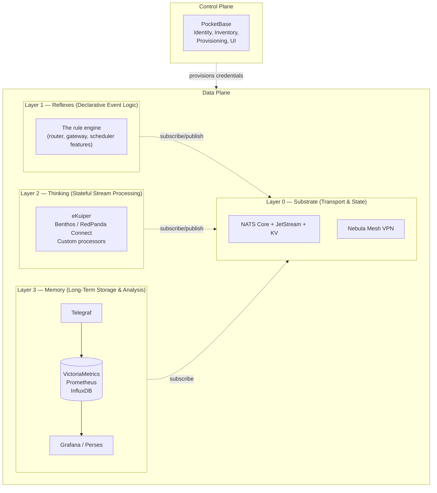
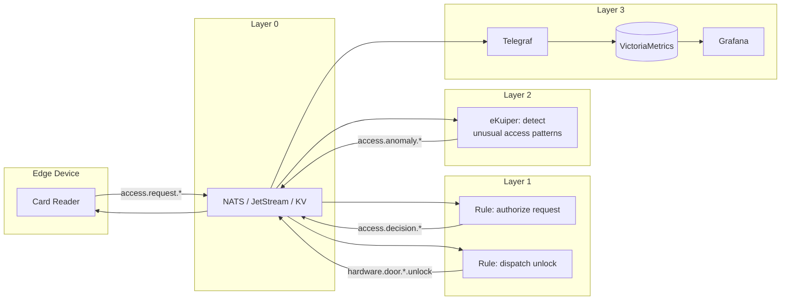

# Platform Layers

Stone-Age.io is a set of layers around one shared bus, NATS. Each layer does one
job. This page tells you which layer should solve a given problem.

---

## 1. Planes and Layers

> **Planes describe *what the platform does*. Layers describe *how the runtime is composed*.**

- **The Control Plane** (PocketBase) is the management side: identity,
  inventory, provisioning and the embedded UI. It is the source of truth for
  organizations, users, things, locations and credentials.
- **The Data Plane** (NATS, JetStream, KV, Nebula) is the runtime. All
  telemetry, commands and live state go through it.
- **The Data Plane has four layers** (0 to 3). Layer 0 is always on. You add
  Layers 1 to 3 when you need them.
- **The Control Plane sits beside the Data Plane**, not in a layer. It
  provisions the identities the Data Plane uses. It is also a narrow NATS client
  on the System Account: it publishes credential updates on subjects such as
  `$SYS.REQ.CLAIMS.UPDATE`. It does not carry tenant traffic such as telemetry,
  rule traffic or device commands.
- **The Control Plane's access control is rule-based.** PocketBase API rules on
  each collection decide who can read or change a record, from five roles per
  organization and a Platform Operator flag. One hook also refuses any relation
  into another Organization's records. The Data Plane's boundary is
  cryptographic (NATS accounts, Nebula CAs). See [Authorization & Roles](./authorization.md).

If NATS runs as its own process, a PocketBase upgrade does not stop the Data
Plane, and devices keep talking. In the one-process deployment (`serve --nats`,
[ADR 0001](./decisions/0001-embedded-nats-server.md)) NATS runs inside the
Control Plane binary. A restart of that binary is then a short outage of the
whole bus. Run NATS separately to avoid this. If a Layer 3 TSDB goes offline,
the Control Plane and the rest of the Data Plane are not affected.

See [Architecture](./architecture.md) for the Control Plane and Data Plane in
detail.

---

## 2. The Four Layers

```mermaid
graph TB
    subgraph CP["Control Plane"]
        PB["PocketBase<br/>Identity, Inventory,<br/>Provisioning, UI"]
    end

    subgraph DP["Data Plane"]
        subgraph L3["Layer 3 — Memory (Long-Term Storage & Analysis)"]
            Telegraf["Telegraf"]
            TSDB[("VictoriaMetrics<br/>Prometheus<br/>InfluxDB")]
            Grafana["Grafana / Perses"]
            Telegraf --> TSDB --> Grafana
        end

        subgraph L2["Layer 2 — Thinking (Stateful Stream Processing)"]
            SP["eKuiper<br/>Benthos / RedPanda Connect<br/>Custom processors"]
        end

        subgraph L1["Layer 1 — Reflexes (Declarative Event Logic)"]
            RR["The rule engine<br/>(router, gateway, scheduler features)"]
        end

        subgraph L0["Layer 0 — Substrate (Transport & State)"]
            NATS["NATS Core + JetStream + KV"]
            Nebula["Nebula Mesh VPN"]
        end

        L1 -.->|"subscribe/publish"| L0
        L2 -.->|"subscribe/publish"| L0
        L3 -.->|"subscribe"| L0
    end

    CP -.->|"provisions credentials"| DP
```

> **NATS is the bus. The rule engine is the reflexes. Stream processors are the thinking. Telegraf + TSDB is the memory.**

Every layer above 0 is optional. Layer 0 alone gives you messaging. Layers 0
and 1 cover most event-driven applications. All four give you full
observability. A higher layer does not change the layers below it.

---

## 3. Layer 0: Substrate

**Components:** NATS Core, JetStream, NATS KV, Nebula.

Layer 0 carries messages, durable streams, key-value state and the mesh network.

- **Messaging.** Pub/sub, request/reply and MQTT. Every other layer addresses
  data by NATS subject.
- **Durable state.** JetStream streams give at-least-once delivery. KV buckets
  hold live state (the digital twin, see [Architecture](./architecture.md)).
- **Connectivity.** The Nebula mesh connects edge sites peer to peer with
  outbound-only traffic.

**The Control Plane generates Layer 0.** When you initialize the Control Plane,
it generates the NATS Operator JWT, the System Account, the resolver
configuration and the `nats-server` config. You start NATS with these files.
Each Organization gets a Nebula CA that issues host certificates. One command
exports these files, so you can run NATS and Nebula lighthouses on the same
host, on other hosts, in a cluster or at the edge. See
[Getting Started](./getting-started.md) for the commands.

**The Control Plane keeps Layer 0 in sync.** PocketBase stays connected to NATS
on the System Account. It publishes account and credential updates
(`$SYS.REQ.CLAIMS.UPDATE`), so NATS applies Control Plane changes with no
restart or reload. Rule engines, stream processors, agents and users see each
other on the bus. They do not see PocketBase there.

Many use cases need only Layer 0. To ingest telemetry and show it on a
dashboard, you need pub/sub, KV and the console reading NATS over WebSocket.

**You are at this layer when you:**

- Connect devices, services or users to the NATS bus.
- Configure Nebula groups and firewall rules.
- Write widgets that subscribe to NATS subjects.
- Set up JetStream streams and KV buckets.

---

## 4. Layer 1: Reflexes (Declarative Event Logic)

**Component:** the rule engine (`rule-router`), a separate binary with router,
gateway and scheduler features. It runs as its own process beside NATS.

Layer 1 holds rules: conditions and actions that run on each message, with no
state between messages.

**The rule engine handles:**

- **Trigger, condition, action.** "When a message on subject X matches
  condition Y, publish to subject Z or call a webhook."
- **Three trigger types.** NATS subjects (router), HTTP requests (gateway) and
  cron schedules (scheduler) use the same YAML syntax.
- **Routing and filtering.** Send a subset of events to another subject, reject
  bad messages, add metadata.
- **KV lookups.** Add context to an event from a KV bucket. Lookups are cached
  and take under a microsecond, so you can chain several.
- **State in KV.** Alarm deduplication and presence tracking with a TTL. The
  rule has no state. The state is in KV. See [Automation](./automation.md).
- **Rate limiting and debounce.** A per-rule `throttle` block, leading-edge by
  default, `mode: trailing` for debounce, grouped by a templated `key`. The
  windows are in the engine's memory, not in KV, because rule templates have no
  arithmetic. Each instance keeps its own windows, and a restart clears them.
- **HTTP in and out.** The gateway turns webhooks into NATS messages. It also
  calls external APIs in response to NATS events, with retry.
- **Scheduled publishes.** The scheduler publishes to NATS or HTTP on a cron
  expression.

**Do not use the rule engine for:**

- **Windowed aggregations**, such as "average temperature per sensor over the
  last 5 minutes".
- **Stream-to-stream joins**, which match two event streams by key and time
  window.
- **Retractable computation**, where late data changes earlier results.
- **Multi-step workflows** where each step's result decides the next step.
- **Transactions.** The rule engine publishes. It does not coordinate
  two-phase commits.

For these, use Layer 2. A stream processor reads from and publishes to the same
NATS subjects your rules use, so the two run side by side.

**You are at this layer when you:**

- Write a YAML rule that says "when X happens, do Y".
- Use KV for state that rules read and write.
- Connect an external service by webhook, in either direction.
- Schedule publishes, such as reports, batch commands or periodic syncs.

---

## 5. Layer 2: Thinking (Stateful Stream Processing)

**Components:** eKuiper, Benthos / RedPanda Connect, Wombat, or any stream
processor that reads from and publishes to NATS.

Layer 2 does computation that needs state across events: sliding windows,
aggregations, joins and retraction of earlier results.

**Stream processors handle:**

- Tumbling, sliding and session windows.
- Joins of two streams by key within a time window.
- Continuous SQL-like queries over streams.
- Late-arriving events and updates to earlier results.
- Filter, projection, enrichment and complex event processing (CEP) operators.

**How Layer 1 and Layer 2 work together:**

1. Layer 1 rules filter, enrich and route raw events.
2. The results go to a dedicated NATS subject.
3. A Layer 2 pipeline (for example eKuiper) subscribes to that subject,
   aggregates over a window, and publishes the result to another subject.
4. Layer 1 rules react to the result: they raise alerts, update KV or call
   webhooks.

Neither layer knows how the other works. They share only NATS subjects.

**You are at this layer when:**

- The problem says "over the last N minutes" or "in a sliding window".
- You join two streams by a common key.
- The logic became awkward in the rule engine.
- You need SQL-like queries over event streams.

**Which stream processor?** Any of them works with NATS:

- **eKuiper**: small, SQL-based, runs at the edge. Suits IoT problems.
- **Benthos / RedPanda Connect / Wombat**: YAML pipelines with many connectors.
  Suits data movement between systems.
- **Your own service**: a small Go service that reads from NATS and publishes
  results.

Pick the one whose configuration style suits your team.

---

## 6. Layer 3: Memory (Long-Term Storage & Analysis)

**Components:** Telegraf or similar, VictoriaMetrics / Prometheus / InfluxDB,
Grafana / Perses.

Layer 3 answers questions about the past.

**Layer 3 handles:**

- **Long-term retention.** Months to years of telemetry.
- **Trend queries.** "The 30-day moving average of CPU use across the warehouse
  sensors."
- **Historical alerts.** "Alert if this week's average is 10% higher than last
  week's."
- **Visualization** in Grafana or Perses.

Layer 3 only reads from NATS. Telegraf subscribes to telemetry through a durable
JetStream consumer and writes to a TSDB. Grafana or Perses queries the TSDB.

A Layer 3 failure does not affect Layers 0 to 2. If VictoriaMetrics is down,
data still moves on NATS, JetStream keeps it, and Telegraf catches up when the
TSDB returns. Your history dashboards fall behind, but live operation continues.

**You are at this layer when:**

- The question starts with "what happened", not "what is happening".
- You build reports, dashboards or alerts over days, weeks or months.
- You need SQL or PromQL for historical analysis.
- You hand data to analysts, auditors or compliance tools.

Stone-Age.io does not bundle a TSDB. You pick the one that suits your operations
and budget. The subjects stay the same, so you can change from VictoriaMetrics
to InfluxDB, Postgres or Snowflake with no change to Layers 0 to 2. See
[Observability](./observability.md).

---

## 7. Which Layer Solves My Problem?

1. Moving bytes from A to B, or managing identity and inventory: Layer 0 or the
   Control Plane.
2. Logic you can say as "when X, check Y, do Z": Layer 1.
3. Short-lived state you can keep in KV: still Layer 1. Stateful alarms and
   presence tracking with a TTL fit here. Debounce and rate limiting use the
   rule engine's `throttle`.
4. Windows, stream joins or aggregation over time: Layer 2.
5. A question about the past: Layer 3.

Most applications use Layers 0, 1 and 3. Layer 2 comes in for analytical
behavior such as anomaly detection, cross-stream correlation and windowed
alerts.

Do not move a problem up a layer too early, for example a stream processor for
work the rule engine can do. Do not force it down either, for example windowed
logic in rules.

---

## 8. Reference Architecture — All Four Layers

This example uses all four layers. The domain is physical access control for an
organization with several sites.

```mermaid
flowchart LR
    subgraph Device["Edge Device"]
        Reader["Card Reader"]
    end

    subgraph L0["Layer 0"]
        NATS["NATS / JetStream / KV"]
    end

    subgraph L1["Layer 1"]
        RR1["Rule: authorize request"]
        RR2["Rule: dispatch unlock"]
    end

    subgraph L2["Layer 2"]
        EK["eKuiper: detect<br/>unusual access patterns"]
    end

    subgraph L3["Layer 3"]
        TG["Telegraf"]
        VM[("VictoriaMetrics")]
        GR["Grafana"]
    end

    Reader -->|"access.request.*"| NATS
    NATS --> RR1
    RR1 -->|"access.decision.*"| NATS
    NATS --> RR2
    RR2 -->|"hardware.door.*.unlock"| NATS
    NATS --> Reader

    NATS --> EK
    EK -->|"access.anomaly.*"| NATS

    NATS --> TG
    TG --> VM
    VM --> GR
```

**Layer 0** carries every message. The KV bucket holds credentials, users,
roles, schedules and a precomputed permissions view.

**Layer 1** handles the fast path. A rule reads
`access.request.{door_id}.{direction}` and looks up credential, user, role, door
and schedule in KV. It then publishes `access.decision.granted.*` or
`access.decision.denied.*`. A second rule turns granted decisions into unlock
commands.

**Layer 2** is optional and can come later. An eKuiper pipeline watches all
access decisions and keeps a baseline for each user. It publishes
`access.anomaly.*` when someone uses a door they rarely use, at an unusual hour
or in an unusual order.

**Layer 3** runs Telegraf on `access.decision.>` and `access.anomaly.>`, writing
to VictoriaMetrics. Grafana shows access volume, deny reasons, use per door and
anomaly trends. vmalert can alert when the deny rate for a door rises sharply.

The layers share only NATS subjects. You can redeploy, scale or replace any one
of them without changes to the others.

---

## 9. Where to Go Next

- Control Plane and Data Plane: [Architecture](./architecture.md)
- Layer 0: [Connectivity](./connectivity.md), [Platform UI & Entities](./platform-ui-entities.md)
- Layer 1: [Automation](./automation.md)
- Layer 2: [Stream Processing](./stream-processing.md)
- Layer 3: [Observability](./observability.md)
- The edge, all layers: [The Agent](./agent.md)
