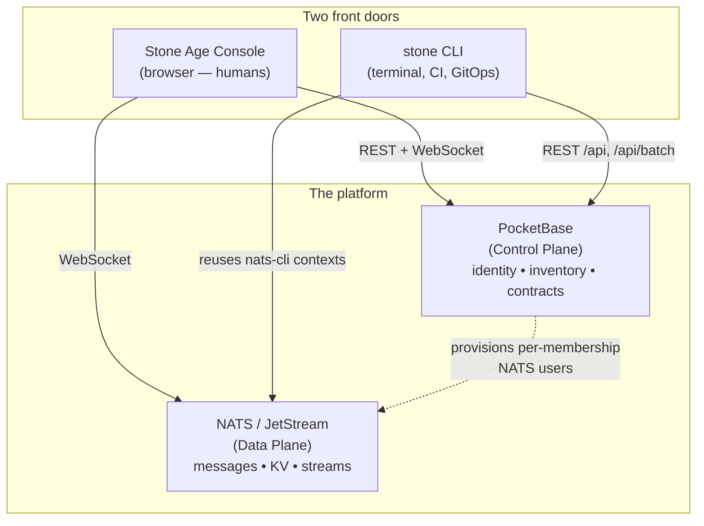

# Stone CLI

`stone` is the command-line client for the Stone-Age.io Platform — the scriptable counterpart to the [Stone Age Console](./platform-ui-entities.md). Anything you can click in the console, you can drive from a terminal: managing tenant resources (Things, Locations, Thing Types, message schemas, memberships, NATS users/roles, Nebula hosts), publishing and subscribing on NATS, reading and writing JetStream KV, and — the part the UI can't do — managing your entire tenant configuration as a folder of YAML files under `git` (GitOps style).

It's a single, dependency-free Go binary that talks to a **running** platform server: PocketBase for tenant data, NATS/JetStream for messaging and KV. It uses the same auth, the same collections, and the same multi-tenant boundaries as the console — so it's an automation surface, not a back door.

> ### `stone` vs `stone-age` — keep them straight
> | Binary | What it is |
> | :--- | :--- |
> | **`stone`** (this page) | The **client CLI** you run from your laptop or a CI runner. It logs in to a platform server over HTTPS and talks to NATS. It never opens the database directly. |
> | **`stone-age`** | The **platform server** binary itself — the Control Plane. This is what you `superuser upsert`, `bootstrap`, and `serve` in [Getting Started](./getting-started.md). It owns the embedded database. |
>
> They share a name and a project, but they're different programs with different jobs. This page is about the client.

---

## 1. Where it fits

The console and `stone` are two front doors to the same two planes. The console is a reactive single pane of glass for humans; `stone` is for scripting, automation, CI, and bulk/declarative changes. Both authenticate as the same users, respect the same PocketBase API rules, and are scoped to the same current Organization.

<center>

</center>

The division of labor in practice:

- **Reach for the console** for dashboards, the Digital Twin, floor-plan placement, and day-to-day point-and-click administration.
- **Reach for `stone`** when you want repeatability: seeding a new org from a template, bulk-creating Things, wiring credentials into a headless device, or keeping a tenant's configuration in version control so changes are reviewed and auditable.

---

## 2. Install & build

`stone` is a standalone Go module (`github.com/stone-age-io/stone-cli`, Go 1.25+).

```sh
go build -o stone        # local binary
go vet ./...
```

There's no daemon and nothing to install server-side — the binary is the whole client.

---

## 3. Contexts, auth, and organizations

Everything `stone` does resolves through a **context**: a named bundle of a server URL, an auth token, the current Organization, an optional NATS context, and an optional workspace path. Contexts are how you point the same binary at `local`, `staging`, and `prod` without re-typing connection details. State lives under `$XDG_CONFIG_HOME/stone/` (`~/.config/stone/` on macOS/Linux, `%APPDATA%\stone\` on Windows), with `0600` permissions on anything secret-bearing.

```
stone/
├── config.yaml                       # active_context, default output format
├── contexts/
│   └── <name>/context.yaml           # url, auth, current_organization, nats_url, nats_context, workspace
└── creds/
    └── stone-<ctx>-<org>.creds       # per-org NATS creds (see §7)
```

### Context commands

```sh
stone context create local --url http://localhost:8090 \
    --nats-url nats://localhost:4222    # --nats-url is optional; enables per-org NATS sync (§7)
stone context ls                        # '*' marks the active one
stone context use staging               # switch the active context
stone context show                      # inspect the active context (secrets shown as "(set)")
stone context rm old-ctx
```

The first context you create becomes active automatically; pass `--use` on `create` to force it otherwise.

### Authentication

```sh
stone auth login        # prompts for email + password (password never echoes)
stone auth whoami       # who am I, on which context, in which org
stone auth logout       # clears the token from the context
```

`login` authenticates against the `users` collection by default (override with `--collection`); the token, email, and user id are written into the context. The login can't be fully automated — it prompts for credentials — so in pipelines you log in once on the runner, or supply `--email`/`--password` flags from a secret store.

### Organizations

The platform is multi-tenant, and almost every resource is scoped to an Organization. `stone org switch` is the pivot:

```sh
stone org ls                       # orgs visible to you; '*' marks the current one
stone org current                  # the current org (id + name)
stone org switch "Warehouse Ops"   # by name or 15-char id
```

`org switch` updates `users.current_organization` **on the server** (so the console and the CLI agree on context) and caches it locally. From then on, org-scoped commands auto-filter `ls` and auto-inject `organization` on `create`. If `--nats-url` is set on the context, `switch` also re-issues your per-org NATS credentials — see §7.

### Bootstrap order

Before real work, four preconditions must hold. Check them in order and fix only what's missing:

| Step | Check | Fix |
| :--- | :--- | :--- |
| 1. Context | `stone context ls` | `stone context create <name> --url <server> [--nats-url …]` |
| 2. Auth | `stone auth whoami` | `stone auth login` *(interactive — needs your credentials)* |
| 3. Organization | `stone org current` | `stone org ls` → `stone org switch <name>` |
| 4. Workspace *(optional, for §5)* | `stone context show` → `workspace:` | `stone pull --set-workspace .` |

---

## 4. Managing entities

The CLI exposes typed CRUD over the same Control Plane collections the console manages. The command set is generated from a single declarative table, so every entity behaves consistently and the name aliases are forgiving (`stone thing`, `stone things`, `stone thing_type`, `stone thing-types` all resolve).

| Entity | Org-scoped | Lookup key | Verbs |
| :--- | :---: | :--- | :--- |
| `thing` | yes | `code` | full |
| `location` | yes | `code` | full |
| `location-type` | yes | `code` | full |
| `thing-type` | yes | `code` | full |
| `thing-type-operation` | yes | `name` | full |
| `message-schema` | yes | `name` | full |
| `organization` | no | `name` | full |
| `membership` | no | — (id only) | full |
| `invite` | yes | `email` | full |
| `nats-user` | yes | `nats_username` | full |
| `nats-role` | yes | `name` | full |
| `nats-import` | yes | `name` | full |
| `nats-export` | yes | `name` | full |
| `nebula-network` | yes | `name` | full |
| `nebula-host` | yes | `hostname` | full |
| `leaf-node` | yes | `code` | full |
| `nats-account` | yes | `name` | `ls / get / update / edit` |
| `nebula-ca` | yes | `name` | `ls / get / update / edit` |

"Full" verbs are `ls / get / create / update / delete / edit`. The two limited entities (`nats-account`, `nebula-ca`) are provisioned automatically by the platform when you create an Organization — you can read and adjust them, but not create or delete them by hand.

```sh
stone location create --name "HQ" --code hq
stone thing-type create --name "Temp Sensor" --code temp-sensor \
    --subject-prefix "telemetry.sensors" --capabilities publish
stone thing get warehouse-hvac --fields code,name,location   # read back by natural key
stone thing ls --fields code,name                            # requested fields become the columns
stone nebula-host edit edge-west                             # opens $EDITOR as YAML, PATCHes on save
```

### Lookup by id or natural key

`get`, `update`, `delete`, and `edit` accept either a 15-char PocketBase id or the entity's **natural key** from the table above (`code`, `name`, `hostname`, …). Key lookups are exact-match and scoped to the current Organization; zero or multiple matches fail with the candidate ids listed. `membership` is id-only.

### Field types

| Type | Flag form | Notes |
| :--- | :--- | :--- |
| string / int / bool | `--name foo` · `--validity-years 5` · `--active true` | |
| select | `--capability publish` | validated against a whitelist |
| multiselect | `--capabilities publish,subscribe` | comma-separated |
| relation (id) | `--type abc123def456ghi` | **15-char id only** — natural keys resolve on positional args, never on relation flags |
| relation list | `--operations id1,id2` | comma-separated or repeated flag |
| JSON | `--metadata '{"k":"v"}'` · `--metadata @file.json` · `--metadata -` | inline, file, or stdin |

> **Relation flags take ids, not names.** There's no name-to-id resolver on flags — discover an id first with `stone <type> get <key> --fields id -o json` or `stone <type> ls -o json`.

### Auth-collection ergonomics

`thing`, `nats-user`, `nebula-host`, and `leaf-node` are PocketBase **auth collections**. The CLI smooths over PB's two requirements so you don't have to: when a non-empty `password` is present it mirrors `passwordConfirm` and sets `emailVisibility` for you (on typed CRUD, `apply`, and `edit` alike).

For headless provisioning, skip `--password` and let the CLI mint one:

```sh
stone thing create --email reader-01@things.example.com --code reader-01 \
    --type <thing_type_id> --random-password -o json 2> reader-01.pw
```

`--random-password` generates a 32-char URL-safe password and prints it **once to stderr**, so stdout stays clean for `jq`. `--password` and `--random-password` are mutually exclusive; exactly one is required on `create`.

---

## 5. Declarative workspaces (pull / apply)

This is the capability the console doesn't have: treat a tenant's entire configuration as YAML files in a `git` repo.

```sh
mkdir my-workspace && cd my-workspace && git init
stone pull --set-workspace .      # writes <collection>/<key>.yaml, one file per record
# …edit files, commit for review…
stone apply                       # reconciles the workspace back to the server
```

- **`pull`** writes one YAML file per record into `<workspace>/<collection>/`, named by the record's natural key (message-schemas use `namespace__name__version`; fallback `name`, then id). Org-scoped collections are filtered to the current Organization. Server-managed fields (`collectionId`, `collectionName`, `created`, `updated`, `expand`) are stripped on read.
- **`apply`** walks the workspace (or just the paths you pass), groups records into batches of up to 50, and POSTs them through PocketBase's transactional `/api/batch` endpoint. Records with an `id` are PATCHed; records without are POSTed and the server-assigned id is written **back into the file**.

Three properties make this safe to live with:

- **Idempotent.** Re-running `apply` is a no-op when nothing changed. Filenames are cosmetic — `apply` keys solely on the `id` field inside each file.
- **No deletes.** Records on the server but absent locally are left alone. To delete, use `stone <type> delete <id|key>` or the console.
- **Reviewable.** Put the workspace under `git` and you get diff, history, blame, and PR review on your infrastructure for free.

---

## 6. NATS, JetStream, and KV

`stone` reuses your existing `nats` CLI contexts (via orbit.go's `natscontext`), so JetStream domains are honored automatically and the two tools stay in sync.

```sh
# Messaging
stone nats pub demo.hello 'world'
stone nats pub demo.hello @msg.json --js      # JetStream publish, prints the ack
stone nats sub 'demo.>'
stone nats req demo.echo 'ping' --timeout 5s

# KV data plane
stone kv get twins device.42
stone kv put twins device.42 '{"online":true}'
stone kv put twins device.42 @./twin.json
stone kv del twins device.42
stone kv ls twins
stone kv watch twins

# KV bucket lifecycle
stone kv bucket ls
stone kv bucket create twins --history 5 --ttl 720h
stone kv bucket info twins
stone kv bucket delete twins

# JetStream streams
stone js stream ls
stone js stream create twins --subject 'twins.>' --max-age 24h --storage file
stone js stream create twins --config stream.yaml      # advanced config from a file
stone js stream info twins
stone js stream purge twins
stone js stream delete twins
```

The same buckets and streams power the console's Digital Twin and KV Dashboard, and the rule engine and stream processors consume them too — see [Platform Entities & UI](./platform-ui-entities.md#jetstream-streams-and-kv-buckets) and [Automation](./automation.md).

> **Consumer management is intentionally out of scope.** The `nats` CLI is better at managing JetStream consumers — `stone` deliberately doesn't duplicate it.

---

## 7. Per-organization NATS credentials

This is the non-obvious convenience that ties the CLI to the platform's tenancy model. In Stone-Age.io, NATS credentials are **per-membership** — a user gets a distinct NATS identity for each Organization they belong to, stored as the membership's [Linked NATS Identity](./platform-ui-entities.md#1-organizations-memberships). `stone` keeps your local `nats` CLI in lockstep with whichever org you're working in.

When `nats_url` is set on the context, `stone org switch <org>` (and `stone nats sync-context`):

1. Looks up your `memberships` record for that org.
2. Reads the linked `nats_users` record's `creds_file`.
3. Writes `~/.config/stone/creds/stone-<ctx>-<org>.creds` and a matching `~/.config/nats/context/stone-<ctx>-<org>.json`.
4. Points the context's `nats_context` at the new context.

```sh
stone org switch "Warehouse Ops" --set-nats-default   # also makes it the nats-cli default
stone nats sync-context                               # re-issue after rotating keys
```

Run `sync-context` after a credential rotation (e.g. `stone nats-user update <id> --regenerate true`). The org switch always succeeds even if this step can't; when it short-circuits, it prints an informational `nats-sync: skipped — <reason>` line, never an error:

| Reason | Meaning |
| :--- | :--- |
| `no NATS URL on this stone context` | `nats_url` was never set — re-create the context or pass `--nats-url` to a future `org switch`. |
| `no membership found for this user+org` | You're acting as an Operator on an org you aren't a member of — NATS creds are per-membership. |
| `membership has no linked nats_user` | The platform's hooks haven't provisioned a NATS user for this membership yet. |
| `(--no-nats)` | You passed the flag. |

Add `--verbose` to either command to print the user, membership, and NATS user ids on stderr. See [Connectivity](./connectivity.md) for how these credentials map onto the NATS account model.

---

## 8. Output & scripting discipline

Every command takes persistent flags:

- **`--output` / `-o`** — `table` (human, not stable across versions), `json`, or `yaml`. Use `-o json` whenever a script consumes the output.
- **`--context <name>`** — override the active context for a single invocation (handy in CI that touches multiple environments).
- **`--debug`** — log HTTP requests/responses to stderr (bodies capped at 4 KB).

Two conventions keep `stone` pipeline-friendly: structured output goes to **stdout**, while human messages and generated passwords go to **stderr** — so `stone thing create … --random-password -o json | jq .id` does the right thing.

---

## 9. Limitations

- Relation flags (`--type`, `--location`, …) accept 15-char PocketBase ids only — natural-key lookup applies to positional args, not flags.
- `apply` never deletes server records that are missing locally. Delete explicitly.
- No JetStream **consumer** management — use the `nats` CLI.
- `nats-account` and `nebula-ca` updates that touch limits or infrastructure fields require operator-level credentials server-side. Org admins can only trigger key/CA rotation (`rotate_keys: true`).
- `auth login` is interactive by design — credentials can't be discovered by the CLI.

---

## 10. Where to Go Next

- **Stand up a server for `stone` to talk to:** [Getting Started](./getting-started.md).
- **The entities the CLI manages, and the console that mirrors it:** [Platform Entities & UI](./platform-ui-entities.md).
- **The contract graph behind Thing Types and message schemas:** [Thing Types](./thing-types.md).
- **How per-membership NATS creds fit the account model:** [Connectivity](./connectivity.md).
- **GitOps at the edge — the same declarative spirit, applied to a site:** [Leaf Nodes](./leaf-nodes.md).
- **Config keys and `STONE_AGE_*` environment variables for the server:** [Configuration Reference](./configuration.md).
