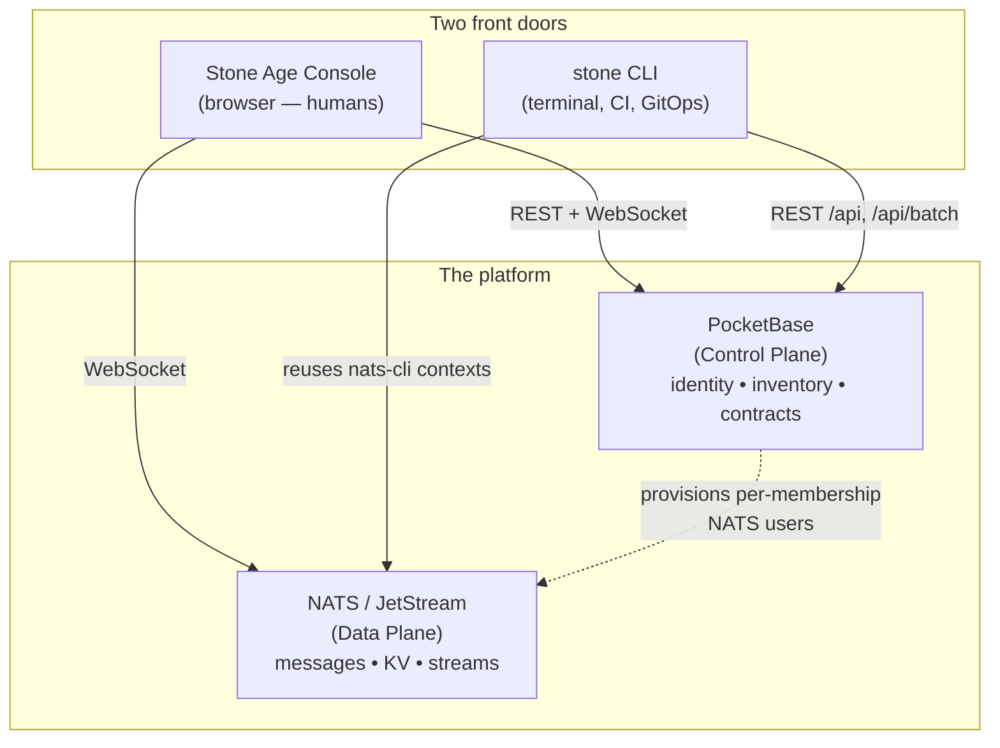

# Stone CLI

`stone` is the command-line client for the Stone-Age.io Platform — the scriptable counterpart to the [Stone Age Console](./platform-ui-entities.md). Anything you can click in the console, you can drive from a terminal: managing tenant resources (Things, Locations, the Thing Type contract graph, memberships, NATS users/roles, Nebula hosts), publishing and subscribing on NATS, reading and writing JetStream KV, and — the part the UI can't do — pulling your tenant configuration down as a folder of YAML files you can review, diff, and apply back from `git` (§5).

It's a single, dependency-free Go binary that talks to a **running** Control Plane (`stone-age`): PocketBase for tenant data, NATS/JetStream for messaging and KV. It uses the same auth, the same collections, and the same multi-tenant boundaries as the console — so it's an automation surface, not a back door.

> ### `stone` vs `stone-age` — keep them straight
> | Binary | What it is |
> | :--- | :--- |
> | **`stone`** (this page) | The **client CLI** you run from your laptop or a CI runner. It logs in to the Control Plane over HTTPS and talks to NATS. It never opens the database directly. |
> | **`stone-age`** | The **Control Plane** binary itself. This is what you `superuser upsert`, `bootstrap`, and `serve` in [Getting Started](./getting-started.md). It owns the embedded database. |
>
> They share a name and a project, but they're different programs with different jobs. This page is about the client.

---

## 1. Where it fits

The console and `stone` are two front doors to the same two planes. The console is a reactive single pane of glass for humans; `stone` is for scripting, automation, CI, and bulk/declarative changes. Both authenticate as the same users, respect the same PocketBase API rules, and are scoped to the same current Organization.

<center>

</center>

The division of labor in practice:

- **Reach for the console** for dashboards, the Digital Twin, floor-plan placement, and day-to-day point-and-click administration.
- **Reach for `stone`** when you want repeatability: seeding a new org from a template, bulk-creating Things, wiring credentials into a headless device, or keeping a tenant's configuration in version control so changes are reviewed and auditable.

---

## 2. Install & build

Prebuilt binaries are attached to every release — linux, darwin and windows, amd64 and arm64 each:

```sh
VERSION=0.5.1
curl -sSLO https://github.com/stone-age-io/stone-cli/releases/download/v${VERSION}/stone_${VERSION}_linux_amd64.tar.gz
tar xzf stone_${VERSION}_linux_amd64.tar.gz     # unpacks ./stone, LICENSE, README.md, SKILLS.md
./stone --version
```

Or build it yourself. `stone` is a standalone Go module (`github.com/stone-age-io/stone-cli`, Go 1.25+ — its own module, tracked separately from the platform binary), so a checkout and one command is the whole thing:

```sh
go build -o stone        # local binary
go vet ./...
```

A source build reports `dev` from `--version`; a release build reports the tag. Either way there's no daemon and nothing to install server-side — the binary is the whole client.

---

## 3. Contexts, auth, and organizations

Everything `stone` does resolves through a **context**: a named bundle of a server URL, an auth token, the current Organization, an optional NATS context, and an optional workspace path. Contexts are how you point the same binary at `local`, `staging`, and `prod` without re-typing connection details. State lives in a `stone/` directory under the platform's conventional config home — `$XDG_CONFIG_HOME/stone/` (default `~/.config/stone/`) on Linux, `~/Library/Application Support/stone/` on macOS, `%LOCALAPPDATA%\stone\` on Windows — with `0600` permissions on anything secret-bearing. The nats-cli context files `stone` writes (§7) are the exception: they go where `nats` itself looks, `$XDG_CONFIG_HOME/nats/context/` or `~/.config/nats/context/` on **every** platform.

```
stone/
├── config.yaml                       # active_context, default output format
├── contexts/
│   └── <name>/context.yaml           # url, auth, current_organization, nats_url, nats_context, workspace
└── creds/
    └── stone-<ctx>-<org>.creds       # per-org NATS creds (see §7); <org> is the org's sanitized name
```

### Context commands

```sh
stone context create local --url http://localhost:8090 \
    --nats-url nats://localhost:4222    # --nats-url is optional; enables per-org NATS sync (§7)
stone context ls                        # '*' marks the active one
stone context use staging               # switch the active context
stone context show                      # inspect the active context (secrets shown as "(set)")
stone context rm old-ctx
```

The first context you create becomes active automatically; pass `--use` on `create` to force it otherwise.

### Authentication

```sh
stone auth login        # prompts for email + password (password never echoes)
stone auth whoami       # who am I, on which context, in which org — and is my session still live
stone auth logout       # clears the token from the context
```

`login` authenticates against the `users` collection by default (override with `--collection`); the token, email, and user id are written into the context. The login can't be fully automated — it prompts for credentials — so in pipelines you log in once on the runner, or supply `--email`/`--password` flags from a secret store.

!!! warning "An expired session used to look exactly like an empty organization"
    PocketBase does not refuse a token it will not accept — it serves the request **as a guest**. Every list rule then filters the result to nothing, and the answer is `200` with an empty array. So a context whose token had aged out printed a table header and no rows, `stone org ls` said *"no organizations visible to this user"*, `stone pull` reported `pulled 0 records` and **exited zero**, and nothing anywhere said the word "login".

    Since 0.4.0 the CLI refuses an expired token before sending it, naming the expiry and the command that fixes it, and reads the token's own `exp` claim rather than a stored timestamp — so contexts written before the change are covered too. A token whose expiry cannot be *parsed* is still sent: "unknown" is not "expired", and refusing one would turn a claim rename into an outage. `auth whoami` grew a `session:` line for the same reason — "am I still logged in" is the question it is asked, and it used to answer from local state that could not tell.

### Organizations

The platform is multi-tenant, and almost every resource is scoped to an Organization. `stone org switch` is the pivot:

```sh
stone org ls                       # CURRENT / CODE / NAME / ID, sorted by code; '*' marks the current one
stone org current                  # the current org: id, code, name
stone org switch warehouse-ops     # by code, name, or 15-char id — code is tried first
```

Since 0.5.0 organizations are addressed by their **code** — the platform's globally unique root identifier ([ADR 0002](./decisions/0002-organization-code-namespace.md)). A name still resolves (`org switch "Warehouse Ops"` works), but the code is tried first, so an organization *coded* `acme` beats a different one merely *named* `acme`. Since 0.5.1 `auth login`, `auth whoami` and `context show` print the current organization the same way — `acme (Acme Industries) [r03ixjyfs4fbkp2]` — falling back to the bare id when offline. That is display only: `context.yaml` still stores the id, and `-o json`/`-o yaml` output is unchanged.

`org switch` updates `users.current_organization` **on the server** (so the console and the CLI agree on context) and caches it locally. From then on, org-scoped commands auto-filter `ls` and auto-inject `organization` on `create`. If `--nats-url` is set on the context, `switch` also re-issues your per-org NATS credentials — see §7.

### Bootstrap order

Before real work, four preconditions must hold. Check them in order and fix only what's missing:

| Step | Check | Fix |
| :--- | :--- | :--- |
| 1. Context | `stone context ls` | `stone context create <name> --url <server> [--nats-url …]` |
| 2. Auth | `stone auth whoami` | `stone auth login` *(interactive — needs your credentials)* |
| 3. Organization | `stone org current` | `stone org ls` → `stone org switch <code>` |
| 4. Workspace *(optional, for §5)* | `stone context show` → `workspace:` | `stone pull --workspace . --set-workspace` |

---

## 4. Managing entities

The CLI exposes typed CRUD over the same Control Plane collections the console manages. The command set is generated from a single declarative table, so every entity behaves consistently and the name aliases are forgiving (`stone thing`, `stone things`, `stone thing_type`, `stone thing-types` all resolve).

| Entity | Org-scoped | Lookup key | Verbs | Role required |
| :--- | :---: | :--- | :--- | :--- |
| `thing` | yes | `code` | full | read: any · create/update: member+ · delete: owner/admin |
| `location` | yes | `code` | full | read: any · create/update: member+ · delete: owner/admin |
| `location-type` | yes | `code` | full | read: any · write: owner/admin |
| `thing-type` | yes | `code` | full | read: any · write: owner/admin |
| `thing-type-operation` | yes | `name` | full | read: any · write: owner/admin |
| `organization` | no | `code` (then `name`) | full | read: any member, or Platform Operator · create/update/delete: **Platform Operator only** |
| `membership` | no | — (id only) | full | read: your own, or owner/admin of the org · write: owner/admin |
| `invite` | yes | `email` | full | owner/admin (Platform Operator may create) |
| `nats-user` | yes | `nats_username` | full | owner/admin — **including reads** (plus your own one row) |
| `nats-role` | yes | `name` | full | owner/admin — including reads |
| `nats-import` | yes | `name` | full | owner/admin — including reads |
| `nats-export` | yes | `name` | full | owner/admin — including reads |
| `nebula-network` | yes | `name` | full | owner/admin — including reads |
| `nebula-host` | yes | `hostname` | full | owner/admin — including reads |
| `activity` | yes | — (id only) | `ls / get` | read: any · **no writes at all** (see below) |
| `nats-account` | yes | `name` | `ls / get / update / edit` | read: any · **all writes: Platform Operator** · signing keys: owner/admin via route |
| `nebula-ca` | yes | `name` | `ls / get / update / edit` | read: any · **record writes: Platform Operator** · rotation: owner/admin via `stone nebula ca-rotate` |

"Full" verbs are `ls / get / create / update / delete / edit`. `activity` is the tenant feed of who changed what, and it is read-only **everywhere**, not just here: all three write rules on the collection are nil, so no one — tenant or operator — can forge or rewrite an entry through the API. It lists newest-first without being asked, and `--filter 'resource_id="<id>"'` is the one to know, because it answers "who touched this device". It is excluded from `pull`/`apply`. See [Authorization §5](./authorization.md#5-two-histories-the-audit-log-and-the-activity-feed) for how it differs from the operator-only audit log.

The two limited entities (`nats-account`, `nebula-ca`) are provisioned automatically by the platform when you create an Organization, so neither can be created or deleted by hand. The CLI does expose `update` and `edit` on both — they exist for a **Platform Operator**, not as a tenant path — but both are **read-only to every tenant role**, so an owner or admin calling them gets a 404 from the update rule rather than a change. An owner or admin manages the account's signing keys with `stone nats account-keys add-signing | remove-signing <public-key> | rotate`, which wraps `POST /api/org/nats-account/keys` (see [Authorization §4.1](./authorization.md#41-account-signing-keys)), and rolls the Nebula CA with `stone nebula ca-rotate` (below) rather than by editing the record.

In the **Role required** column, *any* means any role in the current organization including `dashboard`, the least privileged one, and *member+* means `member`, `admin`, or `owner`. Three consequences worth internalizing before you script against the CLI:

- On the `nats-*` and `nebula-*` entities, any role below admin gets an **empty `ls`, not a filtered one** — the read rules themselves require owner or admin. The one exception is the single `nats-user` row linked to your own membership.
- On `thing`, the `nats_user` and `nebula_host` relations are owner/admin only. A member can create and edit a Thing but any `--nats-user` / `--nebula-host` flag will be rejected.
- On your **own** `membership` record the only write is to the NATS identity link, and only to **keep or clear** it — pointing it at a different identity is rejected. `nats_users` serves the credential of whichever identity your membership names, so choosing one is owner/admin, like changing a role. `--role`, `--user`, and `--invited-by` are rejected outright — self-promotion is not a supported path.

Both ends of the invitation flow are here. `stone invite create --email …` issues one; `stone invite accept <token>` redeems it, taking the `?token=` value from the invitation link rather than the invite record's id. Redeeming sets `current_organization` only when it was blank, so follow it with `stone org switch` (since 0.5.1 the `next:` hint it prints carries the organization's code, ready to paste) — which is also what writes the nats-cli context the new membership has no creds for yet.

The full matrix, and the reasoning behind each restriction, is on [Authorization & Roles](./authorization.md).

```sh
stone location create --name "HQ" --code hq
stone thing-type create --name "Temp Sensor" --code temp-sensor \
    --subject-prefix "sensor.{thing}"
stone thing-type-operation create --name heartbeat --capability publish \
    --subject-suffix heartbeat
stone thing get warehouse-hvac --fields code,name,location   # read back by natural key
stone thing ls --fields code,name                            # requested fields become the columns
stone nebula-host edit edge-west                             # opens $EDITOR as YAML, PATCHes on save
```

**Codes are generated server-side when left out** ([ADR 0003](./decisions/0003-human-friendly-codes-and-default-subject.md)). `stone thing create` or `stone location create` without `--code` gets a code like `CA-9KD-4PX` under the type's prefix, and `-o yaml` or a later `get` shows it. A code you pass is stored as typed. Two things `stone` has not caught up with yet: `thing provision` still requires `--code`, and neither type entity has a `--prefix` flag, so set a type's prefix in the console, or with `edit` or `apply`.

### Provisioning a real device

`thing create` writes an inventory row and nothing else. For a device that needs to connect, use `thing provision`, which wraps [`POST /api/org/things`](./api-reference.md) — the Thing plus its NATS identity and Nebula host in **one server-side transaction**, so a failure part-way leaves no signed credential or allocated overlay IP owned by nothing:

```sh
stone thing provision --code gw-01 --name "Gateway 01" \
    --type <thing_types_id> --location <locations_id> \
    --nats-mode auto \
    --nebula-mode auto --nebula-network <id> --nebula-ip 10.128.0.42
```

Each identity takes `--nats-mode` / `--nebula-mode` of `none` (default), `auto` (mint one — NATS uses the org's default role unless `--nats-role` names another; Nebula needs `--nebula-network` and `--nebula-ip`, the route does not allocate an address) or `link` (attach an existing one with `--nats-user` / `--nebula-host`). `--name` and `--code` are required. Attaching either identity is owner/admin; a member may provision with both modes left at `none`. The organization comes from your active context, never the request.

### Lookup by id or natural key

`get`, `update`, `delete`, and `edit` accept either a 15-char PocketBase id or the entity's **natural key** from the table above (`code`, `name`, `hostname`, …). Key lookups are exact-match and scoped to the current Organization. On the platform code uniqueness ignores case, so `cam-1` and `CAM-1` cannot both exist; `stone` still matches the case you type, so type a code the way it is stored. Multiple matches fail with the candidate ids listed; no match fails with `no <entity> with <key> "<arg>"`. Where an entity has a second key (`organization`: `code`, then `name`), the keys are tried one at a time in that order. `membership` is id-only.

### Field types

| Type | Flag form | Notes |
| :--- | :--- | :--- |
| string / int / bool | `--name foo` · `--validity-years 5` · `--active=false` | a bool needs the `=` to be set false (see below) |
| select | `--capability publish` | validated against a whitelist |
| multiselect | comma-separated, validated against a whitelist | supported, but no entity currently declares one |
| relation (id) | `--type abc123def456ghi` | **15-char id only** — natural keys resolve on positional args, never on relation flags |
| relation list | `--operations id1,id2` | comma-separated or repeated flag |
| JSON | `--metadata '{"k":"v"}'` · `--metadata @file.json` · `--metadata -` | inline, file, or stdin |

> **Relation flags take ids, not names.** There's no name-to-id resolver on flags — discover an id first with `stone <type> get <key> --fields id -o json` or `stone <type> ls -o json`.

### Auth-collection ergonomics

`thing`, `nats-user`, and `nebula-host` are PocketBase **auth collections**. The CLI smooths over PB's two requirements so you don't have to: when a non-empty `password` is present it mirrors `passwordConfirm` and sets `emailVisibility` for you (on typed CRUD, `apply`, and `edit` alike).

For headless provisioning, skip `--password` and let the CLI mint one:

```sh
stone thing create --email reader-01@things.example.com --code reader-01 \
    --type <thing_type_id> --random-password -o json 2> reader-01.pw
```

`--random-password` generates a 32-char URL-safe password and prints it **once to stderr**, so stdout stays clean for `jq`. `--password` and `--random-password` are mutually exclusive; exactly one is required on `create`.

### Decommissioning from the CLI

`thing` carries an `active` flag, so a device — including a site gateway, which is an ordinary Thing — can be taken out of service from a script:

```sh
stone thing update reader-01 --active=false        # decommission
stone thing update reader-01 --active=true         # return to service
```

!!! warning "`--active=false` is not a status label"
    It is the same operation as the console's Deactivate button, with the same four effects: the device cannot sign in again, every session it already holds is killed at once, its linked **NATS identity is suspended** (key revoked, nothing reissued), and its linked **Nebula host is deactivated**, which puts its certificate on every peer's blocklist once those configs are redeployed. Reactivating issues a *new* `.creds` file — the old one stays revoked permanently, so the device has to be given the replacement. Owner/Admin only. See [Authorization §4.2](./authorization.md#42-taking-a-device-out-of-service).

    This matters most in `apply`. `pull` writes every non-server field, so `active` lands in the workspace YAML — and a file carrying `active: false` decommissions real hardware on the next `apply`.

Note the `=` in `--active=false`. Boolean flags set *true* when passed bare, so the space-separated form is a different command — `--active false` leaves `false` as a second positional argument and fails with `accepts 1 arg(s), received 2`. It errors rather than doing the wrong thing, but the `=` is required.

### Nebula operations that are not record writes

Two Nebula operations are not expressible as a record edit, so they live under `stone nebula` rather than on the `nebula-ca` / `nebula-host` entities:

```sh
stone nebula ca-rotate prepare      # mint the incoming CA, publish it as additional trust
stone nebula ca-rotate commit       # switch issuance to it, re-sign every active host
stone nebula ca-rotate finish       # drop the outgoing CA
stone nebula cert-audit             # hosts whose certificate no longer matches their network
```

**`ca-rotate` is three steps, and the wait between them is the point.** Nebula verification is mutual — each peer checks the other against its *own* local CA pool, with no chain and no fallback — and hosts pull their config whenever they like. So a single write carrying both the new trust bundle and the new certificate splits the mesh: a host that has fetched presents a new-CA certificate to one that has not, and the handshake fails in **both** directions until propagation finishes. `prepare` moves no issuance and is fully reversible; wait there until every host has fetched. `commit` is idempotent — re-running it re-signs only the hosts still on the outgoing CA, which is how you recover from a partial sweep. `finish` is refused while any active host still holds a certificate signed by the outgoing CA, and the error names the host.

Owner/Admin of the active organization, and it takes no id — the CA is derived from your active org, so it cannot be aimed at another tenant. A CA cannot be renewed, only rotated, so start months before expiry rather than weeks; `stone nebula-ca ls` shows the date. See [Authorization §4.3](./authorization.md#43-rolling-a-nebula-ca).

**`cert-audit` is a route because answering it means parsing a certificate.** It compares the network each host certificate carries against the network the host actually belongs to — no client can do that, so the platform answers and hands back the verdict. It exists because `pb-nebula` signed host certificates at `/32` until v0.3.0, and Nebula puts a certificate's prefix straight onto the tun device as a link route: a `/32` gives a host a route covering only itself, so the certificate verifies, the config renders, the host starts, the handshake completes, and no packet ever crosses the mesh. Nothing errors anywhere.

!!! warning "Affected hosts are not re-signed automatically, and that is deliberate"
    Re-signing moves a certificate's fingerprint, and a fingerprint is what `pki.blocklist` revokes — so an automatic sweep would rewrite every peer config in the mesh on the strength of a dependency bump. The audit names the hosts; re-issue them individually. Inactive hosts are excluded because they are revoked, and re-signing one would publish a new fingerprint while the old certificate stayed valid.

---

## 5. Declarative workspaces (pull / apply)

This is the capability the console doesn't have: treat a tenant's entire configuration as YAML files in a `git` repo.

```sh
mkdir my-workspace && cd my-workspace && git init
stone pull --set-workspace .      # writes <collection>/<key>.yaml, one file per record
# …edit files, commit for review…
stone apply                       # reconciles the workspace back to the server
```

- **`pull`** writes one YAML file per record into `<workspace>/<collection>/`, named by the record's natural key (fallback `name`, then id, with a suffix on collision). Since 0.5.0 organization files are named by code (`acme.yaml`); a workspace pulled earlier gains the new file beside the old name-based one, and the stale one is safe to delete. Org-scoped collections are filtered to the current Organization. Server-managed fields (`collectionId`, `collectionName`, `created`, `updated`, `expand`) are stripped on read, as are the credential and server-generated fields below. `pull` prints what it left out, per collection. The `activity` feed is excluded entirely — a declarative workspace has nothing to say about a log of what already happened.
- **`apply`** walks the workspace (or just the paths you pass), groups records into batches of up to 50, and POSTs them through PocketBase's transactional `/api/batch` endpoint. Records with an `id` are PATCHed; records without are POSTed and the server-assigned id is written **back into the file**.

Three properties make this safe to live with:

- **Idempotent.** Re-running `apply` is a no-op when nothing changed. Filenames are cosmetic — `apply` keys solely on the `id` field inside each file.
- **No deletes.** Records on the server but absent locally are left alone. To delete, use `stone <type> delete <id|key>` or the console.
- **Reviewable.** Put the workspace under `git` and you get diff, history, blame, and PR review on your infrastructure for free.

### Credentials are not pulled, and that is recent

Putting the workspace in `git` is the documented workflow, so what `pull` writes into it matters. The fields PocketBase marks hidden — every `private_key` and `seed` — were never the exposure. The exposure was material the API legitimately returns to an owner or admin:

| Field | Why it is a credential |
| :--- | :--- |
| `nats_users.creds_file` | **Is** the credential — a user JWT and an nkey seed, the same bytes `stone nats sync-context` deliberately writes under `0600`. One per NATS identity in the organization. |
| `nebula_hosts.config_yaml` | Carries the host's Nebula private key inline. The standalone `private_key` column is hidden and encryptable at rest; the rendered config holding the same key was neither. |
| `invites.token` | A bearer credential that redeems into a membership. |

`pull` now omits these, along with the server-generated certificates, JWTs and action triggers beside them. That half was a **correctness** bug as much as a disclosure one: `apply` sends back every key in a file, so a pulled certificate is a stale value racing whatever the server has rotated to since.

The filter is **pull-side only** — a hand-written `revoke: true` still applies, and nothing here removes a capability you can express.

!!! danger "If you pulled with `stone` before 0.4.0, treat those values as disclosed"
    They are in the workspace and in its git history. Upgrading stops new ones being written; it cannot unwrite the old. Replace them with `stone nats-user update <username> --revoke` — which issues a new key pair and puts the old one on the account's revocation list; `--regenerate` would re-sign for the **same** seed, leaving the leaked file working — and `stone nebula-host update <hostname> --renew`, which likewise mints a fresh keypair rather than just a certificate. Then delete any invitation whose token was written out.

### What this is, and what it isn't

People arrive at "GitOps" with expectations set by Flux and Argo CD, so it's worth being precise about which of those properties you get here.

`stone apply` is a **one-way, additive upsert**. It pushes what's in the workspace to the server and stops. It is not a convergence loop.

| | `stone pull` / `apply` | A full GitOps reconciler |
| :--- | :--- | :--- |
| Creates and updates from files | ✅ | ✅ |
| Transactional batches | ✅ (`/api/batch`, 50 per batch) | Varies |
| Deletes server records missing from git | ❌ **Never** | ✅ (pruning) |
| Detects drift when someone edits in the console | ❌ Not until the next `pull` | ✅ Continuously |
| Runs unattended in a control loop | ❌ You invoke it | ✅ |

The practical consequences:

- **The workspace is not authoritative, and it is not a complete picture of the server.** It is a snapshot from the last `pull`, plus your edits. A Thing someone created in the console this morning does not exist in your workspace until you pull again.
- **Two people editing the same records in different places will not conflict — the last `apply` wins,** field by field, with no warning. If a workspace is shared, treat `pull` before `apply` the way you'd treat `git pull` before a push.
- **Deletion is deliberately manual.** Removing a file from the workspace does nothing. That's the right default when a stray `rm -rf` would otherwise decommission a customer site, but it does mean git history alone will not tell you the current server state.

None of this makes the workflow less useful — reviewable, diffable, reproducible tenant config is the point, and you get all three. It just isn't a reconciler, so don't build a process that assumes convergence. For the same reason, [Operations §3](./operations.md#3-backups) treats a workspace as an audit and re-creation aid, **not** as a backup.

---

## 6. NATS, JetStream, and KV

`stone` reuses your existing `nats` CLI contexts (via orbit.go's `natscontext`), so JetStream domains are honored automatically and the two tools stay in sync.

```sh
# Messaging
stone nats pub demo.hello 'world'
stone nats pub demo.hello @msg.json --js      # JetStream publish, prints the ack
stone nats sub 'demo.>'
stone nats req demo.echo 'ping' --timeout 5s

# KV data plane
stone kv get twins device.42
stone kv put twins device.42 '{"online":true}'
stone kv put twins device.42 @./twin.json
stone kv del twins device.42
stone kv ls twins
stone kv watch twins

# KV bucket lifecycle
stone kv bucket ls
stone kv bucket create twins --history 5 --ttl 720h
stone kv bucket info twins
stone kv bucket delete twins

# JetStream streams
stone js stream ls
stone js stream create twins --subject 'twins.>' --max-age 24h --storage file
stone js stream create twins --config stream.yaml      # advanced config from a file
stone js stream info twins
stone js stream view twins --last 20                  # newest first (alias: tail)
stone js stream purge twins
stone js stream delete twins
```

The same buckets and streams power the console's Digital Twin and KV Dashboard, and the rule engine and stream processors consume them too — see [Platform Entities & UI](./platform-ui-entities.md#jetstream-streams-and-kv-buckets) and [Automation](./automation.md).

> **Consumer management is intentionally out of scope.** The `nats` CLI is better at managing JetStream consumers — `stone` deliberately doesn't duplicate it.

---

## 7. Per-organization NATS credentials

This is the non-obvious convenience that ties the CLI to the platform's tenancy model. In Stone-Age.io, NATS credentials are **per-membership** — a user gets a distinct NATS identity for each Organization they belong to, stored as the membership's [Linked NATS Identity](./platform-ui-entities.md#1-organizations-memberships). `stone` keeps your local `nats` CLI in lockstep with whichever org you're working in.

When `nats_url` is set on the context, `stone org switch <org>` (and `stone nats sync-context`):

1. Looks up your `memberships` record for that org.
2. Reads the linked `nats_users` record's `creds_file`.
3. Writes `stone/creds/stone-<ctx>-<org>.creds` under the config home (§3) and a matching `stone-<ctx>-<org>.json` in nats-cli's context directory. `<org>` is the organization's **name**, sanitized — not its code.
4. Points the context's `nats_context` at the new context.

```sh
stone org switch warehouse-ops --set-nats-default     # also makes it the nats-cli default
stone nats sync-context                               # re-issue after rotating keys
```

Run `sync-context` after a credential rotation. Re-issuing *someone else's* credential is `stone nats-user update <id> --regenerate` and needs owner or admin — anyone below that gets a 404, because `nats_users` writes are owner/admin only. To rotate **your own**, use the dedicated route, which every role can use and which takes no id:

```sh
stone nats creds rotate      # rotate my own credential (any role, incl. dashboard)
stone nats sync-context      # then re-issue the local creds file
```

`creds rotate` is refused (`403`) while your identity is suspended — a rotation mints a credential issued after the revocation cutoff, so otherwise it would lift the suspension.

Three operations change a NATS identity's credential, and only one of them takes it out of service:

| Operation | What it does | Use it when |
| :--- | :--- | :--- |
| `--regenerate` | Re-signs the JWT for the **same** key. Copies of the old file keep working. | A JWT field changed, or a device lost its file. |
| `--revoke` | New key pair; the **old** public key goes on the account's revocation list, so every copy of the old file is rejected immediately and for good. A working replacement is issued on the same record and the identity **stays active**. | Credentials have leaked. Deliver the new file to the legitimate holder. |
| `active` → `false` | Revokes the key and issues **nothing**. Setting it back to `true` issues a fresh credential while the old one stays dead. | The identity must stop connecting. |

```sh
stone nats-user update device-01 --revoke        # leaked: kill every copy, issue a replacement
stone thing update reader-01 --active=false      # a device: suspend through the Thing (§4)
```

!!! note "There is no `--active` flag on `nats-user`"
    For a device, suspend the **Thing** — its `active` flag suspends the linked NATS identity along with its sessions and Nebula host, which is the whole operation. For an identity with no Thing, 0.5.0 has no typed flag: `stone nats-user edit <username>` opens the record as YAML, and setting `active: false` there and saving PATCHes it (owner/admin). The next release adds `stone nats-user update <username> --active=false` (and `=true` to reactivate); it is on stone-cli's main branch, unreleased. `pull` omits `active` on `nats_users`, so it cannot be changed through `apply`.

See [Authorization §4](./authorization.md#4-the-row-scoped-credential-model). The org switch always succeeds even if this step can't; when it short-circuits, it prints an informational `nats-sync: skipped — <reason>` line, never an error. `stone nats sync-context` has nothing else to do, so for it the same reasons are an **error** — `nothing to sync — <reason>`, non-zero exit:

| Reason | Meaning |
| :--- | :--- |
| `no NATS URL on this stone context` | `nats_url` was never set — re-create the context or pass `--nats-url` to a future `org switch`. |
| `no membership found for this user+org` | You're acting as a Platform Operator on an org you aren't a member of — NATS creds are per-membership. |
| `membership has no linked nats_user` | No NATS identity is linked to your membership in this org. Linking one is owner/admin. |
| `(--no-nats)` | You passed the flag. |

Add `--verbose` to either command to print the user, membership, and NATS user ids on stderr. See [Connectivity](./connectivity.md) for how these credentials map onto the NATS account model.

---

## 8. Output & scripting discipline

Every command takes persistent flags:

- **`--output` / `-o`** — `table` (human, not stable across versions), `json`, or `yaml`. Use `-o json` whenever a script consumes the output.
- **`--context <name>`** — override the active context for a single invocation (handy in CI that touches multiple environments).
- **`--nats-context <name>`** — the nats-cli context to connect with, overriding the stone context's `nats_context`.
- **`--debug`** — log HTTP requests/responses to stderr (bodies capped at 4 KB).

Every entity `ls` also takes:

- **`--filter <expr>`** — a PocketBase filter, ANDed with the organization filter.
- **`--sort <expr>`** — a PocketBase sort, e.g. `-updated`.
- **`--fields a,b,c`** — server-side projection; the table columns follow it.
- **`--limit <n>`** — fetch a single page rather than paging through the whole match. It reaches the query, so it is the right way to ask a server holding 40,000 Things for the newest ten.

Two conventions keep `stone` pipeline-friendly: structured output goes to **stdout**, while human messages and generated passwords go to **stderr** — so `stone thing create … --random-password -o json | jq .id` does the right thing.

### Relations print as codes for a human and ids for a script

`stone thing ls` used to render TYPE and LOCATION as 15-char PocketBase ids — a column of noise nobody recognises. **`table` output and `get`'s key/value output now print the target's natural key instead**, the same key `get` / `update` / `delete` already accept positionally. PocketBase returns the related record inline on the same query, so this costs no extra round trip.

**`json` and `yaml` are unchanged, and that is the contract rather than a concession.** They are the scripting surface: a pipeline parsing `type` still gets a relation id, and `--fields id -o json` is still how you discover one. `edit` and `pull` also fetch raw — what `edit` opens in `$EDITOR` is PATCHed straight back, and the workspace keys on ids, which is the invariant `apply` is built on.

Two behaviours worth knowing: an **unset** relation is simply an empty cell, and so is one you may not read — expansion never breaks a command that would otherwise work. And PocketBase masks another user's email, so on `membership ls` an owner sees a colleague's *name* in the USER column rather than their address.

---

## 9. Driving `stone` with Claude

Because `stone` is a clean, scriptable surface with stable JSON output, it's a natural fit for an AI assistant that can shell out to a terminal. The CLI ships with everything an assistant needs to drive it safely — no prompt-engineering on your part required.

Two files travel in the repo, describing the same capability surface for two audiences:

| File | Audience | What it is |
| :--- | :--- | :--- |
| **`.claude/skills/stone/SKILL.md`** | Claude Code | An imperative [Agent Skill](https://docs.claude.com/en/docs/claude-code/skills) that Claude Code **auto-loads** when your request matches its trigger description. You don't invoke it by hand. |
| **`SKILLS.md`** | Humans & other tools | The audience-neutral reference of the same surface — bootstrap order, entity table, NATS sync semantics, and limitations — for people, other assistants, or automation. |

When you're working in a project that has the stone skill installed (it lives under `.claude/skills/` in the CLI's repo, and can be installed into any project or your user config), Claude Code activates it automatically the moment your ask looks like platform work — *"create a thing"*, *"switch org"*, *"pull the workspace"*, *"publish to NATS on the platform"*, or any command starting with `stone`. From that point the assistant is operating from the skill's playbook rather than improvising.

### What the skill encodes

The skill turns the conventions documented on this page into operating rules the assistant follows:

- **Bootstrap before acting.** It walks the context → auth → org → workspace chain (§3), checking each precondition and fixing only what's missing — so it won't fire entity commands against an unconfigured or wrong-org context.
- **Parseable output.** It always adds `-o json` when it intends to consume a result, never scraping the human-facing table format.
- **No invented ids.** It resolves relations by looking them up first (`get <key> --fields id -o json`) instead of guessing a 15-char id — and prefers natural keys for one-off operations.
- **GitOps awareness.** It knows `apply` is idempotent and **never deletes**, so it won't expect a missing-from-workspace record to disappear.
- **Failure-mode literacy.** It reads `nats-sync: skipped — …` as informational, recognizes the per-membership NATS creds model, and maps common PocketBase 400s back to "that wasn't a valid relation id."

> **The interactive login is a deliberate safety boundary.** `stone auth login` prompts for credentials, and the assistant *cannot* supply them — the skill is explicitly told to surface the requirement and let you log in yourself. An assistant can manage your tenant, but it can't authenticate as you. Combined with the platform's per-organization scoping and PocketBase API rules, the assistant operates inside exactly the same boundaries you do.

The upshot: pointing Claude Code at this platform doesn't mean trusting it to reverse-engineer a CLI — it means handing it a vetted set of commands and the judgment to chain them in the right order. Keep the two files in sync when command shapes change; both are meant to stay accurate to the surface an assistant relies on.

---

## 10. Limitations

- Relation flags (`--type`, `--location`, …) accept 15-char PocketBase ids only — natural-key lookup applies to positional args, not flags. Note this is the *input* side: table and `get` output print relations as codes (§8).
- `apply` never deletes server records that are missing locally. Delete explicitly.
- No JetStream **consumer** management — use the `nats` CLI.
- `nats-account` and `nebula-ca` are read-only for every tenant role — all updates require Platform Operator credentials server-side. Signing-key operations go through `stone nats account-keys` (owner/admin), not `stone nats-account update`.
- `auth login` is interactive by design — credentials can't be discovered by the CLI.
- File fields have no CLI upload path: a Thing's and a Location's `photo`, a Location's `floorplan`, an Organization's `logo` and a user's `avatar` must be set from the console. All of them are **protected** fields — reading one back needs a file token, not the auth token ([Platform Entities](./platform-ui-entities.md#photos-and-file-fields)).
- **The CLI's field list is hand-maintained, not derived from the platform's `schema.json`.** It can drift behind a platform release. If a field exists in the console but has no flag, that is the reason — check `cmd/entity.go` in the `stone-cli` repo.

---

## 11. Where to Go Next

- **Start a server for `stone` to talk to:** [Getting Started](./getting-started.md).
- **The entities the CLI manages, and the console that mirrors it:** [Platform Entities & UI](./platform-ui-entities.md).
- **Which of those entities your role can actually touch:** [Authorization & Roles](./authorization.md).
- **The HTTP routes behind the commands that are not record writes:** [API Reference](./api-reference.md).
- **The contract graph behind Thing Types and their operations:** [Thing Types](./thing-types.md).
- **How per-membership NATS creds fit the account model:** [Connectivity](./connectivity.md).
- **GitOps at the edge — the same declarative spirit, applied to a site:** [Leaf Nodes](./leaf-nodes.md).
- **Config keys and `STONE_AGE_*` environment variables for the server:** [Configuration Reference](./configuration.md).
