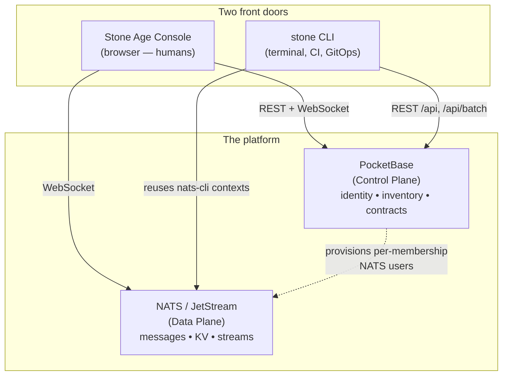

# Stone CLI

`stone` is the command-line client for Stone-Age.io. It does from a terminal
what the [Stone Age Console](./platform-ui-entities.md) does in a browser:

- Manage tenant records: Things, Locations, Thing Types and operations,
  memberships, NATS users and roles, Nebula hosts.
- Publish and subscribe on NATS.
- Read and write JetStream KV.
- Pull a tenant's configuration into YAML files that you can review, diff and
  apply back from `git` (§5). The console cannot do this.

It is one Go binary with no dependencies. It talks to a **running** Control
Plane (`stone-age`): PocketBase for tenant data, and NATS/JetStream for
messaging and KV. It uses the same auth, collections and tenant boundaries as
the console, so it gives no extra access.

> ### `stone` vs `stone-age`
> | Binary | What it is |
> | :--- | :--- |
> | **`stone`** (this page) | The **client CLI** you run from a laptop or CI runner. It signs in to the Control Plane over HTTPS and talks to NATS. It never opens the database. |
> | **`stone-age`** | The **Control Plane** binary. You run `superuser upsert`, `bootstrap` and `serve` on it in [Getting Started](./getting-started.md). It owns the database. |

---

## 1. Where it fits

The console and `stone` are two clients of the same Control Plane and Data
Plane. Both sign in as the same users, follow the same API rules, and work in
the same current Organization.


```mermaid
graph TB
    subgraph Clients["Two front doors"]
        UI["Stone Age Console<br/>(browser — humans)"]
        CLI["stone CLI<br/>(terminal, CI, GitOps)"]
    end

    subgraph Planes["The platform"]
        PB["PocketBase<br/>(Control Plane)<br/>identity • inventory • contracts"]
        NATS["NATS / JetStream<br/>(Data Plane)<br/>messages • KV • streams"]
    end

    UI -->|"REST + WebSocket"| PB
    UI -->|"WebSocket"| NATS
    CLI -->|"REST /api, /api/batch"| PB
    CLI -->|"reuses nats-cli contexts"| NATS

    PB -.->|"provisions per-membership<br/>NATS users"| NATS
```

- **Use the console** for dashboards, the digital twin, floor plans and daily
  administration.
- **Use `stone`** for repeatable work: seed a new org from a template, create
  Things in bulk, put credentials on a headless device, or keep a tenant's
  configuration in version control.

---

## 2. Install & build

Every release has binaries for linux, darwin and windows, on amd64 and arm64:

```sh
VERSION=0.5.1
curl -sSLO https://github.com/stone-age-io/stone-cli/releases/download/v${VERSION}/stone_${VERSION}_linux_amd64.tar.gz
tar xzf stone_${VERSION}_linux_amd64.tar.gz     # unpacks ./stone, LICENSE, README.md, SKILLS.md
./stone --version
```

To build it yourself: `stone` is its own Go module
(`github.com/stone-age-io/stone-cli`, Go 1.25+), versioned separately from the
platform.

```sh
go build -o stone        # local binary
go vet ./...
```

A source build shows `dev` for `--version`. A release build shows the tag.
There is nothing to install on the server.

---

## 3. Contexts, auth, and organizations

Every `stone` command runs in a **context**: a named set of server URL, auth
token, current Organization, optional NATS context and optional workspace path.
Use contexts to point the same binary at `local`, `staging` and `prod`.

State is in a `stone/` directory in the platform's config home:

- Linux: `$XDG_CONFIG_HOME/stone/` (default `~/.config/stone/`)
- macOS: `~/Library/Application Support/stone/`
- Windows: `%LOCALAPPDATA%\stone\`

Files that hold secrets have `0600` permissions. The nats-cli context files
that `stone` writes (§7) go where `nats` looks for them:
`$XDG_CONFIG_HOME/nats/context/` or `~/.config/nats/context/`, on **every**
platform.

```
stone/
├── config.yaml                       # active_context, default output format
├── contexts/
│   └── <name>/context.yaml           # url, auth, current_organization, nats_url, nats_context, workspace
└── creds/
    └── stone-<ctx>-<org>.creds       # per-org NATS creds (see §7); <org> is the org's sanitized name
```

### Context commands

```sh
stone context create local --url http://localhost:8090 \
    --nats-url nats://localhost:4222    # --nats-url is optional; enables per-org NATS sync (§7)
stone context ls                        # '*' marks the active one
stone context use staging               # switch the active context
stone context show                      # inspect the active context (secrets shown as "(set)")
stone context rm old-ctx
```

The first context you create becomes active. Pass `--use` on `create` to make a
later one active.

### Authentication

```sh
stone auth login        # prompts for email + password (password never echoes)
stone auth whoami       # who am I, on which context, in which org, and is my session live
stone auth logout       # clears the token from the context
```

`login` signs in to the `users` collection by default (change it with
`--collection`). It writes the token, email and user id into the context. It
prompts for credentials, so in a pipeline, sign in once on the runner or pass
`--email` and `--password` from a secret store.

::: warning An expired token would look like an empty organization
PocketBase serves a request with a token it does not accept **as a guest**.
Every list rule then returns nothing, with `200` and an empty array. So the CLI
checks the token's `exp` claim before it sends the token. If the token has
expired, the CLI stops and tells you to run `stone auth login`. A token whose
expiry it cannot parse is still sent. `auth whoami` shows a `session:` line
with the token's state.
:::

### Organizations

Almost every resource belongs to an Organization. Use `stone org switch` to
change organization:

```sh
stone org ls                       # CURRENT / CODE / NAME / ID, sorted by code; '*' marks the current one
stone org current                  # the current org: id, code, name
stone org switch warehouse-ops     # by code, name, or 15-char id; code is tried first
```

Organizations are addressed by their **code**, the platform's globally unique
identifier ([ADR 0002](./decisions/0002-organization-code-namespace.md)). A
name also works (`org switch "Warehouse Ops"`), but the code is tried first. An
organization *coded* `acme` wins over another one *named* `acme`.

`auth login`, `auth whoami` and `context show` print the current organization
as `acme (Acme Industries) [r03ixjyfs4fbkp2]`, or only the id when offline.
`context.yaml` stores the id, and `-o json`/`-o yaml` output shows the id.

`org switch` sets `users.current_organization` **on the server**, so the
console and the CLI agree, and caches it locally. After a switch, org-scoped
commands filter `ls` and add `organization` on `create`. If the context has
`--nats-url`, `switch` also writes your per-org NATS credentials (§7).

### Bootstrap order

Four things must be in place before real work. Check them in order and fix
only what is missing:

| Step | Check | Fix |
| :--- | :--- | :--- |
| 1. Context | `stone context ls` | `stone context create <name> --url <server> [--nats-url …]` |
| 2. Auth | `stone auth whoami` | `stone auth login` *(interactive, needs your credentials)* |
| 3. Organization | `stone org current` | `stone org ls`, then `stone org switch <code>` |
| 4. Workspace *(optional, for §5)* | `stone context show`, look at `workspace:` | `stone pull --workspace . --set-workspace` |

---

## 4. Managing entities

The CLI has typed CRUD over the same collections as the console. One table
defines all the commands, so every entity works the same way. Name aliases
also work: `stone thing`, `stone things`, `stone thing_type` and
`stone thing-types` all resolve.

| Entity | Org-scoped | Lookup key | Verbs | Role required |
| :--- | :---: | :--- | :--- | :--- |
| `thing` | yes | `code` | full | read: any · create/update: member+ · delete: owner/admin |
| `location` | yes | `code` | full | read: any · create/update: member+ · delete: owner/admin |
| `location-type` | yes | `code` | full | read: any · write: owner/admin |
| `thing-type` | yes | `code` | full | read: any · write: owner/admin |
| `thing-type-operation` | yes | `name` | full | read: any · write: owner/admin |
| `organization` | no | `code` (then `name`) | full | read: any member, or Platform Operator · create/update/delete: **Platform Operator only** |
| `membership` | no | none (id only) | full | read: your own, or owner/admin of the org · write: owner/admin |
| `invite` | yes | `email` | full | owner/admin (Platform Operator can create) |
| `nats-user` | yes | `nats_username` | full | owner/admin, **including reads** (plus your own one row) |
| `nats-role` | yes | `name` | full | owner/admin, including reads |
| `nats-import` | yes | `name` | full | owner/admin, including reads |
| `nats-export` | yes | `name` | full | owner/admin, including reads |
| `nebula-network` | yes | `name` | full | owner/admin, including reads |
| `nebula-host` | yes | `hostname` | full | owner/admin, including reads |
| `activity` | yes | none (id only) | `ls / get` | read: any · **no writes** |
| `nats-account` | yes | `name` | `ls / get / update / edit` | read: any · **all writes: Platform Operator** · signing keys: owner/admin through a route |
| `nebula-ca` | yes | `name` | `ls / get / update / edit` | read: any · **record writes: Platform Operator** · rotation: owner/admin with `stone nebula ca-rotate` |

"Full" verbs are `ls / get / create / update / delete / edit`. *Any* means any
role in the current organization, `dashboard` included. *member+* means
`member`, `admin` or `owner`.

**`activity`** is the tenant's feed of who changed what. It is read-only
**everywhere**: all three write rules are nil, so nobody can forge or change an
entry through the API. It lists newest first. Use
`--filter 'resource_id="<id>"'` to see who changed one device. `pull` and
`apply` skip it. See [Authorization §5](./authorization.md#5-two-histories-the-audit-log-and-the-activity-feed).

**`nats-account` and `nebula-ca`** are created when you create an
Organization, so you cannot create or delete them by hand. `update` and `edit`
exist for Platform Operators. For every tenant role they return 404.

- Owners and admins manage signing keys with
  `stone nats account-keys add-signing | remove-signing <public-key> | rotate`,
  which calls `POST /api/org/nats-account/keys`
  ([Authorization §4.1](./authorization.md#41-account-signing-keys)).
- Owners and admins roll the Nebula CA with `stone nebula ca-rotate` (below).

Before you script against the CLI, know these three rules:

- On `nats-*` and `nebula-*` entities, a role below admin gets an **empty
  `ls`, not a filtered one**. The one exception is the `nats-user` row linked
  to your own membership.
- On `thing`, only owners and admins can set `nats_user` and `nebula_host`. A
  member can create and edit a Thing, but `--nats-user` and `--nebula-host`
  are rejected.
- On your **own** `membership`, the only write is to the NATS identity link,
  and you can only **keep or clear** it. `nats_users` serves the credential of
  the identity your membership names, so choosing one is owner/admin, like
  changing a role. `--role`, `--user` and `--invited-by` are rejected.

**Invitations:** `stone invite create --email …` issues one.
`stone invite accept <token>` redeems it, with the `?token=` value from the
invitation link, not the invite record's id. Redeeming sets
`current_organization` only if it was blank, so then run `stone org switch`.
The `next:` hint it prints has the organization's code. The switch also writes
the nats-cli context for the new membership.

See [Authorization & Roles](./authorization.md) for the full matrix and the
reason for each limit.

```sh
stone location create --name "HQ" --code hq
stone thing-type create --name "Temp Sensor" --code temp-sensor \
    --subject-prefix "sensor.{thing}"
stone thing-type-operation create --name heartbeat --capability publish \
    --subject-suffix heartbeat
stone thing get warehouse-hvac --fields code,name,location   # read back by natural key
stone thing ls --fields code,name                            # requested fields become the columns
stone nebula-host edit edge-west                             # opens $EDITOR as YAML, PATCHes on save
```

**The server generates a code if you leave it out**
([ADR 0003](./decisions/0003-human-friendly-codes-and-default-subject.md)).

- `stone thing create`, `stone location create` or `stone thing provision`
  without `--code` gets a code such as `CA-9KD-4PX` under the type's prefix.
  `provision` prints it. For the others, use `-o yaml` or a later `get`.
- A code you pass is stored as you typed it.
- Set a type's prefix with `--prefix` on `thing-type` or `location-type` (1 to 4
  capitals). A Thing Type and a Location Type in one organization cannot share a
  prefix.
- A code, and a Thing's or Location's `--type`, are frozen once set. An update
  that changes the type returns 404. To fix a wrong type, delete and recreate.
- `provision` without `--code`, `--prefix`, and lookups that ignore case need a
  `stone` build newer than 0.5.1.

### Provisioning a real device

`thing create` writes only an inventory record. For a device that must connect,
use `thing provision`. It calls [`POST /api/org/things`](./api-reference.md),
which creates the Thing, its NATS identity and its Nebula host in **one
server-side transaction**. A failure leaves no orphaned credential or overlay
IP.

```sh
stone thing provision --code gw-01 --name "Gateway 01" \
    --type <thing_types_id> --location <locations_id> \
    --nats-mode auto \
    --nebula-mode auto --nebula-network <id> --nebula-ip 10.128.0.42
```

`--nats-mode` and `--nebula-mode` each take one of:

- `none` (default).
- `auto`: mint one. NATS uses the org's default role unless `--nats-role` names
  another. Nebula needs `--nebula-network` and `--nebula-ip`, because the route
  does not allocate an address.
- `link`: attach an existing one with `--nats-user` or `--nebula-host`.

`--name` is required. `--code` is optional. Only owners and admins can attach
identities. A member can provision with both modes at `none`. The organization
comes from your active context.

### Lookup by id or natural key

`get`, `update`, `delete` and `edit` take a 15-char PocketBase id or the
entity's **natural key** from the table above (`code`, `name`, `hostname` and
so on).

- Key lookups are scoped to the current Organization and match exactly, except
  that a **code ignores case**: `stone thing get ca-9kd-4px` finds
  `CA-9KD-4PX`. Code uniqueness also ignores case, so this cannot match two
  records.
- If several records match, the command fails and lists their ids. If none
  match, it fails with `no <entity> with <key> "<arg>"`.
- An entity with a second key (`organization`: `code`, then `name`) tries each
  key in order.
- `membership` takes an id only.

### Field types

| Type | Flag form | Notes |
| :--- | :--- | :--- |
| string / int / bool | `--name foo` · `--validity-years 5` · `--active=false` | to set a bool false, use `=` (see below) |
| select | `--capability publish` | checked against a whitelist |
| multiselect | comma-separated, checked against a whitelist | supported, but no entity uses one yet |
| relation (id) | `--type abc123def456ghi` | **15-char id only**. Natural keys work on positional args, not on relation flags. |
| relation list | `--operations id1,id2` | comma-separated or repeated flag |
| JSON | `--metadata '{"k":"v"}'` · `--metadata @file.json` · `--metadata -` | inline, file or stdin |

> **Relation flags take ids, not names.** Find an id first with `stone <type> get <key> --fields id -o json` or `stone <type> ls -o json`.

### Auth collections

`thing`, `nats-user` and `nebula-host` are PocketBase **auth collections**. When
you set a non-empty `password`, the CLI also sets `passwordConfirm` and
`emailVisibility` for you, on typed CRUD, `apply` and `edit`.

For headless provisioning, let the CLI create the password:

```sh
stone thing create --email reader-01@things.example.com --code reader-01 \
    --type <thing_type_id> --random-password -o json 2> reader-01.pw
```

`--random-password` makes a 32-character URL-safe password and prints it
**once to stderr**, so stdout stays clean for `jq`. Use exactly one of
`--password` or `--random-password` on `create`.

### Decommissioning from the CLI

A `thing` has an `active` flag, so a script can take a device out of service.
A site gateway is an ordinary Thing, so this also applies to it.

```sh
stone thing update reader-01 --active=false        # decommission
stone thing update reader-01 --active=true         # return to service
```

::: warning `--active=false` is not a status label
It is the same as the console's Deactivate button, with the same four effects:

1. The device cannot sign in again.
2. Every session it holds ends at once.
3. Its linked **NATS identity is suspended**: the key is revoked and nothing is
   reissued.
4. Its linked **Nebula host is deactivated**, and its certificate goes on every
   peer's blocklist when those configs are redeployed.

Reactivating issues a *new* `.creds` file. The old one stays revoked, so give
the device the new file. Owner/Admin only. See
[Authorization §4.2](./authorization.md#42-taking-a-device-out-of-service).

This matters most for `apply`. `pull` writes `active` into the workspace YAML,
so a file with `active: false` decommissions real hardware on the next `apply`.
:::

Use the `=` in `--active=false`. A bare boolean flag means *true*, so
`--active false` treats `false` as a second argument and fails with
`accepts 1 arg(s), received 2`.

### Nebula operations that are not record writes

Two Nebula operations are not record edits, so they are under `stone nebula`:

```sh
stone nebula ca-rotate prepare      # mint the incoming CA, publish it as additional trust
stone nebula ca-rotate commit       # switch issuance to it, re-sign every active host
stone nebula ca-rotate finish       # drop the outgoing CA
stone nebula cert-audit             # hosts whose certificate does not match their network
```

**`ca-rotate` has three steps, and you must wait between them.** Each Nebula
peer checks the other against its *own* local CA pool, with no chain and no
fallback, and hosts pull their config on their own schedule. If one write
changed trust and certificates together, a host with a new-CA certificate would
meet a host that has not fetched yet, and the handshake would fail both ways.

- `prepare` changes no issuance and is fully reversible. Wait here until every
  host has fetched.
- You can run `commit` again. It re-signs only the hosts still on the old CA,
  which is how you finish a partial sweep.
- `finish` is refused while any active host still has a certificate from the
  old CA. The error names the host.

Owner/Admin of the active organization only. It takes no id: the CA comes from
your active org. You cannot renew a CA, only rotate it, so start months before
it expires. `stone nebula-ca ls` shows the date. See
[Authorization §4.3](./authorization.md#43-rolling-a-nebula-ca).

**`cert-audit`** compares each host certificate's network with the network the
host belongs to. A client cannot parse the certificate, so the platform does it.
Nebula puts a certificate's prefix on the tun device as a link route, so a
certificate with the wrong mask (such as `/32`) verifies, renders, starts and
handshakes, but moves no packets, and nothing reports an error.

::: warning Affected hosts are not re-signed automatically
A re-sign changes the certificate's fingerprint, and `pki.blocklist` revokes by
fingerprint, so an automatic sweep would rewrite every peer config in the mesh.
The audit names the hosts. Reissue them one at a time. Inactive hosts are left
out, because they are revoked. Re-signing one would publish a new fingerprint
while the old certificate stayed valid.
:::

---

## 5. Declarative workspaces (pull / apply)

Keep a tenant's whole configuration as YAML files in a `git` repo:

```sh
mkdir my-workspace && cd my-workspace && git init
stone pull --set-workspace .      # writes <collection>/<key>.yaml, one file per record
# …edit files, commit for review…
stone apply                       # sends the workspace back to the server
```

**`pull`** writes one YAML file per record into `<workspace>/<collection>/`.

- Each file is named by the record's natural key (then `name`, then id, with a
  suffix if two collide). Organization files are named by code (`acme.yaml`).
- Org-scoped collections are filtered to the current Organization.
- It removes server-managed fields (`collectionId`, `collectionName`,
  `created`, `updated`, `expand`), and the credential and server-generated
  fields below. It prints what it left out, per collection.
- It skips the `activity` feed.

**`apply`** reads the workspace (or only the paths you pass), groups records
into batches of up to 50, and sends them through PocketBase's transactional
`/api/batch` endpoint. It PATCHes records with an `id`. It POSTs records
without one and writes the new id **back into the file**.

- **Idempotent.** Running `apply` again with no changes does nothing. File
  names do not matter: `apply` uses only the `id` field in each file.
- **No deletes.** `apply` leaves alone any server record that has no local file.
  To delete, use `stone <type> delete <id|key>` or the console.
- **Reviewable.** In `git` you get diff, history, blame and PR review of your
  configuration.

### Credentials are not pulled

`pull` never writes fields that PocketBase marks hidden, such as every
`private_key` and `seed`. It also leaves out these fields, which the API does
return to an owner or admin:

| Field | Why it is a credential |
| :--- | :--- |
| `nats_users.creds_file` | It **is** the credential: a user JWT and an nkey seed. |
| `nebula_hosts.config_yaml` | It has the host's Nebula private key inline. |
| `invites.token` | A bearer token that redeems into a membership. |

`pull` also leaves out the server-generated certificates, JWTs and action
triggers next to them. `apply` sends back every key in a file, so a pulled
certificate would overwrite whatever the server rotated to since.

The filter is on `pull` only. A `revoke: true` you write by hand still applies.

::: danger Workspaces pulled with `stone` before 0.4.0 contain credentials
Those values are in the workspace and in its git history. Treat them as
disclosed, and replace them:

1. `stone nats-user update <username> --revoke`. This issues a new key pair and
   revokes the old one. Do not use `--regenerate`, which signs the **same** seed
   again and leaves the leaked file working.
2. `stone nebula-host update <hostname> --renew`, which mints a new key pair.
3. Delete every invitation whose token was written out.
:::

### What this is, and what it is not

`stone apply` is a **one-way, additive upsert**. It pushes the workspace to the
server and stops. It is not a reconciliation loop like Flux or Argo CD.

| | `stone pull` / `apply` | A full GitOps reconciler |
| :--- | :--- | :--- |
| Creates and updates from files | ✅ | ✅ |
| Transactional batches | ✅ (`/api/batch`, 50 per batch) | Varies |
| Deletes server records missing from git | ❌ **Never** | ✅ (pruning) |
| Detects drift when someone edits in the console | ❌ Not until the next `pull` | ✅ Continuously |
| Runs unattended in a control loop | ❌ You run it | ✅ |

- **The workspace is not the source of truth.** It is a snapshot from the last
  `pull`, plus your edits. A Thing someone created in the console this morning
  is not in your workspace until you pull again.
- **The last `apply` wins, field by field, with no warning.** If people share a
  workspace, `pull` before `apply`, as you would `git pull` before a push.
- **Deletion is manual.** Removing a file does nothing. This protects you from a
  stray `rm -rf`, but git history does not show the current server state.

Do not build a process that expects convergence. For the same reason,
[Operations §3](./operations.md#3-backups) treats a workspace as an audit and
rebuild aid, **not** a backup.

---

## 6. NATS, JetStream, and KV

`stone` uses your existing `nats` CLI contexts (through orbit.go's
`natscontext`), so JetStream domains work and the two tools stay in step.

```sh
# Messaging
stone nats pub demo.hello 'world'
stone nats pub demo.hello @msg.json --js      # JetStream publish, prints the ack
stone nats sub 'demo.>'
stone nats req demo.echo 'ping' --timeout 5s

# KV data plane
stone kv get twins device.42
stone kv put twins device.42 '{"online":true}'
stone kv put twins device.42 @./twin.json
stone kv del twins device.42
stone kv ls twins
stone kv watch twins

# KV bucket lifecycle
stone kv bucket ls
stone kv bucket create twins --history 5 --ttl 720h
stone kv bucket info twins
stone kv bucket delete twins

# JetStream streams
stone js stream ls
stone js stream create twins --subject 'twins.>' --max-age 24h --storage file
stone js stream create twins --config stream.yaml      # advanced config from a file
stone js stream info twins
stone js stream view twins --last 20                  # newest first (alias: tail)
stone js stream purge twins
stone js stream delete twins
```

The console's digital twin and KV Dashboard use the same buckets and streams,
and so do the rule engine and stream processors. See
[Platform Entities & UI](./platform-ui-entities.md#jetstream-streams-and-kv-buckets)
and [Automation](./automation.md).

> **`stone` does not manage JetStream consumers.** Use the `nats` CLI for that.

---

## 7. Per-organization NATS credentials

In Stone-Age.io, NATS credentials are **per membership**. A user has a separate
NATS identity in each Organization, stored as the membership's
[Linked NATS Identity](./platform-ui-entities.md#1-organizations-memberships).
`stone` keeps your local `nats` CLI on the credential for your current org.

When the context has `nats_url`, `stone org switch <org>` and
`stone nats sync-context` do this:

1. Find your `memberships` record for that org.
2. Read the linked `nats_users` record's `creds_file`.
3. Write `stone/creds/stone-<ctx>-<org>.creds` in the config home (§3) and a
   matching `stone-<ctx>-<org>.json` in nats-cli's context directory. `<org>`
   is the organization's **name**, sanitized, not its code.
4. Set the context's `nats_context` to the new context.

```sh
stone org switch warehouse-ops --set-nats-default     # also makes it the nats-cli default
stone nats sync-context                               # write the files again after a key rotation
```

Run `sync-context` after a credential rotation. To re-issue *another*
identity's credential, run `stone nats-user update <id> --regenerate`. This
needs owner or admin. Other roles get a 404. To rotate **your own** credential,
use the dedicated route. Every role can use it, and it takes no id:

```sh
stone nats creds rotate      # rotate my own credential (any role, incl. dashboard)
stone nats sync-context      # then write the local creds file again
```

`creds rotate` returns `403` while your identity is suspended. A rotation mints
a credential issued after the revocation cutoff, so it would end the
suspension.

Three operations change a NATS identity's credential. Only one takes it out of
service:

| Operation | What it does | Use it when |
| :--- | :--- | :--- |
| `--regenerate` | Signs a new JWT for the **same** key. Copies of the old file keep working. | A JWT field changed, or a device lost its file. |
| `--revoke` | Makes a new key pair and puts the **old** public key on the account's revocation list. Every copy of the old file is rejected at once and permanently. The record gets a working replacement and **stays active**. | Credentials leaked. Give the new file to the real holder. |
| `active` to `false` | Revokes the key and issues **nothing**. Setting it back to `true` issues a new credential. The old one stays revoked. | The identity must stop connecting. |

```sh
stone nats-user update device-01 --revoke        # leaked: kill every copy, issue a replacement
stone thing update reader-01 --active=false      # a device: suspend through the Thing (§4)
```

::: note No `--active` flag on `nats-user` in 0.5.1
For a device, suspend the **Thing**. Its `active` flag suspends the linked NATS
identity, its sessions and its Nebula host. For an identity with no Thing, run
`stone nats-user edit <username>`, set `active: false` in the YAML, and save
(owner/admin). `stone nats-user update <username> --active=false` is on
stone-cli's main branch and not released yet. `pull` leaves out `active` on
`nats_users`, so `apply` cannot change it.
:::

See [Authorization §4](./authorization.md#4-the-row-scoped-credential-model).

`org switch` always succeeds, even if the credential step cannot run. It then
prints `nats-sync: skipped — <reason>`, which is information, not an error.
`stone nats sync-context` has no other job, so for it the same reasons are an
**error**: `nothing to sync — <reason>`, with a non-zero exit.

| Reason | Meaning |
| :--- | :--- |
| `no NATS URL on this stone context` | The context has no `nats_url`. Create the context again or pass `--nats-url` to the next `org switch`. |
| `no membership found for this user+org` | You are a Platform Operator in an org where you are not a member. NATS credentials are per membership. |
| `membership has no linked nats_user` | Your membership in this org has no NATS identity. An owner or admin must link one. |
| `(--no-nats)` | You passed the flag. |

Add `--verbose` to either command to print the user, membership and NATS user
ids on stderr. See [Connectivity](./connectivity.md) for how these credentials
fit the NATS account model.

---

## 8. Output & scripting

Every command takes these flags:

- **`--output` / `-o`**: `table` (for people, can change between versions),
  `json` or `yaml`. Use `-o json` when a script reads the output.
- **`--context <name>`**: use another context for one command, for example in
  CI that touches several environments.
- **`--nats-context <name>`**: the nats-cli context to connect with, instead of
  the stone context's `nats_context`.
- **`--debug`**: log HTTP requests and responses to stderr (bodies up to 4 KB).

Every entity `ls` also takes:

- **`--filter <expr>`**: a PocketBase filter, combined with the organization
  filter by AND.
- **`--sort <expr>`**: a PocketBase sort, for example `-updated`.
- **`--fields a,b,c`**: server-side projection. The table columns follow it.
- **`--limit <n>`**: fetch one page, not every match. It goes into the query,
  so use it to get the newest ten of 40,000 Things.

Structured output goes to **stdout**. Messages and generated passwords go to
**stderr**. So `stone thing create … --random-password -o json | jq .id` works.

### Relations print as codes for a human and ids for a script

In `table` output and `get`'s key/value output, relation columns such as TYPE
and LOCATION show the target's natural key, the same key that `get`, `update`
and `delete` accept. PocketBase returns the related record in the same query,
so this costs no extra request.

**`json` and `yaml` show relation ids.** They are the scripting interface: a
pipeline that reads `type` gets an id, and `--fields id -o json` is how you find
one. `edit` and `pull` also use raw ids. `edit` PATCHes what you save straight
back, and `apply` relies on the ids in the workspace.

An **unset** relation shows an empty cell, and so does one you cannot read.
PocketBase hides another user's email, so on `membership ls` an owner sees a
colleague's *name* in the USER column.

---

## 9. Driving `stone` with Claude

Two files in the stone-cli repo describe the CLI for AI assistants:

| File | Audience | What it is |
| :--- | :--- | :--- |
| **`.claude/skills/stone/SKILL.md`** | Claude Code | An [Agent Skill](https://docs.claude.com/en/docs/claude-code/skills). Claude Code loads it automatically when a request matches, such as "create a thing", "switch org", "pull the workspace" or any `stone` command. You can install it into any project or your user config. |
| **`SKILLS.md`** | People and other tools | The same content without Claude-specific instructions: bootstrap order, entity table, NATS sync and limits. |

The skill tells the assistant to:

- Check context, auth, org and workspace in order (§3), and fix only what is
  missing.
- Use `-o json` for any output it reads, never the table.
- Look up ids (`get <key> --fields id -o json`) and never guess them.
- Expect `apply` to be idempotent and to **never delete**.
- Treat `nats-sync: skipped — …` as information, and read a PocketBase 400 as
  an invalid relation id.

> **The assistant cannot sign in for you.** `stone auth login` prompts for credentials, and the skill tells the assistant to ask you to sign in yourself. The assistant then has the same per-organization scope and API rules as you.

When command shapes change, update both files.

---

## 10. Limitations

- Relation flags (`--type`, `--location`, …) take 15-char PocketBase ids only.
  Natural keys work on positional args. Table and `get` output show relations
  as codes (§8).
- `apply` never deletes server records that have no local file.
- No JetStream **consumer** management. Use the `nats` CLI.
- `nats-account` and `nebula-ca` are read-only for every tenant role. Only a
  Platform Operator can update them. Owners and admins manage signing keys with
  `stone nats account-keys`, not `stone nats-account update`.
- `auth login` is always interactive.
- There is no CLI upload for file fields: a Thing's and a Location's `photo`, a
  Location's `floorplan`, an Organization's `logo` and a user's `avatar`. Set
  them in the console. All are **protected**, so reading one needs a file token,
  not the auth token ([Platform Entities](./platform-ui-entities.md#photos-and-file-fields)).
- **The CLI's field list is maintained by hand**, not generated from the
  platform's `schema.json`, so it can fall behind a platform release. If a field
  is in the console but has no flag, check `cmd/entity.go` in the `stone-cli`
  repo.

---

## 11. Where to Go Next

- Start a server for `stone`: [Getting Started](./getting-started.md)
- The records the CLI manages: [Platform Entities & UI](./platform-ui-entities.md)
- What your role can change: [Authorization & Roles](./authorization.md)
- The HTTP routes behind non-record commands: [API Reference](./api-reference.md)
- Thing Types and operations: [Thing Types](./thing-types.md)
- How per-membership NATS credentials fit the account model: [Connectivity](./connectivity.md)
- Declarative configuration at a site: [Leaf Nodes](./leaf-nodes.md)
- Server config keys and `STONE_AGE_*` variables: [Configuration Reference](./configuration.md)
