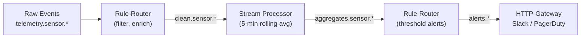

# Stream Processing

Stream processing is **Layer 2** of the Stone-Age.io platform — the tier where genuinely stateful, time-aware computation happens. When the declarative event logic of the Rule-Router becomes awkward, a stream processor is the natural graduation.

For the full layer model, see [Platform Layers](./platform-layers.md).

---

## 1. When You Need a Stream Processor

The Rule-Router (Layer 1) expresses "when X happens, check Y, do Z." It's stateless per-message — durable state lives in NATS KV. That model covers a remarkable amount of ground, but it has real limits.

**You need a stream processor when:**

- The computation involves a **time window**. "Average temperature per sensor over the last 5 minutes." "Count of login failures per user in the last hour." "Anyone who entered a restricted zone and didn't leave within 30 minutes."
- You're **joining two streams** by a common key and time window. "Match each order to the shipment event that followed it."
- You need **retractable results**. An aggregation whose intermediate output can change as late data arrives.
- You want **SQL-like expressiveness** over continuous event streams rather than finite tables.
- You need **complex event processing** — patterns like "A followed by B but not C within T seconds."

If your need doesn't appear in that list, check whether the Rule-Router handles it first. The stateful-alarm-via-KV-stacking pattern in [Automation](./automation.md) covers a lot of cases that *look* like they need a stream processor but don't.

---

## 2. The Handoff Pattern

The most important architectural point: **stream processors don't replace the Rule-Router; they extend it.** Both coexist on the same NATS bus, each doing what they're good at.

<center>

</center>

A typical pipeline:

1. **Layer 1 (inbound filter).** A rule-router rule subscribes to the raw telemetry stream, drops invalid messages, hydrates each event with KV-sourced metadata (location name, asset tier), and publishes cleaned events to a dedicated subject.
2. **Layer 2 (windowed compute).** A stream processor subscribes to the cleaned subject, maintains a 5-minute tumbling window per sensor, computes averages, and publishes aggregates to another subject.
3. **Layer 1 (outbound action).** A second rule-router rule subscribes to aggregates, evaluates threshold conditions (using KV-stored per-sensor limits), and either updates a KV alarm key or triggers a notification via the HTTP-Gateway.

Neither layer knows about the other's internals. They communicate through **subject contracts** — what data lands on which subject, with what shape. That decoupling is what keeps the system maintainable.

---

## 3. Supported Stream Processors

Stone-Age.io has no opinion on *which* stream processor you use. They all speak NATS cleanly.

### eKuiper

A lightweight, SQL-based edge stream processor. Good fit for IoT-shaped problems where you want windowed aggregations and simple filters expressed as SQL queries.

**Strengths:**

- SQL syntax is approachable for operators who aren't full-time developers.
- Runs comfortably at the edge (Raspberry Pi-class hardware).
- Native NATS source and sink.
- Built-in sliding, tumbling, and session window semantics.

**Example concept:** A continuous query that averages temperature per sensor every minute and publishes the result.

```sql
SELECT sensor_id, AVG(temperature) AS avg_temp, window_end() AS ts
FROM cleanSensorStream
GROUP BY sensor_id, TUMBLINGWINDOW(mi, 1)
```

The query runs continuously, consuming from a NATS subject and publishing results to another subject. Rule-router rules on the output subject handle thresholding and alerting.

### Benthos / RedPanda Connect / Wombat

Declarative YAML pipelines with a massive connector library. Excellent for data-plumbing problems — moving and transforming events between systems, with transformation logic expressed as composable processors.

**Strengths:**

- YAML-native, which fits well alongside rule-router's YAML rules.
- Extensive processor library: `mapping`, `branch`, `cache`, `dedupe`, `group_by`, and more.
- Strong support for format transformation (JSON ↔ Protobuf ↔ Avro ↔ CSV).
- Good fit when the stream processing job is less about windowing and more about "consume from A, transform, send to B and C in parallel."

**Example concept:** A pipeline that consumes from a NATS subject, enriches each event from a cache, and fans out to two different downstream subjects based on content.

### Custom Processors

For domain-specific needs, a small Go (or Python, or Rust) service that consumes from NATS and publishes results is completely idiomatic. The substrate doesn't care about implementation language — it cares about subject discipline.

**When to go custom:**

- Your logic is genuinely specialized (e.g., a physics model, an ML inference loop, a domain-specific state machine).
- You want tight integration with existing internal libraries.
- The declarative tools feel like they're working against you rather than with you.

A custom processor is usually 200–500 lines of Go and earns its keep by being exactly the shape your problem needs.

---

## 4. Deployment Considerations

Stream processors can run centrally (at the hub alongside your main NATS cluster) or at the edge (alongside leaf-node NATS deployments on site-local hardware).

**Centralized deployment** fits when:

- The computation needs a global view across all sites.
- Edge hardware is resource-constrained.
- The aggregated output is consumed centrally (dashboards, central alerting).

**Edge deployment** fits when:

- You want local autonomy — the site's stream processing keeps working during a WAN outage.
- The raw event volume is high but aggregate output is low; doing the computation locally saves bandwidth.
- Latency matters and round-tripping to a central processor would add delay.

Both patterns use JetStream leaf nodes or mirrored streams to move data between tiers. The stream processor itself doesn't need to know whether it's at the edge or at the hub — it just subscribes to NATS subjects.

---

## 5. Choosing Between Rule-Router and a Stream Processor

When a problem could plausibly be solved at either layer, here's a rough guide:

| Characteristic | Rule-Router (Layer 1) | Stream Processor (Layer 2) |
|---|---|---|
| State scope | Per-rule, in KV | Per-pipeline, in-memory + checkpointed |
| Time windows | TTL-based presence, debounce, throttle | Tumbling, sliding, session windows |
| Aggregation | Counter-style via KV increment | SUM, AVG, COUNT, PERCENTILE over windows |
| Cross-stream correlation | Limited (single subject at a time) | Native joins |
| Retraction of results | None | Supported |
| Cost of running | Very low (microsecond evaluation) | Moderate (continuous memory/CPU) |
| Best for | High-volume stateless routing, KV-backed state | Analytical windows, anomaly detection |

**Rule of thumb:** if the solution in rule-router requires more than two or three KV keys per logical concept, you're probably approaching the boundary of what layer 1 should do. That's not a hard rule — the alarm stacking pattern uses KV in ways that look complex but are actually principled — but it's a useful smell test.

---

## 6. A Worked Example — Anomaly Detection on Access Events

Continuing the access control reference architecture from [Platform Layers](./platform-layers.md):

**The goal:** flag access events that are unusual for the user — accesses outside their normal hours, to doors they rarely use, or in unusual sequences.

**Why this is layer 2:** "Unusual for the user" requires a baseline built from the user's historical access patterns. That's stateful, windowed computation that would be miserable to express in rule-router.

**The pipeline:**

1. **Layer 1** publishes `access.decision.granted.{door_id}.{direction}` events as they happen. No change to existing rules.
2. **Layer 2** (eKuiper or a custom Go processor) subscribes to `access.decision.granted.>`, maintains per-user rolling statistics (hour-of-day distribution, door-usage frequency, sequence patterns) over the last 30 days, and for each new event computes a "normalcy score" against the baseline. When the score crosses a threshold, it publishes to `access.anomaly.{user_id}`.
3. **Layer 1** (another rule-router rule) subscribes to `access.anomaly.>`, hydrates the message with user contact info from KV, and publishes to `notify.security-team` via the HTTP-Gateway.

The layer 1 rules didn't change. The layer 2 pipeline was added without touching the hot authorization path. If the anomaly detector fails or is taken offline for maintenance, access control continues to work normally — only the anomaly signal is lost, and it catches up from JetStream when the processor returns.

This is the layering paying off. You added analytical behavior to the system without destabilizing the operational path.

---

## 7. Summary

Stream processing is how Stone-Age.io handles the class of problems that declarative rules don't fit cleanly. The platform provides the substrate (NATS) and the seams (subject contracts between layers); you pick the processor that matches your team and your problem.

The pattern is always the same: **consume from a NATS subject, compute, publish to a NATS subject.** Everything else — deployment topology, implementation language, operational model — is an implementation choice that doesn't change the architecture.

For the layer model in full, see [Platform Layers](./platform-layers.md). For the declarative layer this composes with, see [Automation](./automation.md). For long-term storage of the results, see [Observability](./observability.md).
