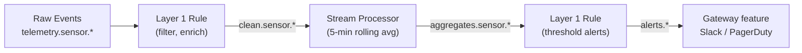

# Stream Processing

Stream processing is **Layer 2** of Stone-Age.io: stateful computation over
time. Use it when a problem is awkward in the rule engine. See
[Platform Layers](./platform-layers.md) for the layer model.

---

## 1. When You Need a Stream Processor

Layer 1 rules keep no state between messages. Durable state is in NATS KV, and
the engine holds only its in-memory throttle windows.

**You need a stream processor when:**

- The computation has a **time window**: "average temperature per sensor over
  the last 5 minutes", "login failures per user in the last hour", "anyone who
  entered a restricted zone and did not leave within 30 minutes".
- You **join two streams** by a common key and time window: "match each order
  to the shipment event after it".
- You need **retractable results**, where late data changes an earlier output.
- You want **SQL-like queries** over event streams.
- You need **complex event processing**, such as "A followed by B but not C
  within T seconds".

If your need is not on this list, try Layer 1 first. The KV alarm-stacking
pattern in [Automation](./automation.md) covers many cases that *look* like
they need a stream processor.

---

## 2. The Handoff Pattern

**Stream processors add to the rule engine. They do not replace it.** Both run
on the same NATS bus.


```mermaid
flowchart LR
    Raw["Raw Events<br/>telemetry.sensor.*"] --> RR1["Layer 1 Rule<br/>(filter, enrich)"]
    RR1 -->|"clean.sensor.*"| SP["Stream Processor<br/>(5-min rolling avg)"]
    SP -->|"aggregates.sensor.*"| RR2["Layer 1 Rule<br/>(threshold alerts)"]
    RR2 -->|"alerts.*"| Out["Gateway feature<br/>Slack / PagerDuty"]
```

1. **Layer 1 (inbound filter):** a rule reads raw telemetry, drops invalid
   messages, adds KV metadata (location name, asset tier), and publishes clean
   events to a dedicated subject.
2. **Layer 2 (windowed compute):** a stream processor reads the clean subject,
   keeps a 5-minute tumbling window per sensor, computes averages, and publishes
   them to another subject.
3. **Layer 1 (outbound action):** a second rule reads the averages, checks
   thresholds (with per-sensor limits from KV), and updates a KV alarm key or
   sends a notification through the gateway.

Neither layer knows how the other works. They share only **subject contracts**:
what data goes on which subject, in what shape.

---

## 3. Supported Stream Processors

Stone-Age.io works with any stream processor that reads from and publishes to
NATS.

### eKuiper

A small, SQL-based stream processor for the edge. It suits IoT problems where
you want windowed aggregations and simple filters in SQL.

- SQL is easy for analysts and technicians who are not full-time developers.
- It runs at the edge, on Raspberry Pi-class hardware.
- It has a native NATS source and sink.
- It has sliding, tumbling and session windows.

This continuous query averages temperature per sensor every minute:

```sql
SELECT sensor_id, AVG(temperature) AS avg_temp, window_end() AS ts
FROM cleanSensorStream
GROUP BY sensor_id, TUMBLINGWINDOW(mi, 1)
```

It reads from a NATS subject and publishes results to another subject. Layer 1
rules on the output subject check thresholds and send alerts.

### Benthos / RedPanda Connect / Wombat

YAML pipelines with a large connector library. They suit moving and
transforming events between systems.

- YAML, like the rule engine's rules.
- Many processors: `mapping`, `branch`, `cache`, `dedupe`, `group_by` and more.
- Format conversion (JSON, Protobuf, Avro, CSV).
- Best when the job is "read from A, transform, send to B and C", not
  windowing.

For example, a pipeline can read a NATS subject, enrich each event from a cache,
and send it to one of two subjects based on its content.

### Custom Processors

For domain-specific needs, write a small Go, Python or Rust service that reads
from NATS and publishes results. NATS does not care about the language, only
about the subjects.

Write your own when:

- The logic is specialized (a physics model, ML inference, a domain state
  machine).
- You need your existing internal libraries.
- The declarative tools work against you.

A custom processor is usually 200 to 500 lines of Go.

---

## 4. Deployment Considerations

Run stream processors centrally, beside your main NATS cluster, or at the edge,
beside a leaf node on site hardware.

**Run centrally** when:

- The computation needs data from all sites.
- Edge hardware has too little capacity.
- Central dashboards or alerts consume the output.

**Run at the edge** when:

- The site's processing must keep working during a WAN outage.
- Raw volume is high and aggregate output is low, so local computation saves
  bandwidth.
- A round trip to a central processor would add too much latency.

Leaf nodes or mirrored streams move data between the edge and the hub. The
stream processor only subscribes to NATS subjects, and does not need to know
where it runs.

---

## 5. Rule Engine or Stream Processor?

| Characteristic | Rule Engine (Layer 1) | Stream Processor (Layer 2) |
|---|---|---|
| State scope | In KV. Throttle windows are in each instance's memory and lost on restart. | Per pipeline, in memory and checkpointed |
| Time windows | TTL-based presence (KV); a per-rule `throttle` window, leading or trailing | Tumbling, sliding, session windows |
| Aggregation | None. Templates have no arithmetic, so a rule can pass a value on but not add values up. | SUM, AVG, COUNT, PERCENTILE over windows |
| Cross-stream correlation | Limited (one subject at a time) | Native joins |
| Retraction of results | None | Supported |
| Cost of running | Very low (microsecond evaluation) | Moderate (continuous memory and CPU) |
| Best for | High-volume stateless routing, KV-backed state | Analytical windows, anomaly detection |

If a Layer 1 solution needs more than two or three KV keys for one concept, it
is probably near the limit of what Layer 1 should do. The alarm-stacking
pattern is an exception that uses KV in a complex-looking but sound way.

---

## 6. A Worked Example: Anomaly Detection on Access Events

This example adds Layer 2 to the access-control reference architecture in
[Platform Layers §8](./platform-layers.md#8-reference-architecture-all-four-layers).
Layers 0, 1 and 3 stay as they are.

**Goal:** flag access events that are unusual for the user, such as access
outside their normal hours, to doors they rarely use, or in an unusual order.

**Why Layer 2:** "unusual for the user" needs a baseline from the user's access
history. That is stateful, windowed computation, which rules cannot express
well.

1. **Layer 1** publishes `access.decision.granted.{door_id}.{direction}` events,
   as before.
2. **Layer 2** (eKuiper or a custom Go processor) reads
   `access.decision.granted.>`. It keeps rolling statistics per user over the
   last 30 days: hour-of-day distribution, door use and sequences. For each new
   event it computes a score against the baseline. When the score crosses a
   threshold, it publishes to `access.anomaly.{user_id}`.
3. **Layer 1** (another rule) reads `access.anomaly.>`, adds the user's contact
   details from KV, and publishes to `notify.security-team` through the gateway.

The existing rules do not change, and the access decision path is not touched.
If the anomaly detector fails or is stopped for maintenance, access control
keeps working. Only the anomaly signal stops, and the processor catches up from
JetStream when it returns.

---

## 7. Where to Go Next

- The layer model: [Platform Layers](./platform-layers.md)
- Layer 1 rules: [Automation](./automation.md)
- Long-term storage of results: [Observability](./observability.md)
